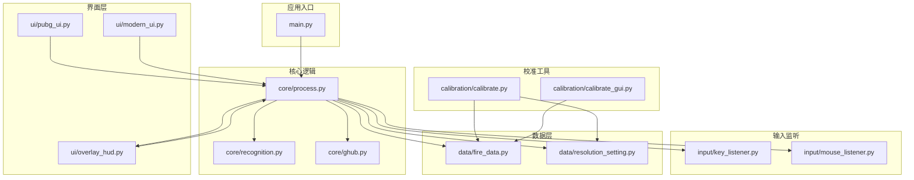
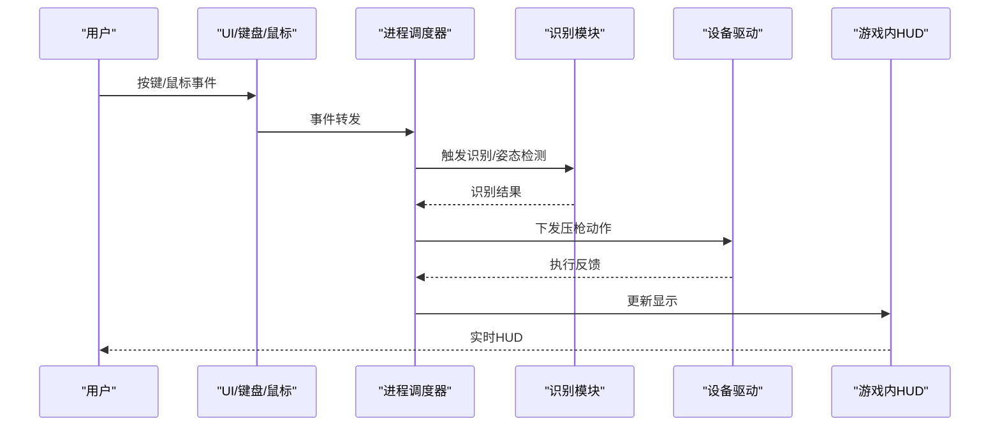
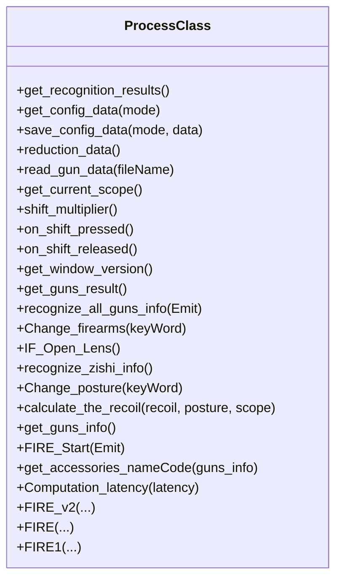
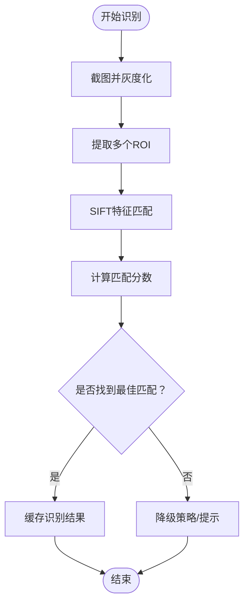
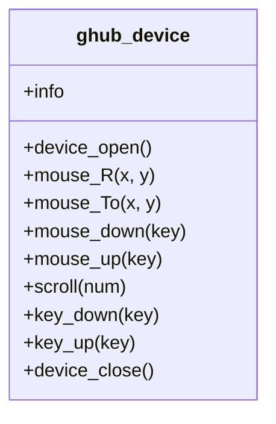
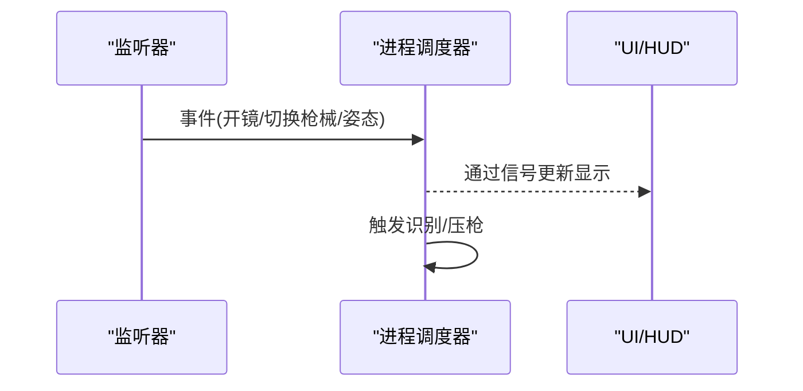
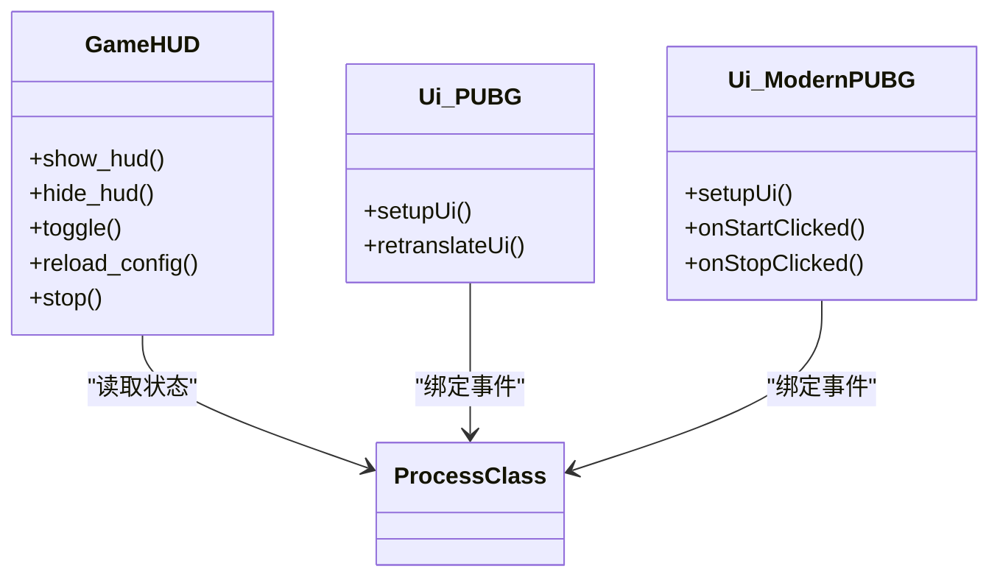
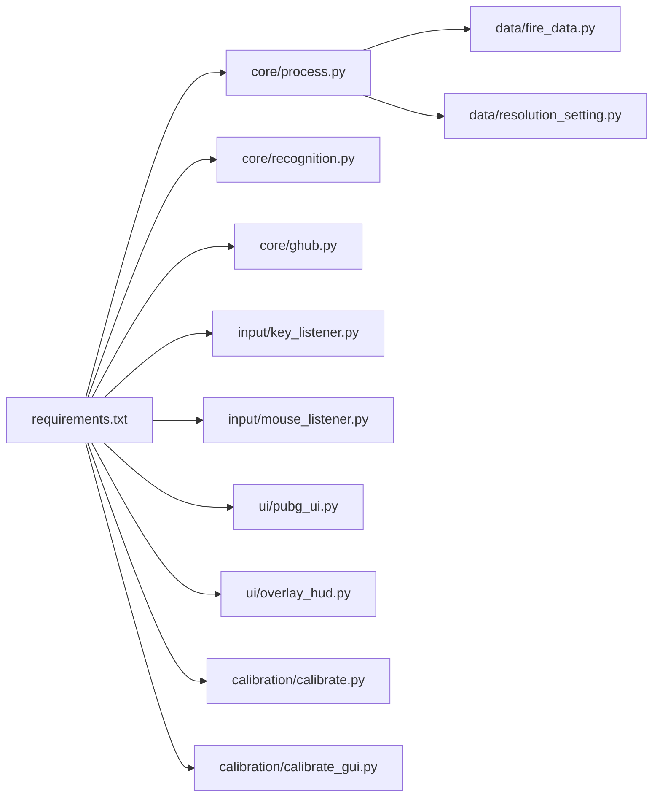

# 代码规范

<cite>
**本文引用的文件**
- [README.md](file://README.md)
- [main.py](file://main.py)
- [core/process.py](file://core/process.py)
- [core/recognition.py](file://core/recognition.py)
- [core/ghub.py](file://core/ghub.py)
- [input/key_listener.py](file://input/key_listener.py)
- [input/mouse_listener.py](file://input/mouse_listener.py)
- [ui/pubg_ui.py](file://ui/pubg_ui.py)
- [ui/modern_ui.py](file://ui/modern_ui.py)
- [ui/overlay_hud.py](file://ui/overlay_hud.py)
- [data/fire_data.py](file://data/fire_data.py)
- [data/resolution_setting.py](file://data/resolution_setting.py)
- [calibration/calibrate.py](file://calibration/calibrate.py)
- [calibration/calibrate_gui.py](file://calibration/calibrate_gui.py)
- [requirements.txt](file://requirements.txt)
</cite>

## 目录
1. [简介](#简介)
2. [项目结构](#项目结构)
3. [核心组件](#核心组件)
4. [架构总览](#架构总览)
5. [详细组件分析](#详细组件分析)
6. [依赖关系分析](#依赖关系分析)
7. [性能考虑](#性能考虑)
8. [故障排查指南](#故障排查指南)
9. [结论](#结论)
10. [附录](#附录)

## 简介
本指南面向“PUBG 自动识别压枪工具”项目，制定统一的代码规范与最佳实践，覆盖以下方面：
- Python 编码风格与 PEP8 规范
- 注释与文档字符串规范
- 错误处理与日志记录
- 命名约定（变量、函数、类）
- 模块导入与代码组织
- 代码审查清单与质量保证标准

## 项目结构
项目采用按功能域划分的层次化组织方式：
- 核心逻辑：core（进程调度、识别、设备驱动）
- 输入监听：input（键盘/鼠标事件）
- 界面层：ui（PyQt5 UI 与游戏内 HUD）
- 数据层：data（配置、弹道、分辨率等）
- 校准工具：calibration（CLI/GUI/HUD 三种模式）
- 配置与依赖：Config、requirements.txt

图表来源
- [main.py](file://main.py)
- [core/process.py](file://core/process.py)
- [core/recognition.py](file://core/recognition.py)
- [core/ghub.py](file://core/ghub.py)
- [input/key_listener.py](file://input/key_listener.py)
- [input/mouse_listener.py](file://input/mouse_listener.py)
- [ui/pubg_ui.py](file://ui/pubg_ui.py)
- [ui/modern_ui.py](file://ui/modern_ui.py)
- [ui/overlay_hud.py](file://ui/overlay_hud.py)
- [data/fire_data.py](file://data/fire_data.py)
- [data/resolution_setting.py](file://data/resolution_setting.py)
- [calibration/calibrate.py](file://calibration/calibrate.py)
- [calibration/calibrate_gui.py](file://calibration/calibrate_gui.py)

章节来源
- [README.md](file://README.md)
- [main.py](file://main.py)
- [core/process.py](file://core/process.py)
- [core/recognition.py](file://core/recognition.py)
- [core/ghub.py](file://core/ghub.py)
- [input/key_listener.py](file://input/key_listener.py)
- [input/mouse_listener.py](file://input/mouse_listener.py)
- [ui/pubg_ui.py](file://ui/pubg_ui.py)
- [ui/modern_ui.py](file://ui/modern_ui.py)
- [ui/overlay_hud.py](file://ui/overlay_hud.py)
- [data/fire_data.py](file://data/fire_data.py)
- [data/resolution_setting.py](file://data/resolution_setting.py)
- [calibration/calibrate.py](file://calibration/calibrate.py)
- [calibration/calibrate_gui.py](file://calibration/calibrate_gui.py)

## 核心组件
- 进程调度与压枪引擎：负责状态管理、配置读写、弹道计算、设备驱动调用
- 图像识别：基于 SIFT 的枪械与配件识别、姿势识别
- 设备驱动封装：对 GHUB/LGS 驱动的 C 扩展接口进行安全调用
- 输入监听：键盘/鼠标事件捕获与转发
- UI 与 HUD：传统 UI、现代化 UI、游戏内 HUD
- 数据与配置：弹道数据、分辨率区域、灵敏度配置
- 校准工具：CLI/GUI/HUD 三种模式的弹痕校准

章节来源
- [core/process.py](file://core/process.py)
- [core/recognition.py](file://core/recognition.py)
- [core/ghub.py](file://core/ghub.py)
- [input/key_listener.py](file://input/key_listener.py)
- [input/mouse_listener.py](file://input/mouse_listener.py)
- [ui/pubg_ui.py](file://ui/pubg_ui.py)
- [ui/modern_ui.py](file://ui/modern_ui.py)
- [ui/overlay_hud.py](file://ui/overlay_hud.py)
- [data/fire_data.py](file://data/fire_data.py)
- [data/resolution_setting.py](file://data/resolution_setting.py)
- [calibration/calibrate.py](file://calibration/calibrate.py)
- [calibration/calibrate_gui.py](file://calibration/calibrate_gui.py)

## 架构总览
系统采用“事件驱动 + 状态机”的架构：
- UI 与输入监听作为前端事件源
- 进程调度器接收事件并更新内部状态
- 识别模块在后台异步执行图像处理
- 设备驱动模块负责鼠标/键盘下发
- HUD 实时渲染当前状态

图表来源
- [input/key_listener.py](file://input/key_listener.py)
- [input/mouse_listener.py](file://input/mouse_listener.py)
- [core/process.py](file://core/process.py)
- [core/recognition.py](file://core/recognition.py)
- [core/ghub.py](file://core/ghub.py)
- [ui/overlay_hud.py](file://ui/overlay_hud.py)

## 详细组件分析

### 进程调度与压枪引擎（ProcessClass）
职责：
- 单例模式管理全局状态
- 读取/保存配置
- 枪械识别触发与结果缓存
- 姿态识别与开镜状态判断
- 弹道计算与压枪下发（含 v1/v2 两种路径）

关键点：
- 使用 asyncio 并行处理多区域截图与匹配
- 通过 emit 信号向 UI/HUD 回传状态
- 支持 Shift 键动态调整灵敏度

图表来源
- [core/process.py](file://core/process.py)

章节来源
- [core/process.py](file://core/process.py)

### 图像识别（SIFT 与姿势识别）
职责：
- 截图与 ROI 提取
- SIFT 特征匹配与相似度评估
- 姿势区域稳定性检测与模板匹配
- 识别结果缓存与异步处理

图表来源
- [core/recognition.py](file://core/recognition.py)

章节来源
- [core/recognition.py](file://core/recognition.py)

### 设备驱动封装（GHUB/LGS）
职责：
- 动态加载驱动 DLL
- 封装鼠标/键盘事件调用
- 错误与缺失文件的健壮处理

图表来源
- [core/ghub.py](file://core/ghub.py)

章节来源
- [core/ghub.py](file://core/ghub.py)

### 输入监听（键盘/鼠标）
职责：
- 捕获按键与鼠标事件
- 将事件转换为进程调度器可理解的状态
- 通过信号与主线程解耦

图表来源
- [input/key_listener.py](file://input/key_listener.py)
- [input/mouse_listener.py](file://input/mouse_listener.py)

章节来源
- [input/key_listener.py](file://input/key_listener.py)
- [input/mouse_listener.py](file://input/mouse_listener.py)

### UI 与 HUD
职责：
- 传统 UI 与现代化 UI 的布局与交互
- 游戏内 HUD 的三档显示、可拖动、热键切换
- 配置文件加载与保存

图表来源
- [ui/overlay_hud.py](file://ui/overlay_hud.py)
- [ui/pubg_ui.py](file://ui/pubg_ui.py)
- [ui/modern_ui.py](file://ui/modern_ui.py)

章节来源
- [ui/overlay_hud.py](file://ui/overlay_hud.py)
- [ui/pubg_ui.py](file://ui/pubg_ui.py)
- [ui/modern_ui.py](file://ui/modern_ui.py)

### 校准工具
职责：
- CLI/GUI/HUD 三种模式的弹痕校准
- 弹孔检测、排序、可视化与对比分析
- 交互式修正与参数建议

章节来源
- [calibration/calibrate.py](file://calibration/calibrate.py)
- [calibration/calibrate_gui.py](file://calibration/calibrate_gui.py)

## 依赖关系分析
- 运行时依赖集中在 requirements.txt，涉及图像处理、输入监听、GUI、网络请求等
- 核心模块间依赖清晰：process 依赖 recognition、ghub、data；UI 依赖 process；HUD 依赖 process；calibration 依赖 data 与 process

图表来源
- [requirements.txt](file://requirements.txt)
- [core/process.py](file://core/process.py)
- [core/recognition.py](file://core/recognition.py)
- [core/ghub.py](file://core/ghub.py)
- [input/key_listener.py](file://input/key_listener.py)
- [input/mouse_listener.py](file://input/mouse_listener.py)
- [ui/pubg_ui.py](file://ui/pubg_ui.py)
- [ui/overlay_hud.py](file://ui/overlay_hud.py)
- [calibration/calibrate.py](file://calibration/calibrate.py)
- [calibration/calibrate_gui.py](file://calibration/calibrate_gui.py)
- [data/fire_data.py](file://data/fire_data.py)
- [data/resolution_setting.py](file://data/resolution_setting.py)

章节来源
- [requirements.txt](file://requirements.txt)

## 性能考虑
- 异步并行：识别模块使用 asyncio 并行处理多个 ROI，降低端到端延迟
- 模板匹配：姿势识别优先使用模板匹配，失败时回退到 SIFT，兼顾速度与准确性
- 缓存与节流：识别结果缓存于进程调度器，避免重复计算
- 资源释放：线程与监听器在停止时正确终止，避免资源泄漏

## 故障排查指南
常见问题与定位要点：
- 驱动缺失或版本不兼容：检查 GHUB/LGS 驱动是否安装、版本是否匹配
- 识别不准确：检查分辨率配置、ROI 坐标、模板质量
- HUD 不显示：确认热键与拖动模式、配置文件路径
- 压枪无效：检查开镜状态、枪械识别结果、Shift 键灵敏度修正

章节来源
- [core/ghub.py](file://core/ghub.py)
- [data/resolution_setting.py](file://data/resolution_setting.py)
- [ui/overlay_hud.py](file://ui/overlay_hud.py)
- [core/process.py](file://core/process.py)

## 结论
本项目在功能复杂度与实时性之间取得平衡，通过清晰的模块划分与事件驱动架构实现了稳定的压枪体验。建议在后续开发中进一步完善单元测试、静态检查与持续集成，以提升代码质量与可维护性。

## 附录

### Python 编码风格与 PEP8 规范
- 命名与缩进：使用 4 空格缩进；变量与函数使用 snake_case；类使用 PascalCase
- 导入顺序：标准库、第三方库、项目内模块分组导入
- 行长度：单行不超过 100 字符
- 空行：模块级函数/类之间空两行，方法之间空一行
- 注释：行内注释前留两个空格以上；函数/类使用三引号文档字符串

章节来源
- [core/process.py](file://core/process.py)
- [core/recognition.py](file://core/recognition.py)
- [ui/pubg_ui.py](file://ui/pubg_ui.py)
- [ui/modern_ui.py](file://ui/modern_ui.py)
- [ui/overlay_hud.py](file://ui/overlay_hud.py)
- [data/fire_data.py](file://data/fire_data.py)
- [data/resolution_setting.py](file://data/resolution_setting.py)
- [calibration/calibrate.py](file://calibration/calibrate.py)
- [calibration/calibrate_gui.py](file://calibration/calibrate_gui.py)

### 注释与文档字符串规范
- 函数/方法：使用三引号文档字符串，描述用途、参数、返回值与异常
- 类：使用三引号文档字符串，描述用途与关键属性/方法
- 行内注释：简洁明了，解释复杂逻辑或边界条件
- TODO/FIXME：使用明确标记并在后续版本修复

章节来源
- [core/process.py](file://core/process.py)
- [core/recognition.py](file://core/recognition.py)
- [core/ghub.py](file://core/ghub.py)
- [input/key_listener.py](file://input/key_listener.py)
- [input/mouse_listener.py](file://input/mouse_listener.py)
- [ui/overlay_hud.py](file://ui/overlay_hud.py)
- [calibration/calibrate.py](file://calibration/calibrate.py)
- [calibration/calibrate_gui.py](file://calibration/calibrate_gui.py)

### 错误处理与日志记录
- 异常捕获：对外部依赖（文件、网络、驱动）进行 try-except 包裹
- 日志输出：使用 print 或 UI 信号输出关键状态与错误信息
- 恢复机制：在异常后回退到安全状态（如禁用功能、提示用户）

章节来源
- [core/ghub.py](file://core/ghub.py)
- [core/process.py](file://core/process.py)
- [calibration/calibrate.py](file://calibration/calibrate.py)
- [calibration/calibrate_gui.py](file://calibration/calibrate_gui.py)

### 命名约定
- 变量：snake_case，语义明确（如 resolution、mouse_one）
- 函数：snake_case，动词开头（如 recognize_all_guns_info、calculate_the_recoil）
- 类：PascalCase（如 ProcessClass、GameHUD、ghub_device）
- 常量：UPPER_CASE（如 MIN_AREA、MAX_AREA）

章节来源
- [core/process.py](file://core/process.py)
- [core/recognition.py](file://core/recognition.py)
- [core/ghub.py](file://core/ghub.py)
- [input/key_listener.py](file://input/key_listener.py)
- [input/mouse_listener.py](file://input/mouse_listener.py)
- [ui/overlay_hud.py](file://ui/overlay_hud.py)
- [calibration/calibrate.py](file://calibration/calibrate.py)
- [calibration/calibrate_gui.py](file://calibration/calibrate_gui.py)

### 模块导入与代码组织
- 优先使用相对导入，避免绝对路径硬编码
- 依赖注入：通过构造函数传递外部依赖（如 ProcessClass 接收 PCdata）
- 配置集中：将路径、阈值、参数集中于配置文件或模块常量

章节来源
- [core/process.py](file://core/process.py)
- [ui/overlay_hud.py](file://ui/overlay_hud.py)
- [data/resolution_setting.py](file://data/resolution_setting.py)
- [requirements.txt](file://requirements.txt)

### 代码审查清单与质量保证
- 代码风格：通过 linter 检查（如 flake8、pylint）
- 单元测试：为关键函数（如 calculate_the_recoil、match_sift）编写测试
- 文档：补充缺失的函数/类文档字符串
- 安全：对外部输入进行校验（如分辨率、灵敏度）
- 可维护性：拆分过长函数、减少全局状态、增加类型注解

章节来源
- [core/process.py](file://core/process.py)
- [core/recognition.py](file://core/recognition.py)
- [core/ghub.py](file://core/ghub.py)
- [ui/overlay_hud.py](file://ui/overlay_hud.py)
- [data/fire_data.py](file://data/fire_data.py)
- [data/resolution_setting.py](file://data/resolution_setting.py)
- [calibration/calibrate.py](file://calibration/calibrate.py)
- [calibration/calibrate_gui.py](file://calibration/calibrate_gui.py)