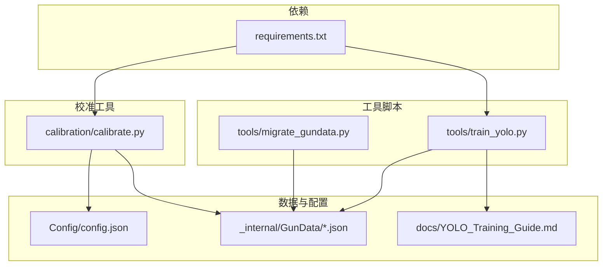
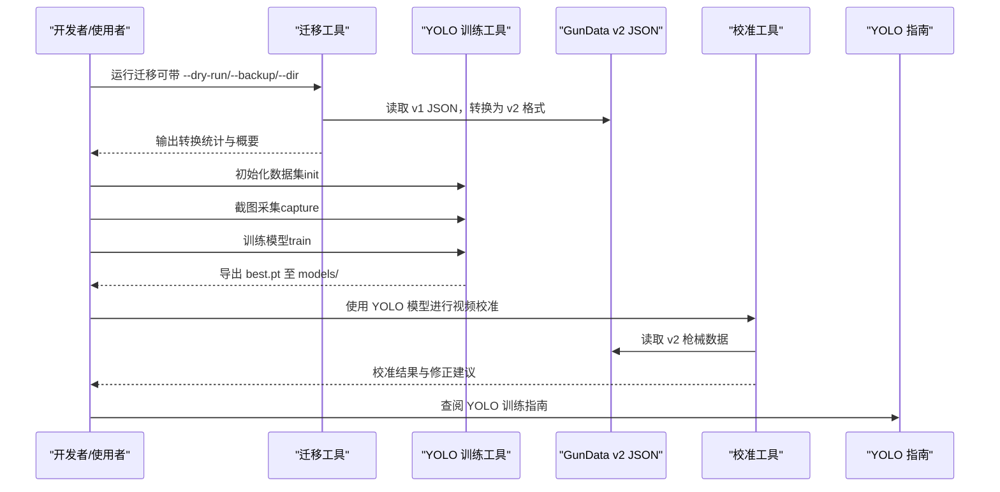
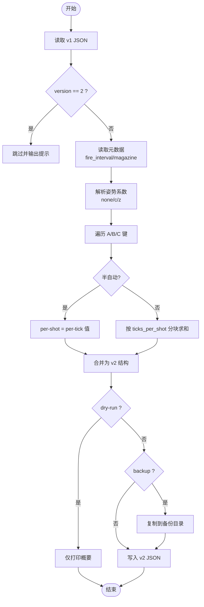
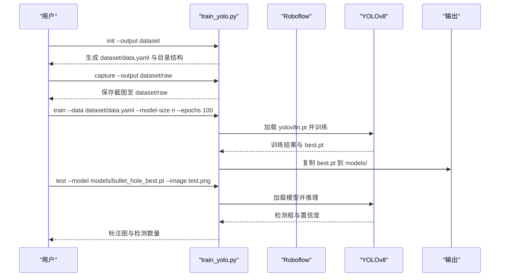
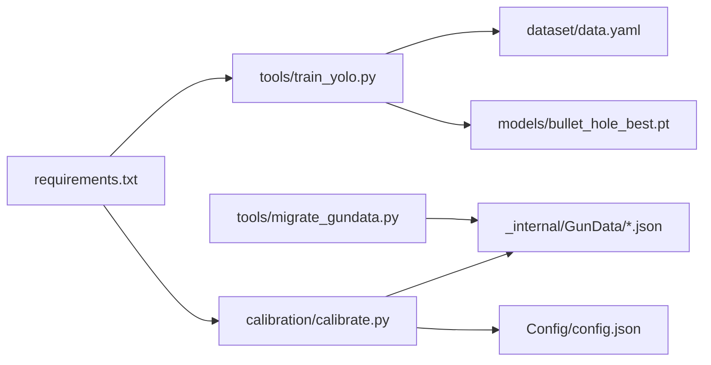

# 工具脚本使用

<cite>
**本文引用的文件列表**
- [migrate_gundata.py](file://migrate_gundata.py)
- [tools/migrate_gundata.py](file://tools/migrate_gundata.py)
- [tools/train_yolo.py](file://tools/train_yolo.py)
- [docs/YOLO_Training_Guide.md](file://docs/YOLO_Training_Guide.md)
- [requirements.txt](file://requirements.txt)
- [_internal/GunData/m416.json](file://_internal/GunData/m416.json)
- [Config/config.json](file://Config/config.json)
- [README.md](file://README.md)
- [calibration/calibrate.py](file://calibration/calibrate.py)
</cite>

## 目录
1. [简介](#简介)
2. [项目结构](#项目结构)
3. [核心组件](#核心组件)
4. [架构总览](#架构总览)
5. [详细组件分析](#详细组件分析)
6. [依赖关系分析](#依赖关系分析)
7. [性能与参数调优](#性能与参数调优)
8. [故障排除指南](#故障排除指南)
9. [结论](#结论)
10. [附录](#附录)

## 简介
本文件面向使用者与开发者，系统性说明两类工具脚本的使用与开发指导：
- 数据迁移工具：将 v1 枪械后坐力数据迁移到 v2 格式，支持批量处理、干跑预览、自动备份与参数配置。
- YOLO 训练工具：提供截图采集、数据集初始化、模型训练与模型测试的完整工作流，并给出性能评估方法与常见问题处理建议。

同时，文档涵盖命令行参数说明、使用示例、扩展与自定义方法，以及常见使用场景与故障排除指南。

## 项目结构
围绕工具脚本的相关目录与文件如下：
- tools/：提供命令行工具脚本
  - tools/migrate_gundata.py：v1→v2 枪械数据迁移工具
  - tools/train_yolo.py：YOLO 弹孔检测训练工具
- _internal/GunData/：v2 枪械数据存储位置（JSON）
- docs/YOLO_Training_Guide.md：YOLO 训练完整指南
- calibration/：弹痕校准工具（CLI/GUI/HUD），与 YOLO 工具配合使用
- requirements.txt：Python 依赖清单
- Config/config.json：用户配置（分辨率、灵敏度等）

图表来源
- [tools/migrate_gundata.py:1-192](file://tools/migrate_gundata.py#L1-L192)
- [tools/train_yolo.py:1-249](file://tools/train_yolo.py#L1-L249)
- [_internal/GunData/m416.json:1-800](file://_internal/GunData/m416.json#L1-L800)
- [docs/YOLO_Training_Guide.md:1-301](file://docs/YOLO_Training_Guide.md#L1-L301)
- [calibration/calibrate.py:1-200](file://calibration/calibrate.py#L1-L200)
- [requirements.txt:1-25](file://requirements.txt#L1-L25)

章节来源
- [README.md:1-156](file://README.md#L1-L156)

## 核心组件
- 枪械数据迁移工具（tools/migrate_gundata.py）
  - 功能：将 v1 per-tick 整数数组转换为 v2 per-shot 浮点数组，支持水平补偿字段与元数据注入；支持干跑预览、备份与批量处理。
  - 关键参数：--dry-run、--backup、--dir
  - 输出：更新后的 v2 JSON 文件，打印转换统计与概要信息。
- YOLO 训练工具（tools/train_yolo.py）
  - 功能：截图采集、数据集初始化、模型训练、模型测试；集成 Ultralytics YOLOv8。
  - 子命令：capture、train、test、init
  - 关键参数：--output、--data、--model-size、--epochs、--imgsz、--batch、--model、--image、--conf

章节来源
- [tools/migrate_gundata.py:1-192](file://tools/migrate_gundata.py#L1-L192)
- [tools/train_yolo.py:1-249](file://tools/train_yolo.py#L1-L249)

## 架构总览
工具脚本与项目数据流的关系如下：

图表来源
- [tools/migrate_gundata.py:154-192](file://tools/migrate_gundata.py#L154-L192)
- [tools/train_yolo.py:206-249](file://tools/train_yolo.py#L206-L249)
- [docs/YOLO_Training_Guide.md:1-301](file://docs/YOLO_Training_Guide.md#L1-L301)
- [calibration/calibrate.py:1-200](file://calibration/calibrate.py#L1-L200)

## 详细组件分析

### 数据迁移工具（v1 → v2）
- 目标与范围
  - 将 per-tick（每 tick 9ms）整数数组转换为 per-shot（每发）浮点数组，保留水平补偿字段与元数据。
  - 支持半自动与全自动枪械的转换逻辑，自动推导 ticks_per_shot 与 RPM。
- 输入输出
  - 输入：GunData 目录下的 v1 JSON 文件（默认 ./_internal/GunData）。
  - 输出：更新为 v2 格式的 JSON 文件，包含 version、weapon、rpm、fire_interval_ms、tick_ms、ticks_per_shot、magazine、semi_auto、posture、recoil 等字段。
- 处理流程
  - 读取单个 JSON，检查 version 是否为 2，若是则跳过。
  - 从元数据表中读取 fire_interval 与 magazine，推导 ticks_per_shot 与 RPM。
  - 识别姿势系数（none/c/z），若缺失则使用默认值。
  - 遍历符合 A/B/C 编码的键，按半自动或全自动规则转换为 per-shot 数组。
  - 可选干跑（--dry-run）与备份（--backup）。
- 关键算法
  - 去除尾部连续零值，避免无效数据影响。
  - 全自动：按 ticks_per_shot 分块求和得到 per-shot。
  - 半自动：直接将每个 tick 值转为浮点。
- 命令行参数
  - --dry-run：仅预览，不写入文件
  - --backup：迁移前备份原文件至 GunData_v1_backup
  - --dir：指定 GunData 目录路径（默认 ./_internal/GunData）
- 使用示例
  - 预览迁移：python tools/migrate_gundata.py --dry-run
  - 执行迁移并备份：python tools/migrate_gundata.py --backup
  - 指定目录：python tools/migrate_gundata.py --dir ./_internal/GunData
- 扩展与自定义
  - 新增枪械元数据：在 GUN_META 中添加新枪械的 fire_interval 与 magazine。
  - 新增半自动枪械：在 SEMI_AUTO_GUNS 中加入新枪名。
  - 新增配件组合：保持 A/B/C 编码命名规范，数据将被自动识别与转换。
- 常见场景
  - 批量迁移：在未启用备份的情况下谨慎执行，建议先 dry-run。
  - 部分迁移：通过 --dir 指向特定子目录，仅处理部分枪械。
- 故障排除
  - 目录不存在：检查 --dir 路径是否存在。
  - JSON 格式异常：确认 v1 JSON 符合预期结构，且包含 A/B/C 键。
  - 元数据缺失：新增 GUN_META 条目或修正名称大小写。

图表来源
- [tools/migrate_gundata.py:80-151](file://tools/migrate_gundata.py#L80-L151)

章节来源
- [tools/migrate_gundata.py:1-192](file://tools/migrate_gundata.py#L1-L192)
- [_internal/GunData/m416.json:1-800](file://_internal/GunData/m416.json#L1-L800)

### YOLO 训练工具（截图采集、训练、测试、数据集初始化）
- 目标与范围
  - 提供完整的 YOLOv8 弹孔检测训练流水线：截图采集、数据集初始化、模型训练、模型测试。
  - 支持多种模型尺寸（n/s/m/l），可配置训练轮次、图像尺寸与批次大小。
- 子命令与参数
  - init：创建数据集目录模板与 data.yaml
    - --output：输出目录（默认 dataset）
  - capture：截图采集
    - --output：截图保存目录（默认 dataset/raw）
  - train：训练模型
    - --data：数据集 YAML（默认 dataset/data.yaml）
    - --model-size：模型大小（n/s/m/l，默认 n）
    - --epochs：训练轮次（默认 100）
    - --imgsz：图像尺寸（默认 640）
    - --batch：批次大小（默认 16）
  - test：测试模型
    - --model：.pt 模型路径（必填）
    - --image：测试图片（必填）
    - --conf：置信度阈值（默认 0.25）
- 使用流程
  - 初始化数据集：python tools/train_yolo.py init --output dataset
  - 截图采集：python tools/train_yolo.py capture --output dataset/raw
  - 训练模型：python tools/train_yolo.py train --data dataset/data.yaml --model-size n --epochs 100
  - 测试模型：python tools/train_yolo.py test --model models/bullet_hole_best.pt --image test.png
- 性能评估
  - 关注指标：mAP50、Precision、Recall；查看 runs/detect/bullet_hole/results.png 与 confusion_matrix.png。
  - 模型文件：best.pt 自动复制到 models/bullet_hole_best.pt。
- 扩展与自定义
  - 自定义训练参数：调整 --epochs、--imgsz、--batch、--model-size。
  - 自定义数据集：在 Roboflow 导出 YOLOv8 格式后放置于 dataset/ 目录。
  - 自定义测试：替换 --image 与 --conf，观察检测结果与标注图。

图表来源
- [tools/train_yolo.py:206-249](file://tools/train_yolo.py#L206-L249)

章节来源
- [tools/train_yolo.py:1-249](file://tools/train_yolo.py#L1-L249)
- [docs/YOLO_Training_Guide.md:1-301](file://docs/YOLO_Training_Guide.md#L1-L301)

### 弹痕校准工具（与 YOLO 工具协同）
- 功能概述
  - 识别枪械与配件，支持快捷键截图（F5 基线 → F6 结果 → F7 分析），弹痕可视化与 JSON 对比，参数建议与交互式修正。
- 与 YOLO 的关系
  - 可在视频校准中选择 YOLO 检测后端，使用训练好的 best.pt 进行实时弹孔检测与跟踪。
- 使用要点
  - 依赖：opencv-python、numpy、mss、keyboard（可选）。
  - 识别流程：按 Tab 打开背包 → 识别 → 关闭背包 → 交互式分析与修正。

章节来源
- [calibration/calibrate.py:1-200](file://calibration/calibrate.py#L1-L200)

## 依赖关系分析
- Python 依赖
  - YOLO 训练工具依赖：ultralytics、opencv-python、numpy、mss、keyboard（可选）、pynput（截图采集）。
  - 校准工具依赖：opencv-python、numpy、mss、keyboard（可选）。
- 文件依赖
  - 迁移工具依赖 GunData v2 JSON 文件结构，读取元数据与配件键（A/B/C 编码）。
  - YOLO 工具依赖 dataset/data.yaml 与训练数据集，训练完成后导出 best.pt。

图表来源
- [requirements.txt:1-25](file://requirements.txt#L1-L25)
- [tools/train_yolo.py:1-249](file://tools/train_yolo.py#L1-L249)
- [tools/migrate_gundata.py:1-192](file://tools/migrate_gundata.py#L1-L192)
- [_internal/GunData/m416.json:1-800](file://_internal/GunData/m416.json#L1-L800)
- [Config/config.json:1-1](file://Config/config.json#L1-L1)

章节来源
- [requirements.txt:1-25](file://requirements.txt#L1-L25)

## 性能与参数调优
- YOLO 训练参数建议
  - 模型尺寸：n（最快）或 s（更准），根据部署设备选择。
  - 训练轮次：100-200，结合早停 patience=20。
  - 图像尺寸：640（标准），若小弹孔较多可提高到 1280。
  - 批次大小：根据显存调整（8-32）。
- 性能评估指标
  - mAP50 > 90%：良好；mAP50 > 95%：优秀；Precision/Recall > 90%：误检/漏检低。
- 截图与标注策略
  - 覆盖多种墙面纹理、距离与姿态，保证正负样本均衡。
  - 每张图包含 5-40 个弹孔，标注所有弹孔（含模糊与重叠）。

章节来源
- [docs/YOLO_Training_Guide.md:183-205](file://docs/YOLO_Training_Guide.md#L183-L205)

## 故障排除指南
- 迁移工具
  - 目录不存在：确认 --dir 路径正确。
  - JSON 格式异常：检查 v1 JSON 是否包含 A/B/C 键与数值数组。
  - 元数据缺失：在 GUN_META 中补充新枪械的 fire_interval 与 magazine。
- YOLO 训练工具
  - 未安装依赖：pip install ultralytics。
  - 数据集配置缺失：使用 init 创建 dataset/data.yaml，或从 Roboflow 导出。
  - GPU 训练慢：使用 n 模型或减少 epochs；无 GPU 可用 Colab。
- 校准工具
  - 快捷键不可用：安装 keyboard 库或手动输入；必要时使用 Win32 API。
  - 识别不准确：调整截图区域与阈值，或在 GUI 模式下交互修正。

章节来源
- [tools/migrate_gundata.py:162-187](file://tools/migrate_gundata.py#L162-L187)
- [tools/train_yolo.py:75-90](file://tools/train_yolo.py#L75-L90)
- [calibration/calibrate.py:32-37](file://calibration/calibrate.py#L32-L37)

## 结论
- 数据迁移工具提供了安全、可控的 v1→v2 转换能力，支持干跑与备份，适合批量处理与增量维护。
- YOLO 训练工具覆盖从截图采集到模型测试的完整流程，结合 Roboflow 标注与项目指南，可快速构建高质量弹孔检测模型。
- 校准工具与 YOLO 工具协同，形成“检测→校准→修正”的闭环，持续提升识别精度与鲁棒性。

## 附录
- 常用命令速查
  - 迁移：python tools/migrate_gundata.py [--dry-run] [--backup] [--dir ./_internal/GunData]
  - 初始化数据集：python tools/train_yolo.py init --output dataset
  - 截图采集：python tools/train_yolo.py capture --output dataset/raw
  - 训练模型：python tools/train_yolo.py train --data dataset/data.yaml --model-size n --epochs 100
  - 测试模型：python tools/train_yolo.py test --model models/bullet_hole_best.pt --image test.png
- 数据结构参考
  - v2 枪械 JSON 字段：version、weapon、rpm、fire_interval_ms、tick_ms、ticks_per_shot、magazine、semi_auto、posture、recoil。
  - YOLO 数据集结构：dataset/data.yaml、images/train、images/val、labels/train、labels/val。

章节来源
- [tools/migrate_gundata.py:128-151](file://tools/migrate_gundata.py#L128-L151)
- [tools/train_yolo.py:173-204](file://tools/train_yolo.py#L173-L204)
- [_internal/GunData/m416.json:1-800](file://_internal/GunData/m416.json#L1-L800)