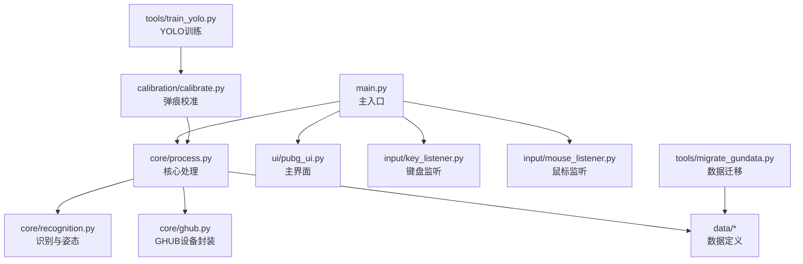
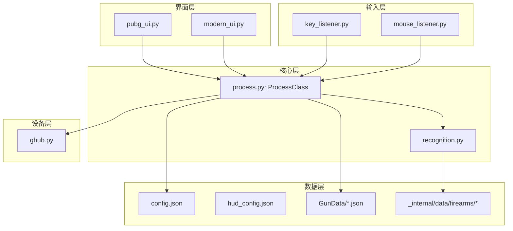
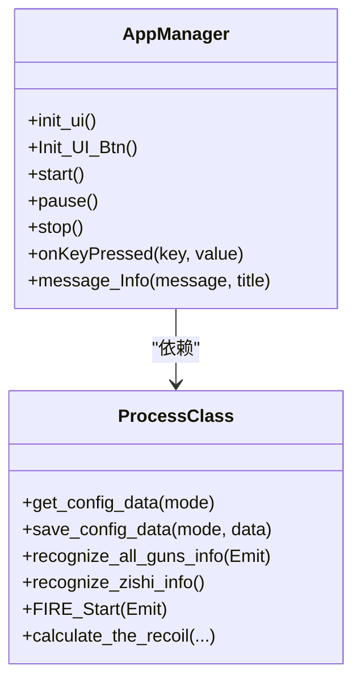
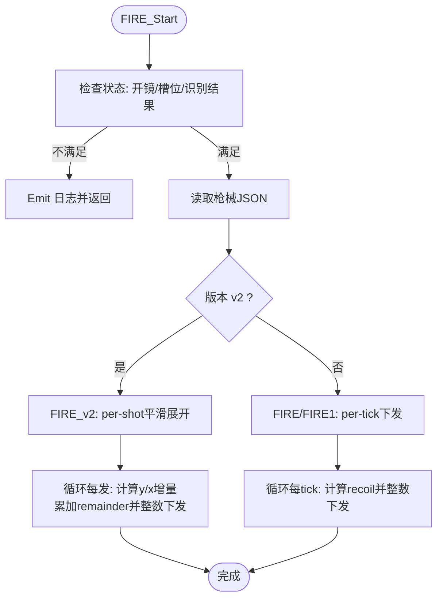
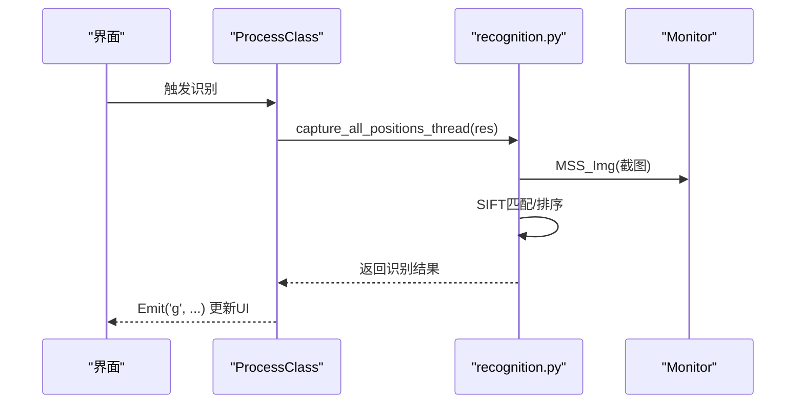
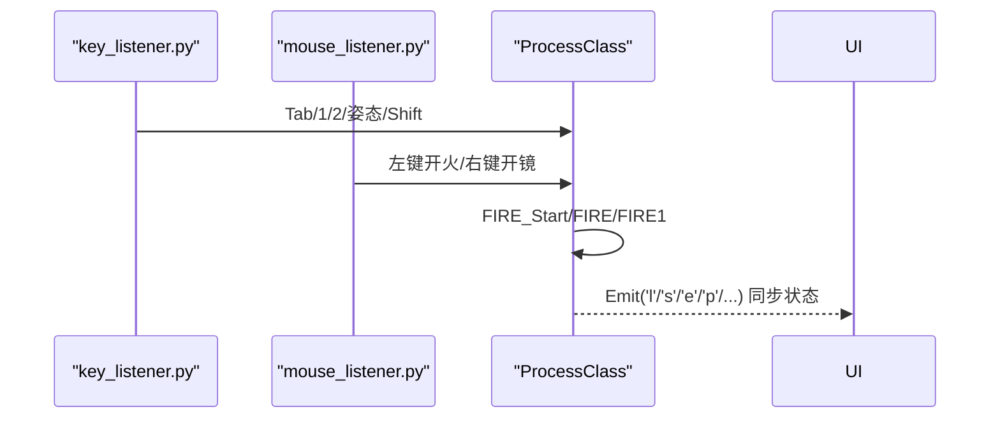
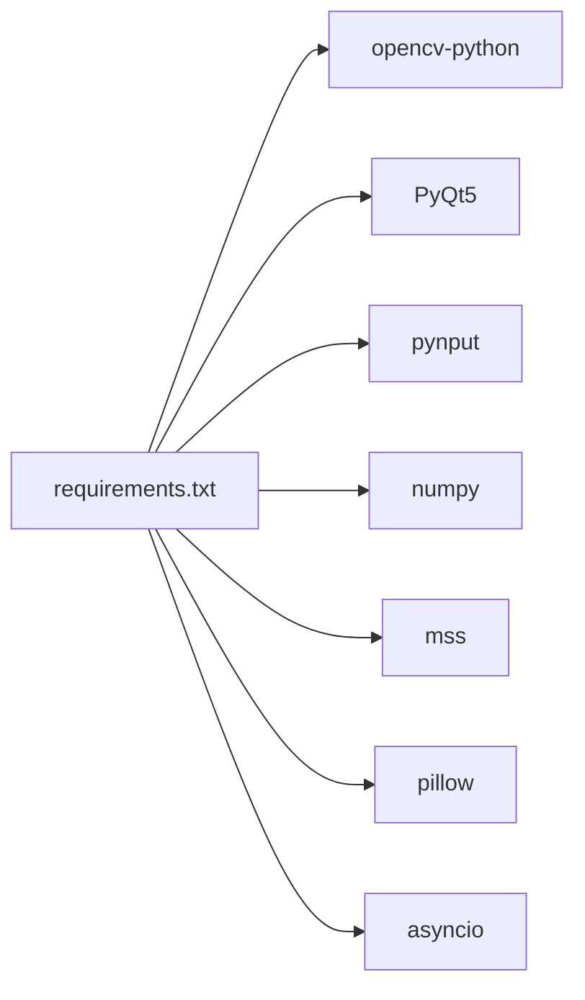

# 开发指南

<cite>
**本文引用的文件**
- [README.md](file://README.md)
- [requirements.txt](file://requirements.txt)
- [main.py](file://main.py)
- [core/process.py](file://core/process.py)
- [core/recognition.py](file://core/recognition.py)
- [core/ghub.py](file://core/ghub.py)
- [input/key_listener.py](file://input/key_listener.py)
- [input/mouse_listener.py](file://input/mouse_listener.py)
- [ui/pubg_ui.py](file://ui/pubg_ui.py)
- [ui/modern_ui.py](file://ui/modern_ui.py)
- [tools/migrate_gundata.py](file://tools/migrate_gundata.py)
- [tools/train_yolo.py](file://tools/train_yolo.py)
- [calibration/calibrate.py](file://calibration/calibrate.py)
- [Config/config.json](file://Config/config.json)
- [Config/hud_config.json](file://Config/hud_config.json)
</cite>

## 目录
1. [简介](#简介)
2. [项目结构](#项目结构)
3. [核心组件](#核心组件)
4. [架构总览](#架构总览)
5. [详细组件分析](#详细组件分析)
6. [依赖关系分析](#依赖关系分析)
7. [性能考虑](#性能考虑)
8. [故障排查指南](#故障排查指南)
9. [结论](#结论)
10. [附录](#附录)

## 简介
本项目是一个基于 Python 的 PUBG 自动识别压枪工具，采用 OpenCV+SIFT 实现枪械与配件识别，结合弹道数据与姿态系数，自动计算后坐力补偿，实现跨分辨率的通用识别与压枪控制。项目提供图形界面、实时 HUD、弹痕校准工具以及 YOLO 训练辅助工具，适合希望深入理解计算机视觉、游戏自动化与工程化的开发者。

## 项目结构
项目采用模块化分层设计，主要目录与职责如下：
- Config：用户配置与 HUD 配置
- core：核心业务逻辑（识别、压枪、GHUB 设备封装）
- data：数据定义（弹道、按键映射、分辨率区域）
- input：输入监听（键盘/鼠标）
- ui：界面（PyQt5 UI 与现代 UI）
- calibration：弹痕校准工具（GUI/CLI/HUD）
- tools：工具脚本（数据迁移、YOLO 训练）
- _internal：运行时资源（打包资源、模板图片、DLL）

图表来源
- [main.py:1-294](file://main.py#L1-L294)
- [core/process.py:1-405](file://core/process.py#L1-L405)
- [core/recognition.py:1-478](file://core/recognition.py#L1-L478)
- [core/ghub.py:1-55](file://core/ghub.py#L1-L55)
- [input/key_listener.py:1-70](file://input/key_listener.py#L1-L70)
- [input/mouse_listener.py:1-64](file://input/mouse_listener.py#L1-L64)
- [ui/pubg_ui.py:1-718](file://ui/pubg_ui.py#L1-L718)
- [tools/migrate_gundata.py:1-192](file://tools/migrate_gundata.py#L1-L192)
- [tools/train_yolo.py:1-249](file://tools/train_yolo.py#L1-L249)
- [calibration/calibrate.py:1-550](file://calibration/calibrate.py#L1-L550)

章节来源
- [README.md:22-67](file://README.md#L22-L67)

## 核心组件
- 主入口与界面
  - main.py：应用生命周期管理、UI 初始化、线程调度、HUD 控制
  - ui/pubg_ui.py：传统 PyQt5 界面
  - ui/modern_ui.py：现代化界面（Tab 管理、滑条、状态栏）
- 核心处理
  - core/process.py：进程单例、配置读写、识别结果缓存、压枪算法（v1/v2）、Shift 倍率叠加
  - core/recognition.py：SIFT 枪械识别、姿势识别（模板匹配/稳定检测）、开镜状态检测
  - core/ghub.py：GHUB/LGS 鼠标/键盘驱动封装
- 输入监听
  - input/key_listener.py：键盘事件（Tab/切换枪械/姿态/视角/Shift）
  - input/mouse_listener.py：鼠标事件（左键开火、右键开镜、X1/X2）
- 工具与校准
  - tools/migrate_gundata.py：v1→v2 枪械数据迁移
  - tools/train_yolo.py：YOLO 训练采集/训练/测试
  - calibration/calibrate.py：弹痕检测/排序/对比/可视化/交互修正

章节来源
- [main.py:11-294](file://main.py#L11-L294)
- [core/process.py:13-405](file://core/process.py#L13-L405)
- [core/recognition.py:1-478](file://core/recognition.py#L1-L478)
- [core/ghub.py:1-55](file://core/ghub.py#L1-L55)
- [input/key_listener.py:1-70](file://input/key_listener.py#L1-L70)
- [input/mouse_listener.py:1-64](file://input/mouse_listener.py#L1-L64)
- [tools/migrate_gundata.py:1-192](file://tools/migrate_gundata.py#L1-L192)
- [tools/train_yolo.py:1-249](file://tools/train_yolo.py#L1-L249)
- [calibration/calibrate.py:1-550](file://calibration/calibrate.py#L1-L550)

## 架构总览
系统采用“界面-输入-核心-设备-数据”的分层架构：
- 界面层：PyQt5 UI 提供配置与状态展示
- 输入层：pynput 监听键盘/鼠标事件，触发核心处理
- 核心层：ProcessClass 单例统一协调识别、姿态、压枪与设备调用
- 设备层：GHUB 驱动提供精准鼠标移动与按键模拟
- 数据层：JSON 枪械数据、SIFT 模板、分辨率区域配置

图表来源
- [main.py:1-294](file://main.py#L1-L294)
- [core/process.py:1-405](file://core/process.py#L1-L405)
- [core/recognition.py:1-478](file://core/recognition.py#L1-L478)
- [core/ghub.py:1-55](file://core/ghub.py#L1-L55)
- [Config/config.json:1-1](file://Config/config.json#L1-L1)
- [Config/hud_config.json:1-91](file://Config/hud_config.json#L1-L91)

## 详细组件分析

### 主入口与界面（AppManager）
- 职责：初始化 UI、绑定事件、启动/停止输入线程、管理 HUD、同步状态
- 关键点：按钮事件映射、日志输出、分辨率/灵敏度配置保存、Shift 倍率联动

图表来源
- [main.py:11-294](file://main.py#L11-L294)
- [core/process.py:13-405](file://core/process.py#L13-L405)

章节来源
- [main.py:11-294](file://main.py#L11-L294)
- [ui/pubg_ui.py:1-718](file://ui/pubg_ui.py#L1-L718)
- [ui/modern_ui.py:1-738](file://ui/modern_ui.py#L1-L738)

### 核心处理（ProcessClass）
- 职责：单例进程管理、配置读写、识别结果缓存、压枪算法（v1/v2）、Shift 倍率叠加
- 关键点：v2 版本将 per-shot 浮点数组平滑展开到多个 tick，支持水平补偿与亚像素累加

图表来源
- [core/process.py:207-405](file://core/process.py#L207-L405)

章节来源
- [core/process.py:13-405](file://core/process.py#L13-L405)

### 识别与姿态（SIFT 与模板匹配）
- 职责：使用 OpenCV SIFT 进行枪械/配件识别；姿势识别支持模板匹配与稳定检测
- 关键点：异步截图与匹配、姿势区域稳定检测、模板匹配阈值与超时控制

图表来源
- [core/process.py:138-147](file://core/process.py#L138-L147)
- [core/recognition.py:102-126](file://core/recognition.py#L102-L126)

章节来源
- [core/recognition.py:1-478](file://core/recognition.py#L1-L478)

### 输入监听（键盘/鼠标）
- 职责：监听键盘/鼠标事件，触发识别、切换枪械/姿态、开火循环、Shift 倍率
- 关键点：线程安全事件分发、异步压枪执行、状态同步

图表来源
- [input/key_listener.py:14-69](file://input/key_listener.py#L14-L69)
- [input/mouse_listener.py:23-50](file://input/mouse_listener.py#L23-L50)
- [core/process.py:207-405](file://core/process.py#L207-L405)

章节来源
- [input/key_listener.py:1-70](file://input/key_listener.py#L1-L70)
- [input/mouse_listener.py:1-64](file://input/mouse_listener.py#L1-L64)

### 设备封装（GHUB/LGS）
- 职责：封装 GHUB/LGS 鼠标/键盘驱动，提供精准移动与按键模拟
- 关键点：动态加载 DLL、异常处理、设备状态反馈

章节来源
- [core/ghub.py:1-55](file://core/ghub.py#L1-L55)

### 工具脚本

#### 数据迁移工具（GunData v1→v2）
- 功能：将 per-tick 整数数组迁移到 per-shot 浮点数组，支持水平补偿与元数据
- 用法：支持 dry-run 与备份，批量处理 GunData 目录

章节来源
- [tools/migrate_gundata.py:1-192](file://tools/migrate_gundata.py#L1-L192)

#### YOLO 训练工具
- 功能：截图采集（F8）、数据集初始化（init）、训练（train）、测试（test）
- 依赖：ultralytics YOLOv8，Roboflow 标注

章节来源
- [tools/train_yolo.py:1-249](file://tools/train_yolo.py#L1-L249)

#### 弹痕校准工具
- 功能：F5 基线 → F6 结果 → F7 分析；弹痕可视化、轨迹图、与 JSON 对比、交互修正
- 依赖：OpenCV、NumPy、MSS、可选 keyboard

章节来源
- [calibration/calibrate.py:1-550](file://calibration/calibrate.py#L1-L550)

## 依赖关系分析
- Python 版本与平台：Python ≥ 3.8，Windows 10/11，依赖 Win32 API 与 GHUB/LGS 驱动
- 关键依赖：OpenCV、PyQt5、pynput、numpy、mss、pillow、requests、asyncio 等
- 运行时资源：_internal 下的 DLL、模板图片、打包资源

图表来源
- [requirements.txt:1-25](file://requirements.txt#L1-L25)

章节来源
- [requirements.txt:1-25](file://requirements.txt#L1-L25)
- [README.md:16-20](file://README.md#L16-L20)

## 性能考虑
- 异步识别：使用 asyncio 并行处理多区域截图与匹配，降低总耗时
- v2 压枪：将每发补偿均匀分配到多个 tick，减少锯齿与抖动，提升平滑度
- 模板匹配：姿势识别优先使用模板匹配与稳定检测，避免误判
- 资源管理：线程安全的状态同步与设备句柄管理，避免资源泄漏

## 故障排查指南
- 驱动问题
  - 现象：设备初始化失败或调用错误
  - 排查：确认 GHUB/LGS 驱动安装与版本兼容，以管理员权限运行
- 识别不准确
  - 现象：枪械/配件识别率低
  - 排查：调整分辨率区域配置、检查模板完整性、提高阈值或增加模板数量
- 压枪异常
  - 现象：压过头/压不住
  - 排查：调整灵敏度系数、检查 Shift 倍率叠加、核对弹道数据版本
- 输入监听失效
  - 现象：按键/鼠标事件无响应
  - 排查：确认 pynput 安装、关闭冲突软件、检查权限

章节来源
- [core/ghub.py:8-21](file://core/ghub.py#L8-L21)
- [core/recognition.py:129-171](file://core/recognition.py#L129-L171)
- [core/process.py:97-125](file://core/process.py#L97-L125)
- [input/key_listener.py:58-70](file://input/key_listener.py#L58-L70)
- [input/mouse_listener.py:52-64](file://input/mouse_listener.py#L52-L64)

## 结论
本项目通过模块化设计与清晰的分层架构，实现了高可靠性的枪械识别与压枪控制。配合完善的工具链（迁移、校准、训练），开发者可以快速扩展与优化系统。建议后续引入单元测试与持续集成，完善错误处理与日志体系，以提升可维护性与稳定性。

## 附录

### 开发环境搭建
- Python 环境
  - Python ≥ 3.8，Windows 10/11
  - 安装依赖：pip install -r requirements.txt
- IDE 推荐
  - VS Code 或 PyCharm，启用 Python 解释器与虚拟环境
  - 安装插件：Python、Pylance、Qt/PySide
- 依赖管理
  - 使用 requirements.txt 管理第三方依赖
  - 运行时资源放置于 _internal 目录，注意打包与分发

章节来源
- [README.md:16-20](file://README.md#L16-L20)
- [requirements.txt:1-25](file://requirements.txt#L1-L25)

### 代码规范与最佳实践
- 编码风格
  - 使用 PEP 8 风格，命名清晰，函数/类职责单一
- 注释规范
  - 关键函数与复杂逻辑添加中文注释，说明输入输出与边界条件
- 错误处理
  - 对外部依赖（DLL、文件、网络）进行异常捕获与降级处理
- 线程与异步
  - 使用 asyncio 并行处理 I/O 密集任务；PyQt5 信号槽进行线程间通信

### 测试策略
- 单元测试
  - 针对识别与压枪核心函数编写测试，覆盖边界条件与异常分支
- 集成测试
  - 模拟键盘/鼠标事件，验证端到端流程（识别→压枪→设备下发）
- 性能测试
  - 测量识别耗时、压枪平滑度与帧率，定位瓶颈并优化

### 工具脚本使用说明
- 数据迁移工具
  - 作用：将 v1 枪械数据迁移为 v2 格式，支持 dry-run 与备份
  - 用法：python tools/migrate_gundata.py [--dry-run] [--backup]
- YOLO 训练工具
  - 作用：截图采集、数据集初始化、模型训练、模型测试
  - 用法：python tools/train_yolo.py capture/train/test/init
- 弹痕校准工具
  - 作用：F5/F6/F7 快捷键模式，弹痕检测、可视化、对比与交互修正
  - 用法：python -m calibration.calibrate

章节来源
- [tools/migrate_gundata.py:154-192](file://tools/migrate_gundata.py#L154-L192)
- [tools/train_yolo.py:206-249](file://tools/train_yolo.py#L206-L249)
- [calibration/calibrate.py:523-550](file://calibration/calibrate.py#L523-L550)

### 贡献指南与版本管理
- 提交规范
  - 分离功能提交，附带测试与变更说明
- 分支管理
  - 主分支保护，功能开发在特性分支，合并前审查与测试
- 版本发布
  - 使用语义化版本，记录重大变更与破坏性更新

### 上手指导
- 理解项目结构与职责划分
- 运行依赖安装与环境配置
- 启动主程序，配置分辨率与灵敏度
- 使用 Tab 识别枪械，右键开镜后自动压枪
- 通过校准工具优化倍镜系数与弹道参数

章节来源
- [README.md:69-84](file://README.md#L69-L84)
- [main.py:223-253](file://main.py#L223-L253)