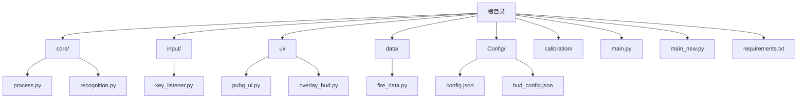
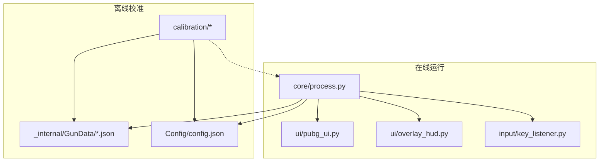
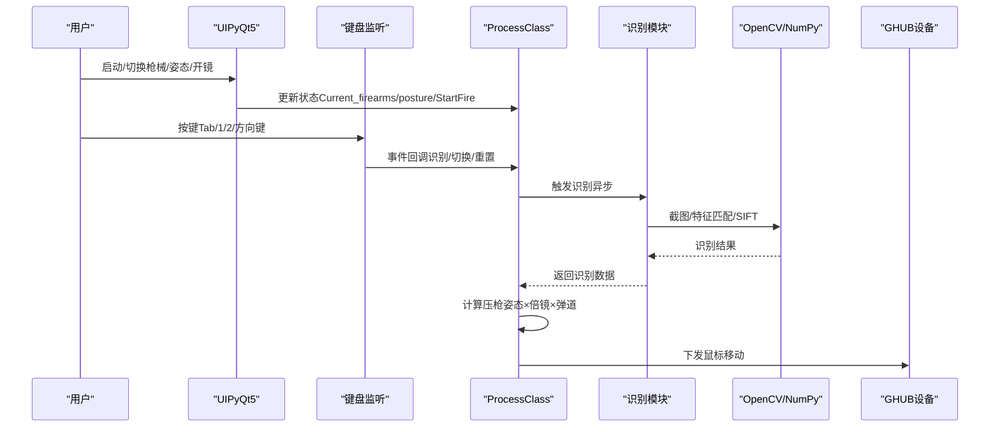
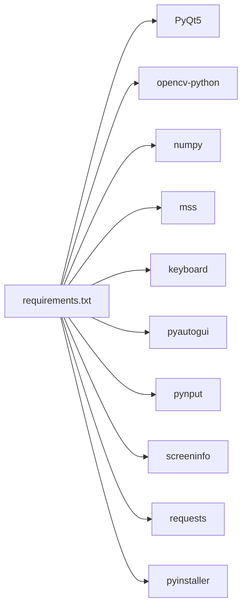

# 开发环境搭建

<cite>
**本文引用的文件**
- [requirements.txt](file://requirements.txt)
- [README.md](file://README.md)
- [main.py](file://main.py)
- [main_new.py](file://main_new.py)
- [core/process.py](file://core/process.py)
- [core/recognition.py](file://core/recognition.py)
- [input/key_listener.py](file://input/key_listener.py)
- [ui/pubg_ui.py](file://ui/pubg_ui.py)
- [ui/overlay_hud.py](file://ui/overlay_hud.py)
- [Config/config.json](file://Config/config.json)
- [Config/hud_config.json](file://Config/hud_config.json)
- [docs/SDD-Architecture.md](file://docs/SDD-Architecture.md)
</cite>

## 目录
1. [简介](#简介)
2. [项目结构](#项目结构)
3. [核心组件](#核心组件)
4. [架构总览](#架构总览)
5. [详细组件分析](#详细组件分析)
6. [依赖分析](#依赖分析)
7. [性能考虑](#性能考虑)
8. [故障排查指南](#故障排查指南)
9. [结论](#结论)
10. [附录](#附录)

## 简介
本指南面向希望在本地搭建并运行本项目的开发者，提供从 Python 环境、核心依赖、IDE 配置到打包与常见问题排查的全流程说明。项目基于 Python 3.8+，使用 PyQt5 构建图形界面，依赖 OpenCV、NumPy 等进行图像识别与处理，并通过 PyInstaller 打包为可执行程序。

## 项目结构
项目采用按功能域分层的组织方式：
- 核心逻辑：core（进程调度、识别、压枪计算）
- 输入监听：input（键盘/鼠标事件）
- 界面：ui（PyQt5 UI、游戏内 HUD）
- 数据与配置：data（弹道/按键映射）、Config（用户配置）
- 校准工具：calibration（弹痕检测与校准）
- 示例入口：main.py、main_new.py
- 依赖清单：requirements.txt

图表来源
- [README.md:22-67](file://README.md#L22-L67)
- [main.py:1-294](file://main.py#L1-L294)
- [main_new.py:1-112](file://main_new.py#L1-L112)

章节来源
- [README.md:22-67](file://README.md#L22-L67)

## 核心组件
- 进程与压枪核心：ProcessClass（配置读取、识别结果缓存、压枪算法、开火循环）
- 图像识别：SIFT 特征匹配、异步截图与模板比对
- 输入监听：键盘/鼠标事件捕获与转发
- 图形界面：PyQt5 UI、游戏内 HUD（三档模式、可拖动、热键切换）
- 配置管理：分辨率、灵敏度、HUD 样式与热键

章节来源
- [core/process.py:13-405](file://core/process.py#L13-L405)
- [core/recognition.py:1-478](file://core/recognition.py#L1-L478)
- [input/key_listener.py:1-70](file://input/key_listener.py#L1-L70)
- [ui/pubg_ui.py:1-718](file://ui/pubg_ui.py#L1-L718)
- [ui/overlay_hud.py:1-698](file://ui/overlay_hud.py#L1-L698)
- [Config/config.json:1-1](file://Config/config.json#L1-L1)
- [Config/hud_config.json:1-91](file://Config/hud_config.json#L1-L91)

## 架构总览
系统分为“离线校准”和“在线运行”两条主线，二者共享数据格式与配置文件。运行时根据识别结果与配置，按固定时间步驱动鼠标移动实现压枪。

图表来源
- [docs/SDD-Architecture.md:17-46](file://docs/SDD-Architecture.md#L17-L46)
- [docs/SDD-Architecture.md:50-71](file://docs/SDD-Architecture.md#L50-L71)

## 详细组件分析

### Python 环境与依赖
- Python 版本：≥ 3.8（Windows 10/11）
- 关键依赖（来自 requirements.txt）：PyQt5、OpenCV、NumPy、PyInstaller、keyboard、mss、pyautogui、pynput、screeninfo、requests 等
- 依赖安装：使用 pip 安装 requirements.txt 中列出的所有包

章节来源
- [README.md:16-20](file://README.md#L16-L20)
- [requirements.txt:1-25](file://requirements.txt#L1-L25)

### 依赖安装与版本兼容性
- 使用虚拟环境隔离依赖，避免全局污染
- 优先使用 requirements.txt 固定版本，确保跨平台一致性
- 如需升级，建议先在测试分支验证兼容性

章节来源
- [README.md:69-77](file://README.md#L69-L77)
- [requirements.txt:1-25](file://requirements.txt#L1-L25)

### IDE 配置建议
- VS Code
  - 推荐扩展：Python、Pylance、Qt/PyQt
  - 解释器：指向虚拟环境中的 Python 3.8+
  - 启动配置：分别针对 main.py 与 main_new.py 设置 launch.json
- PyCharm
  - 项目解释器：选择虚拟环境
  - 运行/调试：新增 Python 配置，脚本路径分别为 main.py 与 main_new.py
  - 代码风格：启用 PEP8 检查与自动格式化

[本节为通用 IDE 配置建议，不直接分析具体文件]

### 项目入口与运行
- 主入口：main.py（经典 UI）
- 备选入口：main_new.py（现代 UI）
- 启动方式：pip 安装依赖后，直接运行 python main.py 或 python main_new.py

章节来源
- [README.md:69-83](file://README.md#L69-L83)
- [main.py:287-294](file://main.py#L287-L294)
- [main_new.py:106-112](file://main_new.py#L106-L112)

### 核心流程：识别与压枪

图表来源
- [input/key_listener.py:14-56](file://input/key_listener.py#L14-L56)
- [core/process.py:138-261](file://core/process.py#L138-L261)
- [core/recognition.py:102-126](file://core/recognition.py#L102-L126)

### 图像识别与特征匹配
- 截图：使用 mss 获取指定区域灰度图
- 匹配：SIFT 特征 + Flann 匹配 + knnMatch + 距离阈值过滤
- 异步处理：并发捕获与匹配，提升整体吞吐
- 姿势识别：支持模板匹配与自适应稳定性检测

章节来源
- [core/recognition.py:10-24](file://core/recognition.py#L10-L24)
- [core/recognition.py:38-65](file://core/recognition.py#L38-L65)
- [core/recognition.py:102-126](file://core/recognition.py#L102-L126)
- [core/recognition.py:365-423](file://core/recognition.py#L365-L423)

### 配置与数据
- 运行时配置：Config/config.json（分辨率、灵敏度）
- HUD 配置：Config/hud_config.json（位置、颜色、字体、刷新频率、热键）
- UI 配置：ui/pubg_ui.py（分辨率选项、灵敏度映射）

章节来源
- [Config/config.json:1-1](file://Config/config.json#L1-L1)
- [Config/hud_config.json:1-91](file://Config/hud_config.json#L1-L91)
- [ui/pubg_ui.py:530-718](file://ui/pubg_ui.py#L530-L718)

## 依赖分析
- 运行时依赖：PyQt5、OpenCV、NumPy、mss、Pillow、requests、pynput、keyboard、pyautogui、screeninfo、setuptools、pip、pyinstaller 等
- 依赖来源：requirements.txt
- 版本固定：建议保持与 requirements.txt 一致，避免因版本差异导致行为异常

图表来源
- [requirements.txt:1-25](file://requirements.txt#L1-L25)

章节来源
- [requirements.txt:1-25](file://requirements.txt#L1-L25)

## 性能考虑
- 异步截图与匹配：减少主线程阻塞，提高识别吞吐
- 时间步一致性：校准与运行时均采用 9ms 步长，保证理论与实测一致
- 余数累加：在每 tick 累积浮点误差，取整后下发，避免累计偏差过大
- HUD 刷新频率：可通过配置调整刷新周期，平衡流畅度与资源占用

章节来源
- [core/recognition.py:102-126](file://core/recognition.py#L102-L126)
- [core/process.py:368-385](file://core/process.py#L368-L385)
- [core/process.py:387-404](file://core/process.py#L387-L404)
- [Config/hud_config.json:88-90](file://Config/hud_config.json#L88-L90)

## 故障排查指南
- 无法导入模块
  - 确认已在虚拟环境中安装 requirements.txt
  - 检查 Python 版本是否满足 ≥ 3.8
- 图像识别不准确
  - 调整分辨率截图区域（data/resolution_setting.py）
  - 参考 README 的调试截图说明，定位 ROI 坐标
- HUD 不显示或穿透失效
  - 确认 Windows 系统为 10/11，且具备必要 DPI 设置能力
  - 检查 HUD 配置文件（hud_config.json）路径与权限
- 压枪不生效
  - 核对灵敏度配置（Config/config.json）与倍镜映射
  - 确认 GHUB 驱动已正确安装且以管理员权限运行
- 打包问题
  - 使用 requirements.txt 中的 pyinstaller 版本
  - 按 README 的打包命令执行，确认 dist 目录产物

章节来源
- [README.md:16-20](file://README.md#L16-L20)
- [README.md:111-114](file://README.md#L111-L114)
- [ui/overlay_hud.py:18-38](file://ui/overlay_hud.py#L18-L38)
- [Config/hud_config.json:61-125](file://Config/hud_config.json#L61-L125)
- [README.md:145-149](file://README.md#L145-L149)

## 结论
按照本指南完成 Python 环境与依赖安装、IDE 配置与项目启动后，即可在 Windows 平台运行本项目。建议在虚拟环境中管理依赖，严格遵循 requirements.txt 的版本约束，并通过 HUD 与日志输出验证各模块工作状态。遇到问题时，优先检查分辨率与灵敏度配置、截图区域与特征匹配阈值，以及 GHUB 驱动与管理员权限。

## 附录
- 快速开始
  - 安装依赖：pip install -r requirements.txt
  - 启动程序：python main.py 或 python main_new.py
- 打包
  - 使用 pyinstaller 按 README 指令生成可执行文件

章节来源
- [README.md:69-83](file://README.md#L69-L83)
- [README.md:145-149](file://README.md#L145-L149)