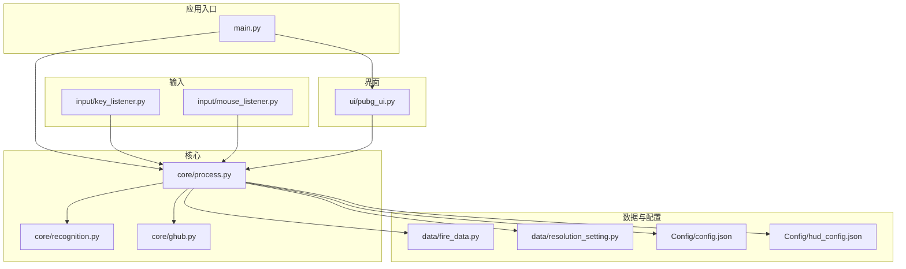
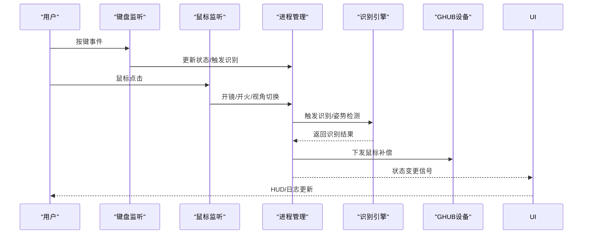
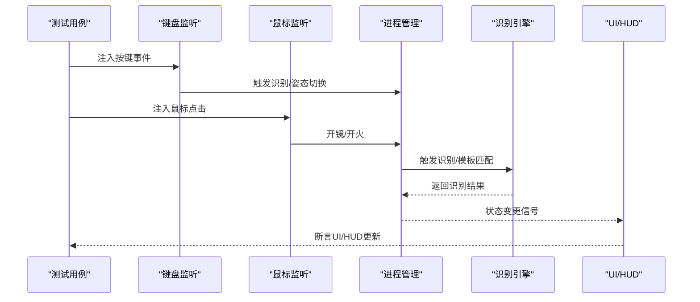
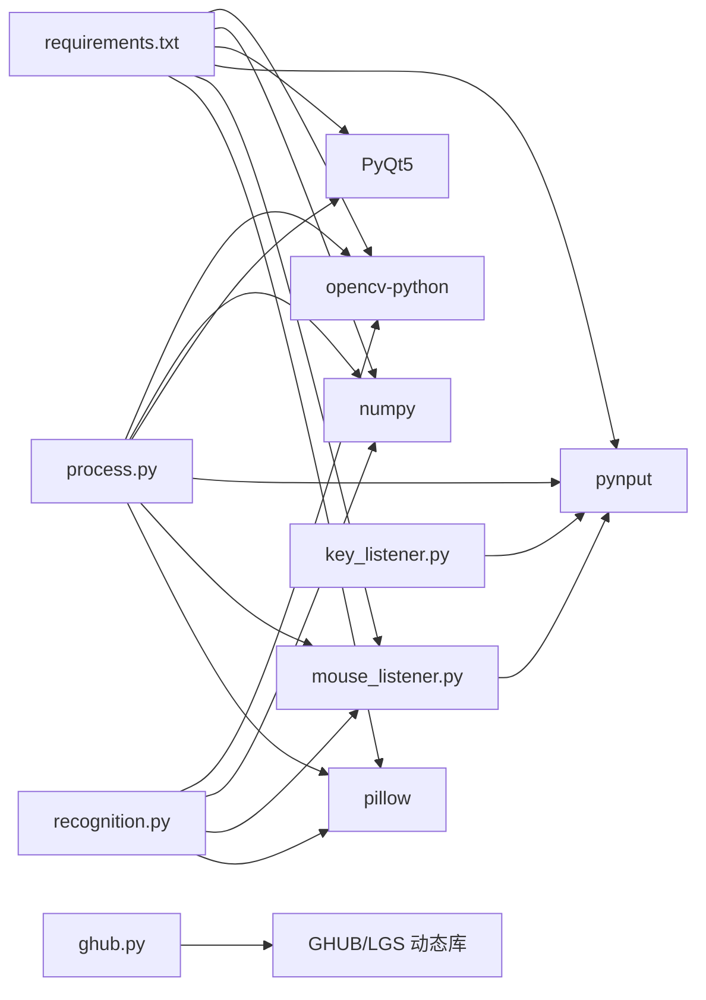

# 测试策略

<cite>
**本文引用的文件**
- [main.py](file://main.py)
- [process.py](file://core/process.py)
- [recognition.py](file://core/recognition.py)
- [key_listener.py](file://input/key_listener.py)
- [mouse_listener.py](file://input/mouse_listener.py)
- [pubg_ui.py](file://ui/pubg_ui.py)
- [fire_data.py](file://data/fire_data.py)
- [resolution_setting.py](file://data/resolution_setting.py)
- [ghub.py](file://core/ghub.py)
- [config.json](file://Config/config.json)
- [hud_config.json](file://Config/hud_config.json)
- [test_pose.py](file://test_pose.py)
- [requirements.txt](file://requirements.txt)
</cite>

## 目录
1. [引言](#引言)
2. [项目结构](#项目结构)
3. [核心组件](#核心组件)
4. [架构总览](#架构总览)
5. [详细组件分析](#详细组件分析)
6. [依赖分析](#依赖分析)
7. [性能考量](#性能考量)
8. [故障排查指南](#故障排查指南)
9. [结论](#结论)
10. [附录](#附录)

## 引言
本测试策略面向“PUBG宏自动识别”项目，目标是建立系统化的测试体系，覆盖单元测试、集成测试与端到端测试，并提供性能测试方法与测试数据管理建议，以及持续集成与自动化测试配置思路。文档将围绕以下关键模块展开：核心识别流程、进程管理与状态机、输入事件处理、UI与HUD展示、配置与模板匹配等。

## 项目结构
项目采用按功能分层组织：核心识别与进程控制位于 core，输入事件处理位于 input，UI与HUD位于 ui，数据与配置位于 data 与 Config，校准工具位于 calibration，工具脚本位于 tools。测试策略将针对各层的关键职责设计测试用例。

图表来源
- [main.py:1-294](file://main.py#L1-L294)
- [process.py:1-405](file://core/process.py#L1-L405)
- [recognition.py:1-478](file://core/recognition.py#L1-L478)
- [key_listener.py:1-70](file://input/key_listener.py#L1-L70)
- [mouse_listener.py:1-64](file://input/mouse_listener.py#L1-L64)
- [pubg_ui.py:1-718](file://ui/pubg_ui.py#L1-L718)
- [fire_data.py:1-83](file://data/fire_data.py#L1-L83)
- [resolution_setting.py:1-147](file://data/resolution_setting.py#L1-L147)
- [config.json:1-1](file://Config/config.json#L1-L1)
- [hud_config.json:1-91](file://Config/hud_config.json#L1-L91)

章节来源
- [main.py:1-294](file://main.py#L1-L294)
- [process.py:1-405](file://core/process.py#L1-L405)
- [recognition.py:1-478](file://core/recognition.py#L1-L478)
- [key_listener.py:1-70](file://input/key_listener.py#L1-L70)
- [mouse_listener.py:1-64](file://input/mouse_listener.py#L1-L64)
- [pubg_ui.py:1-718](file://ui/pubg_ui.py#L1-L718)
- [fire_data.py:1-83](file://data/fire_data.py#L1-L83)
- [resolution_setting.py:1-147](file://data/resolution_setting.py#L1-L147)
- [config.json:1-1](file://Config/config.json#L1-L1)
- [hud_config.json:1-91](file://Config/hud_config.json#L1-L91)

## 核心组件
- 进程管理与状态机：负责配置读写、识别结果缓存、开镜/姿态/枪械状态、开火循环与补偿计算。
- 识别引擎：负责屏幕截图、区域裁剪、特征匹配（SIFT）、模板匹配、姿势区域稳定性检测与等待。
- 输入事件：键盘与鼠标监听，触发识别、姿态识别、开火循环、视角切换等。
- UI/HUD：图形界面与HUD叠加显示，绑定事件与状态更新。
- 配置与数据：分辨率坐标、灵敏度配置、枪械与配件映射、HUD样式配置。

章节来源
- [process.py:13-405](file://core/process.py#L13-L405)
- [recognition.py:10-478](file://core/recognition.py#L10-L478)
- [key_listener.py:6-70](file://input/key_listener.py#L6-L70)
- [mouse_listener.py:13-64](file://input/mouse_listener.py#L13-L64)
- [pubg_ui.py:4-718](file://ui/pubg_ui.py#L4-L718)
- [fire_data.py:1-83](file://data/fire_data.py#L1-L83)
- [resolution_setting.py:1-147](file://data/resolution_setting.py#L1-L147)
- [config.json:1-1](file://Config/config.json#L1-L1)
- [hud_config.json:1-91](file://Config/hud_config.json#L1-L91)

## 架构总览
下图展示了测试关注的交互路径：输入事件触发识别与状态更新，识别结果回填至进程管理，UI/HUD实时反映状态；配置与模板辅助识别稳定性。

图表来源
- [key_listener.py:14-70](file://input/key_listener.py#L14-L70)
- [mouse_listener.py:23-64](file://input/mouse_listener.py#L23-L64)
- [process.py:138-405](file://core/process.py#L138-L405)
- [recognition.py:67-423](file://core/recognition.py#L67-L423)
- [ghub.py:22-55](file://core/ghub.py#L22-L55)
- [pubg_ui.py:1-718](file://ui/pubg_ui.py#L1-L718)

## 详细组件分析

### 单元测试设计原则与用例清单
- 设计原则
  - 针对纯函数与可独立验证的逻辑优先单元测试，如配置读写、状态计算、映射转换、阈值判定等。
  - 使用最小依赖与可替换性（如用Mock替换外部I/O），隔离屏幕截图、驱动调用等。
  - 以断言结果的确定性与边界条件为主，避免对随机性或时序敏感逻辑进行脆弱断言。
  - 为识别与匹配函数提供可控的输入（如固定尺寸的灰度图、已知匹配度的模板），便于重复验证。

- 关键单元测试用例
  - 配置读写
    - 读取分辨率与灵敏度配置，断言默认值与更新后一致性。
    - 断言配置保存后文件内容符合预期。
  - 状态计算
    - 姿态×倍镜×后坐力合成计算，断言整数取整与边界值。
    - Shift倍率叠加逻辑，断言仅在特定条件下生效。
  - 映射与编码
    - 枪口/握把/枪托编码生成，断言生成规则与KEY_DATA映射。
    - 枪械名称到JSON的读取，断言缺失文件时的行为。
  - 匹配与阈值
    - SIFT匹配度计算，断言低/高匹配场景与阈值过滤。
    - 模板匹配阈值与最佳匹配返回。
  - 姿势区域稳定性
    - 稳定性检测与等待函数，断言超时与阈值行为。
  - UI状态映射
    - UI按钮与内部状态的双向映射，断言切换后状态一致。

章节来源
- [process.py:53-124](file://core/process.py#L53-L124)
- [process.py:183-261](file://core/process.py#L183-L261)
- [process.py:263-275](file://core/process.py#L263-L275)
- [process.py:368-404](file://core/process.py#L368-L404)
- [recognition.py:26-65](file://core/recognition.py#L26-L65)
- [recognition.py:289-316](file://core/recognition.py#L289-L316)
- [recognition.py:129-170](file://core/recognition.py#L129-L170)
- [pubg_ui.py:101-130](file://ui/pubg_ui.py#L101-L130)

### 集成测试实施方案
- 模块间交互测试
  - 键盘/鼠标监听与进程管理：构造按键/鼠标事件序列，断言状态切换与识别触发。
  - 识别引擎与进程管理：注入固定截图与模板，断言识别结果与返回格式。
  - UI/HUD与进程管理：断言状态变更信号驱动UI更新与HUD刷新。
- 端到端功能测试
  - 场景一：切换分辨率→保存配置→触发识别→断言UI显示与日志输出。
  - 场景二：第一/第三人称切换→等待渲染→姿势识别→断言结果与模板匹配。
  - 场景三：开镜/开火→后坐力补偿→鼠标移动下发→断言补偿序列与取整逻辑。
- 测试数据准备
  - 使用 test_pose.py 提供的模板创建与匹配能力，准备多分辨率姿势模板。
  - 使用固定尺寸灰度图与已知匹配度的样例图，替代真实截图，提高稳定性。

图表来源
- [key_listener.py:14-70](file://input/key_listener.py#L14-L70)
- [mouse_listener.py:23-64](file://input/mouse_listener.py#L23-L64)
- [process.py:138-170](file://core/process.py#L138-L170)
- [recognition.py:365-423](file://core/recognition.py#L365-L423)
- [pubg_ui.py:1-718](file://ui/pubg_ui.py#L1-L718)

章节来源
- [test_pose.py:14-103](file://test_pose.py#L14-L103)
- [test_pose.py:257-297](file://test_pose.py#L257-L297)
- [process.py:138-170](file://core/process.py#L138-L170)
- [recognition.py:365-423](file://core/recognition.py#L365-L423)

### 性能测试方法与工具
- 速度测试
  - 识别流水线耗时：记录从截图到识别完成的总时长，断言在不同分辨率下的上限。
  - 匹配算法耗时：分别测量SIFT与模板匹配的耗时，评估阈值与模板数量对性能的影响。
- 内存使用监控
  - 使用进程级内存采样工具，监控识别循环中的峰值与增长趋势，定位异常增长点。
- CPU占用分析
  - 结合系统采样器，观察识别与匹配阶段的CPU占比，识别热点函数（如模板遍历、匹配器初始化）。
- 建议工具
  - Python：time、memory_profiler、cProfile。
  - 系统：Windows性能监视器、Linux top/htop、valgrind/callgrind。
  - GUI：PyQt事件循环阻塞检测，避免主线程长时间占用。

章节来源
- [recognition.py:102-126](file://core/recognition.py#L102-L126)
- [recognition.py:365-423](file://core/recognition.py#L365-L423)
- [process.py:368-404](file://core/process.py#L368-L404)

### 测试数据准备与管理
- 测试图像集
  - 枪械识别：准备多分辨率、多配件的样张，覆盖常见与极端场景。
  - 姿势识别：使用 test_pose.py 的模板创建能力，按分辨率创建站立/下蹲/趴地模板。
- 模拟输入数据
  - 使用键盘/鼠标监听的事件注入，模拟按键序列与点击节奏，避免真实环境依赖。
- 配置与模板
  - 读取/写入配置文件，断言解析与持久化正确性。
  - 模板目录结构与命名规范，保证识别流程可复现。

章节来源
- [test_pose.py:106-130](file://test_pose.py#L106-L130)
- [test_pose.py:257-297](file://test_pose.py#L257-L297)
- [config.json:1-1](file://Config/config.json#L1-L1)
- [hud_config.json:1-91](file://Config/hud_config.json#L1-L91)

### 持续集成与自动化测试配置
- CI流水线建议
  - 代码检查：flake8/black/isort。
  - 单元测试：pytest + pytest-cov，覆盖核心模块。
  - 集成测试：在虚拟显示环境下运行（如Xvfb），或在专用CI容器中启用GUI。
  - 性能回归：对比上次基线的识别耗时与内存峰值。
- 自动化触发
  - PR/MR触发基础测试；定时任务运行全量集成与性能测试。
- 报告与归档
  - 测试报告与覆盖率报告上传至CI平台；性能指标存档对比。

## 依赖分析
- 组件耦合
  - 进程管理与识别引擎：强耦合（识别结果驱动状态），需通过接口隔离进行测试。
  - 输入监听与进程管理：事件驱动，可通过信号/回调注入测试。
  - UI与进程管理：通过信号解耦，适合单元测试。
- 外部依赖
  - 图像与匹配：OpenCV、NumPy、mss、Pillow。
  - GUI与事件：PyQt5、pynput。
  - 键鼠驱动：GHUB/LGS动态库。
- 潜在风险
  - 屏幕截图与驱动调用的不确定性，应通过Mock与固定输入规避。
  - 分辨率与模板差异导致的误判，需完善阈值与多分辨率模板。

图表来源
- [requirements.txt:1-25](file://requirements.txt#L1-L25)
- [process.py:1-12](file://core/process.py#L1-L12)
- [recognition.py:1-9](file://core/recognition.py#L1-L9)
- [key_listener.py:1-5](file://input/key_listener.py#L1-L5)
- [mouse_listener.py:1-11](file://input/mouse_listener.py#L1-L11)
- [ghub.py:1-55](file://core/ghub.py#L1-L55)

章节来源
- [requirements.txt:1-25](file://requirements.txt#L1-L25)
- [process.py:1-12](file://core/process.py#L1-L12)
- [recognition.py:1-9](file://core/recognition.py#L1-L9)
- [key_listener.py:1-5](file://input/key_listener.py#L1-L5)
- [mouse_listener.py:1-11](file://input/mouse_listener.py#L1-L11)
- [ghub.py:1-55](file://core/ghub.py#L1-L55)

## 性能考量
- 识别路径优化
  - 异步并发截图与匹配，减少串行等待。
  - 模板匹配阈值与数量平衡，避免过度扫描。
- 内存与CPU
  - 控制图像尺寸与通道转换，避免重复拷贝。
  - 合理设置匹配器参数与搜索深度，降低复杂度。
- 实时性保障
  - 识别耗时与帧率挂钩，必要时降低分辨率或模板数量。
  - 对UI/HUD更新频率进行节流，避免频繁重绘。

## 故障排查指南
- 驱动问题
  - GHUB/LGS未安装或文件缺失：检查设备初始化信息与动态库路径。
- 识别失败
  - 模板缺失或阈值不当：确认模板目录与命名，调整匹配阈值。
  - 分辨率不匹配：核对分辨率配置与区域坐标。
- 输入事件异常
  - 键盘/鼠标监听未启动：检查线程状态与信号发射。
- UI/HUD异常
  - 状态未更新：检查信号连接与UI控件属性。

章节来源
- [ghub.py:8-21](file://core/ghub.py#L8-L21)
- [test_pose.py:106-130](file://test_pose.py#L106-L130)
- [config.json:1-1](file://Config/config.json#L1-L1)
- [resolution_setting.py:1-147](file://data/resolution_setting.py#L1-L147)
- [key_listener.py:58-70](file://input/key_listener.py#L58-L70)
- [mouse_listener.py:52-64](file://input/mouse_listener.py#L52-L64)

## 结论
通过单元测试覆盖核心算法与状态逻辑，集成测试验证模块交互与端到端流程，配合性能测试与测试数据管理，可显著提升系统的稳定性与可维护性。建议在CI中引入自动化测试与性能回归，持续优化识别与匹配效率。

## 附录
- 测试用例清单（示例）
  - 配置读写：读取默认值、更新后一致性、保存后文件内容。
  - 状态计算：姿态×倍镜×后坐力合成、Shift倍率叠加。
  - 映射与编码：配件编码生成、枪械JSON读取。
  - 匹配与阈值：SIFT匹配度、模板匹配阈值。
  - 姿势区域稳定性：等待与稳定检测。
  - UI状态映射：按钮与状态双向映射。
- 推荐工具
  - 单元测试：pytest。
  - 性能：cProfile、memory_profiler。
  - GUI：PyQt5测试工具与虚拟显示环境。