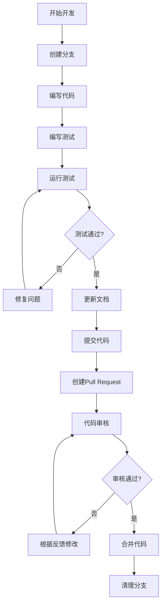
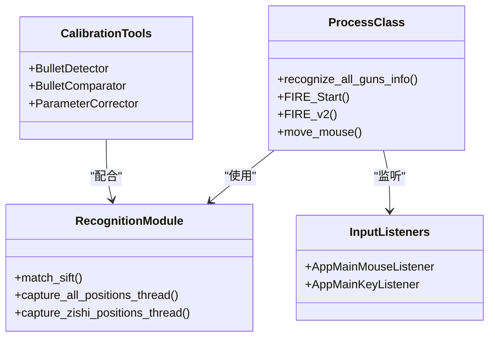
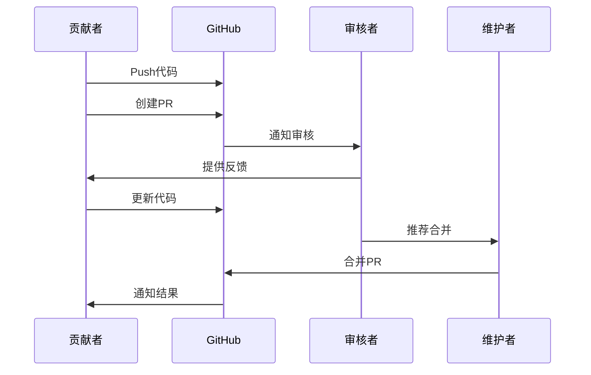

# 贡献指南

<cite>
**本文档引用的文件**
- [README.md](file://README.md)
- [requirements.txt](file://requirements.txt)
- [main.py](file://main.py)
- [core/recognition.py](file://core/recognition.py)
- [docs/PROJECT_KNOWLEDGE.md](file://docs/PROJECT_KNOWLEDGE.md)
- [docs/SDD-Architecture.md](file://docs/SDD-Architecture.md)
- [docs/YOLO_Training_Guide.md](file://docs/YOLO_Training_Guide.md)
- [calibration/README.md](file://calibration/README.md)
- [todo/PUBG宏识别工具技术增强建议.md](file://todo/PUBG宏识别工具技术增强建议.md)
- [todo/PUBG宏识别工具新功能建议.md](file://todo/PUBG宏识别工具新功能建议.md)
- [docs/SDD-Algorithm.md](file://docs/SDD-Algorithm.md)
- [docs/SDD-UserGuide.md](file://docs/SDD-UserGuide.md)
- [docs/SDD-DataFormat.md](file://docs/SDD-DataFormat.md)
- [calibration/CURVE_EDITOR_ANOMALY_DETECTION.md](file://calibration/CURVE_EDITOR_ANOMALY_DETECTION.md)
</cite>

## 目录
1. [简介](#简介)
2. [项目结构](#项目结构)
3. [参与方式](#参与方式)
4. [代码贡献流程](#代码贡献流程)
5. [功能请求和Bug报告](#功能请求和bug报告)
6. [代码贡献标准](#代码贡献标准)
7. [文档贡献规范](#文档贡献规范)
8. [社区行为准则](#社区行为准则)
9. [新贡献者指南](#新贡献者指南)
10. [审核标准和合并要求](#审核标准和合并要求)
11. [故障排除指南](#故障排除指南)
12. [结语](#结语)

## 简介

欢迎加入PUBG自动识别压枪工具项目的开源社区！这是一个基于Python开发的PUBG游戏辅助工具，利用OpenCV SIFT算法实现枪械与配件的自动识别，并通过Logitech GHUB驱动实现智能压枪功能。

本项目采用模块化架构设计，包含核心识别逻辑、GUI界面、校准工具等多个子系统。项目支持Windows平台，需要Python 3.8及以上版本和Logitech GHUB驱动。

## 项目结构

项目采用清晰的模块化组织结构，主要目录和文件职责如下：

```mermaid
graph TB
subgraph "项目根目录"
A[main.py] --> B[核心模块]
C[main_new.py] --> D[UI模块]
E[requirements.txt] --> F[依赖管理]
end
subgraph "核心模块 (core/)"
G[process.py] --> H[压枪控制]
I[ghub.py] --> J[GHUB驱动封装]
K[recognition.py] --> L[SIFT识别]
end
subgraph "数据模块 (data/)"
M[fire_data.py] --> N[配件映射]
O[bullet_data.py] --> P[弹道数据]
Q[resolution_setting.py] --> R[分辨率配置]
end
subgraph "输入模块 (input/)"
S[mouse_listener.py] --> T[鼠标监听]
U[key_listener.py] --> V[键盘监听]
end
subgraph "UI模块 (ui/)"
W[overlay_hud.py] --> X[游戏内HUD]
Y[ingame_display.py] --> Z[信息显示]
AA[pubg_ui.py] --> BB[主界面]
CC[modern_ui.py] --> DD[现代界面]
end
subgraph "校准模块 (calibration/)"
EE[bullet_analysis.py] --> FF[弹痕分析]
GG[calibrate_gui.py] --> HH[GUI校准]
II[calibrate.py] --> JJ[CLI校准]
KK[calibrate_hud.py] --> LL[HUD校准]
end
subgraph "工具模块 (tools/)"
MM[train_yolo.py] --> NN[YOLO训练]
OO[migrate_gundata.py] --> PP[数据迁移]
end
subgraph "配置文件"
QQ[config.json] --> RR[用户配置]
SS[hud_config.json] --> TT[HUD配置]
end
subgraph "内部资源 (_internal/)"
UU[GunData/*.json] --> VV[弹道数据]
WW[data/firearms/] --> XX[识别模板]
YY[ghub_device_GHUB.dll] --> ZZ[GHUB驱动]
end
```



**图表来源**
- [README.md:22-67](file://README.md#L22-L67)
- [docs/PROJECT_KNOWLEDGE.md:17-72](file://docs/PROJECT_KNOWLEDGE.md#L17-L72)

**章节来源**
- [README.md:22-67](file://README.md#L22-L67)
- [docs/PROJECT_KNOWLEDGE.md:17-72](file://docs/PROJECT_KNOWLEDGE.md#L17-L72)

## 参与方式

### 1. Fork项目
1. 访问GitHub仓库页面
2. 点击右上角的"Fork"按钮
3. 选择您的GitHub账户作为目标
4. 等待Fork完成

### 2. 克隆项目
```bash
git clone https://github.com/您的用户名/PUBG-automatically-recognizes-macros.git
cd PUBG-automatically-recognizes-macros
```

### 3. 创建开发环境
```bash
# 创建虚拟环境
python -m venv venv
source venv/bin/activate  # Linux/Mac
# 或
venv\Scripts\activate  # Windows

# 安装依赖
pip install -r requirements.txt
```

### 4. 创建分支
```bash
# 基于最新代码创建新分支
git checkout -b feature/新功能名称
# 或
git checkout -b fix/修复描述
```

## 代码贡献流程

### 1. 开发流程



**图表来源**
- [main.py:223-286](file://main.py#L223-L286)

### 2. Pull Request要求

#### 基本要求
- **分支命名**: `feature/功能描述` 或 `fix/修复描述`
- **提交信息**: 清晰描述变更内容，遵循"类型: 描述"格式
- **测试覆盖**: 新功能必须包含相应的单元测试
- **文档更新**: 更新相关文档和README

#### 提交规范
```bash
# 提交前检查
git status
git diff

# 提交代码
git add .
git commit -m "类型: 清晰的描述信息"

# 推送到远程仓库
git push origin feature/分支名称
```

## 功能请求和Bug报告

### 1. Issue模板

#### Bug报告模板
```markdown
## Bug报告

### 环境信息
- 系统版本: [例如: Windows 11]
- Python版本: [例如: 3.9.7]
- GHUB版本: [例如: 21.0]
- 分辨率: [例如: 1920x1080]

### 重现步骤
1. [第一步]
2. [第二步]
3. [得到预期结果]

### 预期行为
[描述期望的行为]

### 实际行为
[描述实际发生的问题]

### 日志信息
[提供相关日志或错误信息]

### 截图
[如有必要，提供截图]
```

#### 功能请求模板
```markdown
## 功能请求

### 功能描述
[清晰描述想要的功能]

### 使用场景
[描述在什么情况下需要这个功能]

### 实现方案
[如果有的话，提供实现思路]

### 相关资源
[相关链接或参考资料]
```

### 2. 提交规范

#### Bug报告要求
- **重现性**: 提供可重现的步骤
- **环境信息**: 完整的环境描述
- **日志**: 包含相关错误日志
- **截图**: 必要时提供截图

#### 功能请求要求
- **明确性**: 功能描述要清晰具体
- **必要性**: 说明为什么需要这个功能
- **可行性**: 提供可能的实现方案
- **影响评估**: 说明对现有功能的影响

**章节来源**
- [todo/PUBG宏识别工具技术增强建议.md:1-345](file://todo/PUBG宏识别工具技术增强建议.md#L1-L345)
- [todo/PUBG宏识别工具新功能建议.md:1-206](file://todo/PUBG宏识别工具新功能建议.md#L1-L206)

## 代码贡献标准

### 1. 代码风格

#### Python代码规范
- **命名规范**: 
  - 类名: `CamelCase`
  - 函数名: `snake_case`
  - 常量: `UPPER_CASE`
  - 变量: `snake_case`

- **缩进**: 4个空格
- **行长度**: 不超过79字符
- **导入顺序**: 标准库 → 第三方库 → 项目内模块

#### 注释规范
```python
def example_function(param1, param2):
    """
    简要描述函数功能
    
    详细描述函数的工作原理和使用方法
    包括参数说明、返回值说明和异常处理
    
    Args:
        param1 (str): 参数1的说明
        param2 (int): 参数2的说明
        
    Returns:
        bool: 返回值的说明
        
    Raises:
        ValueError: 异常说明
    """
    # 具体实现
    pass
```

### 2. 错误处理

#### 异常处理模式
```python
try:
    # 可能出错的代码
    risky_operation()
except SpecificException as e:
    # 记录错误日志
    logger.error(f"操作失败: {e}")
    # 重新抛出异常
    raise
except Exception as e:
    # 处理未知异常
    logger.critical(f"未预期错误: {e}")
    # 提供默认行为
    return default_value
```

### 3. 性能考虑

#### 性能优化原则
- **避免重复计算**: 缓存昂贵的操作结果
- **内存管理**: 及时释放不需要的对象
- **算法复杂度**: 选择合适的时间复杂度
- **异步处理**: 对耗时操作使用异步模式

**章节来源**
- [core/recognition.py:38-65](file://core/recognition.py#L38-L65)
- [docs/PROJECT_KNOWLEDGE.md:345-354](file://docs/PROJECT_KNOWLEDGE.md#L345-L354)

## 文档贡献规范

### 1. 文档类型

#### 技术文档
- **架构文档**: 系统架构设计说明
- **API文档**: 接口使用说明
- **算法文档**: 核心算法实现细节
- **配置文档**: 配置文件说明

#### 用户文档
- **使用指南**: 功能使用说明
- **安装指南**: 环境搭建步骤
- **故障排除**: 常见问题解答
- **最佳实践**: 使用建议和技巧

### 2. 文档格式

#### Markdown规范
```markdown
# 标题

## 章节标题

### 小节标题

**粗体文本** 和 *斜体文本*

- 列表项1
- 列表项2

```python
# 代码示例
print("Hello World")
```

[链接文本](https://example.com)

| 表头1 | 表头2 |
|-------|-------|
| 内容1 | 内容2 |
```

### 3. 文档更新流程

#### 更新步骤
1. **创建文档**: 在相应目录创建新文档
2. **编写内容**: 按照模板格式编写
3. **本地预览**: 使用Markdown编辑器预览效果
4. **提交更新**: 创建Pull Request
5. **审核合并**: 等待维护者审核

**章节来源**
- [docs/SDD-Architecture.md:1-129](file://docs/SDD-Architecture.md#L1-L129)
- [docs/YOLO_Training_Guide.md:1-301](file://docs/YOLO_Training_Guide.md#L1-L301)

## 社区行为准则

### 1. 基本原则

#### 尊重与包容
- 尊重所有贡献者，无论其背景如何
- 以建设性的方式提供反馈
- 避免歧视性语言和行为
- 鼓励不同观点的表达

#### 积极参与
- 主动帮助新贡献者
- 提供有益的建议和指导
- 分享知识和经验
- 维护社区的良好氛围

### 2. 沟通指南

#### 有效沟通
- **清晰表达**: 使用简洁明了的语言
- **耐心倾听**: 认真听取他人意见
- **建设性反馈**: 提供具体的改进建议
- **避免冲突**: 以解决问题为导向

#### 社交媒体礼仪
- 遵守GitHub社区准则
- 避免发布不当内容
- 尊重知识产权
- 保护个人隐私

### 3. 冲突解决

#### 处理分歧
1. **私下沟通**: 首先尝试私下解决
2. **寻求共识**: 寻找双方都能接受的解决方案
3. **第三方介入**: 必要时请项目维护者协助
4. **社区投票**: 重大决策可通过社区投票决定

## 新贡献者指南

### 1. 快速开始

#### 环境准备
```bash
# 1. Fork项目并克隆
git clone https://github.com/您的用户名/PUBG-automatically-recognizes-macros.git
cd PUBG-automatically-recognizes-macros

# 2. 创建虚拟环境
python -m venv venv
source venv/bin/activate  # Linux/Mac
# 或 venv\Scripts\activate  # Windows

# 3. 安装依赖
pip install -r requirements.txt

# 4. 验证安装
python -c "import cv2; print('OpenCV版本:', cv2.__version__)"
```

#### 运行项目
```bash
# 启动主程序
python main.py

# 启动GUI校准工具
python -m calibration.calibrate_gui

# 启动CLI校准工具
python -m calibration.calibrate
```

### 2. 项目理解

#### 核心概念
- **SIFT识别**: 使用OpenCV SIFT算法进行特征匹配
- **压枪算法**: 基于弹道数据和配件组合的后坐力补偿
- **GHUB集成**: 通过Logitech GHUB驱动控制鼠标
- **多分辨率支持**: 支持多种游戏分辨率的适配

#### 关键模块


**图表来源**
- [docs/PROJECT_KNOWLEDGE.md:121-166](file://docs/PROJECT_KNOWLEDGE.md#L121-L166)

### 3. 第一个贡献

#### 推荐任务
1. **文档改进**: 修复拼写错误或改进说明
2. **测试用例**: 为现有功能添加测试
3. **小bug修复**: 修复容易解决的问题
4. **代码优化**: 改进代码可读性

#### 开发建议
- 从小处着手，逐步熟悉项目
- 阅读相关文档和注释
- 参考现有代码风格
- 及时与维护者沟通

**章节来源**
- [README.md:16-21](file://README.md#L16-L21)
- [docs/PROJECT_KNOWLEDGE.md:101-116](file://docs/PROJECT_KNOWLEDGE.md#L101-L116)

## 审核标准和合并要求

### 1. 代码质量标准

#### 代码审查清单
- **功能性**: 代码按预期工作
- **可读性**: 代码易于理解和维护
- **性能**: 代码效率合理
- **安全性**: 代码无安全漏洞
- **兼容性**: 代码与现有功能兼容

#### 技术要求
- **单元测试**: 新功能至少包含基本测试
- **文档更新**: 相关文档同步更新
- **代码注释**: 关键逻辑有适当注释
- **错误处理**: 完善的异常处理机制

### 2. 合并条件

#### 必需条件
- **代码审查**: 至少一名维护者批准
- **测试通过**: 所有测试用例通过
- **文档更新**: 相关文档已更新
- **CI检查**: CI流水线通过

#### 优先级考虑
- **紧急修复**: 高优先级处理
- **向后兼容**: 保持向后兼容性
- **性能影响**: 评估性能影响
- **社区反馈**: 考虑社区意见

### 3. 审核流程



**图表来源**
- [main.py:223-286](file://main.py#L223-L286)

## 故障排除指南

### 1. 常见问题

#### 安装问题
**问题**: 依赖安装失败
**解决方案**: 
1. 确认Python版本满足要求
2. 检查网络连接
3. 尝试使用国内镜像源
4. 清理pip缓存

**问题**: OpenCV导入失败
**解决方案**:
1. 确认OpenCV版本兼容
2. 检查系统架构匹配
3. 重新安装OpenCV

#### 运行问题
**问题**: 程序启动失败
**解决方案**:
1. 检查GHUB驱动安装
2. 确认管理员权限
3. 验证配置文件正确性

**问题**: 识别不准确
**解决方案**:
1. 调整SIFT参数
2. 检查截图质量
3. 更新模板数据

### 2. 调试技巧

#### 日志分析
```python
import logging

# 配置日志
logging.basicConfig(
    level=logging.DEBUG,
    format='%(asctime)s - %(name)s - %(levelname)s - %(message)s'
)

logger = logging.getLogger(__name__)

# 记录调试信息
logger.debug("变量值: %s", variable)
logger.info("功能执行完成")
logger.warning("潜在问题")
logger.error("错误发生: %s", error)
```

#### 性能监控
- 使用Python内置的`cProfile`分析性能
- 监控内存使用情况
- 分析CPU使用率
- 识别瓶颈代码

### 3. 支持渠道

#### 获取帮助
- **GitHub Issues**: 报告Bug和功能请求
- **社区讨论**: GitHub Discussions
- **文档**: 完整的使用文档
- **示例**: 项目中的示例代码

**章节来源**
- [calibration/README.md:149-199](file://calibration/README.md#L149-L199)
- [docs/YOLO_Training_Guide.md:282-301](file://docs/YOLO_Training_Guide.md#L282-L301)

## 结语

感谢您对PUBG自动识别压枪工具项目的关注和贡献！我们期待您的参与，共同改进这个开源项目。

### 下一步行动
1. **阅读完整文档**: 仔细阅读所有相关文档
2. **选择任务**: 从简单的任务开始
3. **开始贡献**: 提交您的第一个PR
4. **加入社区**: 参与讨论和交流

### 联系方式
- **GitHub Issues**: 项目问题讨论
- **邮件**: 项目维护者邮箱
- **社交媒体**: 项目官方账号

让我们一起打造更好的PUBG辅助工具！