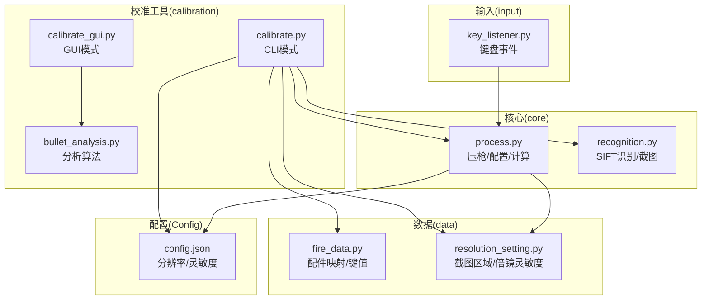
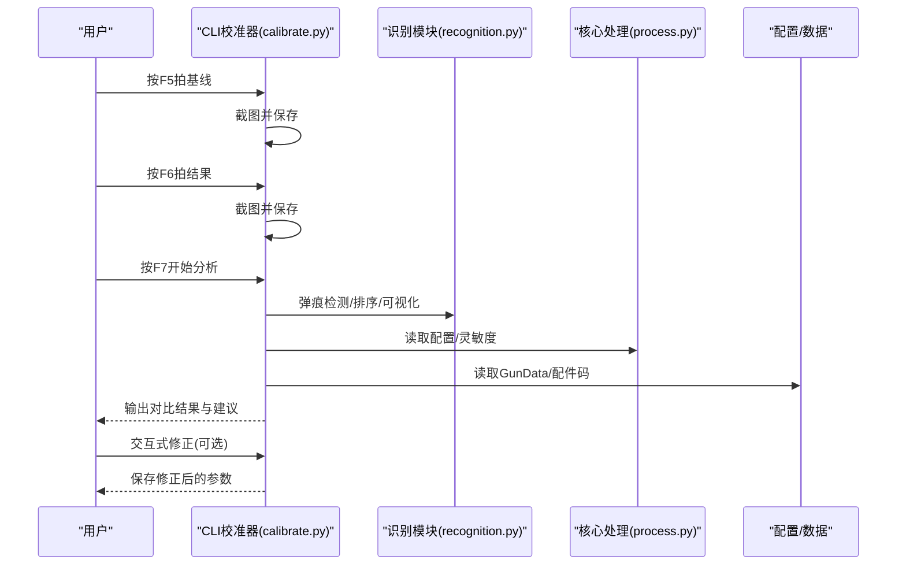
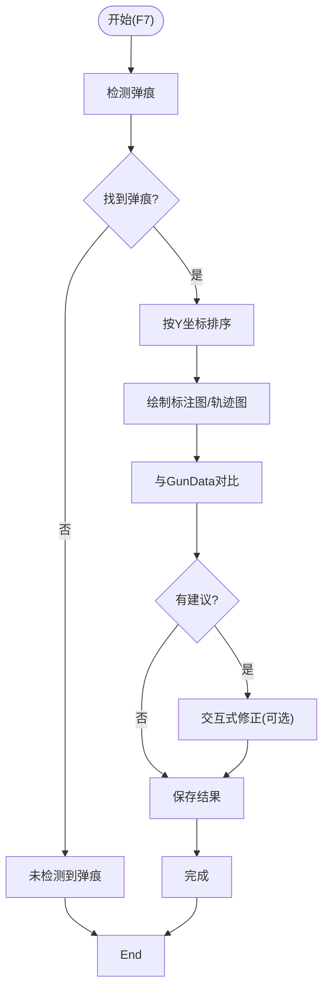
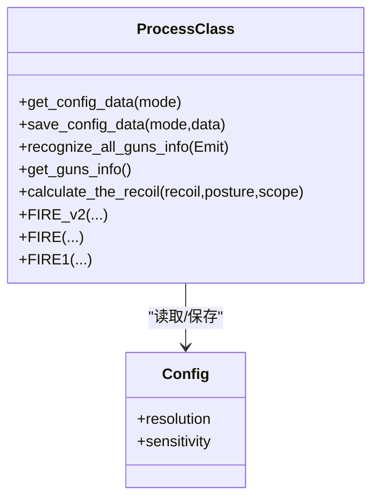
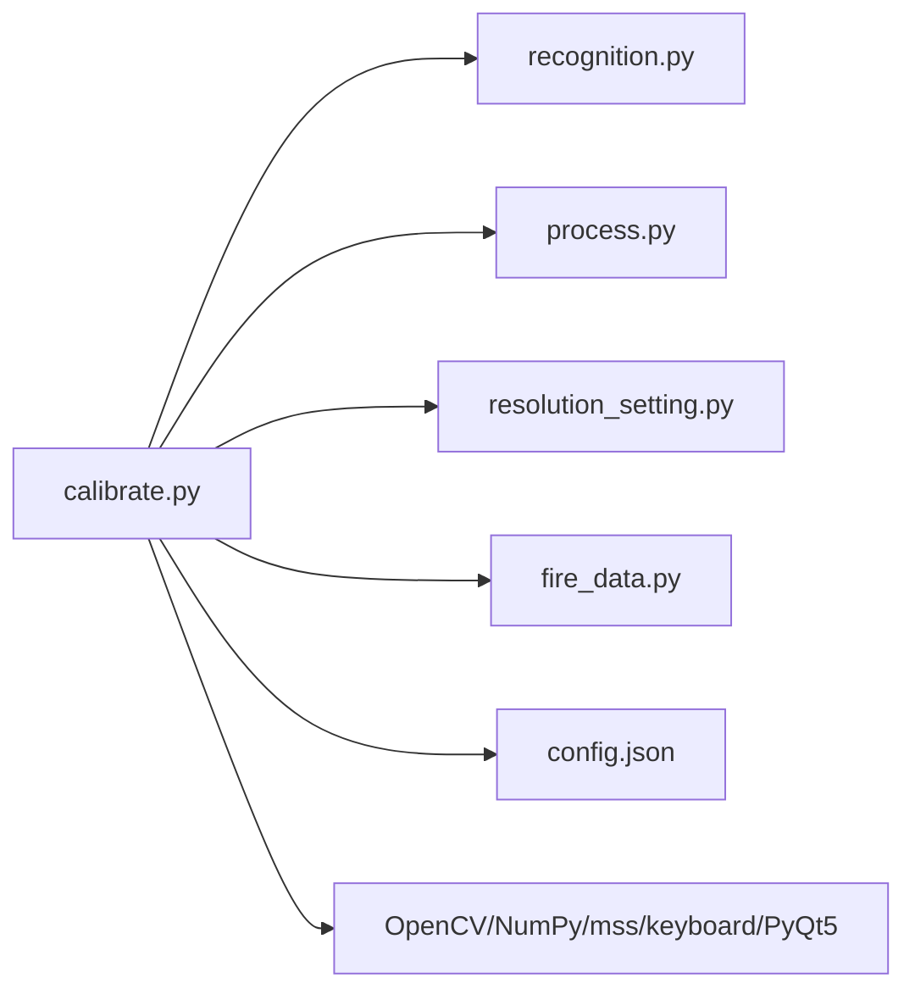

# CLI校准工具

<cite>
**本文引用的文件**
- [README.md](file://README.md)
- [main.py](file://main.py)
- [calibration/calibrate.py](file://calibration/calibrate.py)
- [calibration/calibrate_gui.py](file://calibration/calibrate_gui.py)
- [input/key_listener.py](file://input/key_listener.py)
- [core/process.py](file://core/process.py)
- [core/recognition.py](file://core/recognition.py)
- [data/fire_data.py](file://data/fire_data.py)
- [data/resolution_setting.py](file://data/resolution_setting.py)
- [Config/config.json](file://Config/config.json)
- [requirements.txt](file://requirements.txt)
</cite>

## 目录
1. [简介](#简介)
2. [项目结构](#项目结构)
3. [核心组件](#核心组件)
4. [架构总览](#架构总览)
5. [详细组件分析](#详细组件分析)
6. [依赖关系分析](#依赖关系分析)
7. [性能考量](#性能考量)
8. [故障排查指南](#故障排查指南)
9. [结论](#结论)
10. [附录](#附录)

## 简介
本文件面向PUBG CLI校准工具的使用者与开发者，系统性阐述命令行接口设计、快捷键操作模式、参数配置与优化技巧、批处理与自动化流程，以及与GUI/HUD模式的协同使用。文档基于仓库现有代码进行分析，重点覆盖以下方面：
- CLI模式的命令行用法与参数说明
- 快捷键操作流程（F5/F6/F7/F8）与交互式修正
- 单图自适应、模板使用、高灵敏度检测、调试输出等场景
- 批量处理与自动化策略
- CLI模式下的灵敏度、倍镜与姿势参数指定
- 高级用户自定义脚本与外部工具联动

## 项目结构
该项目围绕“识别+压枪+校准”三大主线构建，CLI校准工具位于calibration子模块，复用核心识别与配置模块，形成“GUI/CLI/HUD”三模式互补的弹痕校准体系。

图表来源
- [calibration/calibrate.py:1-550](file://calibration/calibrate.py#L1-L550)
- [core/process.py:1-405](file://core/process.py#L1-L405)
- [core/recognition.py:1-200](file://core/recognition.py#L1-L200)
- [data/resolution_setting.py:1-147](file://data/resolution_setting.py#L1-L147)
- [data/fire_data.py:1-83](file://data/fire_data.py#L1-L83)
- [Config/config.json:1-1](file://Config/config.json#L1-L1)
- [input/key_listener.py:1-70](file://input/key_listener.py#L1-L70)

章节来源
- [README.md:22-67](file://README.md#L22-L67)
- [README.md:116-125](file://README.md#L116-L125)

## 核心组件
- CLI校准器（calibrate.py）
  - 提供快捷键模式（F5/F6/F7/F8）进行基线/结果截图与分析
  - 自动识别枪械/配件/姿势（部分跳过），读取配置灵敏度
  - 弹痕检测、排序、可视化、与JSON理论数据对比，输出建议与交互式修正
- 核心处理（core/process.py）
  - 提供配置读取/保存、枪械识别、姿态识别、压枪计算等能力
  - 为CLI校准器提供识别与配置数据支撑
- 识别模块（core/recognition.py）
  - 基于SIFT的图像识别与异步截图采集
  - 为校准器提供截图区域与识别结果
- 数据与配置（data/*, Config/config.json）
  - 配件键值映射、分辨率截图区域、倍镜灵敏度配置
- 键盘监听（input/key_listener.py）
  - 为主程序提供键盘事件，与校准器的快捷键模式形成互补

章节来源
- [calibration/calibrate.py:78-187](file://calibration/calibrate.py#L78-L187)
- [core/process.py:53-71](file://core/process.py#L53-L71)
- [core/recognition.py:102-126](file://core/recognition.py#L102-L126)
- [data/resolution_setting.py:1-147](file://data/resolution_setting.py#L1-147)
- [Config/config.json:1-1](file://Config/config.json#L1-L1)
- [input/key_listener.py:14-47](file://input/key_listener.py#L14-L47)

## 架构总览
CLI校准工具通过快捷键触发截图，调用图像识别与差异检测，将结果与理论弹道数据对比，输出建议并支持交互修正。其核心流程如下：

图表来源
- [calibration/calibrate.py:366-453](file://calibration/calibrate.py#L366-L453)
- [core/recognition.py:102-126](file://core/recognition.py#L102-L126)
- [core/process.py:53-71](file://core/process.py#L53-L71)

## 详细组件分析

### CLI校准器（calibrate.py）
- 快捷键模式
  - F5：拍摄空白墙面（基线）
  - F6：拍摄射击后墙面（结果）
  - F7：开始分析（检测弹痕+对比）
  - F8：退出
- 识别与配置
  - 识别枪械/配件/姿势（姿势识别跳过，使用默认站立）
  - 读取配置中的灵敏度系数，用于理论弹道缩放
- 弹痕分析
  - 差分阈值+形态学+轮廓筛选
  - 按Y坐标排序，绘制轨迹图与间距统计
  - 与GunData JSON理论数据对比，计算平均比值与建议倍镜系数
- 交互式修正
  - 支持修改某发Y值、删除弹痕、重新排序
- 输出
  - 保存标注图、轨迹图、分析结果JSON

图表来源
- [calibration/calibrate.py:208-364](file://calibration/calibrate.py#L208-L364)
- [calibration/calibrate.py:478-521](file://calibration/calibrate.py#L478-L521)

章节来源
- [calibration/calibrate.py:366-453](file://calibration/calibrate.py#L366-L453)
- [calibration/calibrate.py:208-364](file://calibration/calibrate.py#L208-L364)
- [calibration/calibrate.py:478-521](file://calibration/calibrate.py#L478-L521)

### 核心处理（core/process.py）
- 配置读取/保存
  - 读取分辨率与灵敏度配置
  - 保存分辨率与灵敏度配置
- 识别与姿态
  - 识别枪械/配件/姿态
  - 识别结果缓存至实例变量，供校准器使用
- 压枪计算
  - 计算单tick补偿值：posture × (recoil × scope)
  - v2路径支持每发总补偿量平滑展开与水平补偿

图表来源
- [core/process.py:53-71](file://core/process.py#L53-L71)
- [core/process.py:199-261](file://core/process.py#L199-L261)
- [core/process.py:310-362](file://core/process.py#L310-L362)

章节来源
- [core/process.py:53-71](file://core/process.py#L53-L71)
- [core/process.py:199-261](file://core/process.py#L199-L261)
- [core/process.py:310-362](file://core/process.py#L310-L362)

### 识别模块（core/recognition.py）
- 异步截图与SIFT匹配
  - 按分辨率配置的截图区域，异步采集并匹配模板
- 姿势识别辅助
  - 通过区域稳定性检测辅助识别

章节来源
- [core/recognition.py:102-126](file://core/recognition.py#L102-L126)
- [core/recognition.py:129-170](file://core/recognition.py#L129-L170)

### 数据与配置（data/*, Config/config.json）
- 配件键值映射（KEY_DATA）
  - 枪口/握把/枪托键值码，用于生成配件码A*B*C*
- 分辨率截图区域（RESOLUTION_SETTINGS）
  - 不同分辨率下的截图区域坐标
- 配置（config.json）
  - 分辨率与倍镜灵敏度系数

章节来源
- [data/fire_data.py:54-82](file://data/fire_data.py#L54-L82)
- [data/resolution_setting.py:1-147](file://data/resolution_setting.py#L1-L147)
- [Config/config.json:1-1](file://Config/config.json#L1-L1)

### 键盘监听（input/key_listener.py）
- 为主程序提供键盘事件，与校准器快捷键模式形成互补
- 支持Tab触发识别、切换枪械、姿态、视角等

章节来源
- [input/key_listener.py:14-47](file://input/key_listener.py#L14-L47)

## 依赖关系分析
- CLI校准器依赖
  - 识别模块：用于截图与SIFT识别
  - 核心处理：用于读取配置与灵敏度
  - 数据与配置：用于配件码与GunData路径
- 外部依赖
  - OpenCV、NumPy、mss、keyboard（可选）、PyQt5（GUI）

图表来源
- [calibration/calibrate.py:26-36](file://calibration/calibrate.py#L26-L36)
- [requirements.txt:1-25](file://requirements.txt#L1-L25)

章节来源
- [calibration/calibrate.py:26-36](file://calibration/calibrate.py#L26-L36)
- [requirements.txt:1-25](file://requirements.txt#L1-L25)

## 性能考量
- 异步截图与识别
  - 使用异步并发采集与匹配，缩短识别耗时
- 参数自适应
  - 弹痕检测参数随图像尺寸自适应，减少误检/漏检
- 交互式修正
  - 交互修正在分析后进行，避免重复计算

章节来源
- [core/recognition.py:102-126](file://core/recognition.py#L102-L126)
- [calibration/bullet_analysis.py:171-200](file://calibration/bullet_analysis.py#L171-L200)

## 故障排查指南
- 未检测到弹痕
  - 检查截图区域与分辨率配置是否匹配
  - 调整检测灵敏度参数或使用模板匹配
- 倍镜系数偏差
  - 通过对比结果的平均比值与建议倍镜系数进行微调
- 姿势识别问题
  - CLI模式跳过姿势识别，使用默认站立；GUI/HUD模式可辅助识别
- 快捷键不可用
  - 无keyboard库时，需手动输入命令；确保权限与环境正确

章节来源
- [calibration/calibrate.py:440-442](file://calibration/calibrate.py#L440-L442)
- [calibration/calibrate.py:113-118](file://calibration/calibrate.py#L113-L118)
- [requirements.txt:1-25](file://requirements.txt#L1-L25)

## 结论
CLI校准工具通过快捷键模式实现了“基线—结果—分析”的高效工作流，结合理论弹道对比与交互式修正，能够快速获得可靠的倍镜灵敏度系数。配合GUI/HUD模式与主程序的识别/压枪能力，形成完整的校准闭环。对于高级用户，可通过脚本化与外部工具联动实现批量化与自动化。

## 附录

### 命令行用法与参数说明
- 启动方式
  - 通过模块方式运行：python -m calibration.calibrate
- 快捷键操作
  - F5：拍摄空白墙面（基线）
  - F6：拍摄射击后墙面（结果）
  - F7：开始分析（检测弹痕+对比）
  - F8：退出
- 识别与配置
  - 自动识别枪械/配件/姿势（姿势识别跳过，使用默认站立）
  - 读取配置中的灵敏度系数，用于理论弹道缩放
- 交互式修正
  - 支持修改某发Y值、删除弹痕、重新排序
- 输出
  - 保存标注图、轨迹图、分析结果JSON

章节来源
- [README.md:118-125](file://README.md#L118-L125)
- [calibration/calibrate.py:366-453](file://calibration/calibrate.py#L366-L453)
- [calibration/calibrate.py:478-521](file://calibration/calibrate.py#L478-L521)

### 场景化用法示例
- 单图自适应
  - 使用F5/F6/F7流程，自动适配不同分辨率的截图区域与检测参数
- 使用模板
  - 在高噪声环境下，先在GUI模式中生成模板，再在CLI中使用模板匹配提升准确性
- 高灵敏度检测
  - 通过GUI模式的调试对话框查看中间步骤，调整检测参数后在CLI中复用
- 调试输出
  - CLI模式下输出标注图、轨迹图与分析结果JSON，便于后续分析

章节来源
- [calibration/calibrate.py:208-364](file://calibration/calibrate.py#L208-L364)
- [calibration/calibrate_gui.py:682-720](file://calibration/calibrate_gui.py#L682-L720)

### 批处理与自动化
- 批量处理策略
  - 将多张结果图按顺序命名，编写脚本循环调用CLI校准器，自动完成基线/结果/分析流程
- 自动化流程
  - 结合键盘事件监听与截图工具，实现一键化采集与分析
- 与GUI联动
  - 先在GUI中进行初步标注与参数修正，再在CLI中进行批量验证与导出

章节来源
- [input/key_listener.py:14-47](file://input/key_listener.py#L14-L47)
- [calibration/calibrate_gui.py:682-720](file://calibration/calibrate_gui.py#L682-L720)

### CLI模式参数配置与优化
- 灵敏度设置
  - 在config.json中调整各倍镜灵敏度系数，校准后在GUI中保存生效
- 倍镜与姿势参数
  - CLI模式自动读取当前倍镜与姿势对应的灵敏度系数
- 优化技巧
  - 使用高分辨率截图、保持墙面整洁、合理设置检测阈值

章节来源
- [Config/config.json:1-1](file://Config/config.json#L1-L1)
- [core/process.py:53-71](file://core/process.py#L53-L71)
- [calibration/calibrate.py:137-142](file://calibration/calibrate.py#L137-L142)

### 高级用户自定义脚本与集成
- 与其他工具联动
  - 通过解析CLI输出的JSON结果，接入外部数据分析工具或自动化平台
- 脚本化
  - 编写Python脚本，调用CLI校准器的核心函数，实现自定义流程与参数注入

章节来源
- [calibration/calibrate.py:366-453](file://calibration/calibrate.py#L366-L453)
- [calibration/calibrate.py:523-547](file://calibration/calibrate.py#L523-L547)