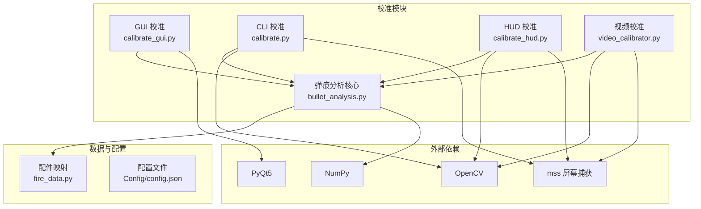
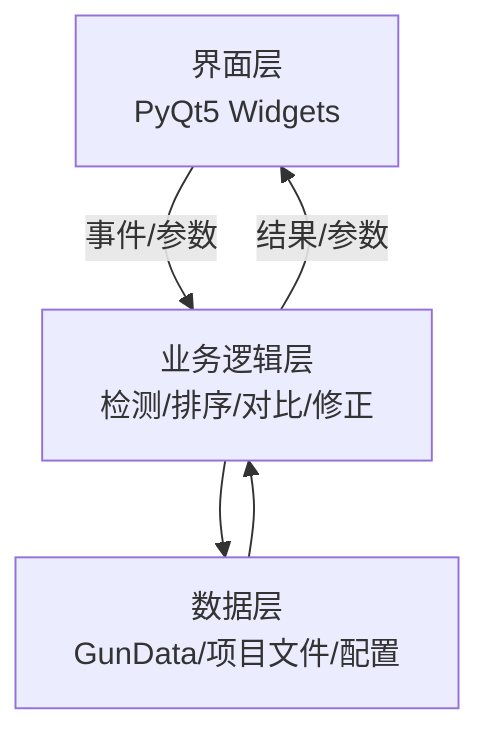
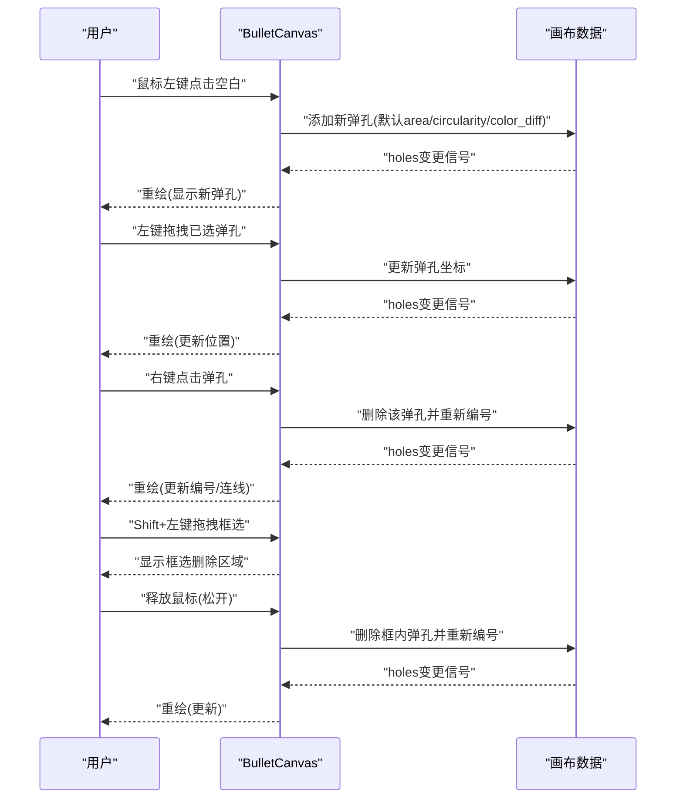
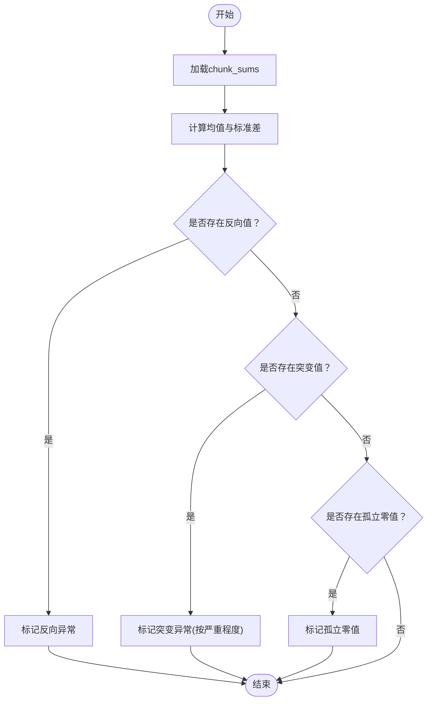
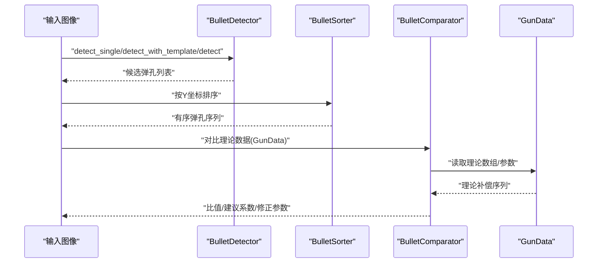
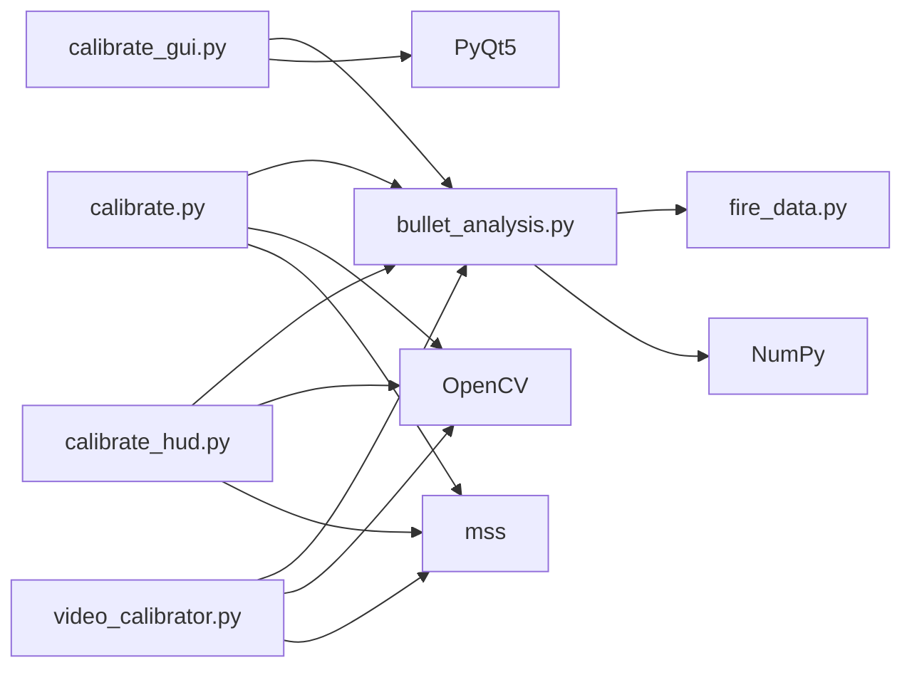

# GUI校准工具

<cite>
**本文档引用的文件**
- [README.md](file://README.md)
- [calibrate_gui.py](file://calibration/calibrate_gui.py)
- [calibrate.py](file://calibration/calibrate.py)
- [bullet_analysis.py](file://calibration/bullet_analysis.py)
- [calibrate_hud.py](file://calibration/calibrate_hud.py)
- [video_calibrator.py](file://calibration/video_calibrator.py)
- [fire_data.py](file://data/fire_data.py)
- [requirements.txt](file://requirements.txt)
</cite>

## 目录
1. [简介](#简介)
2. [项目结构](#项目结构)
3. [核心组件](#核心组件)
4. [架构总览](#架构总览)
5. [详细组件分析](#详细组件分析)
6. [依赖关系分析](#依赖关系分析)
7. [性能考虑](#性能考虑)
8. [故障排除指南](#故障排除指南)
9. [结论](#结论)
10. [附录](#附录)

## 简介
本文件为PUBG GUI校准工具的详细使用与开发文档。工具提供三种校准模式：GUI交互式标注、CLI快捷键模式、游戏内HUD悬浮窗模式。用户可通过加载弹痕截图，自动检测弹孔并进行排序、对比与修正，最终输出优化后的压枪参数。GUI模式支持弹孔的交互式标注、删除、拖拽调整、ROI区域框选、异常值检测与曲线编辑器可视化。

## 项目结构
项目采用模块化组织，校准相关代码集中在calibration目录，核心检测算法与数据结构在bullet_analysis.py中实现，GUI界面由PyQt5构建，支持Windows平台的热键与窗口穿透。

**图表来源**
- [calibrate_gui.py:1-800](file://calibration/calibrate_gui.py#L1-L800)
- [calibrate.py:1-550](file://calibration/calibrate.py#L1-L550)
- [bullet_analysis.py:1-800](file://calibration/bullet_analysis.py#L1-L800)
- [calibrate_hud.py:1-528](file://calibration/calibrate_hud.py#L1-L528)
- [video_calibrator.py:1-800](file://calibration/video_calibrator.py#L1-L800)
- [fire_data.py:1-83](file://data/fire_data.py#L1-L83)

**章节来源**
- [README.md:22-84](file://README.md#L22-L84)
- [requirements.txt:1-25](file://requirements.txt#L1-L25)

## 核心组件
- GUI弹孔标注画布（BulletCanvas）：支持缩放、平移、左键添加/拖拽、右键删除、Shift框选删除、Delete删除选中、ROI选区、标注编号与连线绘制。
- 可视化曲线编辑器（RecoilCurveEditor）：按chunk展示压枪数组，支持拖拽节点调整补偿值，自动识别异常值（反向、突变、孤立零值），并提供异常标记与统计信息。
- 弹痕分析器（BulletDetector/BulletSorter/BulletComparator）：提供单图自适应检测（暗点对比+Blob+中值差分融合）、模板匹配、双图差分三种策略；支持NMS去重与噪声过滤；与GunData理论数据对比，输出比值与建议系数。
- 项目数据管理（ProjectData）：统一保存/加载校准项目（.calibration.json），兼容旧版格式，支持多轨迹存储。
- 视频校准（VideoCalibrator）：支持YOLO模型、帧差分时序、传统静态检测三种后端，支持实时录屏与视频文件加载，提供标注与调试帧输出。
- HUD校准（CalibrateHUD）：游戏内悬浮窗，支持F5/F6/F7热键拍照与分析，F10隐藏/F12穿透模式切换，右键拖拽移动位置。

**章节来源**
- [calibrate_gui.py:56-384](file://calibration/calibrate_gui.py#L56-L384)
- [bullet_analysis.py:160-578](file://calibration/bullet_analysis.py#L160-L578)
- [bullet_analysis.py:584-717](file://calibration/bullet_analysis.py#L584-L717)
- [video_calibrator.py:542-767](file://calibration/video_calibrator.py#L542-L767)
- [calibrate_hud.py:159-524](file://calibration/calibrate_hud.py#L159-L524)

## 架构总览
GUI校准工具采用分层架构：界面层（PyQt5）、业务逻辑层（弹痕检测/排序/对比/修正）、数据层（GunData/项目文件/配置）。GUI与CLI/HUD共享底层检测与分析模块，确保一致性与可扩展性。

**图表来源**
- [calibrate_gui.py:1-800](file://calibration/calibrate_gui.py#L1-L800)
- [bullet_analysis.py:1-800](file://calibration/bullet_analysis.py#L1-L800)

## 详细组件分析

### GUI弹孔标注画布（BulletCanvas）
- 功能特性
  - 缩放与平移：滚轮缩放、中键拖拽平移。
  - 弹孔标注：左键空白添加弹孔，左键点击弹孔进入拖拽模式，右键点击弹孔删除，Shift+左键拖拽进行框选删除，Delete键删除选中弹孔。
  - ROI选区：左键拖拽绘制矩形选区，右键取消。
  - 标注编号：按标注顺序分配shot_num，颜色区分前5发、前15发与后续。
  - 连线与提示：自动绘制相邻弹孔连线；在选区模式与框选删除模式下显示提示文本。
- 交互流程

**图表来源**
- [calibrate_gui.py:263-376](file://calibration/calibrate_gui.py#L263-L376)

**章节来源**
- [calibrate_gui.py:56-384](file://calibration/calibrate_gui.py#L56-L384)

### 可视化曲线编辑器（RecoilCurveEditor）
- 功能特性
  - 按chunk展示GunData数组，每chunk的sum对应一发子弹的补偿量。
  - 拖拽节点调整每发补偿值，实时更新底层数组；支持自动识别异常值（反向、突变、孤立零值）。
  - 提供异常标记与统计信息（hover提示），支持切换异常值显示。
- 异常值检测流程

**图表来源**
- [calibrate_gui.py:464-516](file://calibration/calibrate_gui.py#L464-L516)

**章节来源**
- [calibrate_gui.py:390-676](file://calibration/calibrate_gui.py#L390-L676)

### 弹痕分析核心（BulletDetector/BulletSorter/BulletComparator）
- 检测策略
  - 单图自适应：暗点对比度检测（背景减原图）、SimpleBlobDetector、多尺度中值差分三路融合，NMS去重与噪声过滤。
  - 模板匹配：从弹痕图中裁取模板（15~60px正方形），多尺度匹配，NMS去重。
  - 双图差分：空墙vs弹痕截图，形态学处理与轮廓检测。
- 排序与对比
  - 按Y坐标排序，兼容上→下/下→上两种方向；起始发数可配置。
  - 与GunData理论数据对比，计算相邻弹孔间距的实际值与理论值，得出比值与建议系数；支持v1/v2数据格式与半自动/全自动射速回退策略。
- 项目数据管理
  - 统一保存/加载校准项目（.calibration.json），支持多轨迹存储与旧版兼容。

**图表来源**
- [bullet_analysis.py:160-578](file://calibration/bullet_analysis.py#L160-L578)
- [bullet_analysis.py:723-846](file://calibration/bullet_analysis.py#L723-L846)

**章节来源**
- [bullet_analysis.py:160-800](file://calibration/bullet_analysis.py#L160-L800)

### 视频校准（VideoCalibrator）
- 后端选择
  - YOLO模型：需要训练好的.pt模型文件，支持静态与逐帧时序两种模式。
  - 帧差分时序：传统方法，需干净墙面，图像稳定，保留射击顺序。
  - 传统静态：BulletDetector在最后一帧静态检测。
- 输入方式
  - 实时录屏：F6/F7热键开始/停止录制，支持自定义捕获区域。
  - 视频文件：加载.avi/.mp4文件替代实时录制。
- 输出与调试
  - 标注弹孔于最后一帧，支持保存标注图；提供调试帧（差分/二值化）便于分析。

**章节来源**
- [video_calibrator.py:1-800](file://calibration/video_calibrator.py#L1-L800)

### HUD校准（CalibrateHUD）
- 界面与交互
  - 游戏内悬浮窗，支持F5/F6/F7热键拍照与分析，F10隐藏/F12穿透模式切换，右键拖拽移动位置。
  - 步骤指示：识别→基线→打枪→分析；实时显示枪械信息与分析结果。
- 数据处理
  - 截图捕获（mss），双图差分检测弹孔，排序与对比GunData，保存结果与标注图。

**章节来源**
- [calibrate_hud.py:159-524](file://calibration/calibrate_hud.py#L159-L524)

## 依赖关系分析
- GUI依赖PyQt5进行界面渲染与事件处理；OpenCV用于图像处理；mss用于屏幕捕获；NumPy提供数值计算。
- CLI/HUD依赖OpenCV与mss；GUI共享bullet_analysis核心模块。
- 配件映射与灵敏度配置来源于fire_data.py与Config/config.json。

**图表来源**
- [calibrate_gui.py:1-32](file://calibration/calibrate_gui.py#L1-L32)
- [calibrate.py:15-31](file://calibration/calibrate.py#L15-L31)
- [calibrate_hud.py:13-27](file://calibration/calibrate_hud.py#L13-L27)
- [video_calibrator.py:16-43](file://calibration/video_calibrator.py#L16-L43)
- [bullet_analysis.py:17-25](file://calibration/bullet_analysis.py#L17-L25)
- [fire_data.py:54-82](file://data/fire_data.py#L54-L82)

**章节来源**
- [requirements.txt:1-25](file://requirements.txt#L1-L25)

## 性能考虑
- 图像处理优化
  - OpenCV函数批量化与内存复用，避免频繁创建临时数组。
  - ROI裁剪减少处理区域，提升检测速度。
  - NMS距离按图像尺寸自适应，平衡召回与去重效果。
- GUI交互优化
  - 画布缩放与平移采用矩阵变换，避免重绘全图。
  - 弹孔绘制使用抗锯齿与动态字体大小，兼顾清晰度与性能。
- 检测策略选择
  - 单图自适应在多数场景下平衡精度与速度；模板匹配适合纹理复杂但有明确弹孔样本的情况；帧差分适合干净墙面且需保留顺序的场景。
- 视频校准
  - YOLO时序检测按射击间隔采样，降低帧数；中值核按短边比例自适应，兼顾不同分辨率。

## 故障排除指南
- 检测不到弹孔
  - 检查截图质量：确保墙面干净、弹孔对比度足够；必要时使用ROI缩小检测范围。
  - 调整检测灵敏度：在GUI中切换不同灵敏度预设（high/medium/low）。
  - 使用模板匹配：从弹痕图中裁取弹孔模板，提高检测稳定性。
- 检测到太多噪点
  - 提高NMS距离阈值（按图像宽度比例自适应）；增加最小面积/圆形度阈值。
  - 使用ROI聚焦弹孔区域；检查背景与弹孔边缘的对比度。
- 弹孔排序异常
  - 确认排序方向（bottom_up/top_down）与起始发数（start_shot）设置正确。
  - 对于半自动枪械，理论数据按每发一chunk处理，确保GunData版本与格式正确。
- HUD模式无法穿透
  - 切换穿透模式（F12），允许鼠标事件穿透；右键拖拽移动位置。
- GUI交互卡顿
  - 减少画布缩放级别；关闭不必要的调试信息；确保GPU驱动与PyQt5版本兼容。

**章节来源**
- [calibrate_gui.py:56-384](file://calibration/calibrate_gui.py#L56-L384)
- [bullet_analysis.py:160-578](file://calibration/bullet_analysis.py#L160-L578)
- [calibrate_hud.py:344-353](file://calibration/calibrate_hud.py#L344-L353)

## 结论
GUI校准工具通过GUI交互式标注、可视化曲线编辑与多策略弹痕检测，实现了从截图到参数修正的完整闭环。其模块化设计便于扩展与维护，支持多种输入与输出方式，满足不同使用场景的需求。开发者可基于现有框架扩展新的检测后端、优化参数与交互体验。

## 附录

### 使用流程指南
- GUI模式
  1) 选择枪械/配件/倍镜/姿势，加载弹痕截图。
  2) 可选：使用ROI框选弹孔区域，减少误检。
  3) 点击“分析”，自动检测弹孔并排序。
  4) 交互修正：右键添加/删除弹孔，左键拖拽调整位置，Shift+框选删除。
  5) 保存项目文件（.calibration.json），复制修正参数至GunData。
- CLI模式
  1) 按F5/F6/F7分别拍摄基线/结果/开始分析。
  2) 可选：交互式修正弹孔Y值或删除弹孔。
  3) 查看结果与建议系数，保存至结果目录。
- HUD模式
  1) 打开HUD，F5/F6/F7拍照与分析。
  2) F10隐藏/F12穿透模式切换，右键拖拽移动位置。
- 视频校准
  1) 选择后端（YOLO/帧差分/静态）与输入（实时录屏/视频文件）。
  2) 检测弹孔并标注，保存标注图与调试帧。

**章节来源**
- [README.md:116-134](file://README.md#L116-L134)
- [calibrate_gui.py:722-789](file://calibration/calibrate_gui.py#L722-L789)
- [calibrate.py:366-453](file://calibration/calibrate.py#L366-L453)
- [calibrate_hud.py:420-497](file://calibration/calibrate_hud.py#L420-L497)
- [video_calibrator.py:542-767](file://calibration/video_calibrator.py#L542-L767)

### 开发者扩展与定制
- 新增检测后端
  - 在bullet_analysis.py中扩展检测器类，遵循统一接口；在video_calibrator.py中注册后端并实现detect_*方法。
- 自定义GUI组件
  - 在calibrate_gui.py中新增QWidget子类，继承事件处理与绘制逻辑；通过signals/slots与现有组件解耦。
- 配置与数据
  - 通过Config/config.json调整灵敏度；在GunData中维护压枪参数；使用ProjectData统一管理项目文件。
- 依赖与环境
  - 确保PyQt5、OpenCV、mss、NumPy版本兼容；按requirements.txt安装第三方依赖。

**章节来源**
- [bullet_analysis.py:1-800](file://calibration/bullet_analysis.py#L1-L800)
- [video_calibrator.py:542-767](file://calibration/video_calibrator.py#L542-L767)
- [calibrate_gui.py:1-800](file://calibration/calibrate_gui.py#L1-L800)
- [requirements.txt:1-25](file://requirements.txt#L1-L25)