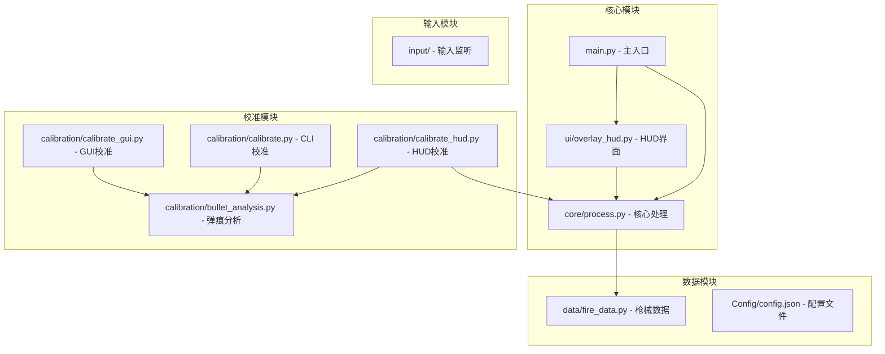
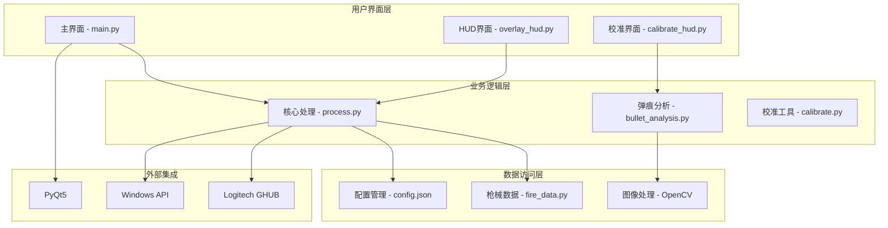
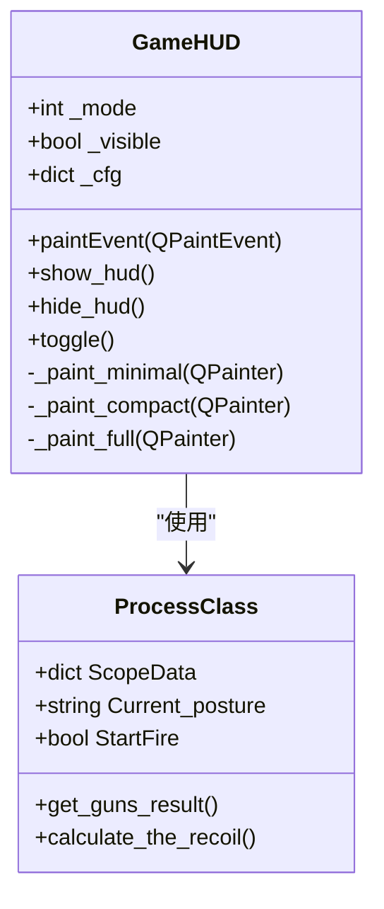
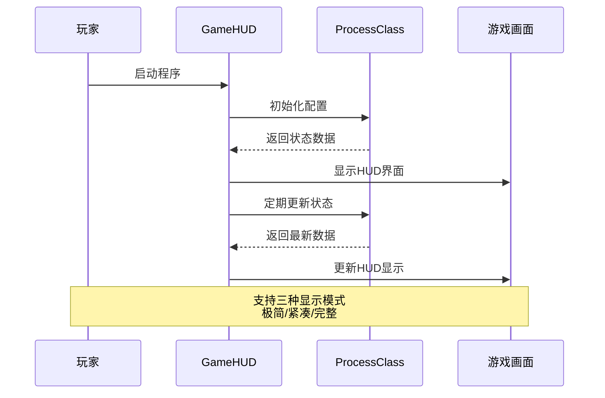
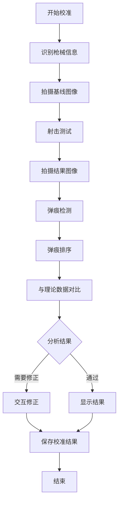
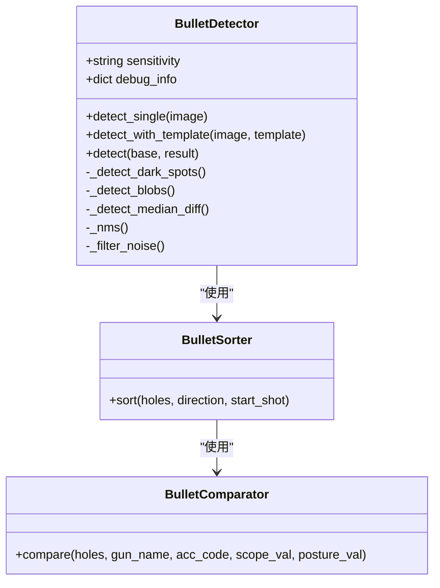
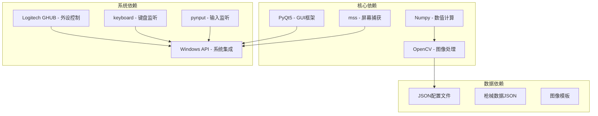

# HUD校准工具

<cite>
**本文档引用的文件**
- [README.md](file://README.md)
- [main.py](file://main.py)
- [calibration/calibrate_hud.py](file://calibration/calibrate_hud.py)
- [ui/overlay_hud.py](file://ui/overlay_hud.py)
- [core/process.py](file://core/process.py)
- [data/fire_data.py](file://data/fire_data.py)
- [calibration/bullet_analysis.py](file://calibration/bullet_analysis.py)
- [calibration/calibrate.py](file://calibration/calibrate.py)
- [calibration/calibrate_gui.py](file://calibration/calibrate_gui.py)
- [Config/config.json](file://Config/config.json)
- [requirements.txt](file://requirements.txt)
</cite>

## 目录
1. [简介](#简介)
2. [项目结构](#项目结构)
3. [核心组件](#核心组件)
4. [架构概览](#架构概览)
5. [详细组件分析](#详细组件分析)
6. [依赖关系分析](#依赖关系分析)
7. [性能考虑](#性能考虑)
8. [故障排除指南](#故障排除指南)
9. [结论](#结论)
10. [附录](#附录)

## 简介

PUBG HUD校准工具是一个专为绝地求生游戏设计的弹痕分析和校准系统。该工具提供了三种使用模式：GUI模式、CLI模式和游戏内HUD模式，支持实时弹痕检测、参数自动修正和结果可视化。

该工具的核心功能包括：
- **实时HUD显示**：游戏内三档HUD界面，支持极简、紧凑、完整三种显示模式
- **弹痕校准**：支持交互式标注修正，自动检测弹痕并与理论数据对比
- **参数修正**：基于统计分析提供参数修正建议
- **边打边校准**：实时分析功能，可在游戏过程中进行校准

## 项目结构

项目采用模块化架构，主要分为以下几个核心模块：



**图表来源**
- [main.py:1-294](file://main.py#L1-L294)
- [calibration/calibrate_hud.py:1-528](file://calibration/calibrate_hud.py#L1-L528)
- [ui/overlay_hud.py:1-698](file://ui/overlay_hud.py#L1-L698)

**章节来源**
- [README.md:22-67](file://README.md#L22-L67)
- [main.py:11-39](file://main.py#L11-L39)

## 核心组件

### HUD系统组件

HUD系统由三个主要组件构成：

1. **GameHUD类** - 主要的HUD显示组件
2. **CalibrateHUD类** - 校准专用HUD
3. **OverlayHUD** - 游戏内覆盖层

### 校准分析组件

1. **BulletDetector** - 弹痕检测器
2. **BulletSorter** - 弹痕排序器
3. **BulletComparator** - 弹痕比较器
4. **ParameterCorrector** - 参数修正器

### 配置管理系统

1. **Config Manager** - 配置文件管理
2. **Resolution Settings** - 分辨率设置
3. **Sensitivity Config** - 灵敏度配置

**章节来源**
- [ui/overlay_hud.py:229-698](file://ui/overlay_hud.py#L229-L698)
- [calibration/bullet_analysis.py:160-800](file://calibration/bullet_analysis.py#L160-L800)
- [Config/config.json:1-1](file://Config/config.json#L1-L1)

## 架构概览

系统采用分层架构设计，实现了清晰的职责分离：



**图表来源**
- [main.py:1-294](file://main.py#L1-L294)
- [core/process.py:13-405](file://core/process.py#L13-L405)
- [calibration/bullet_analysis.py:1-800](file://calibration/bullet_analysis.py#L1-L800)

## 详细组件分析

### GameHUD组件分析

GameHUD是游戏内HUD系统的核心组件，提供了三档显示模式：

#### 显示模式



**图表来源**
- [ui/overlay_hud.py:229-698](file://ui/overlay_hud.py#L229-L698)
- [core/process.py:13-405](file://core/process.py#L13-L405)

#### HUD工作流程



**图表来源**
- [ui/overlay_hud.py:634-669](file://ui/overlay_hud.py#L634-L669)
- [core/process.py:131-136](file://core/process.py#L131-L136)

**章节来源**
- [ui/overlay_hud.py:229-698](file://ui/overlay_hud.py#L229-L698)

### CalibrateHUD组件分析

CalibrateHUD是专门用于弹痕校准的HUD组件：

#### 校准工作流程



**图表来源**
- [calibration/calibrate_hud.py:421-496](file://calibration/calibrate_hud.py#L421-L496)

#### 校准参数处理

CalibrateHUD支持以下参数配置：

| 参数类别 | 配置项 | 默认值 | 说明 |
|---------|--------|--------|------|
| 枪械信息 | 枪名 | m762 | 支持多种枪械类型 |
| 配件系统 | 枪口/握把/枪托 | A0B0C0 | 配件代码组合 |
| 倍镜设置 | scope_name | none | 支持多种倍镜类型 |
| 姿态设置 | posture | none | 站立/蹲下/趴下 |
| 发数配置 | shot_count | 10 | 射击发数 |

**章节来源**
- [calibration/calibrate_hud.py:159-528](file://calibration/calibrate_hud.py#L159-L528)

### 弹痕分析组件

弹痕分析系统包含多个专业组件：

#### BulletDetector分析



**图表来源**
- [calibration/bullet_analysis.py:160-800](file://calibration/bullet_analysis.py#L160-L800)

**章节来源**
- [calibration/bullet_analysis.py:160-800](file://calibration/bullet_analysis.py#L160-L800)

## 依赖关系分析

系统依赖关系复杂但结构清晰：



**图表来源**
- [requirements.txt:1-25](file://requirements.txt#L1-L25)

**章节来源**
- [requirements.txt:1-25](file://requirements.txt#L1-L25)

## 性能考虑

### 性能优化策略

1. **图像处理优化**
   - 使用多线程处理弹痕检测
   - 优化OpenCV算法参数
   - 实现图像缓存机制

2. **内存管理**
   - 及时释放图像资源
   - 控制弹痕检测队列大小
   - 优化数据结构存储

3. **响应速度**
   - 定时器频率调节
   - 异步处理机制
   - 减少不必要的UI更新

### 性能监控指标

| 指标类型 | 正常范围 | 优化建议 |
|---------|----------|----------|
| CPU使用率 | <80% | 优化图像处理算法 |
| 内存占用 | <500MB | 实施资源回收机制 |
| 帧率 | >60FPS | 调整刷新频率 |
| 响应延迟 | <100ms | 优化事件处理 |

## 故障排除指南

### 常见问题及解决方案

#### HUD显示问题

**问题**：HUD界面无法显示
**解决方案**：
1. 检查Windows权限设置
2. 确认游戏窗口处于前台
3. 验证分辨率设置正确性

**问题**：HUD界面透明度异常
**解决方案**：
1. 检查DPI缩放设置
2. 调整透明度配置参数
3. 重启游戏客户端

#### 校准功能问题

**问题**：弹痕检测不准确
**解决方案**：
1. 调整检测灵敏度参数
2. 检查图像质量
3. 确认ROI区域设置

**问题**：参数修正不生效
**解决方案**：
1. 验证枪械数据完整性
2. 检查配件代码匹配
3. 确认倍镜系数设置

**章节来源**
- [calibration/calibrate_hud.py:366-381](file://calibration/calibrate_hud.py#L366-L381)
- [ui/overlay_hud.py:41-55](file://ui/overlay_hud.py#L41-L55)

## 结论

PUBG HUD校准工具是一个功能完整、架构清晰的弹痕分析系统。其主要优势包括：

1. **多模式支持**：提供GUI、CLI、HUD三种使用模式，满足不同用户需求
2. **实时分析**：支持边打边校准，提高工作效率
3. **智能检测**：采用多种检测算法，确保准确性
4. **灵活配置**：支持丰富的参数配置和自定义选项

该工具为PUBG玩家提供了专业的弹痕分析和校准解决方案，有助于提升游戏体验和竞技水平。

## 附录

### 快速开始指南

1. **环境准备**
   - 安装Python 3.8+
   - 安装依赖包：`pip install -r requirements.txt`
   - 确保Windows 10/11系统

2. **基本使用**
   ```bash
   # 启动主程序
   python main.py
   
   # 启动HUD校准
   python -m calibration.calibrate_hud
   
   # 启动CLI校准
   python -m calibration.calibrate
   ```

3. **校准流程**
   - 对准墙面开镜
   - 拍摄空白墙面（基线）
   - 射击若干发
   - 拍摄弹痕墙面（结果）
   - 系统自动分析并显示结果

### 开发者指南

#### 扩展建议

1. **新增枪械支持**
   - 在`_internal/GunData/`目录添加枪械JSON文件
   - 更新`data/fire_data.py`中的枪械映射
   - 验证弹道数据的准确性

2. **自定义HUD样式**
   - 修改`Config/hud_config.json`配置文件
   - 调整颜色、字体、尺寸参数
   - 支持更多显示模式

3. **算法优化**
   - 实现更高效的弹痕检测算法
   - 增加机器学习辅助识别
   - 优化参数修正算法

#### 最佳实践

1. **代码组织**
   - 保持模块间的松耦合
   - 实现清晰的接口定义
   - 添加适当的错误处理

2. **性能优化**
   - 使用异步编程处理I/O密集任务
   - 实现缓存机制减少重复计算
   - 优化图像处理算法

3. **用户体验**
   - 提供详细的错误信息
   - 实现实时进度反馈
   - 支持用户自定义配置

**章节来源**
- [README.md:69-156](file://README.md#L69-L156)
- [main.py:223-294](file://main.py#L223-L294)