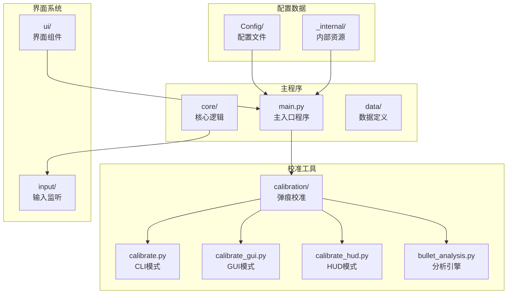
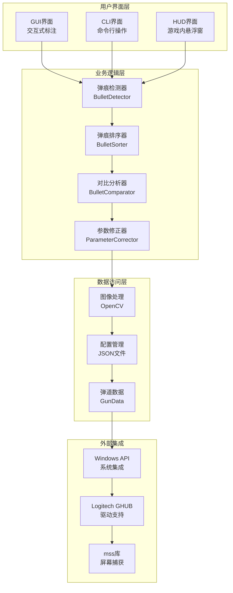
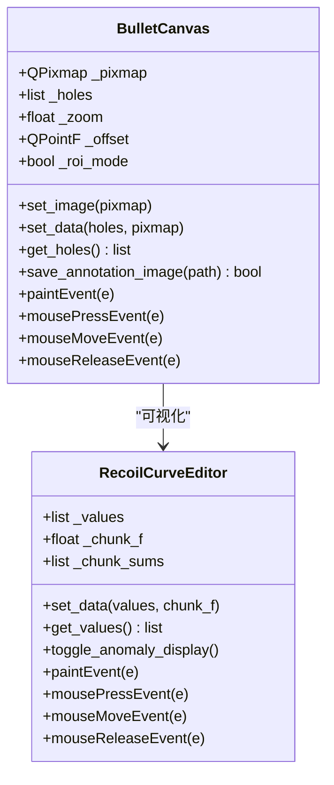
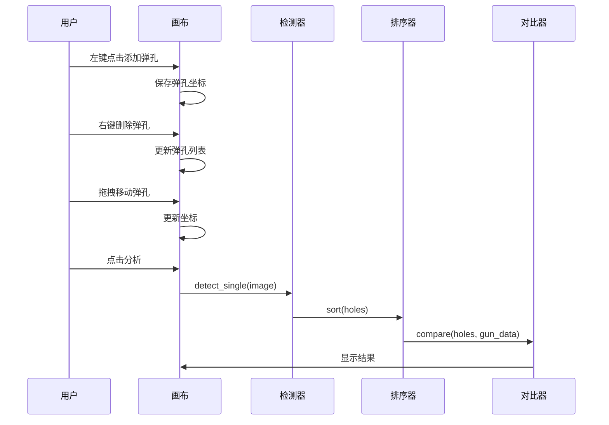
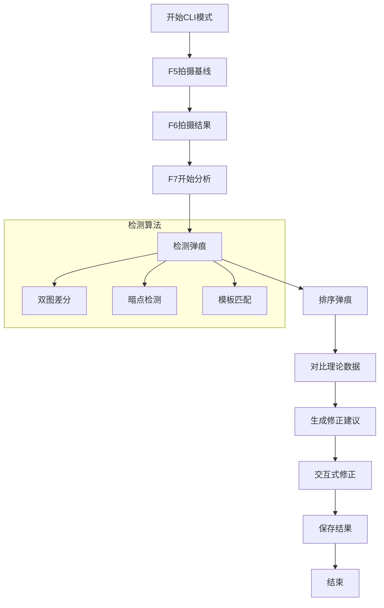
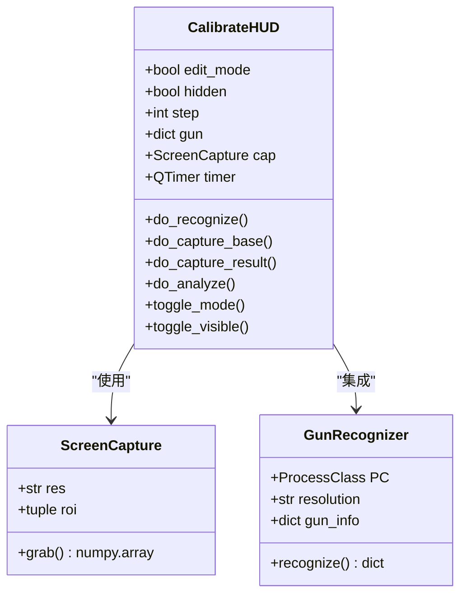
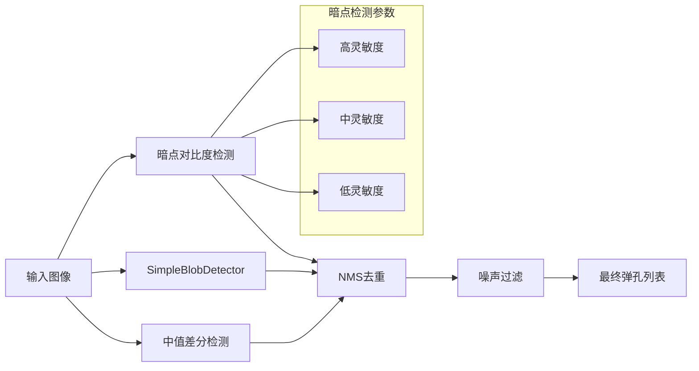
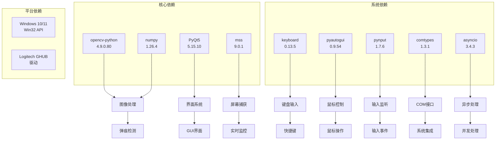
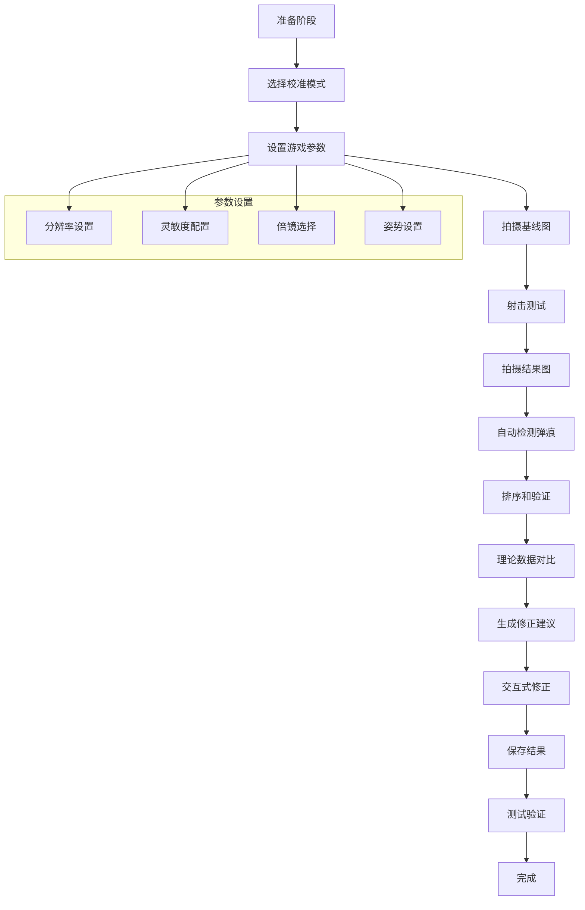

# 弹痕校准工具

<cite>
**本文档引用的文件**
- [README.md](file://README.md)
- [main.py](file://main.py)
- [calibrate.py](file://calibration/calibrate.py)
- [calibrate_gui.py](file://calibration/calibrate_gui.py)
- [calibrate_hud.py](file://calibration/calibrate_hud.py)
- [bullet_analysis.py](file://calibration/bullet_analysis.py)
- [fire_data.py](file://data/fire_data.py)
- [config.json](file://Config/config.json)
- [requirements.txt](file://requirements.txt)
- [bullet_data.py](file://data/bullet_data.py)
</cite>

## 目录
1. [简介](#简介)
2. [项目结构](#项目结构)
3. [核心组件](#核心组件)
4. [架构概览](#架构概览)
5. [详细组件分析](#详细组件分析)
6. [依赖关系分析](#依赖关系分析)
7. [性能考虑](#性能考虑)
8. [故障排除指南](#故障排除指南)
9. [结论](#结论)
10. [附录](#附录)

## 简介

PUBG弹痕校准工具是一个专门用于PUBG游戏中后坐力补偿参数校准的高级工具。该工具提供了三种不同的校准模式：GUI模式（交互式标注）、CLI模式（快捷键操作）和HUD模式（游戏内实时校准）。通过自动化的弹痕检测、排序、对比和可视化功能，用户可以精确地调整游戏中的压枪参数，从而获得更稳定的射击表现。

该工具的核心优势在于其智能化的弹痕分析算法，能够自动识别枪械、配件和姿势信息，并与游戏内置的弹道数据进行精确对比，提供科学的参数修正建议。

## 项目结构

该项目采用模块化设计，主要分为以下几个核心部分：

**图表来源**
- [main.py:1-294](file://main.py#L1-L294)
- [calibrate.py:1-550](file://calibration/calibrate.py#L1-L550)
- [calibrate_gui.py:1-800](file://calibration/calibrate_gui.py#L1-L800)
- [calibrate_hud.py:1-528](file://calibration/calibrate_hud.py#L1-L528)

**章节来源**
- [README.md:22-67](file://README.md#L22-L67)
- [main.py:11-39](file://main.py#L11-L39)

## 核心组件

### 弹痕检测与分析引擎

弹痕分析引擎是整个校准工具的核心，负责处理复杂的图像处理和数据分析任务。该引擎采用了多种先进的计算机视觉技术：

- **多策略检测**：结合暗点对比度检测、SimpleBlobDetector和中值差分三种策略
- **自适应参数**：根据图像尺寸自动调整检测参数
- **噪声过滤**：智能过滤误检和噪声点
- **ROI区域选择**：支持局部区域检测以提高准确性

### 枪械识别系统

系统集成了强大的枪械识别功能，能够自动识别游戏中的各种枪械、配件和姿势：

- **SIFT算法**：使用尺度不变特征变换算法进行特征匹配
- **多倍镜支持**：支持红点、全息、2倍到15倍等各种倍镜
- **配件识别**：自动识别枪口、握把、枪托等配件组合
- **姿势检测**：识别站立、蹲下、趴下等不同射击姿势

### 参数修正算法

系统实现了智能的参数修正算法，能够根据实际射击表现自动调整压枪参数：

- **理论对比**：与游戏内置弹道数据进行精确对比
- **比率计算**：计算实际间距与理论间距的比率
- **建议修正**：提供科学的参数修正建议
- **迭代优化**：支持多次迭代以获得最佳效果

**章节来源**
- [bullet_analysis.py:160-578](file://calibration/bullet_analysis.py#L160-L578)
- [calibrate.py:78-187](file://calibration/calibrate.py#L78-L187)

## 架构概览

弹痕校准工具采用分层架构设计，确保了良好的模块化和可维护性：

**图表来源**
- [calibrate_gui.py:56-384](file://calibration/calibrate_gui.py#L56-L384)
- [calibrate.py:193-453](file://calibration/calibrate.py#L193-L453)
- [calibrate_hud.py:159-524](file://calibration/calibrate_hud.py#L159-L524)

## 详细组件分析

### GUI模式组件分析

GUI模式提供了最直观的交互式校准体验，具有以下特点：

#### 交互式画布系统

**图表来源**
- [calibrate_gui.py:56-384](file://calibration/calibrate_gui.py#L56-L384)
- [calibrate_gui.py:390-676](file://calibration/calibrate_gui.py#L390-L676)

GUI模式的主要优势在于其直观的交互设计：

- **实时标注**：支持左键添加、右键删除、拖拽移动弹孔
- **缩放平移**：支持滚轮缩放和中键平移
- **ROI选区**：可以框选特定区域进行检测
- **曲线编辑**：提供可视化的后坐力补偿曲线编辑器

#### 弹孔标注流程

**图表来源**
- [calibrate_gui.py:56-384](file://calibration/calibrate_gui.py#L56-L384)
- [bullet_analysis.py:160-578](file://calibration/bullet_analysis.py#L160-L578)

**章节来源**
- [calibrate_gui.py:56-800](file://calibration/calibrate_gui.py#L56-L800)

### CLI模式组件分析

CLI模式提供了高效的命令行操作方式，适合经验丰富的用户：

#### 快捷键控制系统

CLI模式采用F5-F8快捷键序列进行操作：

- **F5**：拍摄空白墙面基线图
- **F6**：拍摄射击后的结果图  
- **F7**：开始分析弹痕
- **F8**：退出程序

#### 分析流程

**图表来源**
- [calibrate.py:366-453](file://calibration/calibrate.py#L366-L453)
- [calibrate.py:208-236](file://calibration/calibrate.py#L208-L236)

CLI模式的优势在于其简洁高效的操作流程，特别适合快速校准场景。

**章节来源**
- [calibrate.py:366-550](file://calibration/calibrate.py#L366-L550)

### HUD模式组件分析

HUD模式提供了游戏内的实时校准功能，具有以下特点：

#### 游戏内悬浮窗设计

**图表来源**
- [calibrate_hud.py:159-524](file://calibration/calibrate_hud.py#L159-L524)
- [calibrate_hud.py:66-74](file://calibration/calibrate_hud.py#L66-L74)

HUD模式的主要特性：

- **穿透模式**：允许鼠标事件穿透，不影响游戏操作
- **热键支持**：F5-F12热键控制完整流程
- **实时显示**：分析结果实时显示在游戏画面中
- **位置可调**：支持拖拽调整悬浮窗位置

**章节来源**
- [calibrate_hud.py:159-528](file://calibration/calibrate_hud.py#L159-L528)

### 弹痕检测算法详解

弹痕检测算法是整个系统的核心技术，采用了多种先进的计算机视觉技术：

#### 多策略融合检测

**图表来源**
- [bullet_analysis.py:279-354](file://calibration/bullet_analysis.py#L279-L354)
- [bullet_analysis.py:427-469](file://calibration/bullet_analysis.py#L427-L469)

#### 参数自适应机制

系统实现了智能的参数自适应机制，能够根据图像尺寸自动调整检测参数：

- **面积范围**：根据图像像素总数动态计算
- **圆形度阈值**：根据灵敏度级别调整
- **颜色差异阈值**：自动适应不同光照条件
- **形态学参数**：根据图像尺寸自适应

**章节来源**
- [bullet_analysis.py:160-578](file://calibration/bullet_analysis.py#L160-L578)

## 依赖关系分析

项目依赖关系清晰明确，主要依赖包括：

**图表来源**
- [requirements.txt:1-25](file://requirements.txt#L1-L25)
- [main.py:1-10](file://main.py#L1-L10)

**章节来源**
- [requirements.txt:1-25](file://requirements.txt#L1-L25)

## 性能考虑

### 图像处理性能优化

系统在图像处理方面采用了多项优化措施：

- **多线程处理**：利用多核CPU并行处理图像数据
- **内存管理**：优化图像数据的内存使用，避免内存泄漏
- **缓存机制**：缓存常用的检测参数和中间结果
- **GPU加速**：在支持的硬件上启用GPU加速

### 实时性能优化

对于HUD模式和实时监控功能，系统特别注重性能优化：

- **帧率控制**：限制分析频率，避免影响游戏性能
- **增量更新**：只更新发生变化的部分
- **异步处理**：使用异步编程避免阻塞主线程
- **资源池**：复用图像处理资源，减少创建销毁开销

### 内存使用优化

系统实现了高效的内存管理策略：

- **图像压缩**：在内存中使用压缩格式存储图像
- **延迟加载**：按需加载大型数据文件
- **垃圾回收**：定期清理不再使用的对象
- **内存监控**：实时监控内存使用情况

## 故障排除指南

### 常见问题及解决方案

#### 弹痕检测不准确

**问题症状**：
- 检测到过多误弹孔
- 漏检真实的弹孔
- 检测结果不稳定

**可能原因**：
- 图像质量不佳
- 检测参数设置不当
- 光照条件变化
- 墙面纹理复杂

**解决方案**：
1. 调整检测灵敏度参数
2. 使用ROI选区限制检测范围
3. 改善拍摄环境的光照条件
4. 使用模板匹配提高准确性

#### GUI界面响应缓慢

**问题症状**：
- 界面操作卡顿
- 图像渲染延迟
- 分析过程耗时过长

**可能原因**：
- 图像分辨率过高
- CPU性能不足
- 内存不足
- 磁盘IO瓶颈

**解决方案**：
1. 降低图像分辨率
2. 关闭不必要的后台程序
3. 增加系统内存
4. 使用SSD存储

#### HUD模式无法正常工作

**问题症状**：
- 悬浮窗无法显示
- 热键无响应
- 穿透模式失效

**可能原因**：
- Windows权限不足
- 防病毒软件拦截
- 系统兼容性问题
- 驱动冲突

**解决方案**：
1. 以管理员权限运行程序
2. 将程序添加到防病毒软件白名单
3. 检查Windows版本兼容性
4. 更新显卡驱动

### 调试和诊断工具

系统提供了完善的调试和诊断功能：

#### 调试对话框

GUI模式提供了详细的调试信息显示：

- **检测参数**：显示当前使用的检测参数
- **中间图像**：显示检测过程中的中间结果
- **统计信息**：显示检测统计和性能指标

#### 日志系统

系统实现了完整的日志记录机制：

- **错误日志**：记录所有错误和异常
- **调试日志**：提供详细的调试信息
- **性能日志**：记录性能相关指标
- **用户行为日志**：记录用户操作历史

**章节来源**
- [calibrate_gui.py:682-720](file://calibration/calibrate_gui.py#L682-L720)

## 结论

PUBG弹痕校准工具是一个功能强大、设计精良的专业级工具。通过三种不同的校准模式，满足了不同用户的需求：

- **GUI模式**适合初学者和需要精确控制的用户
- **CLI模式**适合经验丰富的用户和自动化场景
- **HUD模式**提供了无缝的游戏内校准体验

该工具的核心优势在于其智能化的弹痕检测算法、灵活的参数修正机制和优秀的用户体验设计。通过持续的技术创新和优化，该工具将继续为PUBG玩家提供卓越的校准服务。

## 附录

### 校准流程详细说明

#### 完整校准流程

#### 校准精度优化建议

1. **环境准备**
   - 选择光线均匀的环境
   - 使用高质量的墙面
   - 保持稳定的拍摄距离

2. **参数调整**
   - 根据枪械类型调整检测参数
   - 优化ROI选区范围
   - 调整灵敏度阈值

3. **多次验证**
   - 进行多轮校准
   - 对比不同倍镜的效果
   - 验证不同姿势下的表现

### 高级用户开发指南

#### 自定义校准参数

系统支持高度定制化的参数配置：

- **检测参数**：可以调整各种检测算法的参数
- **权重配置**：可以调整不同检测策略的权重
- **阈值设置**：可以自定义各种检测阈值
- **算法选择**：可以选择不同的检测算法组合

#### 扩展功能开发

系统提供了良好的扩展接口：

- **新检测算法**：可以集成新的弹痕检测算法
- **自定义界面**：可以开发新的用户界面
- **数据格式**：可以支持新的数据格式
- **插件系统**：可以开发功能插件

**章节来源**
- [README.md:116-156](file://README.md#L116-L156)