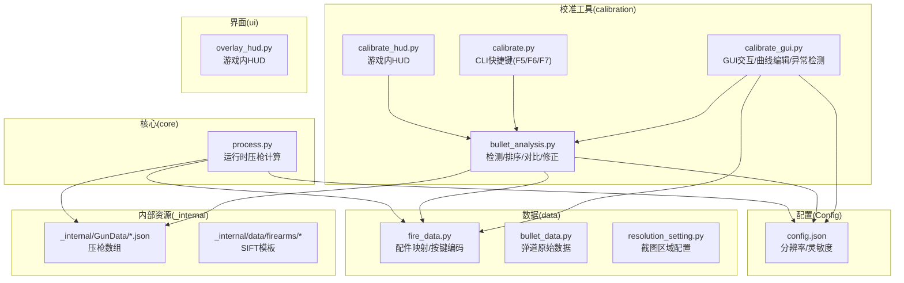
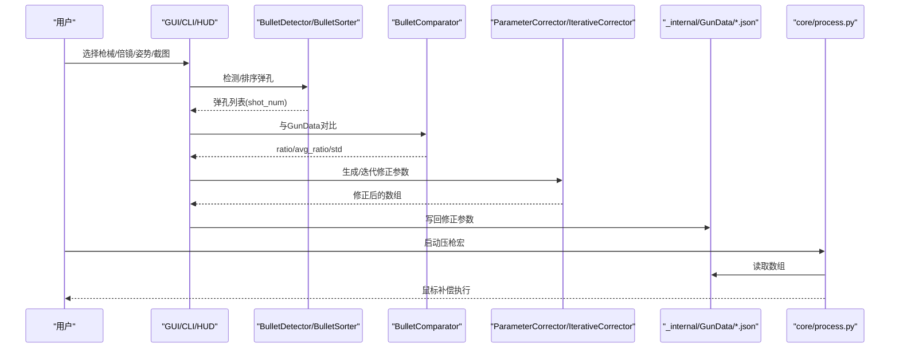
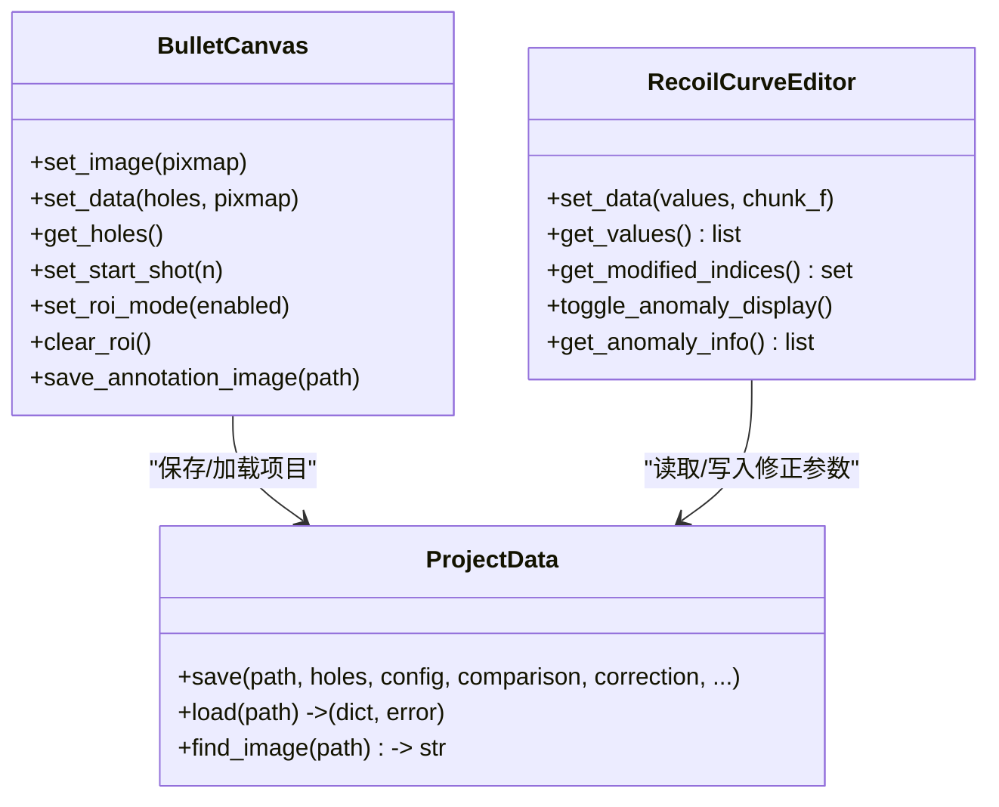
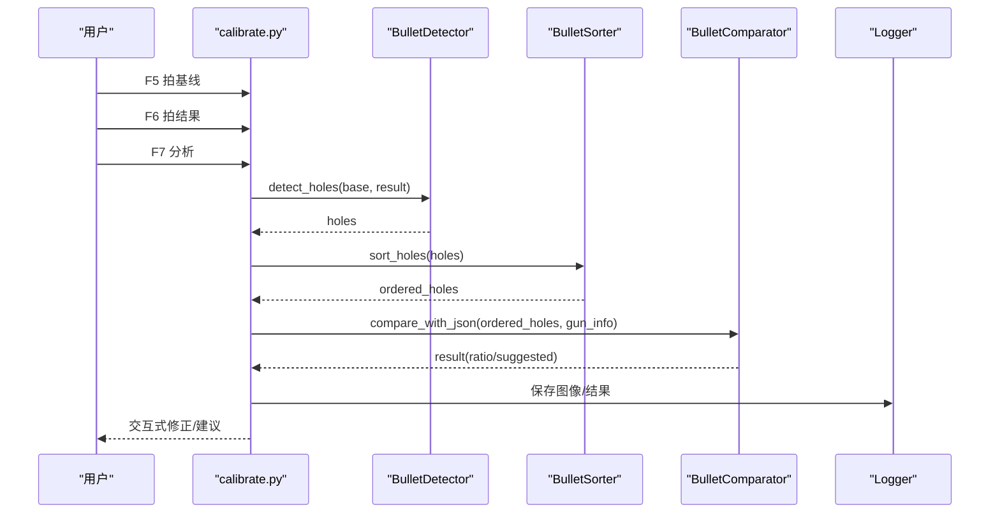
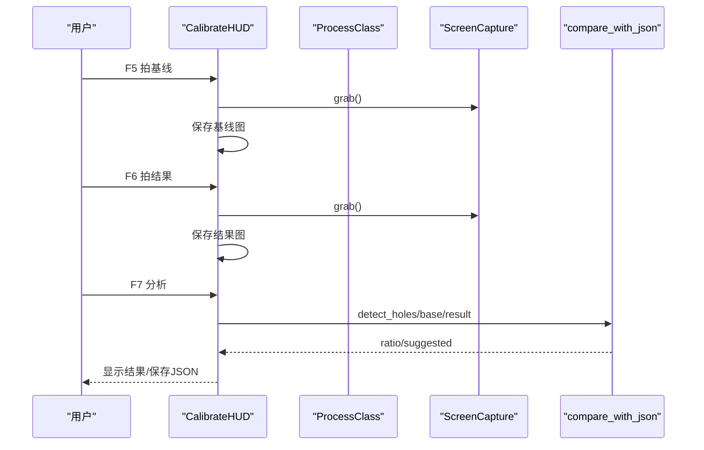
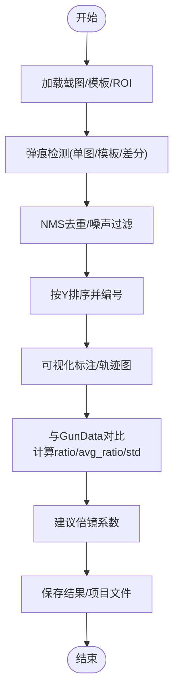
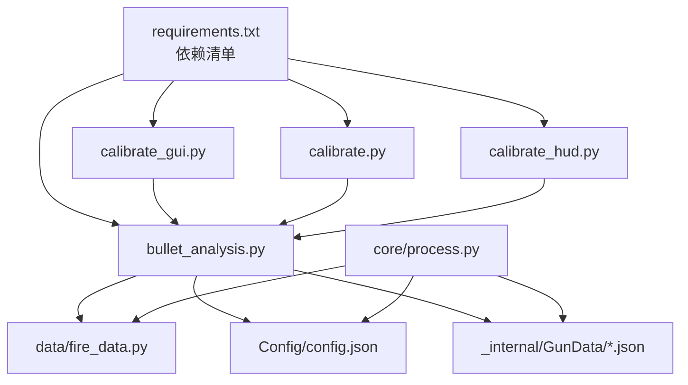

# 校准工具概览

<cite>
**本文引用的文件**
- [README.md](file://README.md)
- [main.py](file://main.py)
- [calibration/calibrate.py](file://calibration/calibrate.py)
- [calibration/calibrate_gui.py](file://calibration/calibrate_gui.py)
- [calibration/calibrate_hud.py](file://calibration/calibrate_hud.py)
- [calibration/bullet_analysis.py](file://calibration/bullet_analysis.py)
- [calibration/README.md](file://calibration/README.md)
- [calibration/CURVE_EDITOR_ANOMALY_DETECTION.md](file://calibration/CURVE_EDITOR_ANOMALY_DETECTION.md)
- [docs/SDD-Architecture.md](file://docs/SDD-Architecture.md)
- [data/fire_data.py](file://data/fire_data.py)
- [Config/config.json](file://Config/config.json)
- [requirements.txt](file://requirements.txt)
</cite>

## 目录
1. [简介](#简介)
2. [项目结构](#项目结构)
3. [核心组件](#核心组件)
4. [架构总览](#架构总览)
5. [详细组件分析](#详细组件分析)
6. [依赖关系分析](#依赖关系分析)
7. [性能与精度考量](#性能与精度考量)
8. [故障排查指南](#故障排查指南)
9. [结论](#结论)
10. [附录](#附录)

## 简介
本项目是一套面向PUBG的弹痕校准工具，旨在通过“截图+自动检测+对比+参数修正”的闭环流程，帮助玩家精准校准压枪宏参数，提升射击稳定性与命中效率。工具提供三种使用模式：
- GUI模式：可视化交互标注、曲线编辑、异常检测与多组比对
- CLI模式：快捷键驱动的快速分析（F5/F6/F7）
- HUD模式：游戏内悬浮窗，边打边校准

其核心价值在于：
- 将“弹痕检测”“排序”“对比”“参数修正”四个环节自动化，降低手工标定成本
- 通过“比值(ratio)”量化误差，指导倍镜系数与压枪数组的修正
- 以“chunk_size”为纽带，将理论数组与实际弹道对齐，确保宏执行的一致性

## 项目结构
项目采用“功能域+层次化”组织方式，核心目录与职责如下：
- calibration：弹痕分析与校准工具（GUI/CLI/HUD）
- core：运行时压枪计算与输入控制（与校准工具共享数据约定）
- data：数据定义（弹道、按键映射、分辨率设置）
- ui：游戏内HUD与主界面（与校准工具互补）
- Config：用户配置（分辨率、灵敏度）
- _internal：运行时资源（GunData、模板、驱动）

图表来源
- [docs/SDD-Architecture.md:19-41](file://docs/SDD-Architecture.md#L19-L41)
- [docs/SDD-Architecture.md:75-113](file://docs/SDD-Architecture.md#L75-L113)

章节来源
- [README.md:22-67](file://README.md#L22-L67)
- [docs/SDD-Architecture.md:1-129](file://docs/SDD-Architecture.md#L1-L129)

## 核心组件
- 弹痕检测与分析（bullet_analysis.py）
  - 提供三种检测策略：单图自适应（暗点+Blob+中值差分融合）、模板匹配、双图差分
  - 支持ROI裁剪、NMS去重、噪声过滤、调试图像输出
- GUI校准工具（calibrate_gui.py）
  - 交互式画布标注弹孔，支持缩放/平移/ROI/批量删除
  - 曲线编辑器按chunk分段，拖拽节点按比例缩放，内置异常检测
  - 多组比对、迭代修正、项目文件(.calibration.json)读写
- CLI校准工具（calibrate.py）
  - 快捷键F5/F6/F7：拍基线/拍结果/分析
  - 自动检测弹孔、排序、可视化、与JSON对比、交互式修正
- HUD校准工具（calibrate_hud.py）
  - 游戏内悬浮窗，F5/F6/F7/F10/F12控制
  - 识别枪械/倍镜/姿势，截图、检测、对比、结果展示
- 数据与配置
  - data/fire_data.py：配件映射与按键编码
  - Config/config.json：分辨率与灵敏度（倍镜系数）

章节来源
- [calibration/bullet_analysis.py:160-578](file://calibration/bullet_analysis.py#L160-L578)
- [calibration/calibrate_gui.py:56-384](file://calibration/calibrate_gui.py#L56-L384)
- [calibration/calibrate.py:193-454](file://calibration/calibrate.py#L193-L454)
- [calibration/calibrate_hud.py:159-498](file://calibration/calibrate_hud.py#L159-L498)
- [data/fire_data.py:54-82](file://data/fire_data.py#L54-L82)
- [Config/config.json:1-1](file://Config/config.json#L1-L1)

## 架构总览
校准工具与运行时的关系：
- 校准阶段：从弹痕截图提取弹孔，生成或修正GunData数组
- 运行阶段：运行时按固定时间步读取GunData数组，驱动鼠标移动
- 数据约定：GUI/CLI/HUD与运行时共享同一GunData JSON与配置格式

图表来源
- [docs/SDD-Architecture.md:50-71](file://docs/SDD-Architecture.md#L50-L71)
- [docs/SDD-Architecture.md:77-113](file://docs/SDD-Architecture.md#L77-L113)

章节来源
- [docs/SDD-Architecture.md:1-129](file://docs/SDD-Architecture.md#L1-L129)

## 详细组件分析

### GUI模式：交互式标注与曲线编辑
- 交互式画布（BulletCanvas）
  - 支持左键添加/拖动、右键删除、Shift+拖拽框选删除、Delete删除选中
  - ROI选区、缩放/平移、标注顺序即开火顺序（shot_num按列表顺序分配）
- 曲线编辑器（RecoilCurveEditor）
  - 按chunk分段，拖拽节点按比例缩放该chunk内的元素
  - 自动异常检测：反向值、突变、孤立零值，可视化标记与提示
  - 支持隐藏/显示异常标记，便于对比与修正
- 项目管理
  - 项目文件（.calibration.json）统一保存弹孔、配置、对比结果与修正参数
  - 支持多轨迹、批量加载、交叉比对

图表来源
- [calibration/calibrate_gui.py:56-384](file://calibration/calibrate_gui.py#L56-L384)
- [calibration/calibrate_gui.py:390-676](file://calibration/calibrate_gui.py#L390-L676)
- [calibration/bullet_analysis.py:584-694](file://calibration/bullet_analysis.py#L584-L694)

章节来源
- [calibration/calibrate_gui.py:56-384](file://calibration/calibrate_gui.py#L56-L384)
- [calibration/calibrate_gui.py:390-676](file://calibration/calibrate_gui.py#L390-L676)
- [calibration/CURVE_EDITOR_ANOMALY_DETECTION.md:1-207](file://calibration/CURVE_EDITOR_ANOMALY_DETECTION.md#L1-L207)
- [calibration/bullet_analysis.py:584-694](file://calibration/bullet_analysis.py#L584-L694)

### CLI模式：快捷键驱动的快速分析
- 快捷键流程
  - F5：拍基线（空白墙面）
  - F6：拍结果（打完枪）
  - F7：开始分析（检测弹痕+对比）
  - F8：退出
- 工作流
  - 截图→检测弹孔→排序→可视化→与GunData对比→交互式修正→保存结果

图表来源
- [calibration/calibrate.py:366-454](file://calibration/calibrate.py#L366-L454)
- [calibration/calibrate.py:193-365](file://calibration/calibrate.py#L193-L365)

章节来源
- [calibration/calibrate.py:1-550](file://calibration/calibrate.py#L1-L550)

### HUD模式：游戏内悬浮窗
- 功能
  - F5/F6/F7/F10/F12控制：拍基线/拍结果/分析/隐藏/穿透模式
  - 识别枪械/倍镜/姿势，实时显示分析结果
  - 透明穿透模式与编辑模式切换
- 交互
  - 右键拖拽移动位置
  - 穿透模式允许游戏输入穿透至游戏

图表来源
- [calibration/calibrate_hud.py:159-498](file://calibration/calibrate_hud.py#L159-L498)

章节来源
- [calibration/calibrate_hud.py:1-528](file://calibration/calibrate_hud.py#L1-L528)

### 弹痕检测与对比流程
- 检测策略
  - 单图自适应：暗点对比度+SimpleBlobDetector+中值差分融合，支持ROI
  - 模板匹配：从截图裁剪弹孔模板，多尺度匹配
  - 双图差分：空墙vs弹痕截图，OTSU阈值+形态学处理
- 排序与可视化
  - 按Y坐标排序，支持top-down/bottom_up与起始发数
  - 绘制连线与序号，输出轨迹图
- 对比与参数修正
  - 计算相邻弹孔间距与理论chunk累加的比值
  - 建议倍镜系数：suggested = current × avg_ratio
  - 生成/迭代修正参数，写回GunData

图表来源
- [calibration/bullet_analysis.py:160-578](file://calibration/bullet_analysis.py#L160-L578)
- [calibration/bullet_analysis.py:723-800](file://calibration/bullet_analysis.py#L723-L800)

章节来源
- [calibration/bullet_analysis.py:1-1504](file://calibration/bullet_analysis.py#L1-L1504)

## 依赖关系分析
- 外部依赖
  - OpenCV、NumPy、PyQt5、mss、keyboard等
- 内部依赖
  - GUI/CLI/HUD均依赖bullet_analysis.py提供的检测/排序/对比能力
  - 运行时core/process.py依赖GunData与配置，与校准工具共享数据格式

图表来源
- [requirements.txt:1-25](file://requirements.txt#L1-L25)
- [docs/SDD-Architecture.md:19-41](file://docs/SDD-Architecture.md#L19-L41)

章节来源
- [requirements.txt:1-25](file://requirements.txt#L1-L25)
- [docs/SDD-Architecture.md:1-129](file://docs/SDD-Architecture.md#L1-L129)

## 性能与精度考量
- 检测性能
  - 单图自适应策略在多数场景下平衡精度与速度；模板匹配与双图差分在特定条件下更稳健
  - ROI裁剪可显著减少误检与计算量
- 精度保障
  - 比值(ratio)作为误差指标，>1表示补偿不足，<1表示补偿过多
  - chunk_size由工具自动计算，确保理论数组与实际弹道对齐
  - 异常检测辅助识别反向、突变、孤立零值等潜在问题
- 实践建议
  - 高分辨率截图自动适配；墙面纹理少、弹孔清晰时优先低灵敏度
  - 多组比对与迭代修正可进一步降低残差

章节来源
- [calibration/README.md:70-128](file://calibration/README.md#L70-L128)
- [calibration/CURVE_EDITOR_ANOMALY_DETECTION.md:1-207](file://calibration/CURVE_EDITOR_ANOMALY_DETECTION.md#L1-L207)
- [docs/SDD-Architecture.md:116-121](file://docs/SDD-Architecture.md#L116-L121)

## 故障排查指南
- 检测不到弹孔
  - 墙面过暗/弹孔不明显：提高灵敏度
  - 背景干扰多：使用ROI框选
  - 仍失败：手工标注（右键添加/左键拖动/右键菜单删除）
- 检测到过多噪点
  - 降低灵敏度
  - 使用ROI限定范围
  - 手动删除误检点
- 数据单位与修正参数
  - 所有像素值基于截图实际分辨率；理论值通过raw_value × scope_val × pose_val转换
  - 将修正参数复制到对应GunData JSON条目

章节来源
- [calibration/README.md:149-175](file://calibration/README.md#L149-L175)

## 结论
本校准工具通过“检测—排序—对比—修正”的闭环流程，将弹痕分析从手工标定转变为自动化、可视化的工程实践。GUI/HUD/CLI三种模式覆盖不同使用场景，配合异常检测与多组比对，显著提升了参数修正的准确性与效率。依托统一的数据格式与配置约定，校准结果可无缝接入运行时压枪宏，形成“校准—执行”的完整链路。

## 附录

### 快速开始
- 安装依赖：pip install -r requirements.txt
- 启动主程序：python main.py
- 弹痕校准：python -m calibration.calibrate_gui 或 python -m calibration.calibrate

章节来源
- [README.md:69-84](file://README.md#L69-L84)

### 核心概念
- 比值(ratio)：实际弹孔间距 / 理论补偿间距；>1需增大参数，<1需减小参数
- chunk_size：GunData数组中每发子弹占的元素数，工具自动计算
- scope_val：倍镜灵敏度系数，来自Config/config.json
- pose_val：姿势倍率，来自GunData JSON中的none/c/z值
- acc_code：配件编码，格式A{枪口}B{握把}C{枪托}

章节来源
- [calibration/README.md:70-128](file://calibration/README.md#L70-L128)
- [data/fire_data.py:54-82](file://data/fire_data.py#L54-L82)
- [Config/config.json:1-1](file://Config/config.json#L1-L1)