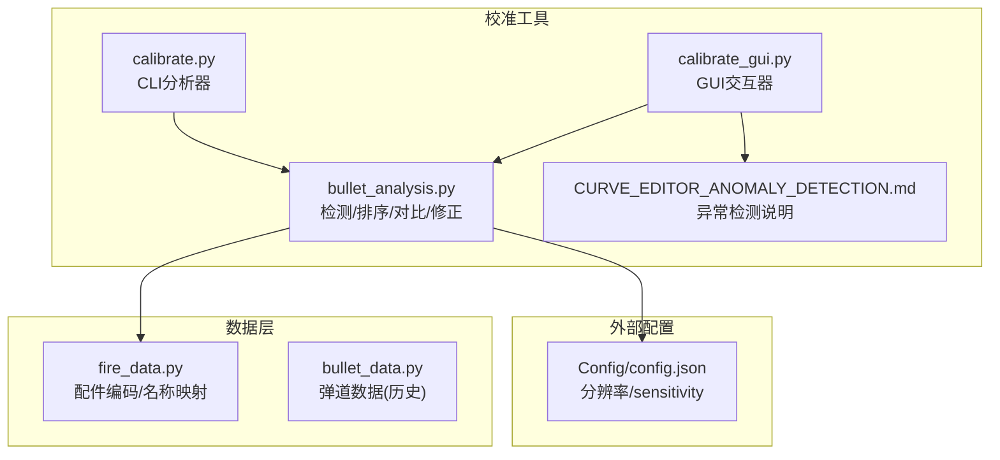
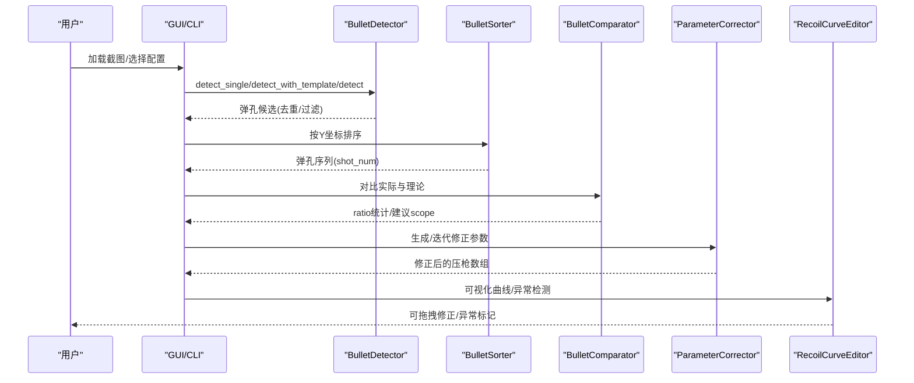
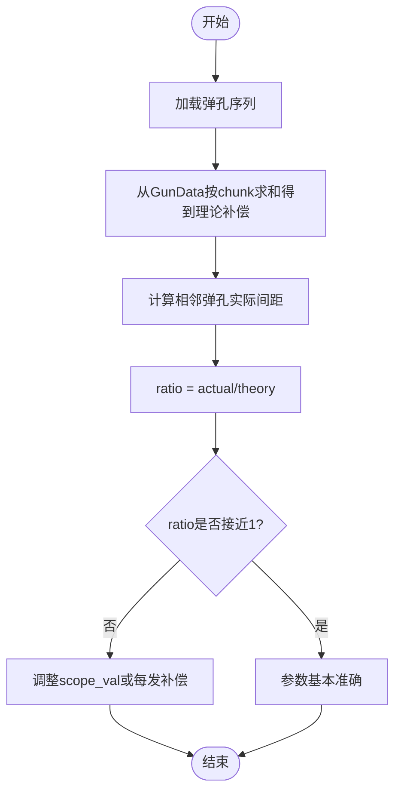
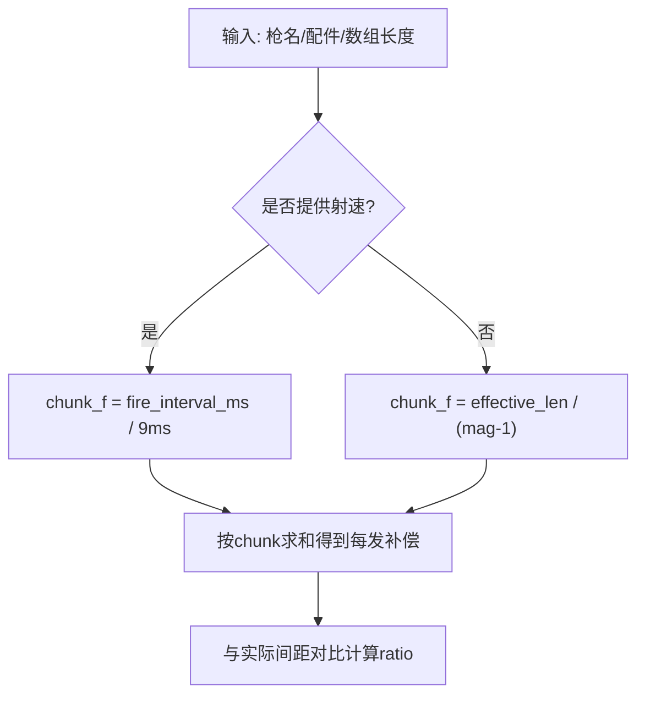
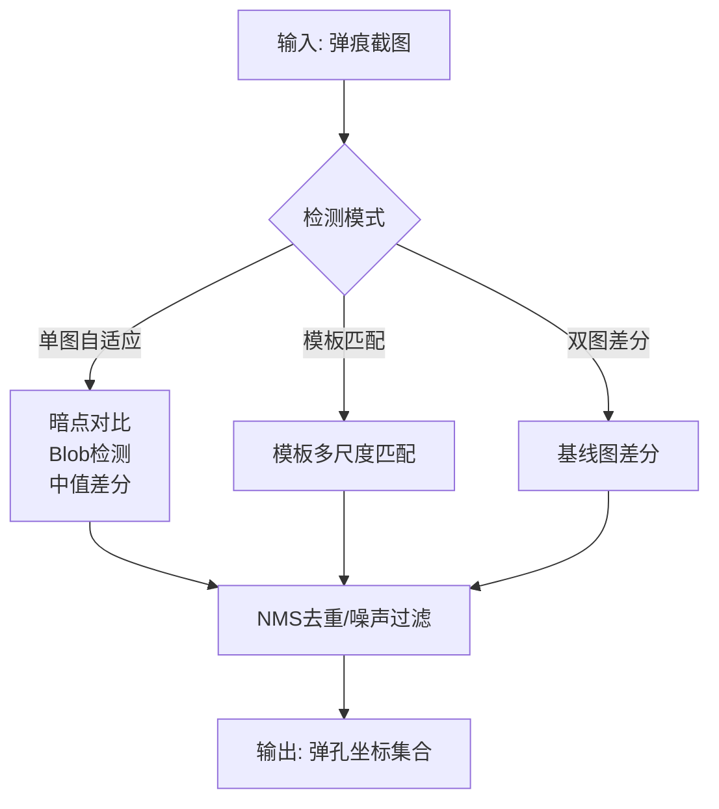
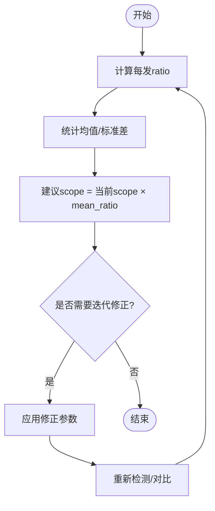
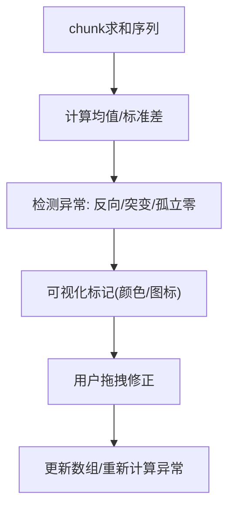
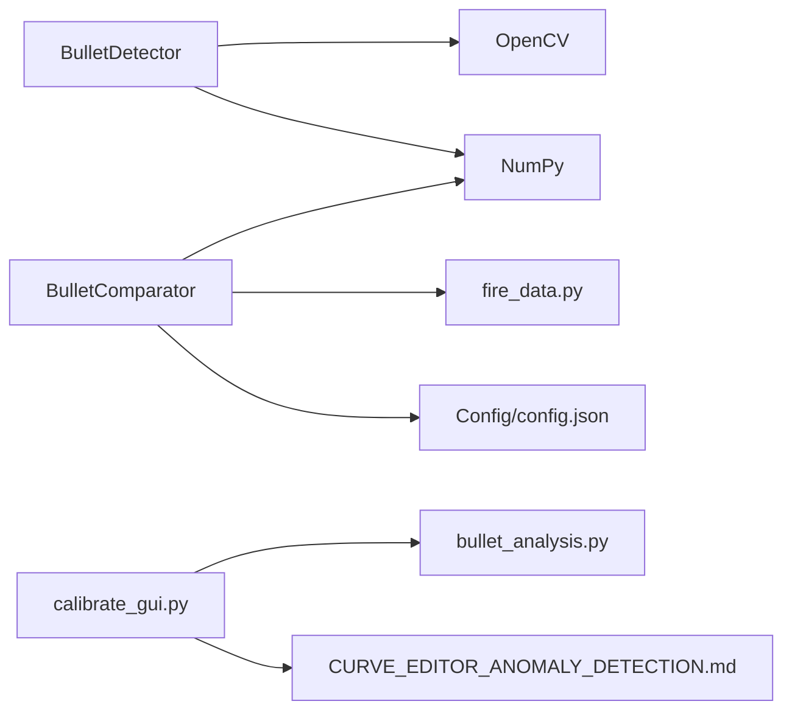

# 校准核心概念

<cite>
**本文引用的文件**
- [README.md](file://README.md)
- [calibration/README.md](file://calibration/README.md)
- [calibration/CURVE_EDITOR_ANOMALY_DETECTION.md](file://calibration/CURVE_EDITOR_ANOMALY_DETECTION.md)
- [calibration/calibrate.py](file://calibration/calibrate.py)
- [calibration/calibrate_gui.py](file://calibration/calibrate_gui.py)
- [calibration/bullet_analysis.py](file://calibration/bullet_analysis.py)
- [data/fire_data.py](file://data/fire_data.py)
- [data/bullet_data.py](file://data/bullet_data.py)
</cite>

## 目录
1. [简介](#简介)
2. [项目结构](#项目结构)
3. [核心组件](#核心组件)
4. [架构总览](#架构总览)
5. [详细组件分析](#详细组件分析)
6. [依赖关系分析](#依赖关系分析)
7. [性能考量](#性能考量)
8. [故障排查指南](#故障排查指南)
9. [结论](#结论)
10. [附录](#附录)

## 简介
本文件面向PUBG弹痕校准工具的使用者与开发者，系统阐述校准过程中的核心概念与理论基础，包括：
- 比值（ratio）计算方法与物理意义
- chunk_size 参数含义及其与射速、数组长度的关系
- scope_val 倍镜灵敏度系数与 pose_val 姿势倍率的来源与作用
- 弹痕检测的三大模式：单图自适应、模板匹配、双图差分
- 参数修正的理论基础：残差、误差分析、最优参数求解
- 异常检测与曲线编辑：离群点检测、数据平滑、参数优化
- 面向高级用户的算法实现细节与扩展开发建议

## 项目结构
本项目围绕“弹痕检测—排序—对比—修正—可视化”形成闭环流程，核心模块如下：
- calibration/README.md：工具使用说明与概念解释
- calibration/calibrate.py：CLI模式的弹痕分析与参数建议
- calibration/calibrate_gui.py：GUI模式的交互标注、曲线编辑与异常检测
- calibration/bullet_analysis.py：弹痕检测、排序、对比、参数生成与项目数据管理
- data/fire_data.py：配件编码与名称映射
- data/bullet_data.py：各枪械的弹道数据（历史版本）

**图示来源**
- [calibration/calibrate.py:1-550](file://calibration/calibrate.py#L1-L550)
- [calibration/calibrate_gui.py:1-800](file://calibration/calibrate_gui.py#L1-L800)
- [calibration/bullet_analysis.py:1-800](file://calibration/bullet_analysis.py#L1-L800)
- [data/fire_data.py:1-83](file://data/fire_data.py#L1-L83)
- [data/bullet_data.py:1-800](file://data/bullet_data.py#L1-L800)

**章节来源**
- [README.md:116-156](file://README.md#L116-L156)
- [calibration/README.md:1-199](file://calibration/README.md#L1-L199)

## 核心组件
- 弹痕检测器（BulletDetector）：提供单图自适应、模板匹配、双图差分三种策略，融合暗点对比、Blob检测与中值差分，并进行NMS去重与横向一致性过滤。
- 弹孔排序器（BulletSorter）：依据后坐力方向与起始发数，将弹孔按射击顺序排序。
- 对比器（BulletComparator）：将实际弹孔间距与GunData理论值对比，计算ratio并给出倍镜系数建议。
- 项目数据（ProjectData）：统一保存弹孔、配置、对比结果与修正参数，支持多轨迹。
- 参数修正器（ParameterCorrector）：基于ratio统计生成修正参数，支持迭代修正与多组交叉比对。
- GUI曲线编辑器（RecoilCurveEditor）：以chunk为单位展示与编辑压枪数组，内置异常检测与可视化。

**章节来源**
- [calibration/bullet_analysis.py:160-578](file://calibration/bullet_analysis.py#L160-L578)
- [calibration/bullet_analysis.py:700-717](file://calibration/bullet_analysis.py#L700-L717)
- [calibration/bullet_analysis.py:723-800](file://calibration/bullet_analysis.py#L723-L800)
- [calibration/bullet_analysis.py:584-694](file://calibration/bullet_analysis.py#L584-L694)
- [calibration/calibrate_gui.py:390-676](file://calibration/calibrate_gui.py#L390-L676)
- [calibration/CURVE_EDITOR_ANOMALY_DETECTION.md:1-207](file://calibration/CURVE_EDITOR_ANOMALY_DETECTION.md#L1-L207)

## 架构总览
下图展示了从截图到参数修正的端到端流程，以及关键模块间的依赖关系。

**图示来源**
- [calibration/bullet_analysis.py:160-578](file://calibration/bullet_analysis.py#L160-L578)
- [calibration/bullet_analysis.py:700-717](file://calibration/bullet_analysis.py#L700-L717)
- [calibration/bullet_analysis.py:723-800](file://calibration/bullet_analysis.py#L723-L800)
- [calibration/calibrate_gui.py:390-676](file://calibration/calibrate_gui.py#L390-L676)

## 详细组件分析

### 比值（ratio）计算与物理意义
- 定义：ratio = 实际弹孔间距 / 理论补偿间距
- 物理意义：ratio反映当前scope_val与pose_val下的整体补偿强度与真实弹道的一致性。
- 修正原则：
  - ratio > 1：补偿不足，需增大scope_val或增大每发补偿
  - ratio < 1：补偿过多，需减小scope_val或减小每发补偿
  - ratio ≈ 1：参数基本准确

**图示来源**
- [calibration/bullet_analysis.py:723-800](file://calibration/bullet_analysis.py#L723-L800)
- [calibration/README.md:70-79](file://calibration/README.md#L70-L79)

**章节来源**
- [calibration/README.md:70-79](file://calibration/README.md#L70-L79)
- [calibration/bullet_analysis.py:723-800](file://calibration/bullet_analysis.py#L723-L800)

### chunk_size 参数与射速、数组长度的关系
- chunk_f：每发子弹在宏循环中对应的tick数量，来源于射速或数组长度启发式估计。
- chunk_size：每发子弹在GunData数组中占用的元素个数，即chunk_f的整数近似。
- 计算优先级：
  1) 射速优先：chunk_f = fire_interval_ms / tick_ms（tick_ms=9ms）
  2) 弹夹回退：chunk_f = effective_array_len / (mag-1)
- 作用：将GunData的per-tick数组按chunk求和，得到每发的补偿总量，与实际弹孔间距对齐。

**图示来源**
- [calibration/bullet_analysis.py:84-146](file://calibration/bullet_analysis.py#L84-L146)
- [calibration/bullet_analysis.py:781-796](file://calibration/bullet_analysis.py#L781-L796)

**章节来源**
- [calibration/bullet_analysis.py:84-146](file://calibration/bullet_analysis.py#L84-L146)
- [calibration/bullet_analysis.py:781-796](file://calibration/bullet_analysis.py#L781-L796)

### scope_val 倍镜灵敏度系数与 pose_val 姿势倍率
- scope_val：来自Config/config.json中的sensitivity字典，不同倍镜下的灵敏度系数。
- pose_val：来自GunData JSON文件中的姿势项（如none/c/z），代表不同姿势下的补偿倍率。
- 作用：将GunData中的理论补偿按 scope_val×pose_val 转换为像素单位，与实际弹孔间距对齐。

**章节来源**
- [calibration/README.md:92-120](file://calibration/README.md#L92-L120)
- [calibration/bullet_analysis.py:741-743](file://calibration/bullet_analysis.py#L741-L743)

### 弹痕检测模式与算法原理
- 单图自适应（推荐）
  - 暗点对比：用大核高斯估计背景，原图减背景得到暗点图，阈值化后形态学清理
  - SimpleBlobDetector：针对深色圆形斑点，参数随分辨率自适应
  - 中值差分：多尺度中值滤波生成虚拟基线，与原图差分检测
  - NMS去重与横向一致性过滤，提升鲁棒性
- 模板匹配
  - 从截图裁剪弹孔模板（15~60px正方形），多尺度匹配，NMS去重
  - 适用于特征明显但自适应漏检的情况
- 双图差分（CLI提供--base）
  - 以空白墙面图为基线，与结果图差分，阈值化后轮廓检测
  - 有基线图时精度最高

**图示来源**
- [calibration/bullet_analysis.py:224-276](file://calibration/bullet_analysis.py#L224-L276)
- [calibration/bullet_analysis.py:358-411](file://calibration/bullet_analysis.py#L358-L411)
- [calibration/bullet_analysis.py:414-424](file://calibration/bullet_analysis.py#L414-L424)

**章节来源**
- [calibration/README.md:55-62](file://calibration/README.md#L55-L62)
- [calibration/bullet_analysis.py:160-578](file://calibration/bullet_analysis.py#L160-L578)

### 参数修正的理论基础
- 残差与误差分析
  - 对每个间隔计算ratio，统计均值与标准差
  - 建议倍镜系数：suggested_scope ≈ current_scope × mean_ratio
- 最优参数求解
  - 通过迭代修正逐步缩小ratio与1的偏差
  - 多组数据交叉比对，给出更稳健的最优参数

**图示来源**
- [calibration/calibrate.py:305-364](file://calibration/calibrate.py#L305-L364)
- [calibration/bullet_analysis.py:723-800](file://calibration/bullet_analysis.py#L723-L800)

**章节来源**
- [calibration/calibrate.py:305-364](file://calibration/calibrate.py#L305-L364)
- [calibration/bullet_analysis.py:723-800](file://calibration/bullet_analysis.py#L723-L800)

### 异常检测与曲线编辑
- 异常检测算法
  - 反向值：当前与前后邻居符号相反且绝对值较大
  - 突变值：偏离均值超过2.5σ，超过4σ为高严重度
  - 孤立零值：前后非零而当前为零
- 曲线编辑器
  - 以chunk为单位展示数组，用户可拖拽调整每发补偿
  - 实时更新底层数组，支持异常标记与交互式修正

**图示来源**
- [calibration/calibrate_gui.py:464-525](file://calibration/calibrate_gui.py#L464-L525)
- [calibration/CURVE_EDITOR_ANOMALY_DETECTION.md:128-161](file://calibration/CURVE_EDITOR_ANOMALY_DETECTION.md#L128-L161)

**章节来源**
- [calibration/CURVE_EDITOR_ANOMALY_DETECTION.md:1-207](file://calibration/CURVE_EDITOR_ANOMALY_DETECTION.md#L1-L207)
- [calibration/calibrate_gui.py:390-676](file://calibration/calibrate_gui.py#L390-L676)

## 依赖关系分析
- 模块耦合
  - BulletDetector独立于GunData，仅依赖OpenCV与numpy
  - BulletComparator依赖GunData目录与Config配置
  - GUI依赖bullet_analysis模块与异常检测说明
- 外部依赖
  - OpenCV：图像处理、Blob检测、模板匹配、形态学
  - NumPy：数组运算、统计分析
  - PyQt5：GUI交互与可视化

**图示来源**
- [calibration/bullet_analysis.py:1-800](file://calibration/bullet_analysis.py#L1-L800)
- [calibration/calibrate_gui.py:1-800](file://calibration/calibrate_gui.py#L1-L800)
- [data/fire_data.py:1-83](file://data/fire_data.py#L1-L83)

**章节来源**
- [calibration/bullet_analysis.py:1-800](file://calibration/bullet_analysis.py#L1-L800)
- [calibration/calibrate_gui.py:1-800](file://calibration/calibrate_gui.py#L1-L800)

## 性能考量
- 分辨率自适应：检测参数按图像像素总数缩放，避免硬编码分辨率
- ROI裁剪：框选区域可显著减少误检与计算量
- 多策略融合：暗点+Blob+中值差分三路融合，提升召回与稳健性
- NMS与噪声过滤：降低误检与漏检，提高排序与对比精度
- GUI交互：实时可视化与异常标记，加速参数收敛

[本节为通用指导，无需特定文件引用]

## 故障排查指南
- 检测不到弹孔
  - 墙面过暗/弹孔不明显：提高灵敏度
  - 背景纹理复杂：使用ROI框选
  - 仍不理想：手工标注/模板匹配
- 检测到过多噪点
  - 降低灵敏度
  - 使用ROI限定范围
  - 手动删除误检点
- 数据单位不对
  - 所有像素值基于截图分辨率，理论值通过raw_value×scope_val×pose_val转换
- 迭代到什么程度算好
  - 残差（每发弹孔偏移量）低于3px视为足够准确

**章节来源**
- [calibration/README.md:149-175](file://calibration/README.md#L149-L175)

## 结论
本工具通过“检测—排序—对比—修正—可视化”的闭环流程，将理论弹道与实际弹痕对齐，借助ratio统计与异常检测实现参数的自动化与可视化修正。对于高级用户，可通过自定义检测算法、参数优化策略与性能改进方法进一步提升校准精度与效率。

[本节为总结，无需特定文件引用]

## 附录
- 配件编码（ACC_CODE）
  - 格式：A{枪口}B{握把}C{枪托}
  - 示例：A5B2C1 表示步枪补偿+拇指握把+战术枪托
- 常用术语
  - ratio：实际间距与理论间距的比值
  - chunk_size：每发子弹在数组中占用的元素数
  - scope_val：倍镜灵敏度系数
  - pose_val：姿势倍率

**章节来源**
- [calibration/README.md:121-129](file://calibration/README.md#L121-L129)
- [data/fire_data.py:54-83](file://data/fire_data.py#L54-L83)