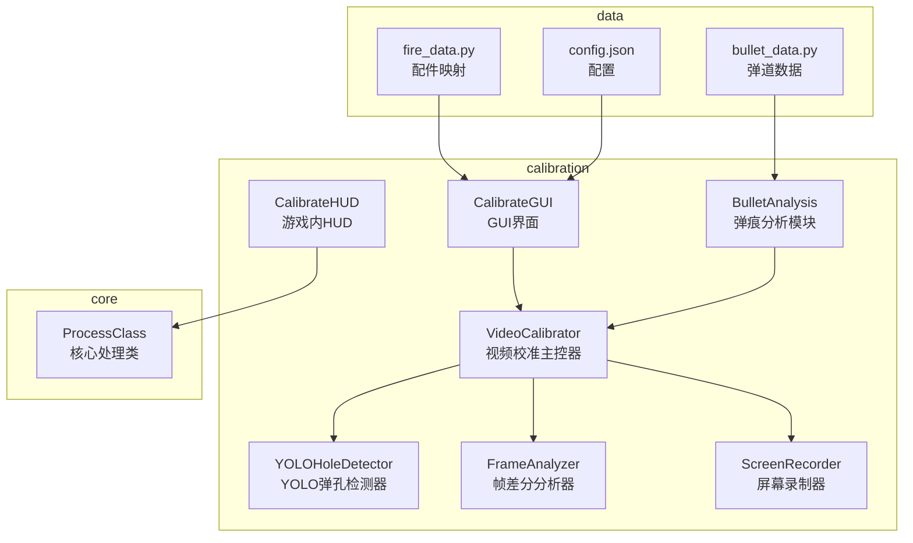
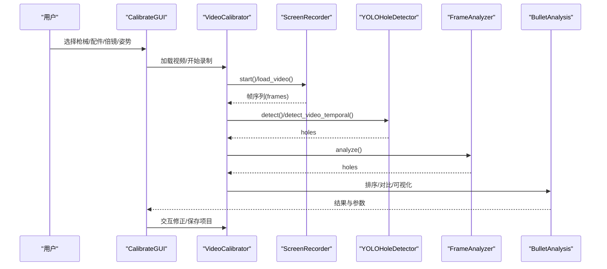
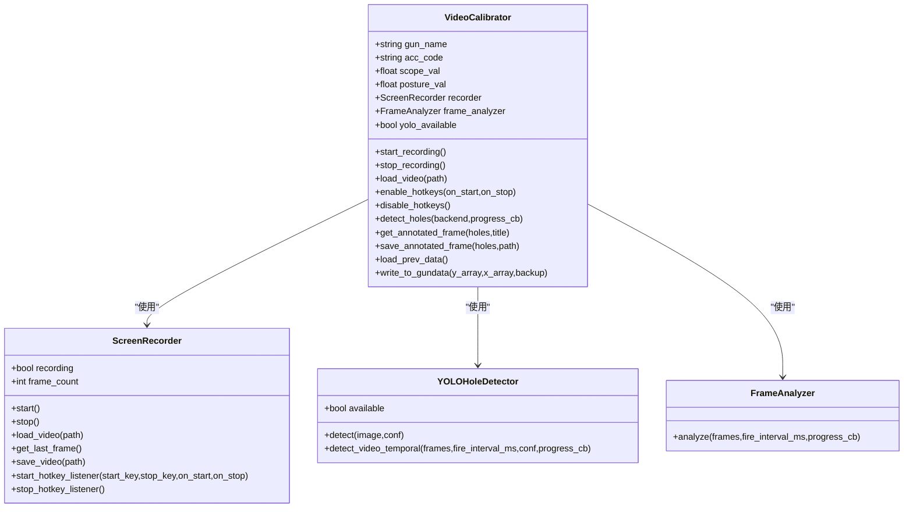
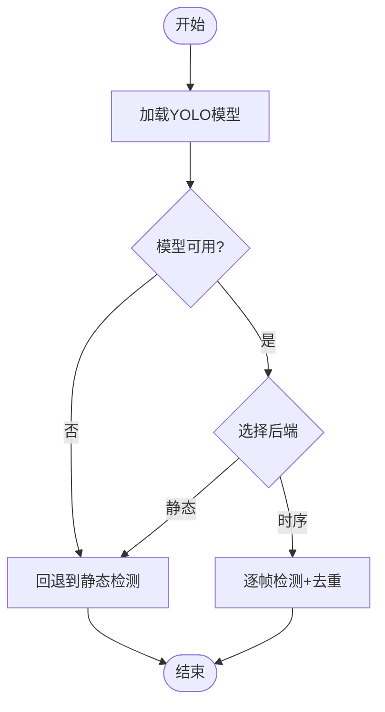
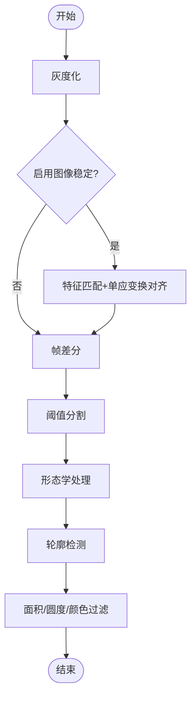
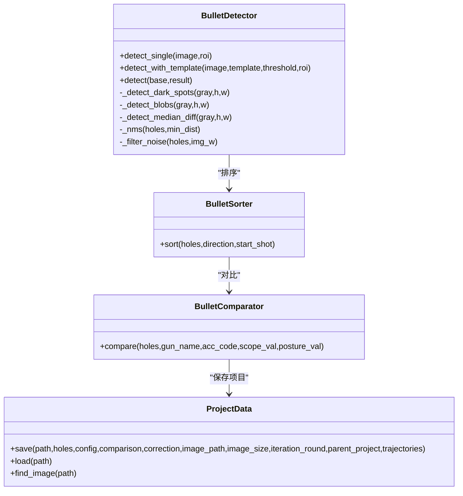
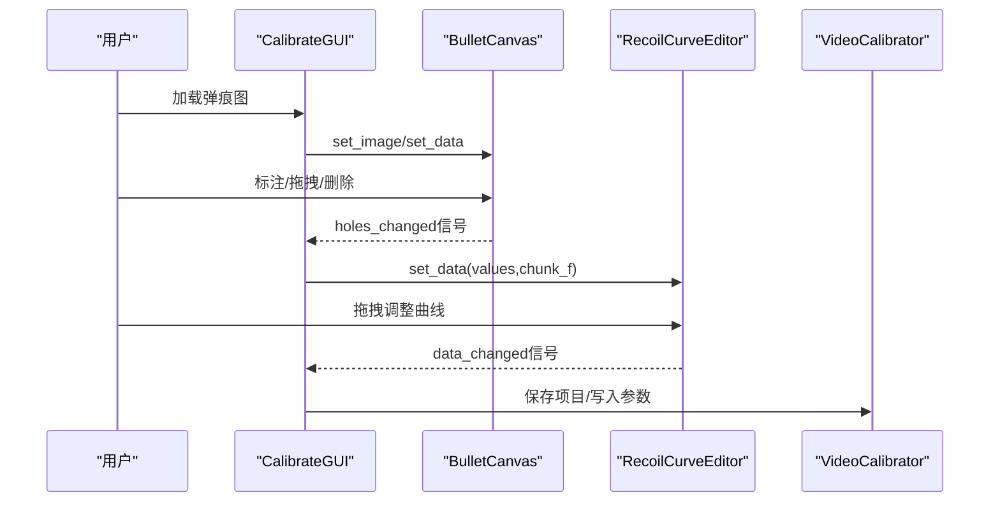
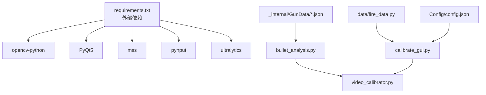

# 视频校准工具

<cite>
**本文引用的文件**
- [README.md](file://README.md)
- [main.py](file://main.py)
- [calibration/video_calibrator.py](file://calibration/video_calibrator.py)
- [calibration/calibrate.py](file://calibration/calibrate.py)
- [calibration/calibrate_gui.py](file://calibration/calibrate_gui.py)
- [calibration/calibrate_hud.py](file://calibration/calibrate_hud.py)
- [calibration/bullet_analysis.py](file://calibration/bullet_analysis.py)
- [requirements.txt](file://requirements.txt)
- [Config/config.json](file://Config/config.json)
- [data/fire_data.py](file://data/fire_data.py)
- [data/bullet_data.py](file://data/bullet_data.py)
</cite>

## 目录
1. [简介](#简介)
2. [项目结构](#项目结构)
3. [核心组件](#核心组件)
4. [架构总览](#架构总览)
5. [详细组件分析](#详细组件分析)
6. [依赖关系分析](#依赖关系分析)
7. [性能考虑](#性能考虑)
8. [故障排除指南](#故障排除指南)
9. [结论](#结论)
10. [附录](#附录)

## 简介
本工具面向PUBG的视频校准需求，提供基于视频序列的弹痕分析与校准能力。相比静态图片校准，视频校准具备以下优势：
- 时间序列分析：通过连续帧捕捉射击过程，保留射击顺序与运动轨迹
- 抗噪声能力：多策略融合（YOLO、帧差分、传统检测）降低误检与漏检
- 实时性与交互性：支持实时录屏、热键触发、GUI/HUD交互标注与参数修正
- 批量处理与自动化：支持视频文件批量分析与项目化保存，便于迭代修正与多组比对

工具支持多种检测后端与输入源，既可作为CLI工具快速校准，也可通过GUI进行交互式标注与参数修正，或在游戏内通过HUD边打边校准。

## 项目结构
项目采用模块化组织，核心围绕“视频校准”与“弹痕分析”两大主线展开：
- calibration：视频校准与弹痕分析模块，包含视频采集、检测、标注、参数修正与GUI/HUD界面
- core：核心逻辑（压枪计算、识别、输入监听等），与校准工具协同工作
- data：数据定义（弹道数据、配置、分辨率设置等）
- input/ui：输入监听与界面组件
- Config：用户配置（分辨率、灵敏度等）

图表来源
- [calibration/video_calibrator.py:542-767](file://calibration/video_calibrator.py#L542-L767)
- [calibration/bullet_analysis.py:160-800](file://calibration/bullet_analysis.py#L160-L800)
- [calibration/calibrate_gui.py:1-200](file://calibration/calibrate_gui.py#L1-L200)
- [calibration/calibrate_hud.py:1-200](file://calibration/calibrate_hud.py#L1-L200)
- [data/fire_data.py:1-83](file://data/fire_data.py#L1-L83)
- [Config/config.json:1-1](file://Config/config.json#L1-L1)

章节来源
- [README.md:22-67](file://README.md#L22-L67)
- [requirements.txt:1-25](file://requirements.txt#L1-L25)

## 核心组件
- VideoCalibrator：视频校准主控器，负责视频输入（录屏/视频文件）、多后端检测（YOLO、帧差分、静态）、标注与参数写入
- YOLOHoleDetector：YOLOv8/v11弹孔检测器，支持静态帧检测与逐帧时序追踪
- FrameAnalyzer：传统帧差分分析器，基于图像稳定与差分阈值检测弹孔
- ScreenRecorder：屏幕录制器，支持实时录屏与视频文件加载，提供热键控制
- BulletAnalysis：弹痕分析模块，包含检测、排序、对比、可视化、参数生成与迭代修正
- CalibrateGUI：图形化界面，支持交互式标注、ROI选区、调试查看与项目保存
- CalibrateHUD：游戏内悬浮窗，支持热键触发、实时分析与结果展示

章节来源
- [calibration/video_calibrator.py:542-767](file://calibration/video_calibrator.py#L542-L767)
- [calibration/bullet_analysis.py:160-800](file://calibration/bullet_analysis.py#L160-L800)
- [calibration/calibrate_gui.py:1-200](file://calibration/calibrate_gui.py#L1-L200)
- [calibration/calibrate_hud.py:1-200](file://calibration/calibrate_hud.py#L1-L200)

## 架构总览
视频校准工具采用“输入—检测—分析—修正—输出”的流水线架构：
- 输入层：ScreenRecorder提供实时录屏与视频文件加载
- 检测层：YOLOHoleDetector与FrameAnalyzer提供多策略检测
- 分析层：BulletAnalysis负责排序、对比、可视化与参数生成
- 交互层：GUI/HUD提供标注、调试与参数修正
- 输出层：保存标注图、项目文件与修正参数

图表来源
- [calibration/video_calibrator.py:622-706](file://calibration/video_calibrator.py#L622-L706)
- [calibration/bullet_analysis.py:723-800](file://calibration/bullet_analysis.py#L723-L800)
- [calibration/calibrate_gui.py:1-200](file://calibration/calibrate_gui.py#L1-L200)

## 详细组件分析

### 视频校准主控器（VideoCalibrator）
- 功能职责
  - 视频输入：支持实时录屏（F6/F7热键）与视频文件加载
  - 多后端检测：YOLO静态/时序、帧差分、传统静态
  - 标注与保存：生成标注图、保存项目文件、写入GunData
- 关键流程
  - detect_holes：根据后端选择调用相应检测器
  - get_annotated_frame/save_annotated_frame：生成标注图
  - load_prev_data/write_to_gundata：读取/写入GunData参数

图表来源
- [calibration/video_calibrator.py:542-767](file://calibration/video_calibrator.py#L542-L767)

章节来源
- [calibration/video_calibrator.py:542-767](file://calibration/video_calibrator.py#L542-L767)

### YOLO弹孔检测器（YOLOHoleDetector）
- 功能职责
  - 加载YOLO模型（.pt），支持单例缓存避免重复加载
  - 静态检测：在最后一帧检测弹孔
  - 时序检测：逐帧检测并基于已知位置去重，保留射击顺序
- 性能特性
  - 通过采样步长与NMS距离控制检测密度
  - 支持进度回调，便于GUI/HUD反馈

图表来源
- [calibration/video_calibrator.py:90-162](file://calibration/video_calibrator.py#L90-L162)

章节来源
- [calibration/video_calibrator.py:49-162](file://calibration/video_calibrator.py#L49-L162)

### 帧差分分析器（FrameAnalyzer）
- 功能职责
  - 基于图像稳定（ORB特征+单应变换）与帧差分检测弹孔
  - 通过面积范围、圆度、颜色差异等约束过滤噪声
  - 支持ROI选区与调试图像输出
- 适用场景
  - 需要干净墙面与稳定画面的场景
  - 作为YOLO的兜底方案

图表来源
- [calibration/video_calibrator.py:375-450](file://calibration/video_calibrator.py#L375-L450)

章节来源
- [calibration/video_calibrator.py:364-472](file://calibration/video_calibrator.py#L364-L472)

### 弹痕分析模块（BulletAnalysis）
- 功能职责
  - BulletDetector：单图自适应检测（暗点对比度+Blob+中值差分融合）
  - BulletSorter：按射击顺序排序
  - BulletComparator：与GunData理论数据对比，计算比值与建议倍镜系数
  - ProjectData：项目文件保存与加载（.calibration.json）
- 关键算法
  - chunk_f计算：基于射击间隔与tick间隔，将GunData数组切片求和
  - 比值分析：actual/theory，指导scope系数修正

图表来源
- [calibration/bullet_analysis.py:160-800](file://calibration/bullet_analysis.py#L160-L800)

章节来源
- [calibration/bullet_analysis.py:160-800](file://calibration/bullet_analysis.py#L160-L800)

### GUI界面（CalibrateGUI）
- 功能职责
  - 交互式画布：缩放/拖拽标注弹孔，支持ROI选区、框选删除
  - 曲线编辑器：拖拽调整后坐力补偿曲线，自动识别异常值
  - 项目管理：加载/保存项目、迭代修正、多组比对
- 操作流程
  - 加载弹痕图 → 框选ROI → 分析 → 手动修正 → 保存项目

图表来源
- [calibration/calibrate_gui.py:56-200](file://calibration/calibrate_gui.py#L56-L200)
- [calibration/calibrate_gui.py:390-676](file://calibration/calibrate_gui.py#L390-L676)

章节来源
- [calibration/calibrate_gui.py:1-200](file://calibration/calibrate_gui.py#L1-L200)
- [calibration/calibrate_gui.py:390-676](file://calibration/calibrate_gui.py#L390-L676)

### 游戏内HUD（CalibrateHUD）
- 功能职责
  - 无侵入悬浮窗，支持热键触发（F5/F6/F7/F10/F12）
  - 实时弹孔检测、排序、对比与结果展示
  - 透明窗口属性，允许点击穿透
- 适用场景
  - 边打边校准，无需切换应用

章节来源
- [calibration/calibrate_hud.py:1-200](file://calibration/calibrate_hud.py#L1-L200)

## 依赖关系分析
- 外部依赖
  - OpenCV：图像处理与检测
  - Ultralytics YOLO：YOLO模型推理
  - PyQt5：GUI界面
  - mss/pynput：屏幕捕获与热键监听
- 内部依赖
  - data/fire_data.py：配件映射与键值编码
  - Config/config.json：分辨率与灵敏度配置
  - _internal/GunData/*：枪械弹道数据

图表来源
- [requirements.txt:1-25](file://requirements.txt#L1-L25)
- [data/fire_data.py:1-83](file://data/fire_data.py#L1-L83)
- [Config/config.json:1-1](file://Config/config.json#L1-L1)
- [calibration/bullet_analysis.py:31-72](file://calibration/bullet_analysis.py#L31-L72)
- [calibration/video_calibrator.py:576-591](file://calibration/video_calibrator.py#L576-L591)

章节来源
- [requirements.txt:1-25](file://requirements.txt#L1-L25)
- [data/fire_data.py:1-83](file://data/fire_data.py#L1-L83)
- [Config/config.json:1-1](file://Config/config.json#L1-L1)

## 性能考虑
- 检测策略选择
  - YOLO：高精度，抗纹理干扰，适合复杂墙面；需GPU/CPU良好性能
  - 帧差分：依赖图像稳定与干净墙面，CPU友好
  - 传统静态：简单可靠，适合兜底
- 采样与去重
  - YOLO时序检测通过采样步长与NMS距离平衡精度与速度
  - 帧差分通过面积/圆度/颜色阈值过滤噪声
- ROI选区
  - 框选弹痕区域可显著减少误检与计算量
- 进度回调
  - 提供进度反馈，避免长时间无响应

章节来源
- [calibration/video_calibrator.py:119-162](file://calibration/video_calibrator.py#L119-L162)
- [calibration/video_calibrator.py:375-450](file://calibration/video_calibrator.py#L375-L450)
- [calibration/bullet_analysis.py:547-578](file://calibration/bullet_analysis.py#L547-L578)

## 故障排除指南
- YOLO模型未安装或加载失败
  - 现象：提示安装ultralytics或模型加载失败
  - 处理：安装依赖或提供正确模型路径
- 热键无效
  - 现象：F6/F7等热键无响应
  - 处理：检查pynput安装与权限，或使用手动模式
- 弹孔检测不准确
  - 现象：误检/漏检
  - 处理：调整灵敏度、启用ROI选区、使用模板匹配、切换检测后端
- GUI/HUD无法显示
  - 现象：界面黑屏或无响应
  - 处理：检查PyQt5安装、分辨率设置与窗口置顶权限

章节来源
- [calibration/video_calibrator.py:70-89](file://calibration/video_calibrator.py#L70-L89)
- [calibration/calibrate_gui.py:1-200](file://calibration/calibrate_gui.py#L1-L200)
- [calibration/calibrate_hud.py:1-200](file://calibration/calibrate_hud.py#L1-L200)

## 结论
视频校准工具通过多策略检测与交互式标注，实现了对PUBG弹痕的高精度分析与参数修正。相比静态图片校准，视频校准在时间序列分析、抗噪声与实时性方面具有显著优势。结合GUI/HUD与项目化管理，用户可高效完成从视频采集、弹孔检测到参数修正的全流程工作。

## 附录

### 使用与开发指南
- 快速开始
  - 安装依赖：pip install -r requirements.txt
  - 启动主程序：python main.py
  - 弹痕校准：python -m calibration.calibrate_gui 或 python -m calibration.calibrate
- 视频处理流程
  - 选择枪械/配件/倍镜/姿势 → 加载视频/开始录制 → 分析 → 标注/修正 → 保存项目
- 配置说明
  - config.json：分辨率与灵敏度系数
  - GunData：枪械弹道数据，支持v1/v2格式

章节来源
- [README.md:69-156](file://README.md#L69-L156)
- [Config/config.json:1-1](file://Config/config.json#L1-L1)
- [data/fire_data.py:1-83](file://data/fire_data.py#L1-L83)