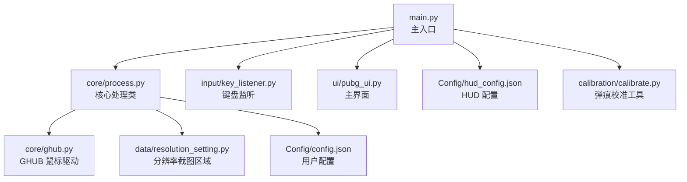
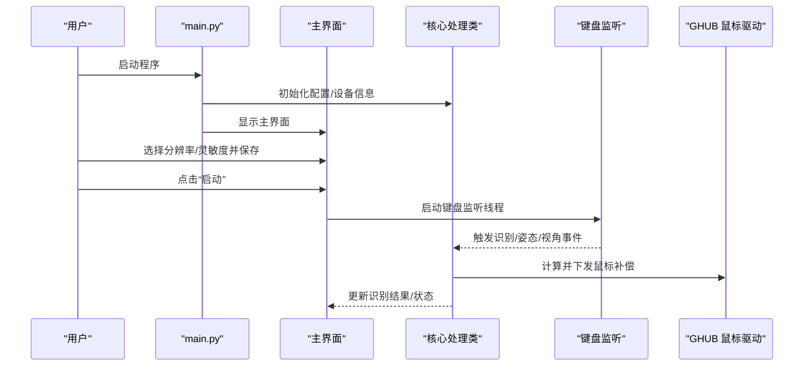
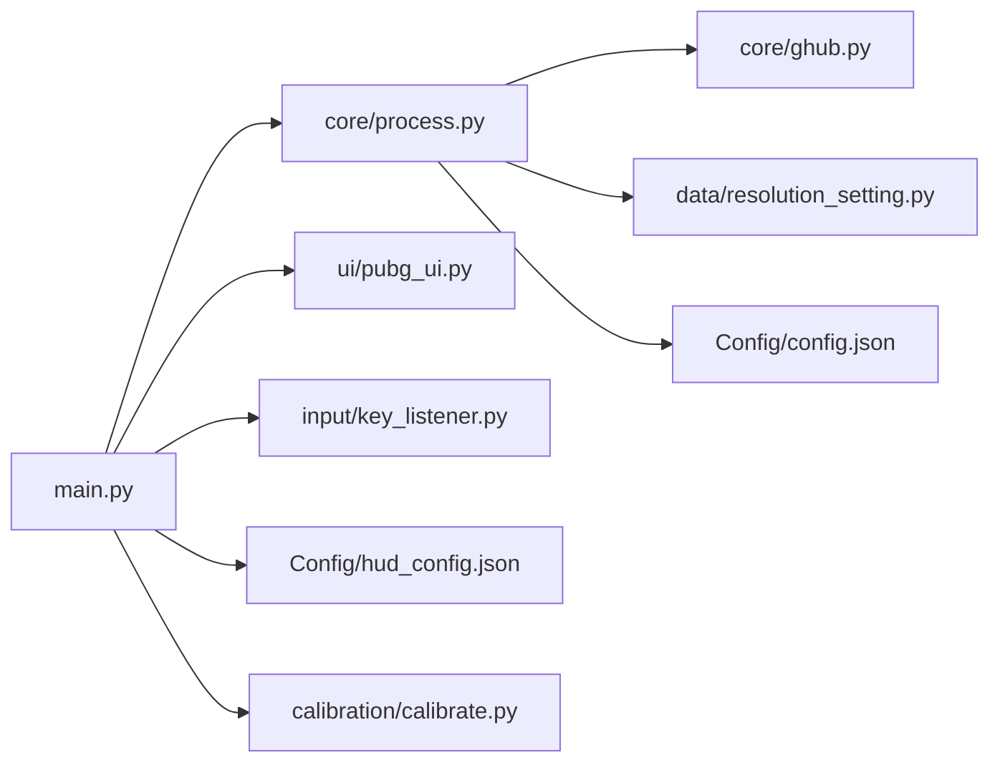

# 快速开始

<cite>
**本文引用的文件**
- [README.md](file://README.md)
- [requirements.txt](file://requirements.txt)
- [main.py](file://main.py)
- [core/process.py](file://core/process.py)
- [input/key_listener.py](file://input/key_listener.py)
- [ui/pubg_ui.py](file://ui/pubg_ui.py)
- [core/ghub.py](file://core/ghub.py)
- [data/resolution_setting.py](file://data/resolution_setting.py)
- [Config/config.json](file://Config/config.json)
- [Config/hud_config.json](file://Config/hud_config.json)
- [calibration/calibrate.py](file://calibration/calibrate.py)
</cite>

## 目录
1. [简介](#简介)
2. [项目结构](#项目结构)
3. [核心组件](#核心组件)
4. [架构总览](#架构总览)
5. [详细组件分析](#详细组件分析)
6. [依赖关系分析](#依赖关系分析)
7. [性能注意事项](#性能注意事项)
8. [故障排查指南](#故障排查指南)
9. [结论](#结论)
10. [附录](#附录)

## 简介
本指南面向新手用户，帮助你在最短时间内完成环境准备、依赖安装、首次运行与基础配置，从而顺利启动并使用该 PUBG 自动识别压枪工具。你将学会：
- 环境要求与系统兼容性
- 依赖安装与常见问题解决
- 首次运行步骤与基本操作
- 关键配置项（分辨率、灵敏度、HUD）说明
- 常见问题快速排查

## 项目结构
该项目采用“功能模块化 + 配置分离”的组织方式，核心模块包括：
- 核心逻辑：图像识别、压枪计算、输入监听、GHUB 鼠标驱动封装
- 数据层：弹道与按键映射、分辨率截图区域配置
- 界面层：PyQt5 主界面与游戏内 HUD
- 校准工具：GUI/CLI/HUD 三种模式的弹痕校准

图表来源
- [main.py:1-294](file://main.py#L1-L294)
- [core/process.py:1-200](file://core/process.py#L1-L200)
- [input/key_listener.py:1-70](file://input/key_listener.py#L1-L70)
- [ui/pubg_ui.py:1-200](file://ui/pubg_ui.py#L1-L200)
- [core/ghub.py:1-55](file://core/ghub.py#L1-L55)
- [data/resolution_setting.py:1-147](file://data/resolution_setting.py#L1-L147)
- [Config/config.json:1-1](file://Config/config.json#L1-L1)
- [Config/hud_config.json:1-91](file://Config/hud_config.json#L1-L91)
- [calibration/calibrate.py:1-200](file://calibration/calibrate.py#L1-L200)

章节来源
- [README.md:22-67](file://README.md#L22-L67)

## 核心组件
- 主入口与界面
  - 主入口负责初始化核心处理类、构建 PyQt5 界面、绑定按钮事件与热键响应。
  - 主界面提供分辨率选择、灵敏度配置、开镜模式、姿态与视角切换、启动/暂停/停止控制等。
- 核心处理类
  - 负责读取/保存配置、调用识别线程、计算压枪补偿、与 GHUB 鼠标驱动交互。
- 键盘监听
  - 监听 Tab、1/2、Z/C/空格、V、Insert、Home、Shift 等键，触发识别、姿态切换、视角切换、重置与窗口切换。
- GHUB 鼠标驱动
  - 封装 Logitech GHUB 驱动，提供鼠标移动、按键等底层控制。
- 分辨率配置
  - 提供多分辨率下的截图区域坐标，确保识别准确性。
- HUD 配置
  - 控制游戏内 HUD 的位置、字体、颜色、尺寸、刷新频率与热键。

章节来源
- [main.py:11-294](file://main.py#L11-L294)
- [core/process.py:13-200](file://core/process.py#L13-L200)
- [input/key_listener.py:6-70](file://input/key_listener.py#L6-L70)
- [core/ghub.py:5-55](file://core/ghub.py#L5-L55)
- [data/resolution_setting.py:1-147](file://data/resolution_setting.py#L1-L147)
- [Config/hud_config.json:1-91](file://Config/hud_config.json#L1-L91)

## 架构总览
下面的序列图展示了从启动到首次识别的关键交互流程。

图表来源
- [main.py:223-286](file://main.py#L223-L286)
- [input/key_listener.py:14-56](file://input/key_listener.py#L14-L56)
- [core/process.py:138-197](file://core/process.py#L138-L197)
- [core/ghub.py:32-51](file://core/ghub.py#L32-L51)

## 详细组件分析

### 环境要求与系统兼容性
- Python 版本：≥ 3.8
- 操作系统：Windows 10/11（依赖 Win32 API 与 Logitech GHUB 驱动）
- 硬件要求：具备可运行 Python 与 OpenCV 的通用 PC 即可；若使用 GHUB 设备，需安装 LGS/Logitech GHUB 驱动

章节来源
- [README.md:16-20](file://README.md#L16-L20)

### 依赖安装步骤
- 安装依赖
  - 使用 pip 安装 requirements.txt 中的全部依赖
- 常见问题与解决方案
  - 依赖冲突：优先使用虚拟环境隔离依赖；若出现编译错误，尝试升级 pip、setuptools、wheel 后重试
  - OpenCV/NumPy 版本：确保与当前 Python 版本兼容；必要时先安装对应 wheel 再执行 pip 安装
  - PyQt5：若界面显示异常，确认 PyQt5 与 PyQt5_sip 版本匹配
  - GHUB 驱动：若提示“未安装 GHUB/LGS 驱动”，请安装 Logitech GHUB/LGS 并重启程序

章节来源
- [README.md:18-20](file://README.md#L18-L20)
- [requirements.txt:1-25](file://requirements.txt#L1-L25)

### 首次运行步骤
- 安装依赖后，启动主程序
- 在主界面选择你的屏幕分辨率，点击“保存”
- 选择开镜模式（长按/点击），点击“启动”
- 游戏中按 Tab 打开背包进行截图识别
- 按 1/2 切换枪械，右键开镜后自动压枪
- 游戏内 HUD 会自动显示，按 Tab 切换显示模式

章节来源
- [README.md:69-84](file://README.md#L69-L84)
- [main.py:188-204](file://main.py#L188-L204)

### 基本配置说明
- 分辨率配置
  - 在主界面选择分辨率并保存；若识别不准确，可在分辨率配置文件中调整截图区域坐标
- 灵敏度配置
  - 在主界面选择倍镜类型，输入灵敏度数值并保存；修改后需在 GUI 中点击“保存”生效
  - 若压过头/压不住，按需上调/下调对应倍镜的灵敏度系数
- HUD 配置
  - 可通过 HUD 配置文件调整位置、字体、颜色、尺寸、透明度与刷新频率；支持热键切换 HUD 模式

章节来源
- [README.md:85-114](file://README.md#L85-L114)
- [Config/config.json:1-1](file://Config/config.json#L1-L1)
- [Config/hud_config.json:1-91](file://Config/hud_config.json#L1-L91)
- [data/resolution_setting.py:1-147](file://data/resolution_setting.py#L1-L147)

### 键盘与热键说明
- Tab：打开背包进行识别
- 1/2：切换枪械
- Z/C/空格：切换姿态（站立/蹲下/趴下）
- V：切换第一/第三人称视角
- Insert：重置内部状态
- Home：切换主界面显示
- Shift：按住时对当前倍镜的灵敏度进行临时叠加（具体逻辑由核心处理类实现）

章节来源
- [input/key_listener.py:14-56](file://input/key_listener.py#L14-L56)
- [core/process.py:97-124](file://core/process.py#L97-L124)

### 弹痕校准工具
- 三种使用方式
  - GUI：可视化界面，支持交互标注修正
  - CLI：命令行模式，快捷键 F5/F6/F7
  - HUD：游戏内悬浮窗，边打边校准
- 校准流程
  - 对准白墙，开镜；截取空白墙面（基线图）；射击若干发；截取弹痕墙面（结果图）；工具自动检测弹痕并与理论数据对比；可交互修正标注，输出修正后的压枪参数

章节来源
- [README.md:116-134](file://README.md#L116-L134)
- [calibration/calibrate.py:1-200](file://calibration/calibrate.py#L1-L200)

## 依赖关系分析
- 模块耦合
  - 主入口与核心处理类强耦合，负责配置读取、识别调度与状态更新
  - 键盘监听与核心处理类松耦合，通过信号/槽传递事件
  - GHUB 驱动封装为底层依赖，核心处理类通过其下发鼠标补偿
- 外部依赖
  - Windows 系统 API 与 GHUB 驱动
  - OpenCV、NumPy、PyQt5、pynput、mss 等第三方库

图表来源
- [main.py:1-294](file://main.py#L1-L294)
- [core/process.py:1-200](file://core/process.py#L1-L200)
- [input/key_listener.py:1-70](file://input/key_listener.py#L1-L70)
- [core/ghub.py:1-55](file://core/ghub.py#L1-L55)
- [data/resolution_setting.py:1-147](file://data/resolution_setting.py#L1-L147)
- [Config/config.json:1-1](file://Config/config.json#L1-L1)
- [Config/hud_config.json:1-91](file://Config/hud_config.json#L1-L91)
- [calibration/calibrate.py:1-200](file://calibration/calibrate.py#L1-L200)

## 性能注意事项
- 识别性能与分辨率相关，建议使用与游戏内一致的分辨率以减少误识
- 灵敏度系数直接影响压枪强度，建议从默认值开始微调
- HUD 刷新频率可适当降低以减轻渲染压力
- 若使用 GHUB 设备，确保驱动稳定，避免额外延迟

## 故障排查指南
- 无法启动/界面异常
  - 检查 PyQt5 与 PyQt5_sip 版本是否匹配
  - 确认已安装并启用 GHUB/LGS 驱动
- 识别不准确
  - 在分辨率配置文件中调整截图区域坐标
  - 确保游戏内 HUD 与截图区域对齐
- 灵敏度不合适
  - 在主界面调整对应倍镜的灵敏度系数并保存
  - 若压过头/压不住，按需上调/下调
- GHUB 驱动相关错误
  - 确认 DLL 文件存在且路径正确
  - 重新安装 GHUB/LGS 驱动并重启程序
- 弹痕校准不准确
  - 使用校准工具的 GUI/CLI/HUD 三种模式进行对比
  - 确保基线图与结果图清晰、无抖动

章节来源
- [core/ghub.py:8-21](file://core/ghub.py#L8-L21)
- [data/resolution_setting.py:1-147](file://data/resolution_setting.py#L1-L147)
- [README.md:116-134](file://README.md#L116-L134)

## 结论
按照本指南完成环境准备与依赖安装后，你可以在主界面完成分辨率与灵敏度的基础配置，并通过 Tab 识别与 1/2 切枪、右键开镜体验自动压枪。若识别或灵敏度仍有偏差，可借助分辨率配置与校准工具进行微调。遇到问题时，优先检查 GHUB 驱动与 PyQt5 版本，必要时参考故障排查章节逐项定位。

## 附录
- 快速命令
  - 安装依赖：pip install -r requirements.txt
  - 启动主程序：python main.py
- 常用热键
  - Tab：识别
  - 1/2：切换枪械
  - Z/C/空格：切换姿态
  - V：切换视角
  - Insert：重置
  - Home：切换主界面
  - Shift：按住临时叠加灵敏度（当前倍镜）