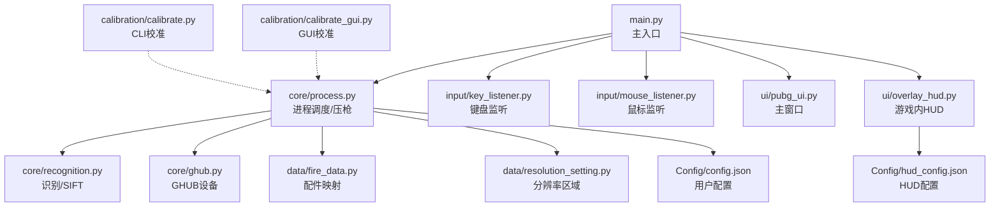
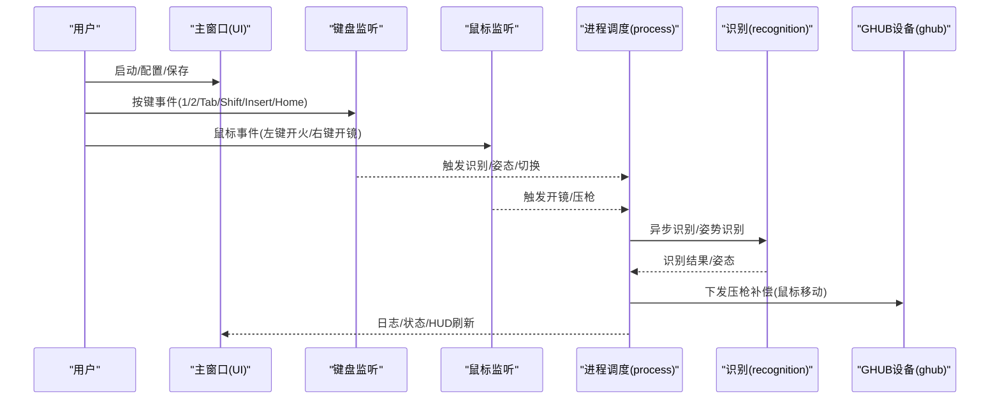
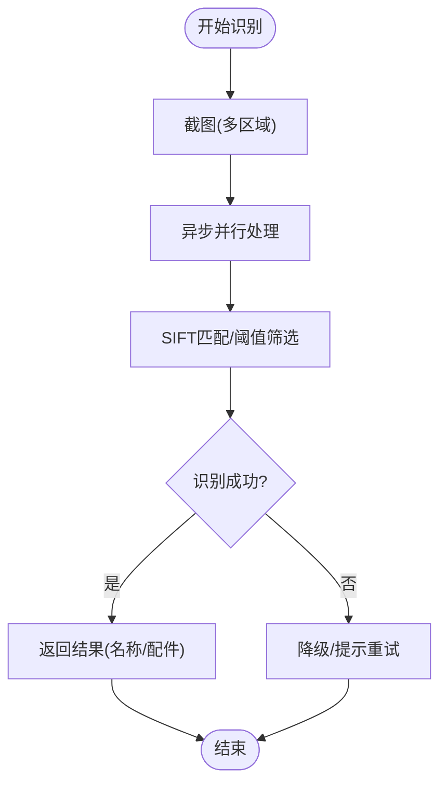
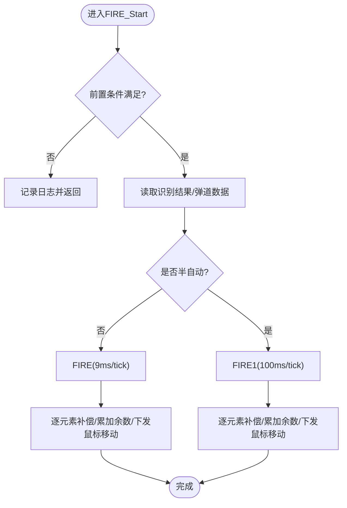
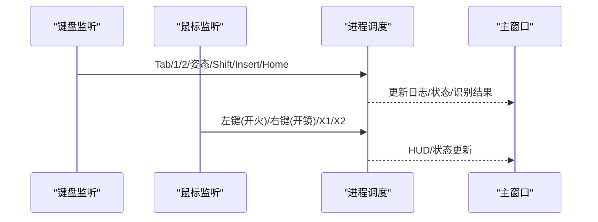
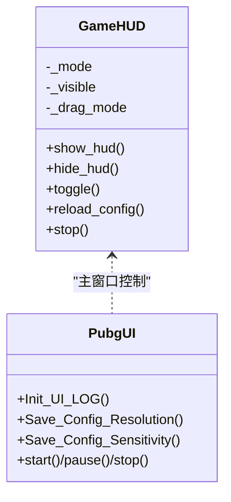
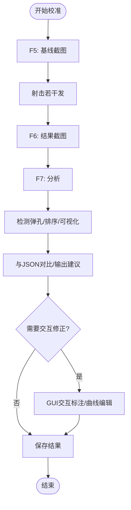
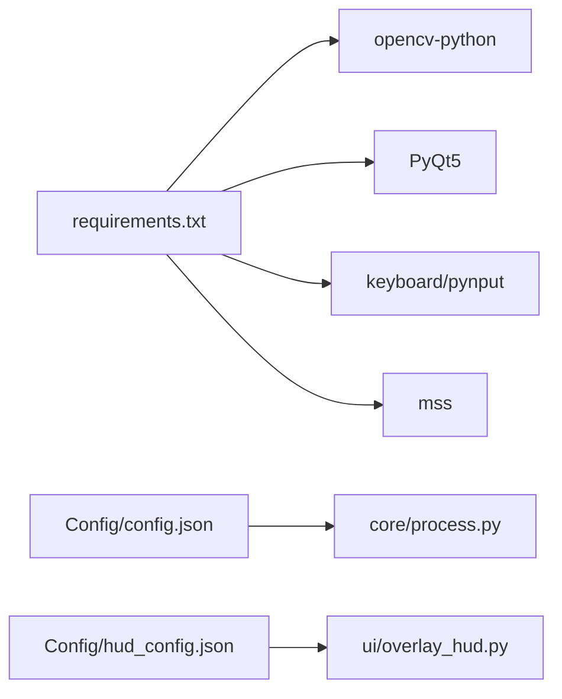

# 故障排除和常见问题

<cite>
**本文引用的文件**
- [README.md](file://README.md)
- [main.py](file://main.py)
- [core/process.py](file://core/process.py)
- [core/recognition.py](file://core/recognition.py)
- [core/ghub.py](file://core/ghub.py)
- [input/key_listener.py](file://input/key_listener.py)
- [input/mouse_listener.py](file://input/mouse_listener.py)
- [ui/pubg_ui.py](file://ui/pubg_ui.py)
- [ui/overlay_hud.py](file://ui/overlay_hud.py)
- [calibration/calibrate.py](file://calibration/calibrate.py)
- [calibration/calibrate_gui.py](file://calibration/calibrate_gui.py)
- [data/fire_data.py](file://data/fire_data.py)
- [data/resolution_setting.py](file://data/resolution_setting.py)
- [Config/config.json](file://Config/config.json)
- [Config/hud_config.json](file://Config/hud_config.json)
- [requirements.txt](file://requirements.txt)
</cite>

## 目录
1. [简介](#简介)
2. [项目结构](#项目结构)
3. [核心组件](#核心组件)
4. [架构总览](#架构总览)
5. [详细组件分析](#详细组件分析)
6. [依赖关系分析](#依赖关系分析)
7. [性能考虑](#性能考虑)
8. [故障排除指南](#故障排除指南)
9. [结论](#结论)
10. [附录](#附录)

## 简介
本文件面向使用 PUBG 自动识别压枪工具的用户与技术支持人员，提供系统化的故障排除与常见问题解答。内容覆盖安装、配置、运行、日志分析、性能监控、错误定位、模块专项排查（识别失败、压枪不准、界面显示异常）、性能优化建议、资源占用调优以及用户反馈与问题报告的标准格式。

## 项目结构
项目采用模块化设计，主要模块包括：
- 核心逻辑：进程调度、识别、压枪计算、GHUB 设备封装
- 输入监听：键盘与鼠标事件监听
- UI：主窗口与游戏内 HUD
- 校准工具：CLI/GUI/HUD 三种模式的弹痕校准
- 数据与配置：分辨率、弹道、配件映射、用户配置

图表来源
- [main.py:1-294](file://main.py#L1-L294)
- [core/process.py:1-405](file://core/process.py#L1-L405)
- [core/recognition.py:1-478](file://core/recognition.py#L1-L478)
- [core/ghub.py:1-55](file://core/ghub.py#L1-L55)
- [input/key_listener.py:1-70](file://input/key_listener.py#L1-L70)
- [input/mouse_listener.py:1-64](file://input/mouse_listener.py#L1-L64)
- [ui/pubg_ui.py:1-718](file://ui/pubg_ui.py#L1-L718)
- [ui/overlay_hud.py:1-698](file://ui/overlay_hud.py#L1-L698)
- [calibration/calibrate.py:1-550](file://calibration/calibrate.py#L1-L550)
- [calibration/calibrate_gui.py:1-800](file://calibration/calibrate_gui.py#L1-L800)
- [data/fire_data.py:1-83](file://data/fire_data.py#L1-L83)
- [data/resolution_setting.py:1-147](file://data/resolution_setting.py#L1-L147)
- [Config/config.json:1-1](file://Config/config.json#L1-L1)
- [Config/hud_config.json:1-91](file://Config/hud_config.json#L1-L91)

章节来源
- [README.md:22-67](file://README.md#L22-L67)
- [requirements.txt:1-25](file://requirements.txt#L1-L25)

## 核心组件
- 进程调度与压枪：负责识别结果读取、姿态/倍镜/配件合成、压枪循环与补偿下发
- 识别模块：基于 SIFT 的图像识别与姿势识别，支持分辨率区域配置与稳定性检测
- 输入监听：键盘/鼠标事件捕获，触发识别、开镜、切换枪械、压枪启动
- UI：主窗口显示识别结果与日志，HUD 三档显示模式与可配置
- 校准工具：CLI/GUI/HUD 三种模式，支持弹痕检测、可视化、对比与参数修正
- 配置与数据：分辨率区域、弹道与配件映射、用户灵敏度配置、HUD 样式配置

章节来源
- [core/process.py:13-405](file://core/process.py#L13-L405)
- [core/recognition.py:10-478](file://core/recognition.py#L10-L478)
- [input/key_listener.py:6-70](file://input/key_listener.py#L6-L70)
- [input/mouse_listener.py:13-64](file://input/mouse_listener.py#L13-L64)
- [ui/pubg_ui.py:4-718](file://ui/pubg_ui.py#L4-L718)
- [ui/overlay_hud.py:229-698](file://ui/overlay_hud.py#L229-L698)
- [calibration/calibrate.py:78-550](file://calibration/calibrate.py#L78-L550)
- [calibration/calibrate_gui.py:56-800](file://calibration/calibrate_gui.py#L56-L800)
- [data/fire_data.py:54-83](file://data/fire_data.py#L54-L83)
- [data/resolution_setting.py:1-147](file://data/resolution_setting.py#L1-L147)
- [Config/config.json:1-1](file://Config/config.json#L1-L1)
- [Config/hud_config.json:1-91](file://Config/hud_config.json#L1-L91)

## 架构总览
系统采用“主入口 -> UI/输入监听 -> 核心进程 -> 识别/压枪 -> GHUB 设备”的流水线式架构。识别与压枪通过异步协程与线程并行，保证实时性与稳定性。

图表来源
- [main.py:223-294](file://main.py#L223-L294)
- [input/key_listener.py:14-70](file://input/key_listener.py#L14-L70)
- [input/mouse_listener.py:23-64](file://input/mouse_listener.py#L23-L64)
- [core/process.py:138-405](file://core/process.py#L138-L405)
- [core/recognition.py:102-248](file://core/recognition.py#L102-L248)
- [core/ghub.py:22-55](file://core/ghub.py#L22-L55)

## 详细组件分析

### 识别与姿态识别模块
- 识别流程：截图 -> 异步并行识别各区域 -> SIFT 匹配 -> 返回名称与配件
- 姿态识别：支持模板匹配与稳定性检测，第三人称模式下自动等待渲染稳定
- 分辨率适配：通过区域配置文件调整 ROI 坐标，必要时可启用调试截图

图表来源
- [core/recognition.py:102-126](file://core/recognition.py#L102-L126)
- [core/recognition.py:364-423](file://core/recognition.py#L364-L423)
- [data/resolution_setting.py:1-147](file://data/resolution_setting.py#L1-L147)

章节来源
- [core/recognition.py:10-478](file://core/recognition.py#L10-L478)
- [data/resolution_setting.py:1-147](file://data/resolution_setting.py#L1-L147)

### 压枪与补偿模块
- 压枪入口：前置条件检查（开镜、槽位、识别结果）
- v1/v2 两种路径：v2 支持 per-shot 平滑展开与水平补偿，v1 逐 tick 下发
- 与 GHUB 设备通信：下发鼠标移动，按系统版本调整计算延迟

图表来源
- [core/process.py:207-405](file://core/process.py#L207-L405)
- [core/ghub.py:22-55](file://core/ghub.py#L22-L55)

章节来源
- [core/process.py:183-405](file://core/process.py#L183-L405)
- [core/ghub.py:1-55](file://core/ghub.py#L1-L55)

### 输入监听与事件路由
- 键盘监听：Tab 打开背包触发识别；1/2 切枪；姿态切换；Shift 倍镜系数叠加；Insert 重置；Home 切换窗口
- 鼠标监听：左键开火触发压枪；右键长按/单击控制开镜；X1/X2 释放强制关闭开镜

图表来源
- [input/key_listener.py:14-70](file://input/key_listener.py#L14-L70)
- [input/mouse_listener.py:23-64](file://input/mouse_listener.py#L23-L64)
- [main.py:270-286](file://main.py#L270-L286)

章节来源
- [input/key_listener.py:1-70](file://input/key_listener.py#L1-L70)
- [input/mouse_listener.py:1-64](file://input/mouse_listener.py#L1-L64)
- [main.py:223-286](file://main.py#L223-L286)

### UI 与 HUD
- 主窗口：显示识别结果、日志、分辨率/灵敏度配置、启动/暂停/停止
- HUD：三档模式（极简/紧凑/完整），可配置位置、字体、颜色、刷新频率，支持拖动与热键切换

图表来源
- [ui/overlay_hud.py:229-698](file://ui/overlay_hud.py#L229-L698)
- [ui/pubg_ui.py:11-718](file://ui/pubg_ui.py#L11-L718)

章节来源
- [ui/overlay_hud.py:1-698](file://ui/overlay_hud.py#L1-L698)
- [ui/pubg_ui.py:1-718](file://ui/pubg_ui.py#L1-L718)

### 校准工具
- CLI 模式：F5/F6/F7 快捷键流程，自动检测弹痕、排序、可视化、与 JSON 对比，输出建议系数
- GUI 模式：交互式标注画布、曲线编辑器、异常检测、迭代修正、多组比对

图表来源
- [calibration/calibrate.py:366-453](file://calibration/calibrate.py#L366-L453)
- [calibration/calibrate_gui.py:56-800](file://calibration/calibrate_gui.py#L56-L800)

章节来源
- [calibration/calibrate.py:1-550](file://calibration/calibrate.py#L1-L550)
- [calibration/calibrate_gui.py:1-800](file://calibration/calibrate_gui.py#L1-L800)

## 依赖关系分析
- Python 版本与依赖：Python ≥ 3.8，依赖 OpenCV、PyQt5、pynput、mss 等
- Windows 专属：依赖 Win32 API 与 Logitech GHUB 驱动
- 配置文件：config.json（分辨率、灵敏度）、hud_config.json（HUD 样式）

图表来源
- [requirements.txt:1-25](file://requirements.txt#L1-L25)
- [Config/config.json:1-1](file://Config/config.json#L1-L1)
- [Config/hud_config.json:1-91](file://Config/hud_config.json#L1-L91)
- [core/process.py:53-71](file://core/process.py#L53-L71)
- [ui/overlay_hud.py:61-126](file://ui/overlay_hud.py#L61-L126)

章节来源
- [requirements.txt:1-25](file://requirements.txt#L1-L25)
- [Config/config.json:1-1](file://Config/config.json#L1-L1)
- [Config/hud_config.json:1-91](file://Config/hud_config.json#L1-L91)

## 性能考虑
- 识别性能：ROI 区域越精准，SIFT 匹配越快；可启用调试截图定位问题
- 压枪延迟：按系统版本动态调整计算延迟，避免帧率抖动
- HUD 刷新：合理设置刷新周期，降低 UI 渲染开销
- 资源占用：避免同时运行多个高负载进程，确保后台驱动与权限充足

## 故障排除指南

### 通用安装与环境问题
- 症状：无法启动或报错缺少依赖
  - 排查要点：确认 Python 版本 ≥ 3.8，Windows 10/11，已安装依赖
  - 解决方案：重新安装依赖，使用管理员权限运行
- 症状：未检测到 GHUB/LGS 驱动
  - 排查要点：检查驱动是否安装、未被更新阻止
  - 解决方案：安装 GHUB 或 LGS 驱动，禁用驱动自动更新

章节来源
- [README.md:16-21](file://README.md#L16-L21)
- [requirements.txt:1-25](file://requirements.txt#L1-L25)
- [core/ghub.py:8-21](file://core/ghub.py#L8-L21)

### 识别失败与识别不准
- 症状：Tab 识别无结果或结果为空
  - 排查要点：确认 Tab 时背包可见，截图区域正确；检查分辨率配置
  - 解决方案：调整分辨率区域配置，启用调试截图查看 ROI；确保倍镜/配件识别区域无遮挡
- 症状：识别结果不稳定或频繁变化
  - 排查要点：检查姿势区域稳定性检测与模板匹配
  - 解决方案：使用模板匹配；第三人称模式下等待渲染稳定；必要时手动创建模板

章节来源
- [core/recognition.py:102-126](file://core/recognition.py#L102-L126)
- [core/recognition.py:211-248](file://core/recognition.py#L211-L248)
- [core/recognition.py:364-423](file://core/recognition.py#L364-L423)
- [data/resolution_setting.py:135-147](file://data/resolution_setting.py#L135-L147)

### 压枪不准与补偿异常
- 症状：压过头/压不住
  - 排查要点：检查灵敏度配置、Shift 键叠加、姿态系数、倍镜系数
  - 解决方案：在 GUI 中调整灵敏度；使用校准工具修正倍镜系数；确认姿态系数与配件组合
- 症状：压枪抖动或不连贯
  - 排查要点：确认使用 v2 路径（per-shot 平滑展开）
  - 解决方案：确保使用 v2 数据与路径；检查 tick_ms 与 ticks_per_shot

章节来源
- [core/process.py:183-405](file://core/process.py#L183-L405)
- [core/process.py:97-124](file://core/process.py#L97-L124)
- [data/fire_data.py:54-83](file://data/fire_data.py#L54-L83)

### 开镜/开火状态异常
- 症状：右键无法开镜/误判开镜
  - 排查要点：确认开镜像素检测区域；检查长按/单击模式
  - 解决方案：调整 Click 区域配置；切换开镜模式
- 症状：左键开火无响应
  - 排查要点：确认鼠标监听线程运行；检查 StartFire 状态
  - 解决方案：重启监听线程；检查 GUI 按钮状态

章节来源
- [core/recognition.py:467-477](file://core/recognition.py#L467-L477)
- [input/mouse_listener.py:23-64](file://input/mouse_listener.py#L23-L64)
- [input/key_listener.py:14-70](file://input/key_listener.py#L14-L70)

### 界面显示异常（HUD/主窗口）
- 症状：HUD 不显示或闪烁
  - 排查要点：检查透明穿透设置、刷新周期、拖动模式
  - 解决方案：切换拖动模式；调整刷新周期；检查配置文件
- 症状：主窗口日志不更新
  - 排查要点：确认信号发射与 UI 更新逻辑
  - 解决方案：检查事件路由与日志输出函数

章节来源
- [ui/overlay_hud.py:229-698](file://ui/overlay_hud.py#L229-L698)
- [ui/pubg_ui.py:180-213](file://ui/pubg_ui.py#L180-L213)
- [main.py:270-286](file://main.py#L270-L286)

### 校准工具问题
- 症状：CLI 模式快捷键无效
  - 排查要点：确认键盘库可用；或使用手动输入
  - 解决方案：安装 keyboard 库；或按提示手动输入
- 症状：GUI 标注不准确
  - 排查要点：ROI 区域、模板匹配、阈值设置
  - 解决方案：框选 ROI；使用模板；调整检测参数

章节来源
- [calibration/calibrate.py:32-70](file://calibration/calibrate.py#L32-L70)
- [calibration/calibrate_gui.py:56-800](file://calibration/calibrate_gui.py#L56-L800)

### 日志分析与错误定位
- 日志来源：主窗口日志输出、识别/压枪事件信号、键盘/鼠标事件
- 建议流程：开启日志 -> 复现问题 -> 截图/导出中间结果 -> 分析差异 -> 修正配置/参数

章节来源
- [main.py:180-213](file://main.py#L180-L213)
- [core/process.py:221-228](file://core/process.py#L221-L228)
- [input/key_listener.py:14-70](file://input/key_listener.py#L14-L70)
- [input/mouse_listener.py:23-64](file://input/mouse_listener.py#L23-L64)

### 性能优化与资源占用调优
- 识别优化：缩小 ROI、减少并发任务、启用调试截图定位问题
- 压枪优化：使用 v2 路径、合理设置 tick_ms、减少冗余计算
- HUD 优化：降低刷新频率、关闭拖动模式、简化样式
- 系统优化：以管理员运行、关闭后台冲突进程、确保驱动稳定

章节来源
- [core/recognition.py:102-126](file://core/recognition.py#L102-L126)
- [core/process.py:307-362](file://core/process.py#L307-L362)
- [ui/overlay_hud.py:262-266](file://ui/overlay_hud.py#L262-L266)

### 用户反馈与问题报告标准格式
- 环境信息：操作系统版本、Python 版本、分辨率、驱动版本
- 复现步骤：具体按键/鼠标操作、截图/日志片段
- 期望行为 vs 实际行为：清晰描述
- 附加材料：截图、日志文件、校准结果（如有）

## 结论
通过系统化的故障排除流程、日志分析与模块专项排查，大多数问题可在短时间内定位并解决。建议用户优先使用校准工具修正灵敏度与姿态系数，确保识别与压枪的准确性；同时根据性能需求调整 HUD 与识别参数，提升系统稳定性与流畅度。

## 附录

### 常见问题快速索引
- 识别失败：检查 ROI、模板匹配、分辨率配置
- 压枪不准：校准灵敏度、Shift 叠加、姿态系数
- 开镜异常：像素检测区域、长按/单击模式
- HUD 异常：透明穿透、刷新周期、拖动模式
- 校准问题：快捷键、ROI、阈值、模板

### 技术支持处理流程（标准化）
- 收集环境与复现信息
- 复现并采集日志/截图
- 定位模块与配置问题
- 提供修复建议与验证
- 记录问题与解决方案