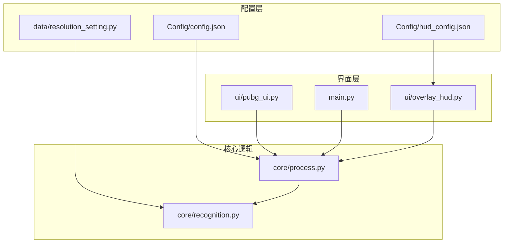
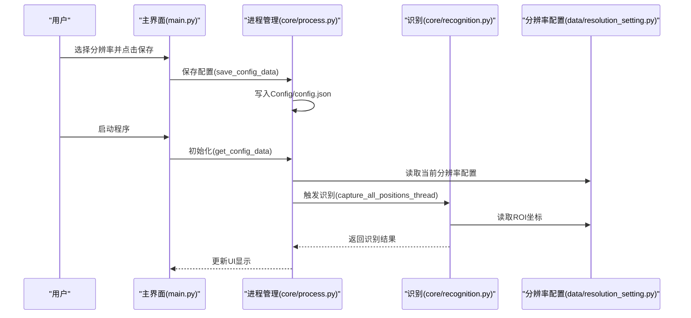
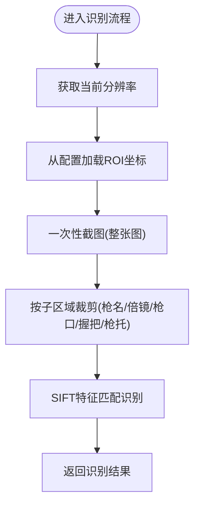
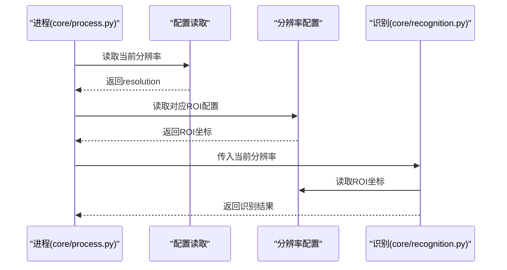
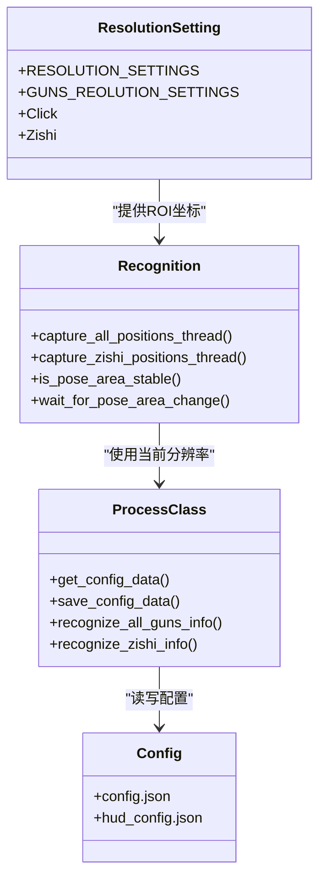
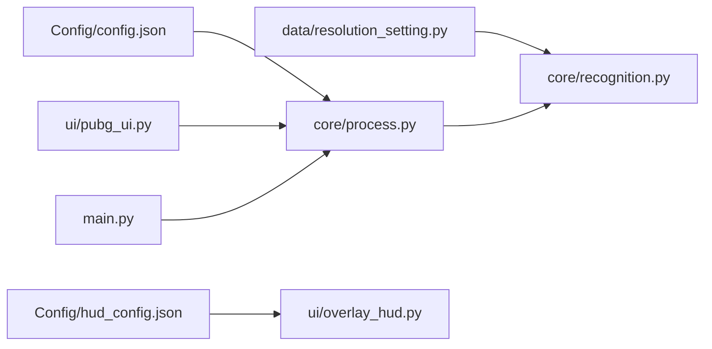

# 分辨率配置管理

<cite>
**本文引用的文件**
- [data/resolution_setting.py](file://data/resolution_setting.py)
- [core/recognition.py](file://core/recognition.py)
- [core/process.py](file://core/process.py)
- [Config/config.json](file://Config/config.json)
- [Config/hud_config.json](file://Config/hud_config.json)
- [main.py](file://main.py)
- [ui/pubg_ui.py](file://ui/pubg_ui.py)
- [ui/overlay_hud.py](file://ui/overlay_hud.py)
- [README.md](file://README.md)
</cite>

## 目录
1. [简介](#简介)
2. [项目结构](#项目结构)
3. [核心组件](#核心组件)
4. [架构总览](#架构总览)
5. [详细组件分析](#详细组件分析)
6. [依赖关系分析](#依赖关系分析)
7. [性能考量](#性能考量)
8. [故障排除指南](#故障排除指南)
9. [结论](#结论)
10. [附录](#附录)

## 简介
本文件系统性阐述分辨率配置管理系统的实现机制，涵盖多分辨率支持、截图区域定义、坐标转换与适配、动态调整策略、性能优化、扩展方法、检测与自动适配、配置持久化与热更新、调试工具与故障排除，以及与图像识别系统的协同工作机制。目标是帮助开发者快速理解并高效维护该系统。

## 项目结构
围绕分辨率配置管理的关键文件与职责如下：
- data/resolution_setting.py：定义各分辨率下的截图区域、右键开镜坐标、姿势区域等配置常量
- core/recognition.py：基于分辨率配置执行截图、图像识别、姿势识别与稳定性检测
- core/process.py：统一读取/保存配置、维护运行时状态、协调识别流程
- Config/config.json：用户配置（分辨率、灵敏度）
- Config/hud_config.json：HUD显示配置（位置、尺寸、颜色、刷新频率等）
- main.py：主界面与按钮事件绑定，触发配置保存
- ui/pubg_ui.py：主界面布局，包含分辨率选择控件
- ui/overlay_hud.py：HUD渲染与配置加载/保存
- README.md：项目说明与分辨率适配指引

**图表来源**
- [core/process.py:53-71](file://core/process.py#L53-L71)
- [core/recognition.py:6](file://core/recognition.py#L6)
- [data/resolution_setting.py:1-147](file://data/resolution_setting.py#L1-L147)
- [Config/config.json:1-1](file://Config/config.json#L1-L1)
- [Config/hud_config.json:1-91](file://Config/hud_config.json#L1-L91)
- [ui/pubg_ui.py:530-603](file://ui/pubg_ui.py#L530-L603)
- [ui/overlay_hud.py:61-126](file://ui/overlay_hud.py#L61-L126)

**章节来源**
- [README.md:22-67](file://README.md#L22-L67)

## 核心组件
- 分辨率配置常量：集中定义各分辨率下的截图区域、右键开镜坐标、姿势区域等
- 配置读写：从JSON读取当前分辨率与灵敏度，保存修改后的配置
- 识别流程：根据当前分辨率从配置中取出ROI区域，执行SIFT识别与姿势识别
- HUD配置：独立的HUD配置文件，支持位置、尺寸、颜色、刷新频率等
- 主界面集成：UI提供分辨率选择与保存按钮，触发配置持久化

**章节来源**
- [data/resolution_setting.py:1-147](file://data/resolution_setting.py#L1-L147)
- [core/process.py:53-71](file://core/process.py#L53-L71)
- [core/recognition.py:102-126](file://core/recognition.py#L102-L126)
- [Config/hud_config.json:1-91](file://Config/hud_config.json#L1-L91)
- [ui/pubg_ui.py:530-603](file://ui/pubg_ui.py#L530-L603)

## 架构总览
系统采用“配置常量 + 运行时读取 + 动态识别”的架构：
- 配置常量层：data/resolution_setting.py提供各分辨率的ROI与坐标
- 配置读取层：core/process.py从Config/config.json读取当前分辨率与灵敏度
- 识别执行层：core/recognition.py依据当前分辨率从配置中取值，执行截图与识别
- 界面与HUD：ui/pubg_ui.py与ui/overlay_hud.py分别负责用户交互与HUD渲染

**图表来源**
- [main.py:188-204](file://main.py#L188-L204)
- [core/process.py:53-71](file://core/process.py#L53-L71)
- [core/recognition.py:102-126](file://core/recognition.py#L102-L126)
- [data/resolution_setting.py:1-147](file://data/resolution_setting.py#L1-L147)

## 详细组件分析

### 分辨率配置数据结构与坐标体系
- 截图区域定义：以四元组(x1, y1, x2, y2)表示矩形区域，其中(x1,y1)为左上角，(x2,y2)为右下角
- 枪械识别区域：按“枪名/倍镜/枪口/握把/枪托”分组，每组包含两个槽位的ROI
- 枪械整体区域：用于一次性截图，再在内存中裁剪为各子区域
- 右键开镜坐标：用于像素取色判断是否处于开镜状态
- 姿势区域：用于姿势识别的ROI区域

**图表来源**
- [core/recognition.py:102-126](file://core/recognition.py#L102-L126)
- [data/resolution_setting.py:111-146](file://data/resolution_setting.py#L111-L146)

**章节来源**
- [data/resolution_setting.py:2-110](file://data/resolution_setting.py#L2-L110)
- [core/recognition.py:102-126](file://core/recognition.py#L102-L126)

### 动态调整策略与坐标转换
- 动态选择：运行时根据Config/config.json中的resolution字段选择对应的配置
- 坐标一致性：所有ROI均以“左上角+宽高”的形式存储，便于跨分辨率统一处理
- 识别流程：一次性截图整张图，再在内存中裁剪，减少重复截图开销

**图表来源**
- [core/process.py:53-71](file://core/process.py#L53-L71)
- [core/recognition.py:105-106](file://core/recognition.py#L105-L106)
- [data/resolution_setting.py:111-146](file://data/resolution_setting.py#L111-L146)

**章节来源**
- [core/process.py:53-71](file://core/process.py#L53-L71)
- [core/recognition.py:102-126](file://core/recognition.py#L102-L126)

### 不同游戏分辨率下的适配方案
- 支持分辨率：3840x2160、3440x1440、2560x1600、2560x1440、2304x1440、2560x1080、1920x1080、1728x1080
- 适配策略：通过配置常量直接映射不同分辨率的ROI，无需额外坐标转换
- 新增分辨率：在data/resolution_setting.py中添加新的分辨率键值对，并补充相应ROI

**章节来源**
- [data/resolution_setting.py:2-110](file://data/resolution_setting.py#L2-L110)

### 性能优化措施
- 一次性截图：先对整张图进行截图，再在内存中裁剪，降低重复截图成本
- 异步并发：使用asyncio.gather并行处理多个子区域的识别
- 模板匹配：对姿势区域采用SIFT特征匹配，提高鲁棒性
- 稳定性检测：提供姿势区域稳定性检测与等待机制，避免误判

**章节来源**
- [core/recognition.py:102-126](file://core/recognition.py#L102-L126)
- [core/recognition.py:129-170](file://core/recognition.py#L129-L170)
- [core/recognition.py:364-423](file://core/recognition.py#L364-L423)

### 分辨率配置的扩展方法
- 新增分辨率支持步骤：
  1) 在data/resolution_setting.py中添加新的分辨率键值对，并定义各ROI区域
  2) 在Config/config.json中添加该分辨率选项
  3) 在ui/pubg_ui.py中更新分辨率选择控件的选项
  4) 验证流程：启动程序，选择新分辨率，点击保存，运行识别流程观察结果
- 验证流程：
  - 使用core/recognition.py中的调试截图功能，查看test/目录下的截图
  - 对比识别结果与预期，必要时微调ROI坐标

**章节来源**
- [data/resolution_setting.py:1-147](file://data/resolution_setting.py#L1-L147)
- [Config/config.json:1-1](file://Config/config.json#L1-L1)
- [ui/pubg_ui.py:530-603](file://ui/pubg_ui.py#L530-L603)
- [README.md:111-115](file://README.md#L111-L115)

### 分辨率检测与自动适配
- 当前实现：通过用户界面选择分辨率并保存到配置文件，程序运行时读取该配置
- 自动检测建议：可在启动时读取系统屏幕分辨率并与配置常量比对，若匹配则自动应用；若不匹配，提示用户选择或提供一键校准工具
- 与图像识别协同：识别流程严格依赖当前分辨率配置，确保ROI与实际屏幕匹配

**章节来源**
- [core/process.py:53-71](file://core/process.py#L53-L71)
- [core/recognition.py:102-126](file://core/recognition.py#L102-L126)

### 配置持久化与热更新机制
- 配置持久化：core/process.py提供get_config_data/save_config_data，读写Config/config.json
- HUD配置：ui/overlay_hud.py提供配置加载与保存，支持拖动后自动保存位置
- 热更新：当前实现为重启生效；建议在运行时监听配置文件变更，或提供“重载配置”按钮

**章节来源**
- [core/process.py:53-71](file://core/process.py#L53-L71)
- [ui/overlay_hud.py:88-126](file://ui/overlay_hud.py#L88-L126)

### 调试工具与故障排除
- 调试截图：在core/recognition.py中可启用调试截图，保存ROI图像至test/目录
- 姿势区域稳定性检测：提供wait_for_pose_area_change与is_pose_area_stable，辅助定位渲染问题
- 常见问题：
  - ROI不准确：检查data/resolution_setting.py中对应分辨率的ROI坐标
  - 识别不稳定：检查HUD刷新频率与屏幕DPI设置
  - 配置未生效：确认Config/config.json写入成功且程序重启

**章节来源**
- [core/recognition.py:129-170](file://core/recognition.py#L129-L170)
- [core/recognition.py:237-242](file://core/recognition.py#L237-L242)
- [README.md:111-115](file://README.md#L111-L115)

### 分辨率配置与图像识别系统的协同工作机制
- 识别入口：core/recognition.py根据当前分辨率从data/resolution_setting.py读取ROI
- 识别流程：一次性截图整张图，再在内存中裁剪为各子区域，使用SIFT进行特征匹配
- HUD渲染：ui/overlay_hud.py读取Config/hud_config.json，支持拖动与模式切换
- 配置联动：main.py与ui/pubg_ui.py负责用户交互，core/process.py负责配置读写与状态管理

**图表来源**
- [data/resolution_setting.py:1-147](file://data/resolution_setting.py#L1-L147)
- [core/recognition.py:102-126](file://core/recognition.py#L102-L126)
- [core/process.py:53-71](file://core/process.py#L53-L71)
- [Config/config.json:1-1](file://Config/config.json#L1-L1)
- [Config/hud_config.json:1-91](file://Config/hud_config.json#L1-L91)

## 依赖关系分析
- data/resolution_setting.py被core/recognition.py直接依赖，提供ROI坐标
- core/process.py依赖Config/config.json进行配置读写
- ui/pubg_ui.py与main.py共同驱动配置保存与界面交互
- ui/overlay_hud.py依赖Config/hud_config.json进行渲染与保存

**图表来源**
- [core/recognition.py:6](file://core/recognition.py#L6)
- [core/process.py:53-71](file://core/process.py#L53-L71)
- [ui/pubg_ui.py:530-603](file://ui/pubg_ui.py#L530-L603)
- [ui/overlay_hud.py:61-126](file://ui/overlay_hud.py#L61-L126)

**章节来源**
- [core/recognition.py:6](file://core/recognition.py#L6)
- [core/process.py:53-71](file://core/process.py#L53-L71)

## 性能考量
- 截图优化：一次性截图整张图，减少重复开销
- 并发处理：使用asyncio.gather并行处理多个子区域
- 模板匹配：SIFT特征匹配具备一定鲁棒性，适合不同分辨率场景
- HUD刷新：Config/hud_config.json的refresh_ms控制刷新频率，平衡性能与实时性

[本节为通用性能讨论，无需特定文件引用]

## 故障排除指南
- 识别不准确
  - 检查data/resolution_setting.py中ROI坐标是否正确
  - 使用调试截图功能查看test/目录下的截图
- 配置未生效
  - 确认Config/config.json写入成功
  - 重启程序以加载新配置
- HUD位置异常
  - 拖动HUD后自动保存位置，检查Config/hud_config.json
- 姿势识别不稳定
  - 使用is_pose_area_stable/wait_for_pose_area_change进行稳定性检测

**章节来源**
- [core/recognition.py:129-170](file://core/recognition.py#L129-L170)
- [core/recognition.py:237-242](file://core/recognition.py#L237-L242)
- [ui/overlay_hud.py:306-312](file://ui/overlay_hud.py#L306-L312)

## 结论
本系统通过集中化的分辨率配置常量与运行时配置读取，实现了对多分辨率的统一支持。识别流程采用一次性截图与内存裁剪的方式，结合异步并发与SIFT特征匹配，兼顾性能与准确性。通过完善的调试工具与配置持久化机制，开发者可以高效地扩展新分辨率并进行验证。未来可在自动检测与热更新方面进一步增强，以提升用户体验。

## 附录
- 快速开始与配置说明参见README.md
- 分辨率适配与调试建议参见README.md第111-115行

**章节来源**
- [README.md:69-115](file://README.md#L69-L115)