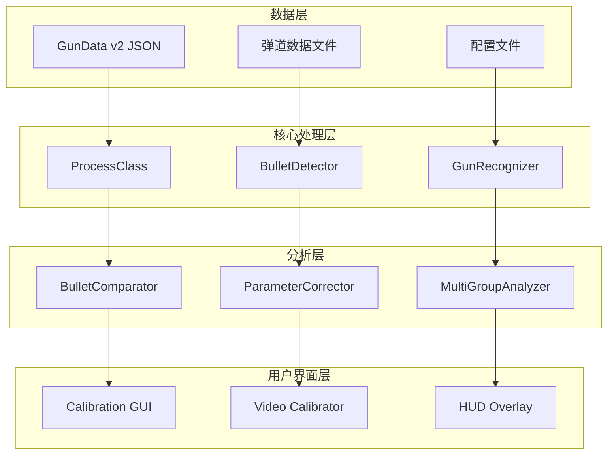
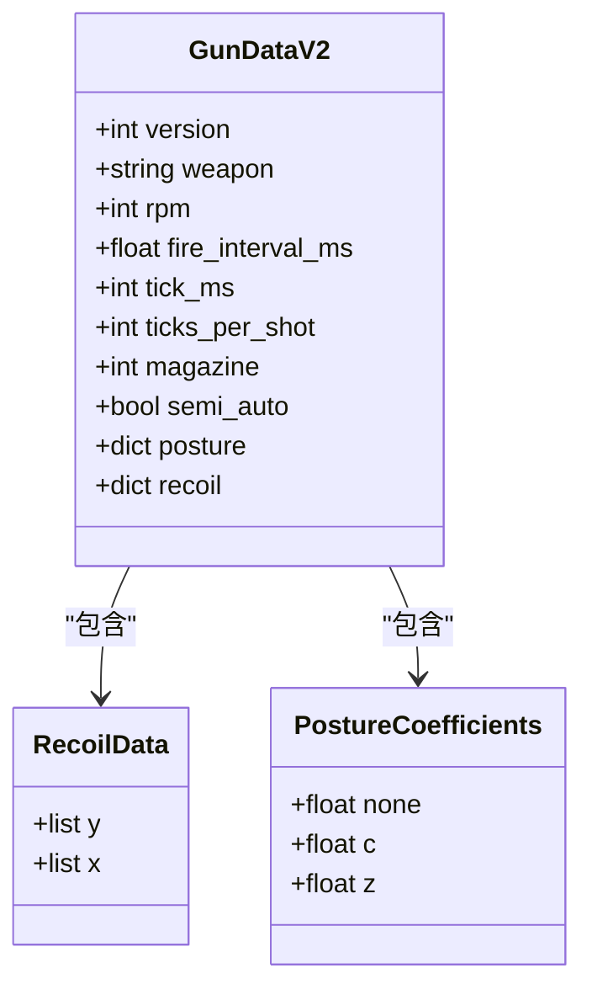
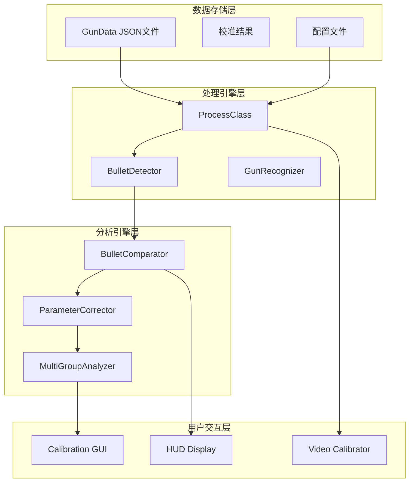
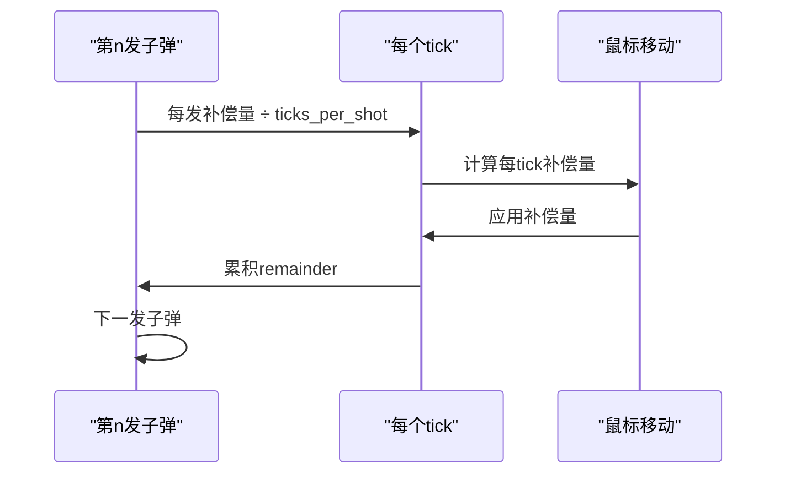
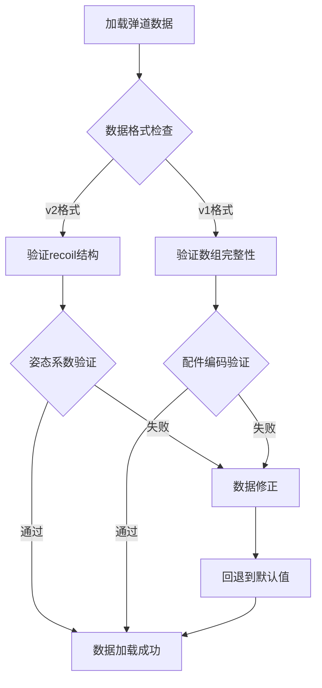
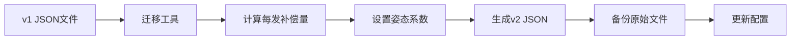
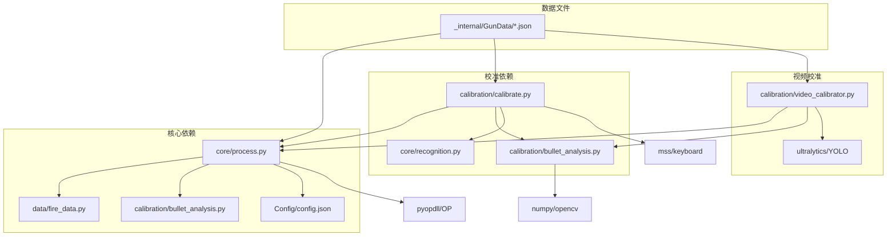
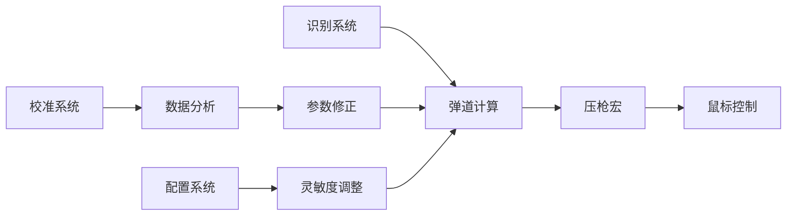

# 弹道数据模型

<cite>
**本文档引用的文件**
- [bullet_data.py](file://data/bullet_data.py)
- [fire_data.py](file://data/fire_data.py)
- [calibrate.py](file://calibration/calibrate.py)
- [bullet_analysis.py](file://calibration/bullet_analysis.py)
- [video_calibrator.py](file://calibration/video_calibrator.py)
- [process.py](file://core/process.py)
- [recognition.py](file://core/recognition.py)
- [resolution_setting.py](file://data/resolution_setting.py)
- [m762.json](file://_internal/GunData/m762.json)
- [ace32.json](file://_internal/GunData/ace32.json)
- [config.json](file://Config/config.json)
- [migrate_gundata.py](file://tools/migrate_gundata.py)
</cite>

## 目录
1. [简介](#简介)
2. [项目结构](#项目结构)
3. [核心组件](#核心组件)
4. [架构概览](#架构概览)
5. [详细组件分析](#详细组件分析)
6. [依赖关系分析](#依赖关系分析)
7. [性能考虑](#性能考虑)
8. [故障排除指南](#故障排除指南)
9. [结论](#结论)
10. [附录](#附录)

## 简介

弹道数据模型是PUBG自动识别系统的核心组成部分，负责管理枪械后坐力参数、弹道曲线和射击模式配置。该系统通过复杂的数学模型和算法实现了精确的弹道计算，为自动化压枪宏提供了可靠的数据基础。

本系统采用v2数据格式，支持每发子弹的浮点补偿量和平滑展开到多个tick，消除了传统v1格式中的锯齿效应。系统还集成了配件编码系统、姿态系数调整和倍镜灵敏度补偿等功能。

## 项目结构

项目采用模块化设计，主要包含以下核心模块：



**图表来源**
- [process.py:13-50](file://core/process.py#L13-L50)
- [calibrate.py:78-160](file://calibration/calibrate.py#L78-L160)
- [bullet_analysis.py:160-200](file://calibration/bullet_analysis.py#L160-L200)

**章节来源**
- [process.py:13-89](file://core/process.py#L13-L89)
- [calibrate.py:15-37](file://calibration/calibrate.py#L15-L37)
- [bullet_analysis.py:160-170](file://calibration/bullet_analysis.py#L160-L170)

## 核心组件

### 弹道数据格式

系统采用v2数据格式，支持每发子弹的浮点补偿量和平滑展开到多个tick：



**图表来源**
- [m762.json:1-52](file://_internal/GunData/m762.json#L1-L52)
- [ace32.json:1-54](file://_internal/GunData/ace32.json#L1-L54)

### 配件编码系统

系统使用A{枪口}B{握把}C{枪托}的三位编码系统：

| 编码 | 枪口类型 | 握把类型 | 枪托类型 |
|------|----------|----------|----------|
| A0/B0/C0 | 无配件 | 无握把 | 无枪托 |
| A5/B4/C1 | 步枪补偿器 | 拇指握把 | 战术枪托 |
| A9/B0/C0 | 消音器 | 无握把 | 无枪托 |

**章节来源**
- [fire_data.py:1-83](file://data/fire_data.py#L1-L83)
- [process.py:263-275](file://core/process.py#L263-L275)

## 架构概览

系统采用分层架构设计，从底层数据存储到顶层用户界面形成完整的弹道管理系统：



**图表来源**
- [process.py:13-89](file://core/process.py#L13-L89)
- [bullet_analysis.py:723-751](file://calibration/bullet_analysis.py#L723-L751)
- [calibrate.py:366-453](file://calibration/calibrate.py#L366-L453)

## 详细组件分析

### 弹道计算核心算法

系统的核心算法基于以下数学模型：

#### v2格式补偿公式

```
每tick补偿量 = round(posture × (每发补偿量 ÷ ticks_per_shot × scope))
```

其中：
- `posture`: 姿态系数（站立=1.0，蹲下≈0.8，趴下≈0.55）
- `scope`: 倍镜灵敏度系数
- `ticks_per_shot`: 每发对应的tick数

#### v1格式兼容算法

```
每tick补偿量 = round(posture × recoil_value × scope)
```

**章节来源**
- [process.py:183-197](file://core/process.py#L183-L197)
- [process.py:310-362](file://core/process.py#L310-L362)

### 弹道数据组织方式

#### per-shot格式优势

v2格式将每发子弹的总补偿量平滑分配到多个tick中：



**图表来源**
- [process.py:310-362](file://core/process.py#L310-L362)

#### 不同枪械类型的弹道特征

| 枪械类型 | 射速(RPM) | 每发间隔(ms) | ticks_per_shot | 特征 |
|----------|-----------|--------------|----------------|------|
| 全自动步枪 | 600-800 | 75-100 | 10 | 平滑补偿，适合连发 |
| 冲锋枪 | 600-900 | 60-80 | 8-10 | 高射速，补偿量较小 |
| 狙击步枪 | 100-120 | 800-1000 | 1 | 半自动，单发大补偿 |
| LMG | 600-900 | 75 | 8-10 | 持续火力，补偿量适中 |

**章节来源**
- [bullet_analysis.py:94-131](file://calibration/bullet_analysis.py#L94-L131)
- [m762.json:4-8](file://_internal/GunData/m762.json#L4-L8)

### 弹道数据验证机制

系统提供了多层次的数据验证和质量控制：

#### 自动验证流程



**图表来源**
- [bullet_analysis.py:744-777](file://calibration/bullet_analysis.py#L744-L777)
- [process.py:286-308](file://core/process.py#L286-L308)

#### 质量控制指标

- **数据完整性**: 检查每发补偿量是否为有效数值
- **姿态一致性**: 验证不同姿态下的补偿量合理性
- **配件兼容性**: 确保配件编码与实际配置匹配
- **边界条件**: 处理数组边界和异常值

**章节来源**
- [bullet_analysis.py:744-800](file://calibration/bullet_analysis.py#L744-L800)
- [migrate_gundata.py:80-151](file://tools/migrate_gundata.py#L80-L151)

### 弹道数据扩展方法

#### 新增枪械类型步骤

1. **收集数据**: 通过校准工具获取新枪械的弹道数据
2. **数据格式转换**: 使用迁移工具将v1数据转换为v2格式
3. **配置文件更新**: 添加新的枪械元数据和射速信息
4. **测试验证**: 验证数据的准确性和一致性

#### 数据迁移工具



**图表来源**
- [migrate_gundata.py:80-151](file://tools/migrate_gundata.py#L80-L151)

**章节来源**
- [migrate_gundata.py:1-192](file://tools/migrate_gundata.py#L1-L192)

## 依赖关系分析

系统各组件之间的依赖关系如下：



**图表来源**
- [process.py:1-12](file://core/process.py#L1-L12)
- [calibrate.py:26-31](file://calibration/calibrate.py#L26-L31)
- [video_calibrator.py:29-43](file://calibration/video_calibrator.py#L29-L43)

**章节来源**
- [process.py:1-49](file://core/process.py#L1-L49)
- [calibrate.py:26-31](file://calibration/calibrate.py#L26-L31)
- [video_calibrator.py:29-43](file://calibration/video_calibrator.py#L29-L43)

## 性能考虑

### 实时计算优化

系统采用了多种优化策略来确保弹道计算的实时性能：

#### 计算复杂度分析

- **v2格式**: O(n × m)，其中n为子弹数，m为每发tick数
- **v1格式**: O(k)，其中k为总tick数
- **内存使用**: v2格式需要额外存储每发补偿量数组

#### 性能优化策略

1. **数据预处理**: 在加载时进行数据验证和格式转换
2. **缓存机制**: 缓存常用的计算结果
3. **异步处理**: 使用异步I/O减少阻塞
4. **批处理**: 对多个tick的计算进行批量处理

### 系统集成优化



**图表来源**
- [process.py:207-262](file://core/process.py#L207-L262)
- [bullet_analysis.py:723-751](file://calibration/bullet_analysis.py#L723-L751)

**章节来源**
- [process.py:207-262](file://core/process.py#L207-L262)
- [bullet_analysis.py:723-751](file://calibration/bullet_analysis.py#L723-L751)

## 故障排除指南

### 常见问题及解决方案

#### 弹道数据加载失败

**症状**: 系统提示"枪械数据不存在"

**原因分析**:
1. JSON文件格式错误
2. 文件路径不正确
3. 数据格式版本不兼容

**解决步骤**:
1. 检查JSON文件语法
2. 验证文件路径和权限
3. 使用迁移工具转换数据格式

#### 压枪效果异常

**症状**: 子弹散布过大或过小

**排查流程**:
1. 检查倍镜灵敏度设置
2. 验证姿态系数配置
3. 确认配件编码正确性
4. 重新进行弹道校准

#### 实时性能问题

**症状**: 弹道计算延迟或卡顿

**优化建议**:
1. 减少弹道数据数组长度
2. 降低计算精度
3. 使用更高性能的硬件
4. 调整系统配置参数

**章节来源**
- [process.py:238-241](file://core/process.py#L238-L241)
- [calibrate.py:366-453](file://calibration/calibrate.py#L366-L453)

### 调试工具和技巧

#### 开发者调试方法

1. **日志记录**: 启用详细的日志输出
2. **数据验证**: 使用内置验证函数检查数据完整性
3. **性能监控**: 监控计算时间和内存使用
4. **单元测试**: 编写测试用例验证核心算法

#### 常用调试命令

```bash
# 启用详细日志
python calibrate.py --debug

# 验证弹道数据
python tools/migrate_gundata.py --dry-run

# 重新校准特定枪械
python calibrate.py --gun m762 --acc A0B0C0
```

## 结论

弹道数据模型通过精心设计的数据结构、算法和验证机制，为PUBG自动化系统提供了可靠的弹道计算基础。v2格式的引入显著提升了弹道计算的精度和平滑度，而多层次的验证和质量控制确保了数据的可靠性。

系统的模块化设计使得扩展新枪械类型变得相对简单，同时保持了良好的性能和稳定性。通过持续的校准和优化，该系统能够适应不断变化的游戏环境和玩家需求。

未来的发展方向包括进一步优化计算性能、扩展支持更多枪械类型，以及集成更先进的机器学习算法来提升弹道预测的准确性。

## 附录

### 数据格式规范

#### v2 JSON格式字段说明

| 字段名 | 类型 | 必需 | 描述 |
|--------|------|------|------|
| version | int | 是 | 数据格式版本（固定为2） |
| weapon | string | 是 | 枪械名称 |
| rpm | int | 是 | 射速（发/分钟） |
| fire_interval_ms | float | 是 | 每发间隔（毫秒） |
| tick_ms | int | 是 | 每个tick的时间（毫秒） |
| ticks_per_shot | int | 是 | 每发子弹对应的tick数 |
| magazine | int | 是 | 弹匣容量 |
| semi_auto | bool | 是 | 是否半自动 |
| posture | dict | 是 | 姿态系数字典 |
| recoil | dict | 是 | 弹道数据字典 |

#### 配件编码对照表

| 编码 | 枪口类型 | 握把类型 | 枪托类型 |
|------|----------|----------|----------|
| 0 | 无 | 无 | 无 |
| 3 | 冲锋枪补偿器 | 半截式握把 | 战术枪托 |
| 4 | 冲锋枪消焰器 | 拇指握把 | 重型枪托 |
| 5 | 步枪补偿器 | 直角握把 | 托腮板 |
| 6 | 步枪消焰器 | 垂直握把 | 子弹袋 |
| 7 | 狙击枪补偿器 | 无 | 折叠式枪托 |
| 8 | 鸭嘴/S12K枪口 | 无 | 无 |
| 9 | 消音器 | 无 | 无 |

**章节来源**
- [m762.json:1-9](file://_internal/GunData/m762.json#L1-L9)
- [fire_data.py:14-82](file://data/fire_data.py#L14-L82)