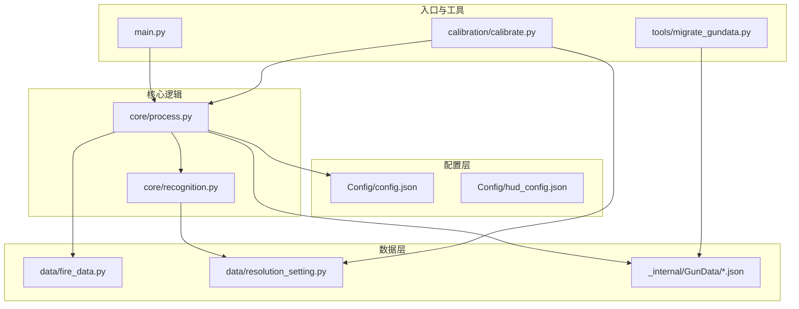
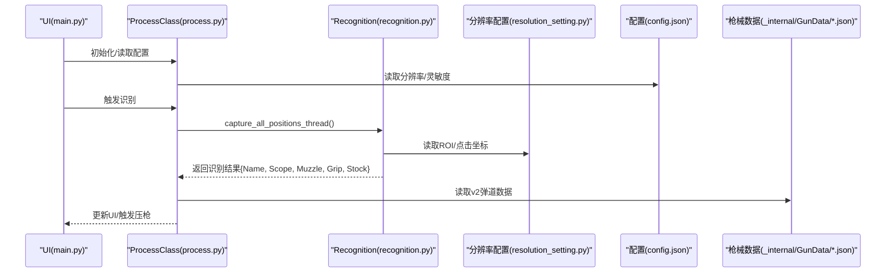
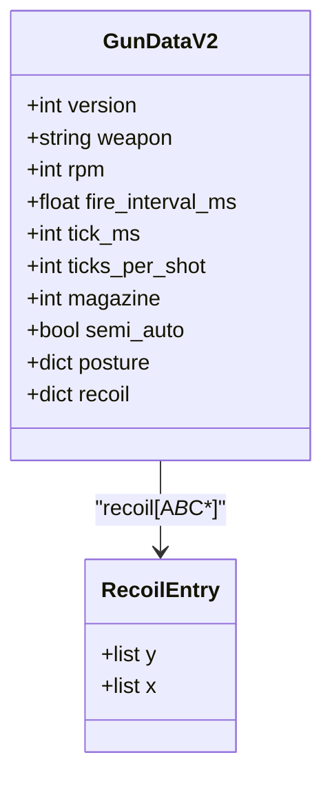
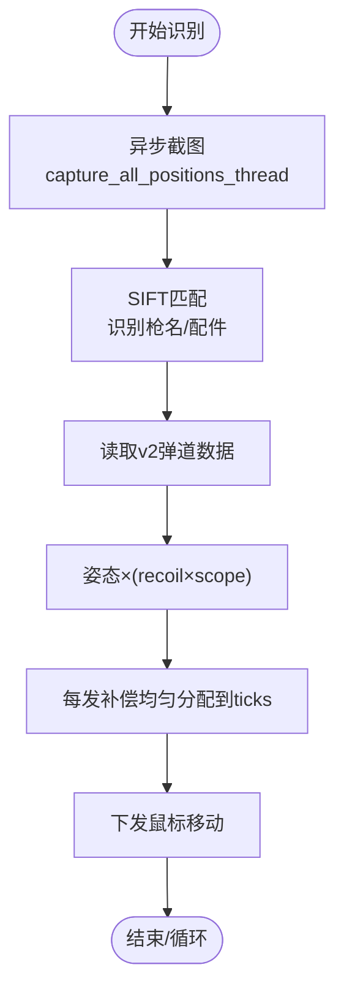
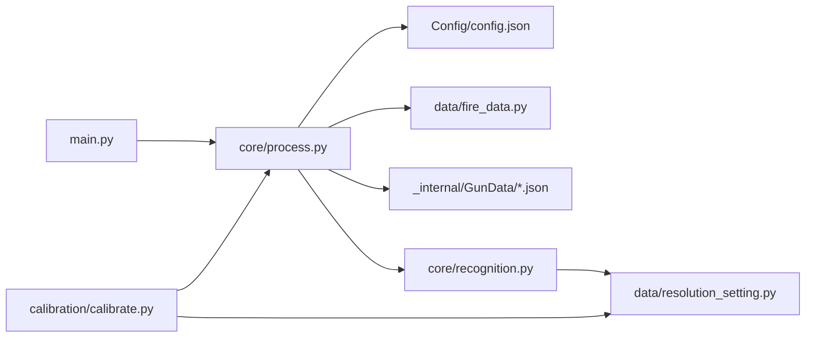

# 数据管理

<cite>
**本文引用的文件**
- [main.py](file://main.py)
- [process.py](file://core/process.py)
- [recognition.py](file://core/recognition.py)
- [config.json](file://Config/config.json)
- [hud_config.json](file://Config/hud_config.json)
- [fire_data.py](file://data/fire_data.py)
- [resolution_setting.py](file://data/resolution_setting.py)
- [m762.json](file://_internal/GunData/m762.json)
- [akm.json](file://_internal/GunData/akm.json)
- [migrate_gundata.py](file://tools/migrate_gundata.py)
- [calibrate.py](file://calibration/calibrate.py)
- [README.md](file://calibration/README.md)
</cite>

## 目录
1. [简介](#简介)
2. [项目结构](#项目结构)
3. [核心组件](#核心组件)
4. [架构总览](#架构总览)
5. [详细组件分析](#详细组件分析)
6. [依赖关系分析](#依赖关系分析)
7. [性能考量](#性能考量)
8. [故障排查指南](#故障排查指南)
9. [结论](#结论)
10. [附录](#附录)

## 简介
本文件面向开发者与维护者，系统性阐述PUBG自动识别压枪工具的数据管理系统。重点覆盖：
- 枪械数据结构设计：v1/v2格式差异、弹道数据格式、配件编码规则与数据组织方式
- 配置管理系统：config.json结构与动态加载机制
- 分辨率配置：数据模型与多分辨率支持策略
- 数据扩展与自定义：新增枪械数据的方法与格式规范
- 数据验证、错误处理与性能优化
- 数据维护与更新的最佳实践

## 项目结构
该项目采用“功能模块化 + 配置分离”的组织方式：
- Config：存放运行期配置（分辨率、灵敏度、HUD样式等）
- data：通用数据模型与分辨率配置
- _internal/GunData：v2格式的枪械弹道数据（JSON）
- calibration：弹道校准工具链
- core：核心业务逻辑（识别、处理、压枪）
- tools：数据迁移与训练辅助脚本
- ui/input：UI与输入监听
- 根目录入口：main.py

图表来源
- [main.py:1-294](file://main.py#L1-L294)
- [process.py:1-405](file://core/process.py#L1-L405)
- [recognition.py:1-478](file://core/recognition.py#L1-L478)
- [config.json:1-1](file://Config/config.json#L1-L1)
- [hud_config.json:1-91](file://Config/hud_config.json#L1-L91)
- [fire_data.py:1-83](file://data/fire_data.py#L1-L83)
- [resolution_setting.py:1-147](file://data/resolution_setting.py#L1-L147)
- [m762.json:1-800](file://_internal/GunData/m762.json#L1-L800)
- [akm.json:1-337](file://_internal/GunData/akm.json#L1-L337)
- [migrate_gundata.py:1-192](file://tools/migrate_gundata.py#L1-L192)
- [calibrate.py:1-200](file://calibration/calibrate.py#L1-L200)

章节来源
- [main.py:1-294](file://main.py#L1-L294)
- [process.py:1-405](file://core/process.py#L1-L405)
- [recognition.py:1-478](file://core/recognition.py#L1-L478)

## 核心组件
- 配置管理：读取/写入分辨率与灵敏度配置，支持动态更新
- 枪械数据：v2格式的per-shot弹道数组、姿态系数、配件编码映射
- 分辨率适配：多分辨率下的ROI区域、点击坐标、姿势区域模板
- 识别与压枪：异步识别、SIFT特征匹配、弹道合成与下发
- 校准工具：GUI/CLI弹痕分析、参数迭代修正、项目文件(.calibration.json)

章节来源
- [process.py:53-71](file://core/process.py#L53-L71)
- [process.py:83-88](file://core/process.py#L83-L88)
- [resolution_setting.py:2-147](file://data/resolution_setting.py#L2-L147)
- [recognition.py:102-126](file://core/recognition.py#L102-L126)
- [calibrate.py:1-200](file://calibration/calibrate.py#L1-L200)

## 架构总览
系统采用“配置驱动 + 数据驱动”的架构：
- 配置驱动：Config/config.json决定分辨率与灵敏度；Config/hud_config.json决定HUD外观
- 数据驱动：_internal/GunData/*.json提供v2格式弹道数据；data/fire_data.py提供配件编码映射
- 识别驱动：core/recognition.py负责异步截图、SIFT匹配与姿势识别
- 业务驱动：core/process.py负责数据读取、合成、压枪循环

图表来源
- [main.py:188-204](file://main.py#L188-L204)
- [process.py:138-147](file://core/process.py#L138-L147)
- [recognition.py:102-126](file://core/recognition.py#L102-L126)
- [resolution_setting.py:2-147](file://data/resolution_setting.py#L2-L147)
- [config.json:1-1](file://Config/config.json#L1-L1)

## 详细组件分析

### 枪械数据结构设计（v1 → v2）
- v1格式（遗留兼容）：以“per-tick整数数组”记录每tick补偿，需按射速分片展开
- v2格式（当前标准）：以“per-shot浮点数组”记录每发总补偿，内部按ticks_per_shot均匀展开，支持水平补偿与亚像素累积
- 关键字段：
  - version：版本标识
  - weapon：枪械名
  - rpm/fire_interval_ms/tick_ms/ticks_per_shot：射击节奏参数
  - magazine：弹夹容量
  - semi_auto：是否半自动
  - posture：姿态系数（none/c/z）
  - recoil：配件编码→{y/x}数组

图表来源
- [m762.json:1-800](file://_internal/GunData/m762.json#L1-L800)
- [akm.json:1-337](file://_internal/GunData/akm.json#L1-L337)

章节来源
- [process.py:242-244](file://core/process.py#L242-L244)
- [process.py:286-308](file://core/process.py#L286-L308)
- [m762.json:1-800](file://_internal/GunData/m762.json#L1-L800)
- [akm.json:1-337](file://_internal/GunData/akm.json#L1-L337)

### 弹道数据格式与数据组织
- per-shot数组：每发子弹的总补偿值，按ticks_per_shot均匀分配到各tick
- 水平补偿：x数组可独立控制，实现左右补偿
- 亚像素累积：remainder在shot间连续累积，保证总位移与理论一致
- 姿态/倍镜缩放：posture × (recoil × scope)

章节来源
- [process.py:310-362](file://core/process.py#L310-L362)
- [process.py:183-197](file://core/process.py#L183-L197)

### 配件编码规则与数据组织
- 编码格式：A{枪口}B{握把}C{枪托}，每个位置为数字编码
- 编码映射：data/fire_data.py提供中文名到编码的映射，process.py将其转为A*B*C*
- v2数据按编码索引弹道数组，缺失组合将导致“无弹道数据”错误

章节来源
- [fire_data.py:14-82](file://data/fire_data.py#L14-L82)
- [process.py:263-275](file://core/process.py#L263-L275)

### 配置管理系统（config.json）
- 结构要点：
  - resolution：当前显示器分辨率字符串
  - sensitivity：倍镜/机瞄灵敏度映射（none、hongdian、quanxi、2bei、3bei、4bei、6bei、8bei、15bei、shift）
- 动态加载与保存：
  - get_config_data(mode)：读取resolution或sensitivity或整体
  - save_config_data(mode, data)：写回配置文件

章节来源
- [config.json:1-1](file://Config/config.json#L1-L1)
- [process.py:53-71](file://core/process.py#L53-L71)

### HUD配置（hud_config.json）
- 控制HUD位置、字体大小、颜色、尺寸、透明度、刷新频率、热键等
- 用于UI层渲染与交互

章节来源
- [hud_config.json:1-91](file://Config/hud_config.json#L1-L91)

### 分辨率配置数据模型与多分辨率支持
- RESOLUTION_SETTINGS：按分辨率定义的ROI区域（Name/Scope/Muzzle/Grip/Stock）
- GUNS_REOLUTION_SETTINGS：整屏识别区域
- Click/Zishi：右键开镜坐标、姿势区域模板
- 支持多分辨率：3840x2160、3440x1440、2560x1600、2560x1440、2304x1440、2560x1080、1920x1080、1728x1080

章节来源
- [resolution_setting.py:2-147](file://data/resolution_setting.py#L2-L147)

### 识别与压枪流程
- 异步识别：capture_all_positions_thread按ROI并发截图与匹配，返回两把枪的识别结果
- 姿势识别：capture_zishi_positions_thread支持模板匹配与自适应等待
- 压枪循环：FIRE_v2将每发补偿均匀分配到各tick，支持水平补偿与亚像素累积

图表来源
- [recognition.py:102-126](file://core/recognition.py#L102-L126)
- [process.py:286-308](file://core/process.py#L286-L308)
- [process.py:310-362](file://core/process.py#L310-L362)

章节来源
- [recognition.py:102-126](file://core/recognition.py#L102-L126)
- [process.py:138-147](file://core/process.py#L138-L147)
- [process.py:286-308](file://core/process.py#L286-L308)
- [process.py:310-362](file://core/process.py#L310-L362)

### 数据扩展与自定义（新增枪械数据）
- 迁移工具：tools/migrate_gundata.py将v1数据转换为v2格式，自动计算ticks_per_shot、rpm、semi_auto等元信息
- 新建步骤：
  1) 使用calibration工具采集弹痕，生成.calibration.json
  2) 在GUI/CLI中导出修正参数
  3) 将参数写入_internal/GunData/<枪名>.json的对应A*B*C*条目
  4) 如需半自动特性，设置semi_auto=true并在meta中配置

章节来源
- [migrate_gundata.py:19-54](file://tools/migrate_gundata.py#L19-L54)
- [migrate_gundata.py:80-151](file://tools/migrate_gundata.py#L80-L151)
- [calibrate.py:1-200](file://calibration/calibrate.py#L1-L200)
- [README.md:1-199](file://calibration/README.md#L1-L199)

### 数据验证、错误处理与性能优化
- 数据验证：
  - 识别结果为空：提示“还未进行枪械识别”
  - 未开镜：提示“当前没有开启倍镜”
  - 无弹道数据：提示“配件组合无弹道数据/弹道数据为空”
- 错误处理：
  - 读取配置失败时回退为默认值
  - Shift倍率叠加仅在当前开镜且装备有效时生效
- 性能优化：
  - 异步并发截图与匹配
  - per-shot均匀分配消除锯齿，减少抖动
  - 亚像素remainder累积，提高精度
  - 模板匹配与自适应等待减少无效重试

章节来源
- [process.py:221-261](file://core/process.py#L221-L261)
- [process.py:97-124](file://core/process.py#L97-L124)
- [recognition.py:129-170](file://core/recognition.py#L129-L170)
- [recognition.py:364-423](file://core/recognition.py#L364-L423)

## 依赖关系分析
- main.py依赖core/process.py与UI模块，负责配置读取与UI交互
- core/process.py依赖data/fire_data.py、Config/config.json、_internal/GunData/*.json
- core/recognition.py依赖data/resolution_setting.py与PIL/mss/opencv
- calibration/calibrate.py依赖core/process.py与data/fire_data.py

图表来源
- [main.py:1-294](file://main.py#L1-L294)
- [process.py:1-405](file://core/process.py#L1-L405)
- [recognition.py:1-478](file://core/recognition.py#L1-L478)
- [calibrate.py:1-200](file://calibration/calibrate.py#L1-L200)

章节来源
- [main.py:1-294](file://main.py#L1-L294)
- [process.py:1-405](file://core/process.py#L1-L405)
- [recognition.py:1-478](file://core/recognition.py#L1-L478)
- [calibrate.py:1-200](file://calibration/calibrate.py#L1-L200)

## 性能考量
- 异步并发：识别阶段使用asyncio.gather并发处理多个ROI，显著降低总耗时
- 特征匹配：SIFT+FLANN匹配，阈值与掩码过滤提升鲁棒性
- 模板匹配：姿势识别优先使用模板匹配，失败时回退自适应等待
- 亚像素与均匀分配：减少抖动与误差累积，提高稳定性

[本节为通用性能讨论，无需代码引用]

## 故障排查指南
- 识别结果为空
  - 确认已开启倍镜且选择了1/2号槽
  - 检查分辨率配置与ROI区域是否匹配
- 弹道数据为空
  - 确认配件编码A*B*C*存在
  - 检查v2数据是否正确迁移
- 姿势识别不稳定
  - 使用模板匹配或等待渲染稳定
- 灵敏度异常
  - 检查Config/config.json中的sensitivity映射
  - Shift倍率叠加仅在当前开镜且装备有效时生效

章节来源
- [process.py:221-261](file://core/process.py#L221-L261)
- [process.py:97-124](file://core/process.py#L97-L124)
- [recognition.py:129-170](file://core/recognition.py#L129-L170)
- [recognition.py:364-423](file://core/recognition.py#L364-L423)

## 结论
本系统通过v2弹道数据、多分辨率适配与异步识别，实现了高精度、高扩展性的压枪数据管理。配置与数据分离、校准工具链与迁移脚本，共同保障了数据维护与更新的可操作性与可追溯性。建议在新增枪械时严格遵循v2格式与配件编码规范，并通过校准工具迭代修正参数，确保跨分辨率与多倍镜场景的一致性。

[本节为总结性内容，无需代码引用]

## 附录

### v2数据格式字段说明
- version：版本号（2）
- weapon：枪械名
- rpm/fire_interval_ms/tick_ms/ticks_per_shot：射击节奏参数
- magazine：弹夹容量
- semi_auto：是否半自动
- posture：姿态系数（none/c/z）
- recoil：配件编码→{y/x}数组

章节来源
- [m762.json:1-800](file://_internal/GunData/m762.json#L1-L800)
- [akm.json:1-337](file://_internal/GunData/akm.json#L1-L337)

### 配件编码映射
- Muzzle/Grip/Stock分别映射为数字编码，组合为A*B*C*

章节来源
- [fire_data.py:14-82](file://data/fire_data.py#L14-L82)

### 多分辨率ROI与点击坐标
- RESOLUTION_SETTINGS：按分辨率定义的ROI区域
- Click/Zishi：右键开镜坐标、姿势区域模板

章节来源
- [resolution_setting.py:2-147](file://data/resolution_setting.py#L2-L147)

### 校准工具使用流程
- GUI/CLI分析弹痕、生成项目文件、导出修正参数、写回v2数据

章节来源
- [calibrate.py:1-200](file://calibration/calibrate.py#L1-L200)
- [README.md:1-199](file://calibration/README.md#L1-L199)