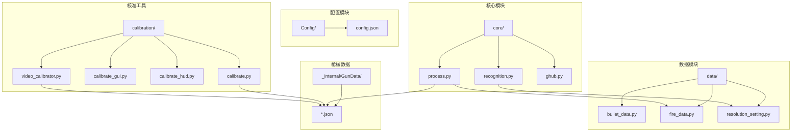
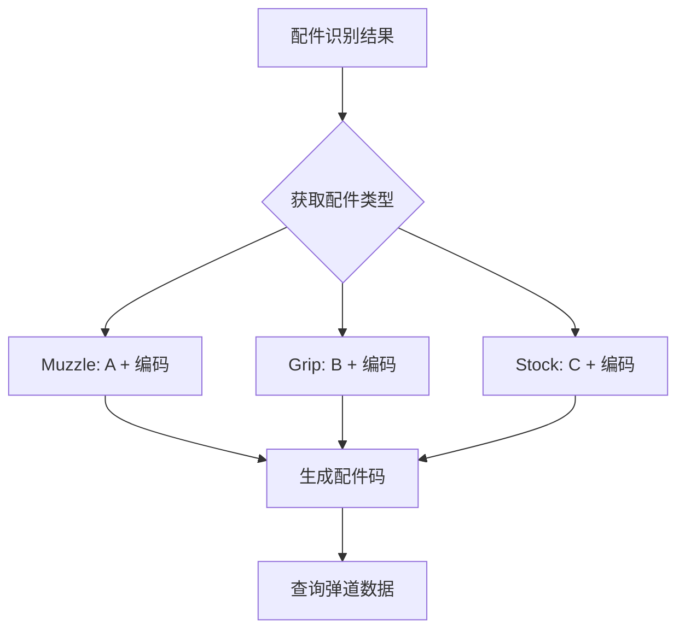
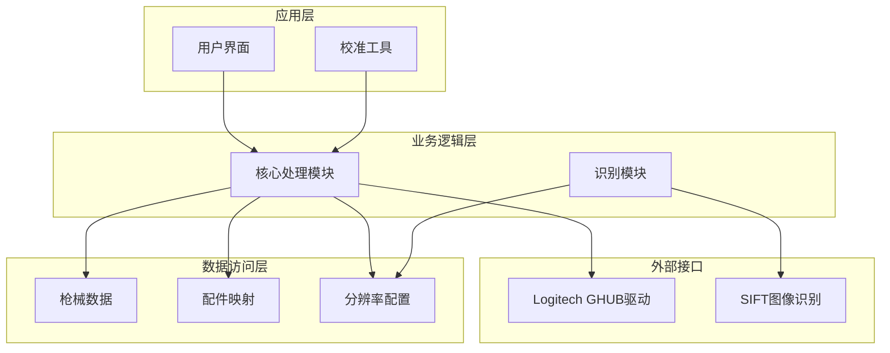
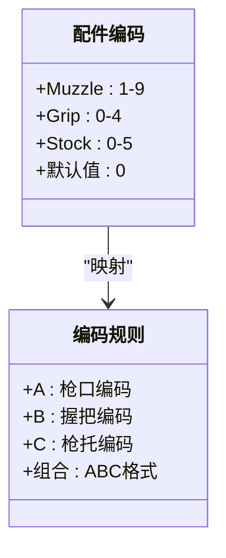
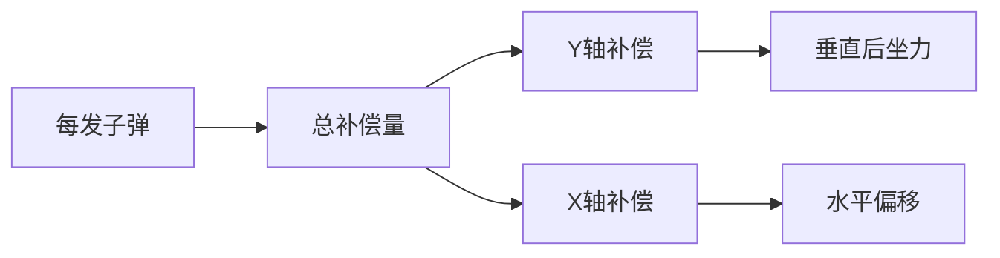
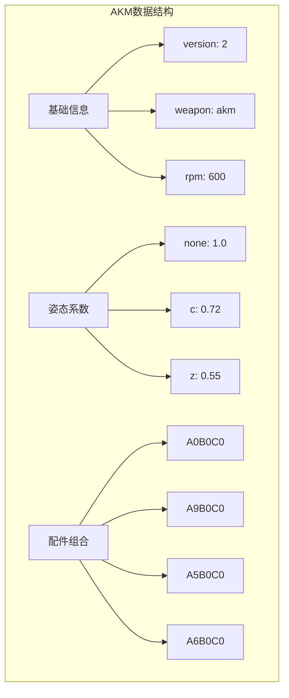
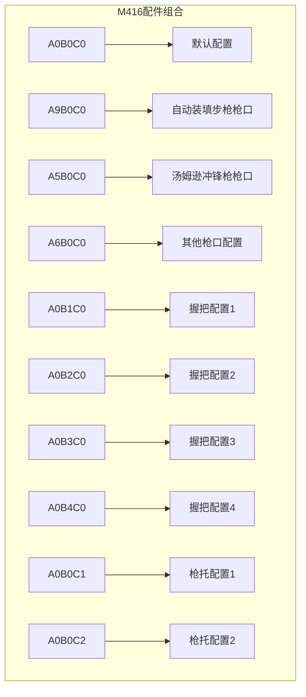
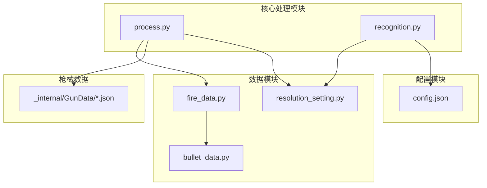

# 枪械数据结构

<cite>
**本文档引用的文件**
- [README.md](file://README.md)
- [Config/config.json](file://Config/config.json)
- [data/bullet_data.py](file://data/bullet_data.py)
- [data/fire_data.py](file://data/fire_data.py)
- [migrate_gundata.py](file://migrate_gundata.py)
- [_internal/GunData/akm.json](file://_internal/GunData/akm.json)
- [_internal/GunData/m416.json](file://_internal/GunData/m416.json)
- [_internal/GunData/ump45.json](file://_internal/GunData/ump45.json)
- [data/resolution_setting.py](file://data/resolution_setting.py)
- [core/process.py](file://core/process.py)
- [core/recognition.py](file://core/recognition.py)
- [calibration/calibrate.py](file://calibration/calibrate.py)
- [calibration/calibrate_hud.py](file://calibration/calibrate_hud.py)
- [calibration/video_calibrator.py](file://calibration/video_calibrator.py)
</cite>

## 目录
1. [简介](#简介)
2. [项目结构](#项目结构)
3. [核心组件](#核心组件)
4. [架构概览](#架构概览)
5. [详细组件分析](#详细组件分析)
6. [依赖关系分析](#依赖关系分析)
7. [性能考虑](#性能考虑)
8. [故障排除指南](#故障排除指南)
9. [结论](#结论)

## 简介

本项目是一个基于OpenCV SIFT算法的PUBG自动识别压枪工具，主要功能包括：
- SIFT枪械识别：按Tab截图，自动识别枪名、倍镜、枪口、握把、枪托
- 智能压枪：根据弹道数据 + 配件组合 + 姿势系数 + 灵敏度自动计算后坐力补偿
- 开火状态检测：像素取色判定是否开镜，自动启停压枪
- 三档游戏内HUD：Tab循环切换极简 → 紧凑 → 完整 → 隐藏

## 项目结构

项目采用模块化设计，主要包含以下核心模块：

**图表来源**
- [README.md:22-67](file://README.md#L22-L67)
- [core/process.py:1-50](file://core/process.py#L1-L50)
- [data/fire_data.py:1-83](file://data/fire_data.py#L1-L83)

**章节来源**
- [README.md:22-67](file://README.md#L22-L67)

## 核心组件

### 枪械数据结构

项目中的枪械数据采用两种不同的存储格式：

#### v1 格式（已迁移）
- 每个元素代表1个tick（9ms）的鼠标位移
- 仅支持垂直方向补偿
- 适用于全自动武器

#### v2 格式（当前标准）
- 每个元素代表1发子弹的总鼠标位移（float）
- 支持水平和垂直方向补偿
- 运行时平滑展开到多个tick
- 支持半自动和全自动武器

### 配件编码系统

项目使用独特的配件编码规则来唯一标识不同的配件组合：

**图表来源**
- [core/process.py:263-275](file://core/process.py#L263-L275)
- [data/fire_data.py:54-82](file://data/fire_data.py#L54-L82)

**章节来源**
- [core/process.py:263-275](file://core/process.py#L263-L275)
- [data/fire_data.py:54-82](file://data/fire_data.py#L54-L82)

## 架构概览

系统采用分层架构设计，各层职责明确：

**图表来源**
- [core/process.py:1-50](file://core/process.py#L1-L50)
- [core/recognition.py:1-50](file://core/recognition.py#L1-L50)
- [data/fire_data.py:1-83](file://data/fire_data.py#L1-L83)

## 详细组件分析

### 枪械数据文件结构

每个枪械的JSON文件包含以下关键字段：

#### 基础信息
- `version`: 数据版本号（v2为当前标准）
- `weapon`: 枪械名称
- `rpm`: 射击速度（RPM）
- `fire_interval_ms`: 每发射击间隔（毫秒）
- `tick_ms`: 模拟器tick间隔（毫秒）
- `ticks_per_shot`: 每发对应的tick数量
- `magazine`: 弹夹容量
- `semi_auto`: 是否为半自动武器

#### 姿态系数
- `posture`: 不同射击姿态下的系数
  - `none`: 标准站立姿态
  - `c`: 蹲姿
  - `z`: 地面姿态

#### 弹道数据
- `recoil`: 配件组合对应的弹道数据
  - `A0B0C0`: 默认配件组合
  - `A9B0C0`: 枪口配件为"自动装填步枪"
  - `A5B0C0`: 枪口配件为"汤姆逊冲锋枪"

每个配件组合包含：
- `y`: 每发垂直方向的总补偿量数组
- `x`: 每发水平方向的总补偿量数组（通常为0）

**章节来源**
- [_internal/GunData/akm.json:1-337](file://_internal/GunData/akm.json#L1-L337)
- [_internal/GunData/m416.json:1-800](file://_internal/GunData/m416.json#L1-L800)
- [_internal/GunData/ump45.json:1-800](file://_internal/GunData/ump45.json#L1-L800)

### 配件映射系统

#### ACCESSORIES_CH 中文映射表
该映射表提供了配件的中文名称映射，便于用户理解和识别：

| 配件类型 | 编码 | 中文名称 |
|---------|------|----------|
| Muzzle | eliuquan | 扼流圈 |
| Muzzle | yazuiqiangkou | 鸭嘴枪口 |
| Muzzle | buqiangbuchang | 步枪补偿 |
| Muzzle | xiaoyin | 消音器 |
| Grip | banjieshi | 半截式握把 |
| Grip | chuizhi | 垂直握把 |
| Stock | zhanshuqiangtuo | 战术枪托 |
| Stock | tuosaiban | 托腮板 |

#### KEY_DATA 数字编码系统
数字编码系统将配件类型转换为机器可读的数字标识：

**图表来源**
- [data/fire_data.py:54-82](file://data/fire_data.py#L54-L82)

**章节来源**
- [data/fire_data.py:1-83](file://data/fire_data.py#L1-L83)

### 弹道数据组织方式

#### v2 格式弹道数据结构
v2格式采用更精确的弹道数据表示方式：

#### 数据格式规范
- **数组长度**: 每发子弹对应数组中的一个元素
- **数据类型**: float类型，支持小数位
- **单位**: 鼠标像素
- **精度**: 保留两位小数

**章节来源**
- [core/process.py:310-362](file://core/process.py#L310-L362)

### 数据扩展机制

#### 向后兼容性保证
系统通过以下机制保证向后兼容性：

1. **版本检测**: 自动检测枪械数据版本
2. **格式转换**: 提供v1到v2的自动迁移工具
3. **降级处理**: v1格式仍可正常工作

#### 迁移工具功能
迁移工具能够：
- 自动识别v1格式数据
- 计算每发子弹的补偿量
- 生成v2格式的标准化数据
- 保持原有的姿态系数

**章节来源**
- [migrate_gundata.py:1-200](file://migrate_gundata.py#L1-L200)

### 现有枪械数据示例分析

#### AKM 枪械数据
AKM作为经典步枪，其数据结构体现了完整的配件支持：

**图表来源**
- [_internal/GunData/akm.json:1-337](file://_internal/GunData/akm.json#L1-L337)

#### M416 枪械数据
M416作为现代化步枪，支持多种配件组合：

**图表来源**
- [_internal/GunData/m416.json:15-800](file://_internal/GunData/m416.json#L15-L800)

#### UMP45 枪械数据
UMP45作为冲锋枪，其数据结构相对简化：

**章节来源**
- [_internal/GunData/ump45.json:1-800](file://_internal/GunData/ump45.json#L1-L800)

## 依赖关系分析

### 组件耦合关系

**图表来源**
- [core/process.py:1-50](file://core/process.py#L1-L50)
- [core/recognition.py:1-50](file://core/recognition.py#L1-L50)
- [data/fire_data.py:1-83](file://data/fire_data.py#L1-L83)

### 数据流依赖

系统中的数据流遵循严格的依赖关系：

1. **识别阶段**: recognition模块负责图像识别
2. **数据处理**: process模块处理识别结果
3. **配置管理**: config模块提供系统配置
4. **数据存储**: GunData文件存储枪械数据

**章节来源**
- [core/process.py:263-308](file://core/process.py#L263-L308)
- [core/recognition.py:83-126](file://core/recognition.py#L83-L126)

## 性能考虑

### 数据结构优化

1. **数组压缩**: v2格式通过每发子弹的总补偿量减少数据冗余
2. **精度控制**: 保留两位小数平衡精度和性能
3. **内存管理**: 按需加载枪械数据，避免内存溢出

### 处理效率

1. **实时性**: v2格式支持更精确的时间控制
2. **平滑补偿**: 通过tick级别的平滑展开消除锯齿
3. **多线程支持**: 异步图像识别提高响应速度

## 故障排除指南

### 常见问题及解决方案

#### 配件组合无数据
**症状**: 显示"配件组合 {NameCode} 无弹道数据"
**原因**: 该配件组合尚未校准或数据缺失
**解决**: 使用校准工具重新校准该配件组合

#### 弹道数据为空
**症状**: 显示"弹道数据为空，请先校准"
**原因**: 未进行弹道校准
**解决**: 运行校准工具进行数据采集和处理

#### 分辨率适配问题
**症状**: 识别不准确或补偿不正确
**原因**: 分辨率配置不匹配
**解决**: 检查并更新分辨率设置

**章节来源**
- [core/process.py:288-296](file://core/process.py#L288-L296)
- [calibration/calibrate.py:144-160](file://calibration/calibrate.py#L144-L160)

### 开发者最佳实践

1. **数据验证**: 新增枪械数据前进行完整性检查
2. **版本管理**: 使用迁移工具确保数据格式一致性
3. **测试覆盖**: 为新数据编写单元测试
4. **文档同步**: 更新相关文档和注释

## 结论

本项目通过精心设计的枪械数据结构和配件编码系统，实现了PUBG游戏中精准的自动压枪功能。主要特点包括：

1. **标准化数据格式**: v2格式提供更精确的弹道数据表示
2. **灵活的配件系统**: 支持复杂的配件组合和编码规则
3. **向后兼容性**: 通过迁移工具保证历史数据的可用性
4. **模块化设计**: 清晰的组件分离便于维护和扩展

该系统为开发者提供了完整的数据结构参考和扩展指南，便于后续功能的开发和维护。