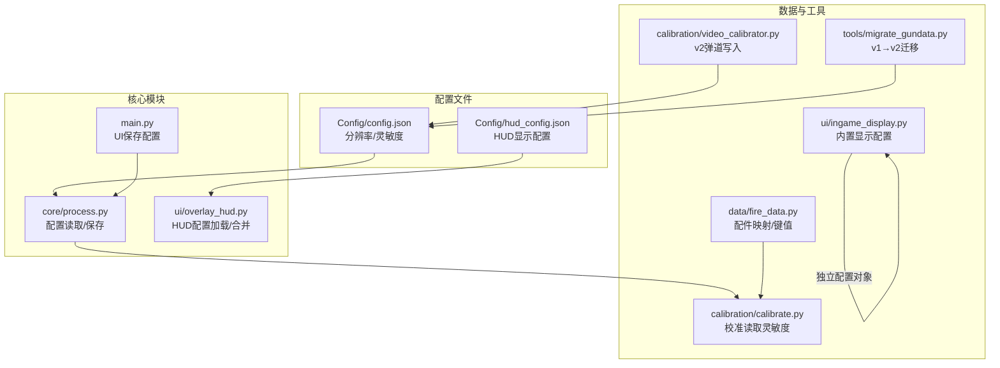
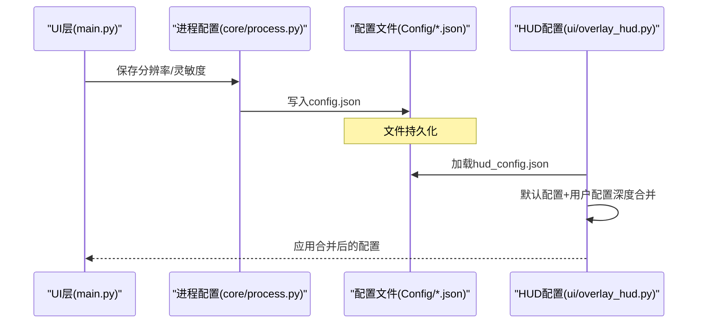
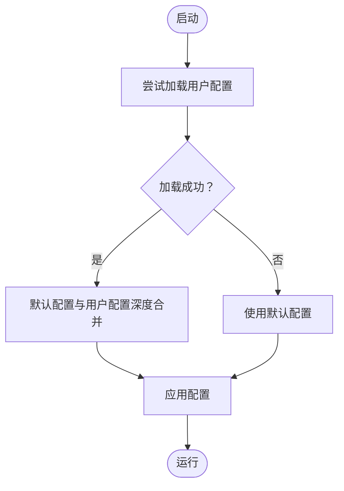
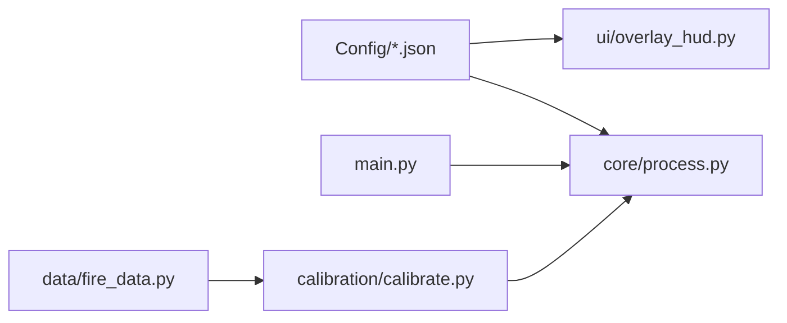

# 配置管理系统

<cite>
**本文引用的文件**
- [config.json](file://Config/config.json)
- [hud_config.json](file://Config/hud_config.json)
- [process.py](file://core/process.py)
- [overlay_hud.py](file://ui/overlay_hud.py)
- [main.py](file://main.py)
- [fire_data.py](file://data/fire_data.py)
- [ingame_display.py](file://ui/ingame_display.py)
- [calibrate.py](file://calibration/calibrate.py)
- [video_calibrator.py](file://calibration/video_calibrator.py)
- [migrate_gundata.py](file://tools/migrate_gundata.py)
</cite>

## 目录
1. [简介](#简介)
2. [项目结构](#项目结构)
3. [核心组件](#核心组件)
4. [架构总览](#架构总览)
5. [详细组件分析](#详细组件分析)
6. [依赖关系分析](#依赖关系分析)
7. [性能考量](#性能考量)
8. [故障排查指南](#故障排查指南)
9. [结论](#结论)
10. [附录](#附录)

## 简介
本文件系统性梳理该PUBG自动识别宏项目的配置管理体系，覆盖以下方面：
- config.json与hud_config.json的结构设计与字段定义
- 动态加载与热更新机制
- 配置项分类体系（游戏设置、显示配置、行为参数）
- 扩展方法与新增配置项规范及验证流程
- 默认值管理与回退机制
- 版本兼容与迁移策略
- 与各功能模块的集成方式
- 最佳实践与常见问题解决方案
- 安全性与权限控制考虑

## 项目结构
配置系统主要由两部分构成：
- 游戏运行配置：Config/config.json，包含分辨率与灵敏度等运行期参数
- HUD显示配置：Config/hud_config.json，包含HUD位置、样式、颜色、尺寸、刷新频率等显示参数



图表来源
- [process.py:53-70](file://core/process.py#L53-L70)
- [overlay_hud.py:68-108](file://ui/overlay_hud.py#L68-L108)
- [main.py:188-204](file://main.py#L188-L204)
- [fire_data.py:54-82](file://data/fire_data.py#L54-L82)
- [ingame_display.py:7-30](file://ui/ingame_display.py#L7-L30)
- [calibrate.py:137-142](file://calibration/calibrate.py#L137-L142)
- [video_calibrator.py:748-766](file://calibration/video_calibrator.py#L748-L766)
- [migrate_gundata.py:128-146](file://tools/migrate_gundata.py#L128-L146)

章节来源
- [config.json:1-1](file://Config/config.json#L1-L1)
- [hud_config.json:1-91](file://Config/hud_config.json#L1-L91)
- [process.py:53-70](file://core/process.py#L53-L70)
- [overlay_hud.py:68-108](file://ui/overlay_hud.py#L68-L108)
- [main.py:188-204](file://main.py#L188-L204)

## 核心组件
- 运行配置读取与保存：通过统一接口读取分辨率与灵敏度，支持保存修改后的配置
- HUD配置加载与合并：提供默认配置与用户配置的深度合并，支持热保存与回退
- UI层配置交互：提供分辨率与灵敏度的保存入口
- 数据与工具链：校准流程读取配置，v2弹道写入工具基于配置生成结构

章节来源
- [process.py:53-70](file://core/process.py#L53-L70)
- [overlay_hud.py:88-125](file://ui/overlay_hud.py#L88-L125)
- [main.py:188-204](file://main.py#L188-L204)
- [calibrate.py:137-142](file://calibration/calibrate.py#L137-L142)
- [video_calibrator.py:748-766](file://calibration/video_calibrator.py#L748-L766)

## 架构总览
配置系统采用“文件驱动 + 默认回退 + 深度合并”的架构，确保用户配置与默认配置解耦，便于扩展与热更新。



图表来源
- [main.py:188-204](file://main.py#L188-L204)
- [process.py:63-70](file://core/process.py#L63-L70)
- [overlay_hud.py:88-125](file://ui/overlay_hud.py#L88-L125)

## 详细组件分析

### config.json 结构与字段定义
- 字段
  - resolution: 字符串，屏幕分辨率字符串，用于识别与渲染定位
  - sensitivity: 对象，键为倍镜类型（如none、hongdian、quanxi等），值为数值，表示灵敏度倍率
  - shift: 数值，Shift键长按增量修正值，用于在特定倍镜下叠加修正

- 用途
  - 运行时读取分辨率以确定识别区域
  - 读取灵敏度映射用于压枪计算
  - 读取shift用于长按Shift时的倍镜修正

- 示例字段路径
  - [config.json:1-1](file://Config/config.json#L1-L1)

章节来源
- [config.json:1-1](file://Config/config.json#L1-L1)
- [process.py:53-70](file://core/process.py#L53-L70)
- [calibrate.py:137-142](file://calibration/calibrate.py#L137-L142)

### hud_config.json 结构与字段定义
- 字段
  - position: 对象
    - x: 整数，HUD横坐标
    - y: 整数，HUD纵坐标
    - anchor: 字符串，锚点（如custom）
    - margin_right: 整数，右侧边距
  - default_mode: 字符串，初始显示模式（minimal/compact/full）
  - font_family: 字体族
  - font_size: 对象，不同模式下的字体大小
  - colors: 对象，颜色RGBA列表
  - size: 对象，不同模式下的尺寸
  - opacity: 透明度
  - refresh_ms: 刷新周期（毫秒）
  - hotkey_mode_switch: 切换模式的热键

- 用途
  - 控制HUD的位置、外观、颜色、尺寸与刷新频率
  - 支持热键切换显示模式
  - 保存用户配置并回退到默认配置

- 示例字段路径
  - [hud_config.json:1-91](file://Config/hud_config.json#L1-L91)

章节来源
- [hud_config.json:1-91](file://Config/hud_config.json#L1-L91)
- [overlay_hud.py:68-108](file://ui/overlay_hud.py#L68-L108)
- [overlay_hud.py:229-287](file://ui/overlay_hud.py#L229-L287)

### 动态加载与热更新机制
- 运行配置（config.json）
  - 读取：启动时一次性读取，后续通过保存接口写回
  - 热更新：当前实现为重启生效；可通过定时轮询或文件监控实现热更新（建议）

- HUD配置（hud_config.json）
  - 加载：优先加载用户配置，若存在则与默认配置深度合并
  - 保存：支持保存到已发现的配置路径，自动去除内部路径标记
  - 回退：若加载失败或文件缺失，使用默认配置



图表来源
- [overlay_hud.py:88-125](file://ui/overlay_hud.py#L88-L125)

章节来源
- [process.py:53-70](file://core/process.py#L53-L70)
- [overlay_hud.py:88-125](file://ui/overlay_hud.py#L88-L125)

### 配置项分类体系
- 游戏设置
  - 分辨率：resolution
  - 灵敏度：sensitivity（按倍镜类型分组）
  - Shift修正：shift
- 显示配置
  - HUD位置：position.x/y/anchor/margin_right
  - 显示模式：default_mode
  - 字体与字号：font_family/font_size
  - 颜色：colors（背景、边框、文字等）
  - 尺寸：size（minimal/compact/full）
  - 透明度：opacity
  - 刷新频率：refresh_ms
  - 热键：hotkey_mode_switch
- 行为参数
  - 识别与渲染：resolution
  - 压枪修正：sensitivity、shift
  - HUD交互：拖拽、隐藏、模式切换

章节来源
- [config.json:1-1](file://Config/config.json#L1-L1)
- [hud_config.json:1-91](file://Config/hud_config.json#L1-L91)
- [process.py:53-70](file://core/process.py#L53-L70)
- [overlay_hud.py:229-287](file://ui/overlay_hud.py#L229-L287)

### 扩展方法与新增配置项规范
- 新增字段步骤
  1) 在默认配置中添加字段（保持与现有结构一致）
  2) 在用户配置中仅新增必要字段，避免破坏兼容性
  3) 在读取逻辑中提供默认值回退
  4) 在保存逻辑中过滤内部字段（如路径标记）
- 验证流程
  - 类型检查：确保数值、字符串、对象类型正确
  - 边界检查：如opacity范围、刷新周期最小值
  - 存在性检查：关键键是否存在，缺失时回退默认
- 保存策略
  - 仅保存用户可见字段，避免保存内部路径等元数据
  - 写入前进行格式化与编码检查

章节来源
- [overlay_hud.py:103-125](file://ui/overlay_hud.py#L103-L125)
- [overlay_hud.py:68-85](file://ui/overlay_hud.py#L68-L85)

### 默认值管理与回退机制
- 默认配置集中于模块内默认字典，作为安全基线
- 用户配置与默认配置进行深度合并，用户配置优先
- 加载失败或文件缺失时，直接回退到默认配置
- 保存时自动剔除内部字段，防止污染用户配置

章节来源
- [overlay_hud.py:68-108](file://ui/overlay_hud.py#L68-L108)
- [overlay_hud.py:88-125](file://ui/overlay_hud.py#L88-L125)

### 版本兼容与迁移策略
- v1到v2迁移
  - 迁移工具将v1弹道数据转换为v2结构（含posture、recoil、ticks_per_shot等）
  - 自动备份原文件，便于回滚
  - 生成新的v2 JSON结构，写入recoil.y/x数组与posture系数
- 配置兼容
  - config.json与hud_config.json保持向后兼容，新增字段不影响旧版本读取
  - 读取时忽略未知字段，保证稳定性

章节来源
- [migrate_gundata.py:128-146](file://tools/migrate_gundata.py#L128-L146)
- [video_calibrator.py:748-766](file://calibration/video_calibrator.py#L748-L766)

### 与功能模块的集成方式
- 核心进程（core/process.py）
  - 读取分辨率与灵敏度，用于识别区域与压枪计算
  - 提供保存接口，供UI层调用
- HUD显示（ui/overlay_hud.py）
  - 加载并合并HUD配置，应用到渲染与交互
  - 支持热键切换模式与拖拽保存
- UI交互（main.py）
  - 提供分辨率与灵敏度的保存入口
  - 将用户输入转换为配置数据并调用保存接口
- 校准流程（calibration/calibrate.py）
  - 从配置读取灵敏度映射，作为校准参考
  - 失败时回退到默认值

```mermaid
classDiagram
class ProcessClass {
+get_config_data(mode)
+save_config_data(mode,data)
+shift_multiplier()
+on_shift_pressed()
+on_shift_released()
}
class GameHUD {
+_load_config()
+_deep_merge(base,override)
+show_hud()
}
class AppManager {
+Save_Config_Resolution()
+Save_Config_Sensitivity()
}
class Calibrate {
+scope_value
+get_config_data('a')
}
AppManager --> ProcessClass : "调用保存"
ProcessClass --> "Config/config.json" : "读/写"
GameHUD --> "Config/hud_config.json" : "读/写"
Calibrate --> ProcessClass : "读取配置"
```

图表来源
- [process.py:53-70](file://core/process.py#L53-L70)
- [overlay_hud.py:88-125](file://ui/overlay_hud.py#L88-L125)
- [main.py:188-204](file://main.py#L188-L204)
- [calibrate.py:137-142](file://calibration/calibrate.py#L137-L142)

章节来源
- [process.py:53-70](file://core/process.py#L53-L70)
- [overlay_hud.py:88-125](file://ui/overlay_hud.py#L88-L125)
- [main.py:188-204](file://main.py#L188-L204)
- [calibrate.py:137-142](file://calibration/calibrate.py#L137-L142)

## 依赖关系分析
- 配置文件依赖
  - config.json被核心进程与校准流程共同依赖
  - hud_config.json被HUD模块依赖
- 模块间耦合
  - 核心进程与UI层通过保存接口耦合
  - HUD模块与配置文件通过深度合并解耦
- 外部依赖
  - JSON解析与文件IO
  - PyQt5用于UI与HUD渲染



图表来源
- [process.py:53-70](file://core/process.py#L53-L70)
- [overlay_hud.py:88-125](file://ui/overlay_hud.py#L88-L125)
- [main.py:188-204](file://main.py#L188-L204)
- [calibrate.py:137-142](file://calibration/calibrate.py#L137-L142)
- [fire_data.py:54-82](file://data/fire_data.py#L54-L82)

章节来源
- [process.py:53-70](file://core/process.py#L53-L70)
- [overlay_hud.py:88-125](file://ui/overlay_hud.py#L88-L125)
- [main.py:188-204](file://main.py#L188-L204)
- [calibrate.py:137-142](file://calibration/calibrate.py#L137-L142)
- [fire_data.py:54-82](file://data/fire_data.py#L54-L82)

## 性能考量
- 配置读取
  - config.json：启动时一次性读取，影响极小
  - hud_config.json：启动时读取，深度合并成本低
- 保存策略
  - 仅在用户操作触发保存，避免频繁IO
- HUD刷新
  - refresh_ms控制刷新频率，建议不低于50ms以平衡性能与体验

[本节为通用指导，无需列出具体文件来源]

## 故障排查指南
- 配置文件损坏
  - 症状：HUD显示异常或无法加载
  - 处理：删除用户配置文件，系统将回退到默认配置
- 保存失败
  - 症状：保存后未生效
  - 处理：检查文件写权限与路径，确认保存逻辑未抛出异常
- 灵敏度读取异常
  - 症状：压枪异常
  - 处理：检查config.json中sensitivity键是否完整，缺失时回退到默认值
- HUD热键无效
  - 症状：F9无法切换模式
  - 处理：确认hotkey_mode_switch配置正确，且未被系统快捷键冲突

章节来源
- [overlay_hud.py:88-125](file://ui/overlay_hud.py#L88-L125)
- [process.py:63-70](file://core/process.py#L63-L70)
- [calibrate.py:137-142](file://calibration/calibrate.py#L137-L142)

## 结论
该配置系统通过“文件驱动 + 默认回退 + 深度合并”实现了良好的扩展性与稳定性。建议后续引入文件监控与热更新机制，进一步提升用户体验；同时完善配置验证与备份策略，降低误操作风险。

[本节为总结性内容，无需列出具体文件来源]

## 附录

### 配置字段对照表
- config.json
  - resolution: 字符串，分辨率
  - sensitivity: 对象，倍镜类型→倍率
  - shift: 数值，Shift修正
- hud_config.json
  - position: x/y/anchor/margin_right
  - default_mode: minimal/compact/full
  - font_family: 字体族
  - font_size: 模式→字号
  - colors: RGBA列表
  - size: 模式→尺寸
  - opacity: 透明度
  - refresh_ms: 刷新周期
  - hotkey_mode_switch: 热键

章节来源
- [config.json:1-1](file://Config/config.json#L1-L1)
- [hud_config.json:1-91](file://Config/hud_config.json#L1-L91)

### 最佳实践清单
- 新增配置项必须提供默认值
- 用户配置仅包含必要字段，避免冗余
- 保存前进行类型与边界检查
- 重要配置变更建议增加确认对话框
- 定期备份用户配置文件

[本节为通用指导，无需列出具体文件来源]