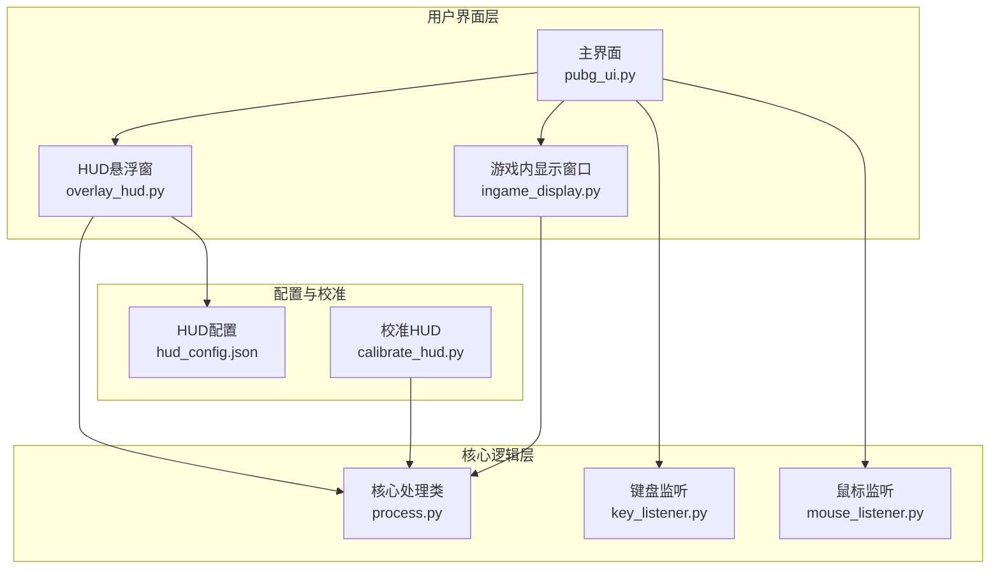
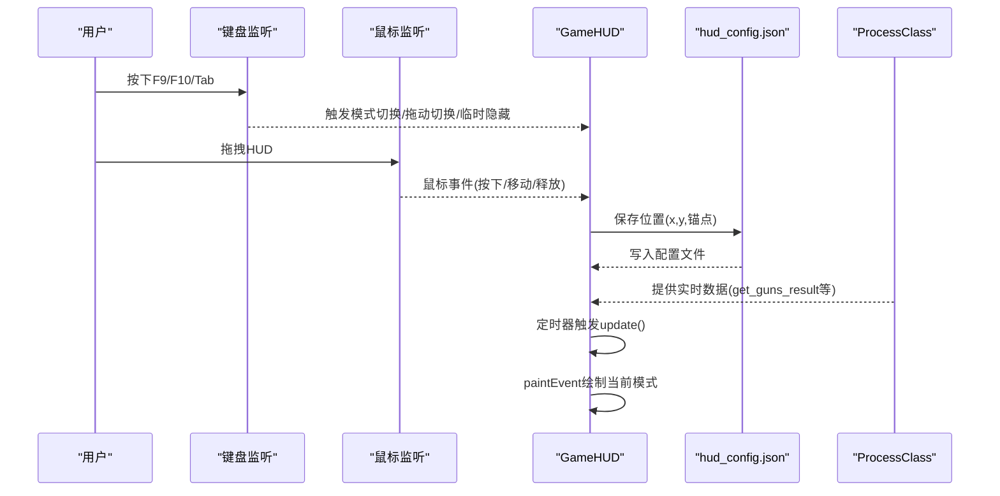
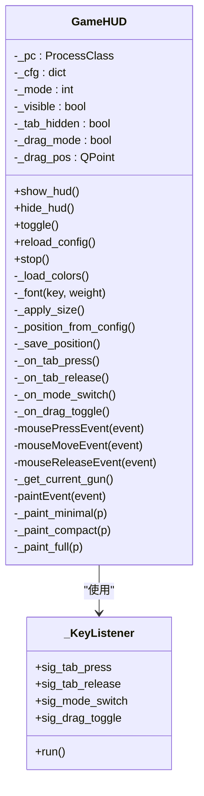
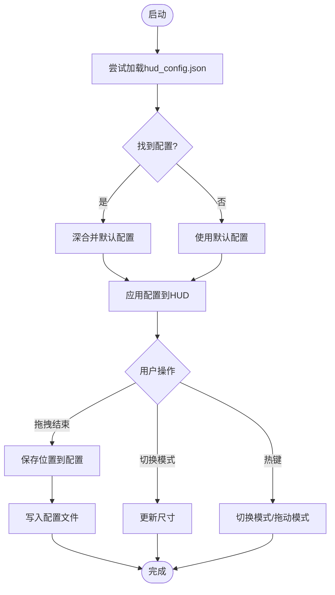
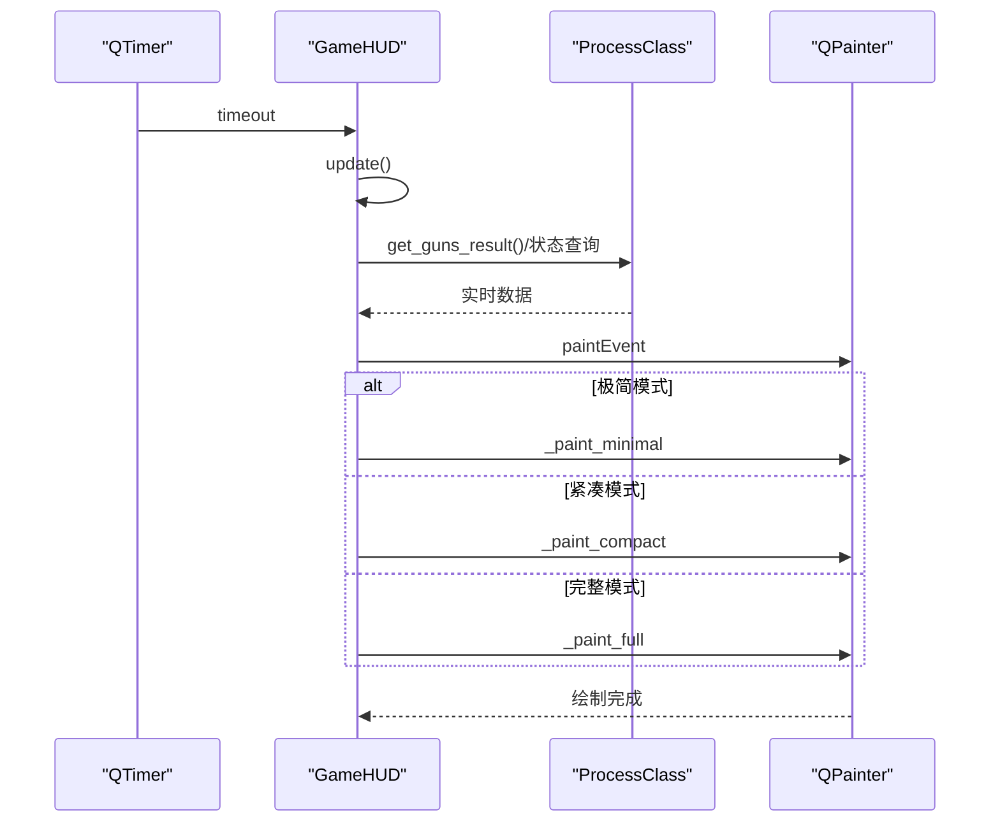
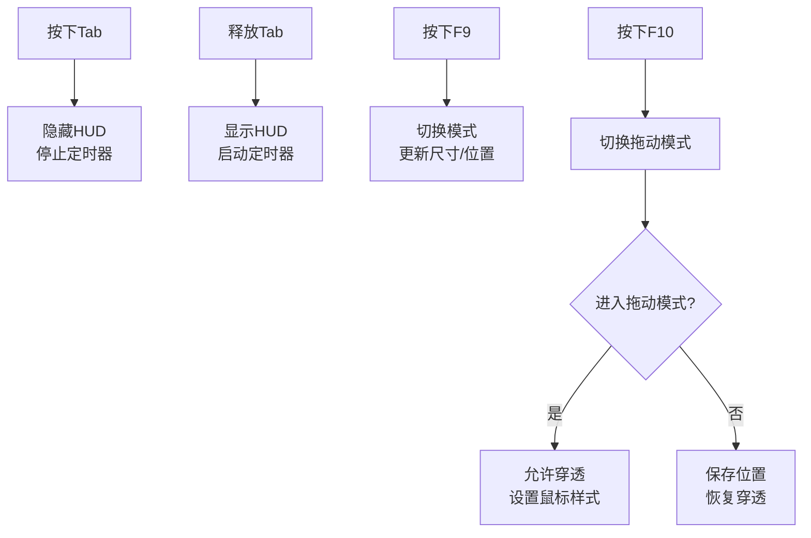
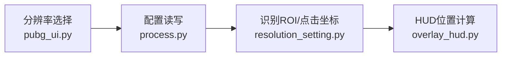
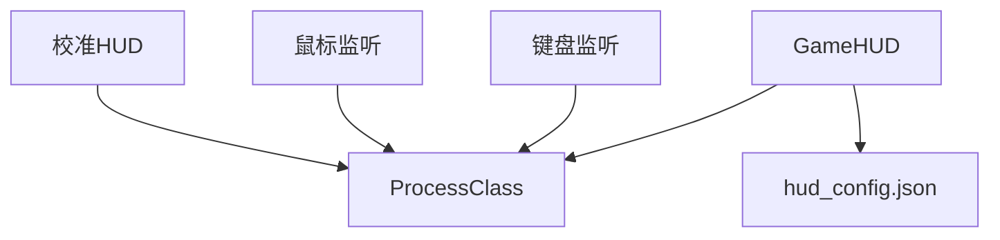

# HUD显示系统

<cite>
**本文档引用的文件**
- [overlay_hud.py](file://ui/overlay_hud.py)
- [hud_config.json](file://Config/hud_config.json)
- [process.py](file://core/process.py)
- [main.py](file://main.py)
- [calibrate_hud.py](file://calibration/calibrate_hud.py)
- [ingame_display.py](file://ui/ingame_display.py)
- [pubg_ui.py](file://ui/pubg_ui.py)
- [key_listener.py](file://input/key_listener.py)
- [mouse_listener.py](file://input/mouse_listener.py)
- [resolution_setting.py](file://data/resolution_setting.py)
</cite>

## 目录
1. [简介](#简介)
2. [项目结构](#项目结构)
3. [核心组件](#核心组件)
4. [架构总览](#架构总览)
5. [详细组件分析](#详细组件分析)
6. [依赖关系分析](#依赖关系分析)
7. [性能考虑](#性能考虑)
8. [故障排除指南](#故障排除指南)
9. [结论](#结论)
10. [附录](#附录)

## 简介
本技术文档深入解析PUBG宏识别工具中的HUD显示系统，重点阐述游戏内悬浮窗的实现原理与设计架构。系统提供三档显示模式（极简、紧凑、完整），支持拖拽定位与热键控制，具备窗口穿透、透明度控制、位置记忆与配置持久化能力。文档还涵盖渲染机制、实时数据更新策略、性能优化技术，以及通过hud_config.json进行个性化配置的方法，并提供使用示例、多分辨率适配方案与异常处理建议。

## 项目结构
HUD显示系统主要位于ui目录下的overlay_hud.py，配合Config/hud_config.json进行配置管理，核心数据来源于core/process.py中的ProcessClass，UI交互由main.py与pubg_ui.py协调，键盘与鼠标输入由input目录下的监听器提供。

**图表来源**
- [overlay_hud.py:1-698](file://ui/overlay_hud.py#L1-L698)
- [process.py:1-405](file://core/process.py#L1-L405)
- [main.py:1-294](file://main.py#L1-L294)
- [hud_config.json:1-91](file://Config/hud_config.json#L1-L91)
- [ingame_display.py:1-558](file://ui/ingame_display.py#L1-L558)
- [calibrate_hud.py:1-528](file://calibration/calibrate_hud.py#L1-L528)

**章节来源**
- [overlay_hud.py:1-698](file://ui/overlay_hud.py#L1-L698)
- [main.py:1-294](file://main.py#L1-L294)

## 核心组件
- GameHUD：三档显示模式的悬浮窗，负责窗口管理、透明度控制、位置记忆与配置持久化，支持拖拽定位与热键控制。
- 配置系统：hud_config.json提供位置、字体、颜色、尺寸、透明度、刷新频率与热键等配置项。
- 数据源：ProcessClass提供当前枪械、姿态、开镜状态、第一人称状态等实时数据。
- 输入系统：键盘与鼠标监听器将用户操作转化为状态变更，驱动HUD实时更新。
- 校准HUD：独立的校准界面，支持穿透/编辑模式切换、拖拽移动与热键控制。

**章节来源**
- [overlay_hud.py:229-670](file://ui/overlay_hud.py#L229-L670)
- [hud_config.json:1-91](file://Config/hud_config.json#L1-L91)
- [process.py:13-405](file://core/process.py#L13-L405)
- [key_listener.py:1-70](file://input/key_listener.py#L1-L70)
- [mouse_listener.py:1-64](file://input/mouse_listener.py#L1-L64)
- [calibrate_hud.py:159-528](file://calibration/calibrate_hud.py#L159-L528)

## 架构总览
HUD系统采用“配置驱动 + 实时数据 + 渲染更新”的架构：
- 配置驱动：从hud_config.json加载初始配置，支持动态重载与保存。
- 实时数据：ProcessClass提供当前状态（枪械、姿态、开镜、第一人称等），通过定时器触发更新。
- 渲染更新：QTimer驱动paintEvent，根据当前模式绘制不同复杂度的内容。
- 窗口管理：通过Win32 API实现穿透/非穿透切换，支持拖拽定位与位置记忆。

**图表来源**
- [overlay_hud.py:192-371](file://ui/overlay_hud.py#L192-L371)
- [overlay_hud.py:390-632](file://ui/overlay_hud.py#L390-L632)
- [process.py:131-205](file://core/process.py#L131-L205)
- [hud_config.json:1-91](file://Config/hud_config.json#L1-91)

## 详细组件分析

### GameHUD类设计与实现
- 窗口管理：使用Qt框架创建无边框置顶窗口，支持透明背景与固定尺寸；通过Win32 API实现穿透/非穿透模式切换。
- 三档显示模式：
  - 极简：仅显示当前枪械、瞄具、姿态与状态指示灯，适合最小干扰。
  - 紧凑：显示武器槽位、配件列表与开镜/开火状态，兼顾信息密度与简洁。
  - 完整：显示HUD标题、两把武器详情、姿态、开镜/视角状态与提示信息。
- 拖拽定位：在拖动模式下允许鼠标穿透，拖拽结束后自动保存位置到配置。
- 热键控制：F9循环切换模式，F10切换拖动模式，Tab临时隐藏HUD。
- 配置持久化：支持从多个候选路径加载配置，深合并用户配置，保存时去除内部路径字段。
- 实时数据更新：通过QTimer定时触发update，paintEvent根据当前模式绘制内容。

**图表来源**
- [overlay_hud.py:229-670](file://ui/overlay_hud.py#L229-L670)
- [overlay_hud.py:192-227](file://ui/overlay_hud.py#L192-L227)

**章节来源**
- [overlay_hud.py:229-670](file://ui/overlay_hud.py#L229-L670)

### 配置系统与持久化
- 配置加载：优先从ui/overlay_hud.py同级Config/hud_config.json加载，若不存在则尝试相对路径与上级路径；加载失败时回退到默认配置。
- 默认配置：包含位置、默认模式、字体族与各模式字体大小、颜色集合、尺寸、透明度、刷新周期与热键等。
- 深合并：用户配置与默认配置进行深合并，确保部分覆盖。
- 保存策略：若配置文件路径不可写，则尝试在候选路径中创建；保存时移除内部路径字段，避免污染用户配置。

**图表来源**
- [overlay_hud.py:88-126](file://ui/overlay_hud.py#L88-L126)
- [overlay_hud.py:306-312](file://ui/overlay_hud.py#L306-L312)
- [overlay_hud.py:333-340](file://ui/overlay_hud.py#L333-L340)
- [overlay_hud.py:342-352](file://ui/overlay_hud.py#L342-L352)

**章节来源**
- [overlay_hud.py:88-126](file://ui/overlay_hud.py#L88-L126)
- [hud_config.json:1-91](file://Config/hud_config.json#L1-L91)

### 渲染机制与实时更新
- 渲染策略：paintEvent根据当前模式调用对应的绘制方法，使用抗锯齿提升视觉质量。
- 数据来源：_get_current_gun从ProcessClass获取当前枪械信息，支持双槽位识别结果。
- 状态指示：根据mouse_one、StartFire、firstPerson等状态绘制不同颜色的指示点与文字。
- 刷新控制：基于配置的refresh_ms设置QTimer，保证更新频率与性能平衡。

**图表来源**
- [overlay_hud.py:262-266](file://ui/overlay_hud.py#L262-L266)
- [overlay_hud.py:390-399](file://ui/overlay_hud.py#L390-L399)
- [overlay_hud.py:401-457](file://ui/overlay_hud.py#L401-L457)
- [overlay_hud.py:458-525](file://ui/overlay_hud.py#L458-L525)
- [overlay_hud.py:526-632](file://ui/overlay_hud.py#L526-L632)
- [process.py:131-205](file://core/process.py#L131-L205)

**章节来源**
- [overlay_hud.py:390-632](file://ui/overlay_hud.py#L390-L632)
- [process.py:131-205](file://core/process.py#L131-L205)

### 热键控制机制
- 模式切换：F9循环切换极简/紧凑/完整模式，必要时重新计算位置（如顶部右锚点）。
- 拖动模式：F10切换拖动模式，拖动时允许鼠标穿透，释放后恢复穿透并保存位置。
- 临时隐藏：Tab按下时隐藏HUD，释放时恢复显示，期间停止定时器以节省资源。

**图表来源**
- [overlay_hud.py:199-227](file://ui/overlay_hud.py#L199-L227)
- [overlay_hud.py:315-327](file://ui/overlay_hud.py#L315-L327)
- [overlay_hud.py:328-341](file://ui/overlay_hud.py#L328-L341)
- [overlay_hud.py:342-352](file://ui/overlay_hud.py#L342-L352)

**章节来源**
- [overlay_hud.py:199-227](file://ui/overlay_hud.py#L199-L227)
- [overlay_hud.py:315-352](file://ui/overlay_hud.py#L315-L352)

### 多分辨率适配
- 主界面分辨率设置：通过pubg_ui.py中的分辨率选择控件与process.py的配置读写实现。
- 识别区域适配：resolution_setting.py提供多分辨率下的识别ROI与点击坐标，确保在不同分辨率下正确识别与交互。
- HUD位置适配：当锚点为“顶部右”时，若x为负值，HUD会根据屏幕宽度与边距自动计算x坐标，确保在不同分辨率下保持一致的显示位置。

**图表来源**
- [pubg_ui.py:512-591](file://ui/pubg_ui.py#L512-L591)
- [process.py:53-70](file://core/process.py#L53-L70)
- [resolution_setting.py:1-147](file://data/resolution_setting.py#L1-L147)
- [overlay_hud.py:291-302](file://ui/overlay_hud.py#L291-L302)

**章节来源**
- [pubg_ui.py:512-591](file://ui/pubg_ui.py#L512-L591)
- [process.py:53-70](file://core/process.py#L53-L70)
- [resolution_setting.py:1-147](file://data/resolution_setting.py#L1-L147)
- [overlay_hud.py:291-302](file://ui/overlay_hud.py#L291-L302)

### 校准HUD与编辑模式
- 校准HUD提供独立的校准界面，支持穿透/编辑模式切换、拖拽移动、热键控制（F5-F7、F10、F12）。
- 穿透模式：允许鼠标穿透，便于在游戏内移动校准HUD。
- 编辑模式：允许拖拽移动并保存位置，适合HUD布局调试。

**章节来源**
- [calibrate_hud.py:159-528](file://calibration/calibrate_hud.py#L159-L528)

## 依赖关系分析
- GameHUD依赖ProcessClass提供的实时状态数据，通过定时器驱动更新。
- 配置系统独立于GameHUD，通过文件读写实现配置持久化。
- 输入系统（键盘/鼠标监听）通过信号与槽连接，将用户操作转化为状态变更，间接驱动HUD更新。
- 校准HUD与主HUD共享底层的ProcessClass，但具有独立的UI与热键绑定。

**图表来源**
- [overlay_hud.py:236-260](file://ui/overlay_hud.py#L236-L260)
- [process.py:13-405](file://core/process.py#L13-L405)
- [key_listener.py:1-70](file://input/key_listener.py#L1-L70)
- [mouse_listener.py:1-64](file://input/mouse_listener.py#L1-L64)
- [calibrate_hud.py:159-187](file://calibration/calibrate_hud.py#L159-L187)

**章节来源**
- [overlay_hud.py:236-260](file://ui/overlay_hud.py#L236-L260)
- [process.py:13-405](file://core/process.py#L13-L405)
- [key_listener.py:1-70](file://input/key_listener.py#L1-L70)
- [mouse_listener.py:1-64](file://input/mouse_listener.py#L1-L64)
- [calibrate_hud.py:159-187](file://calibration/calibrate_hud.py#L159-L187)

## 性能考虑
- 刷新频率：默认250ms，可通过配置调整；过低影响响应性，过高增加CPU/GPU负载。
- 抗锯齿：启用抗锯齿提升视觉质量，轻微增加GPU开销。
- 窗口穿透：在非拖动模式下启用穿透，减少与游戏窗口的交互冲突。
- 字体与颜色：统一字体族与颜色集合，避免频繁字体切换与颜色构造带来的开销。
- 定时器与线程：QTimer与QThread分离，避免阻塞UI线程；拖动模式下停止定时器可降低资源消耗。

[本节为通用性能指导，无需特定文件引用]

## 故障排除指南
- HUD不显示或无法穿透：
  - 检查Windows版本与DPI感知设置，确认SetProcessDpiAwareness调用成功。
  - 确认Win32 API可用性，检查GWL_EXSTYLE标志设置。
- 拖拽无效或位置未保存：
  - 确认F10已切换至拖动模式，拖拽结束后释放鼠标。
  - 检查配置文件写入权限，确认候选路径存在。
- 模式切换异常：
  - 确认热键配置正确，检查F9热键是否被其他程序占用。
  - 重启应用后重试，确保配置重载生效。
- 多分辨率适配问题：
  - 在主界面选择正确的分辨率，确保resolution_setting.py中的ROI与点击坐标匹配当前分辨率。
  - 若HUD位置异常，调整position.anchor与margin_right。

**章节来源**
- [overlay_hud.py:18-39](file://ui/overlay_hud.py#L18-L39)
- [overlay_hud.py:41-55](file://ui/overlay_hud.py#L41-L55)
- [overlay_hud.py:306-312](file://ui/overlay_hud.py#L306-L312)
- [overlay_hud.py:342-352](file://ui/overlay_hud.py#L342-L352)
- [resolution_setting.py:1-147](file://data/resolution_setting.py#L1-L147)

## 结论
HUD显示系统通过清晰的模块划分与配置驱动实现了高度可定制的游戏内悬浮窗体验。三档显示模式满足不同场景需求，拖拽定位与热键控制提升了易用性，配置持久化保障了用户体验的一致性。结合ProcessClass提供的实时数据与输入监听器的事件驱动，系统在保证性能的同时提供了丰富的交互能力。建议在实际部署中关注配置文件权限、多分辨率适配与热键冲突等问题，以获得最佳使用体验。

[本节为总结性内容，无需特定文件引用]

## 附录

### 使用示例与个性化配置
- 自定义显示内容：
  - 通过hud_config.json调整position、font_family、font_size、colors、size、opacity、refresh_ms与hotkey_mode_switch等字段。
  - 示例：将default_mode设为compact或full，以显示更详细的信息。
- 多分辨率适配：
  - 在主界面选择目标分辨率，确保识别ROI与点击坐标正确。
  - 若HUD位置不符合预期，调整position.anchor与margin_right。
- 处理显示异常：
  - 临时隐藏：按下Tab键隐藏HUD，释放后恢复。
  - 拖动锁定：按下F10进入拖动模式，拖拽结束后自动保存位置。
  - 热键冲突：修改hotkey_mode_switch为其他未使用的键位。

**章节来源**
- [hud_config.json:1-91](file://Config/hud_config.json#L1-L91)
- [overlay_hud.py:315-352](file://ui/overlay_hud.py#L315-L352)
- [overlay_hud.py:291-302](file://ui/overlay_hud.py#L291-L302)
- [pubg_ui.py:512-591](file://ui/pubg_ui.py#L512-L591)