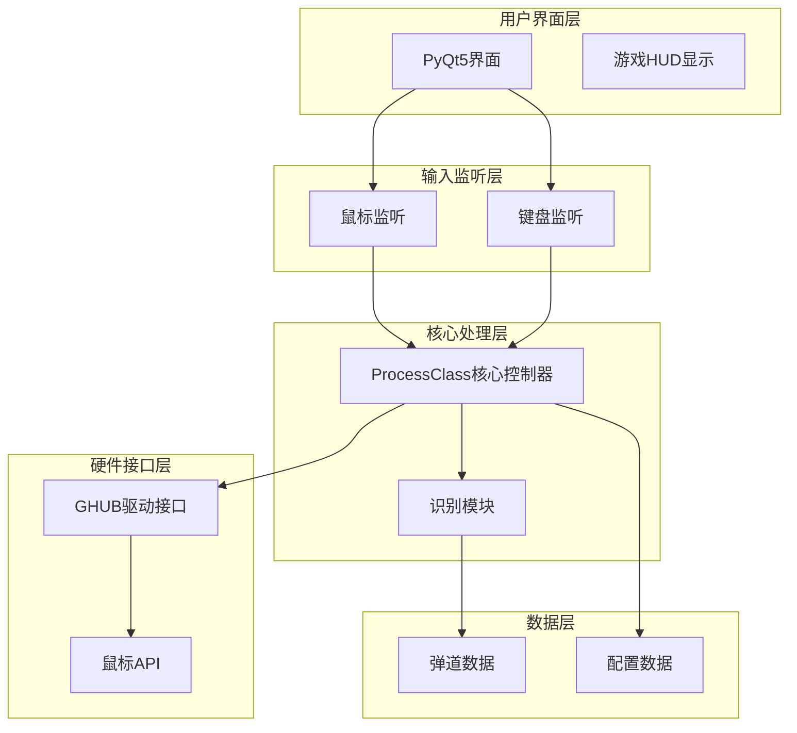
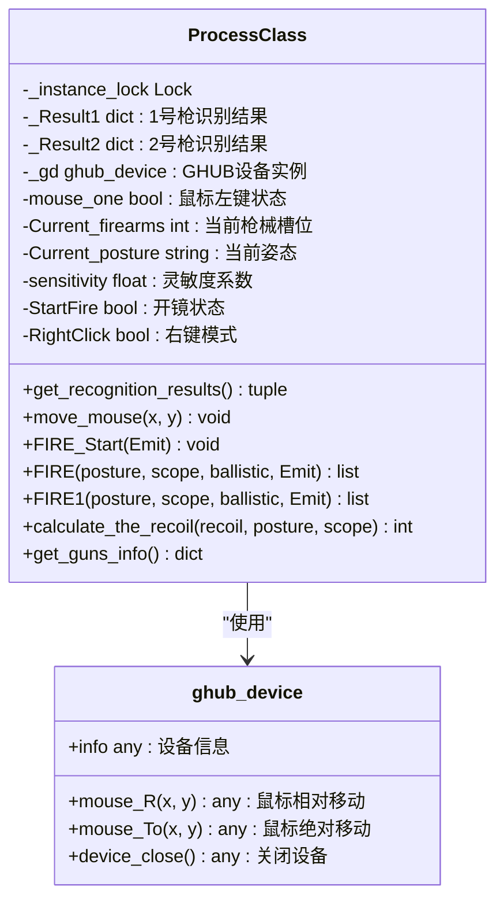
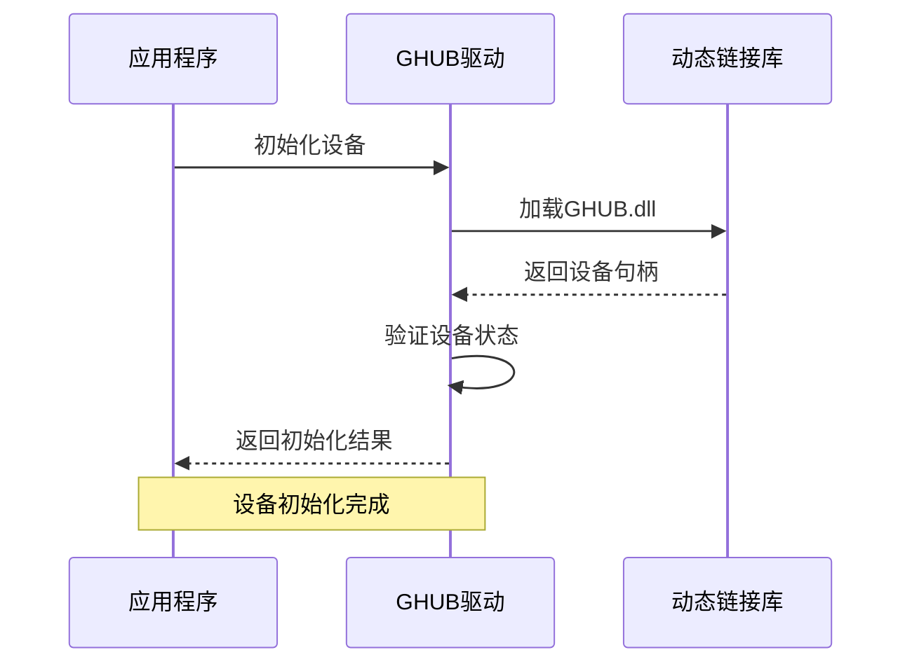
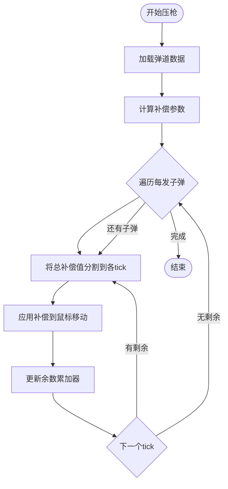
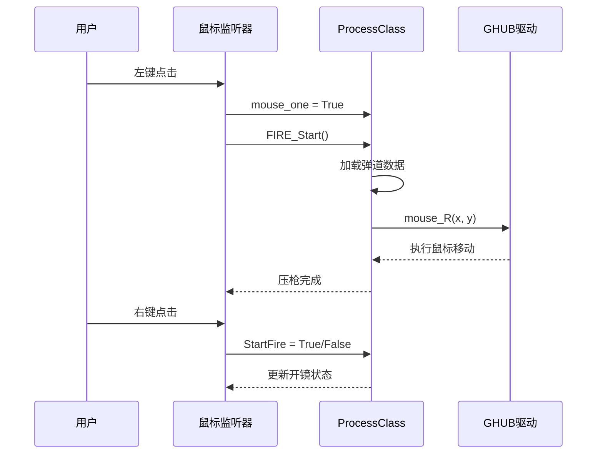
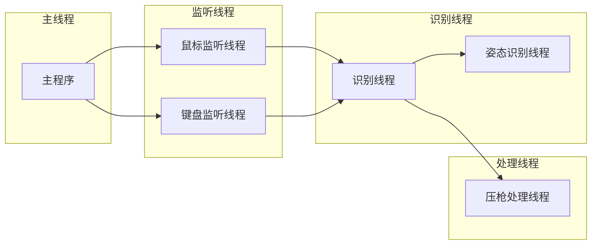

# 压枪控制系统

<cite>
**本文档引用的文件**
- [process.py](file://core/process.py)
- [ghub.py](file://core/ghub.py)
- [recognition.py](file://core/recognition.py)
- [bullet_data.py](file://data/bullet_data.py)
- [fire_data.py](file://data/fire_data.py)
- [mouse_listener.py](file://input/mouse_listener.py)
- [key_listener.py](file://input/key_listener.py)
- [config.json](file://Config/config.json)
- [main.py](file://main.py)
- [m416.json](file://_internal/GunData/m416.json)
- [ace32.json](file://_internal/GunData/ace32.json)
</cite>

## 目录
1. [项目概述](#项目概述)
2. [系统架构](#系统架构)
3. [核心组件分析](#核心组件分析)
4. [压枪算法实现](#压枪算法实现)
5. [弹道数据系统](#弹道数据系统)
6. [输入监听集成](#输入监听集成)
7. [配置管理系统](#配置管理系统)
8. [性能优化策略](#性能优化策略)
9. [故障排除指南](#故障排除指南)
10. [总结](#总结)

## 项目概述

压枪控制系统是一个基于Python开发的自动化PUBG游戏辅助系统，专门用于实现精确的自动压枪功能。该系统通过计算机视觉技术识别游戏中的枪械和姿态，结合弹道数据和实时补偿机制，为玩家提供稳定的射击辅助。

### 主要功能特性
- **智能枪械识别**：支持多种枪械类型的自动识别和分类
- **姿态检测**：实时检测玩家的站立、蹲下、趴下姿态
- **弹道补偿**：基于物理模型的精确后坐力补偿
- **实时鼠标控制**：通过GHUB驱动实现精确的鼠标移动控制
- **多配置支持**：支持不同倍镜和配件组合的个性化设置

## 系统架构

系统采用模块化设计，主要分为以下几个核心层次：



**图表来源**
- [process.py:13-405](file://core/process.py#L13-L405)
- [main.py:11-294](file://main.py#L11-L294)

**章节来源**
- [process.py:13-405](file://core/process.py#L13-L405)
- [main.py:11-294](file://main.py#L11-L294)

## 核心组件分析

### ProcessClass核心控制器

ProcessClass是整个系统的核心控制器，实现了单例模式设计，负责协调各个模块的工作。

#### 核心属性和方法



**图表来源**
- [process.py:13-405](file://core/process.py#L13-L405)
- [ghub.py:5-55](file://core/ghub.py#L5-L55)

#### 单例模式实现

系统采用双重检查锁定的单例模式，确保全局只有一个ProcessClass实例：

```python
@classmethod
def get_recognition_results(cls):
    return cls._Result1, cls._Result2

def __new__(cls, *args, **kwargs):
    if not hasattr(ProcessClass, "_instance"):
        with ProcessClass._instance_lock:
            if not hasattr(ProcessClass, "_instance"):
                ProcessClass._instance = object.__new__(cls)
    return ProcessClass._instance
```

**章节来源**
- [process.py:19-29](file://core/process.py#L19-L29)
- [process.py:31-48](file://core/process.py#L31-L48)

### GHUB驱动接口

GHUB驱动提供了底层的鼠标和键盘控制能力，通过动态链接库实现与游戏的交互。

#### 驱动初始化流程



**图表来源**
- [ghub.py:8-21](file://core/ghub.py#L8-L21)

**章节来源**
- [ghub.py:5-55](file://core/ghub.py#L5-L55)

## 压枪算法实现

### 弹道补偿计算

压枪算法的核心是基于物理模型的弹道补偿计算，主要公式如下：

#### 基础补偿公式

```
补偿值 = round(姿态系数 × (每tick后坐力 × 倍镜系数))
```

其中：
- **姿态系数**：根据站立、蹲下、趴下姿态调整的后坐力系数
- **每tick后坐力**：从弹道数据中获取的每帧后坐力值
- **倍镜系数**：根据当前使用的瞄准镜类型调整的灵敏度系数

#### v2版本改进算法

对于支持v2格式的枪械，系统实现了更精确的补偿算法：



**图表来源**
- [process.py:310-362](file://core/process.py#L310-L362)

#### 实时补偿机制

系统实现了亚像素精度的实时补偿机制，通过余数累加器确保总补偿量的精确性：

```python
# v2版本的补偿实现
y_remainder = 0.0
x_remainder = 0.0

for shot_idx in range(len(y_array)):
    y_total = y_array[shot_idx]
    x_total = x_array[shot_idx] if shot_idx < len(x_array) else 0.0
    
    y_per_tick = y_total / ticks_per_shot
    x_per_tick = x_total / ticks_per_shot
    
    for _ in range(ticks_per_shot):
        y_exact = posture * (y_per_tick * scope) + y_remainder
        x_exact = posture * (x_per_tick * scope) + x_remainder
        
        y_move = int(round(y_exact))
        x_move = int(round(x_exact))
        
        y_remainder = y_exact - y_move
        x_remainder = x_exact - x_move
        
        self._gd.mouse_R(x_move, y_move)
```

**章节来源**
- [process.py:310-362](file://core/process.py#L310-L362)
- [process.py:368-404](file://core/process.py#L368-L404)

### 不同枪械的弹道特性处理

系统针对不同类型的枪械实现了差异化的处理策略：

#### 全自动枪械处理

全自动枪械采用高频tick处理，tick间隔约为9ms：

```python
# 全自动枪械的处理流程
def FIRE(self, posture, scope, ballistic, Emit):
    remainder = 0.0
    for i in ballistic:
        recoil = self.calculate_the_recoil(i, posture, scope)
        exact = recoil + remainder
        move = int(round(exact))
        remainder = exact - move
        self._gd.mouse_R(0, move)
        time.sleep(0.009)  # 9ms间隔
```

#### 半自动枪械处理

半自动枪械采用低频tick处理，tick间隔约为100ms：

```python
# 半自动枪械的处理流程
def FIRE1(self, posture, scope, ballistic, Emit):
    remainder = 0.0
    for i in ballistic:
        recoil = self.calculate_the_recoil(i, posture, scope)
        exact = recoil + remainder
        move = int(round(exact))
        remainder = exact - move
        self._gd.mouse_R(0, move)
        time.sleep(0.1)  # 100ms间隔
```

**章节来源**
- [process.py:368-404](file://core/process.py#L368-L404)

## 弹道数据系统

### 数据结构设计

系统使用JSON格式存储弹道数据，支持v1和v2两种版本格式：

#### v1版本数据结构

```json
{
    "stand": 1.0,
    "squat": 0.80,
    "lie": 0.56,
    "guichs": [0, 0, 0],
    "guichn": [10, 0, 2, 0, 2, 2, ...],
    "guicvs": [0, 0, 0],
    "guicvn": [10, 0, 2, 2, 0, 2, ...]
}
```

#### v2版本数据结构

```json
{
    "version": 2,
    "weapon": "m416",
    "rpm": 700,
    "tick_ms": 9,
    "ticks_per_shot": 10,
    "posture": {
        "z": 0.55,
        "c": 0.81,
        "none": 1.0
    },
    "recoil": {
        "A0B0C0": {
            "y": [14.0, 15.0, 15.0, ...],
            "x": [0.0, 0.0, 0.0, ...]
        }
    }
}
```

### 配件组合识别

系统通过特定的命名规则识别不同的配件组合：

```python
def get_accessories_nameCode(self, guns_info):
    NameCode = ""
    type_dict = {"Muzzle": "A", "Grip": "B", "Stock": "C"}
    for name, value in type_dict.items():
        accessories = guns_info.get(name, "None").lower()
        code_num = KEY_DATA[name][accessories]
        NameCode += value + code_num
    return NameCode
```

**章节来源**
- [process.py:263-275](file://core/process.py#L263-L275)
- [m416.json:15-93](file://_internal/GunData/m416.json#L15-L93)

## 输入监听集成

### 鼠标监听系统

系统通过pynput库实现鼠标事件监听，支持左键压枪、右键开镜等功能：

#### 鼠标事件处理流程



**图表来源**
- [mouse_listener.py:23-50](file://input/mouse_listener.py#L23-L50)
- [process.py:207-262](file://core/process.py#L207-L262)

#### 键盘监听系统

键盘监听器负责处理各种快捷键操作：

```python
def on_key_pressed(self, key):
    Keys = str(key.name if isinstance(key, Key) else key.char)
    if Keys == "tab":
        self.PC.StartFire = False
        Thread(target=self.PC.recognize_all_guns_info, args=(self.keyInfo.emit,)).start()
    elif Keys in "12":
        self.PC.Change_firearms(Keys)
    elif Keys in "zc" or Keys == "space":
        self.PC.Change_posture(Keys)
    elif Keys == "shift":
        self.PC.on_shift_pressed()
```

**章节来源**
- [mouse_listener.py:13-64](file://input/mouse_listener.py#L13-L64)
- [key_listener.py:14-56](file://input/key_listener.py#L14-L56)

## 配置管理系统

### 配置文件结构

系统使用JSON格式存储配置信息：

```json
{
    "resolution": "3840x2160",
    "sensitivity": {
        "none": 1,
        "hongdian": 1,
        "quanxi": 2,
        "2bei": 1.7,
        "3bei": 5.5,
        "4bei": 11.5,
        "6bei": 5,
        "8bei": 5.7,
        "15bei": 10,
        "shift": 1.5
    }
}
```

### 灵敏度调节机制

系统实现了多层次的灵敏度调节机制：

#### Shift键倍增功能

```python
def shift_multiplier(self):
    shift_scpoe = float(self.ScopeData.get('shift', 0))
    if self.shift_pressed and shift_scpoe:
        if self.Current_firearms and self.StartFire:
            accessor_scope = self.get_current_scope()
            if accessor_scope == 'hongdian':
                self.ScopeData['hongdian'] += shift_scpoe
            elif accessor_scope == 'quanxi':
                self.ScopeData['quanxi'] += shift_scpoe
```

**章节来源**
- [process.py:97-124](file://core/process.py#L97-L124)
- [config.json:1](file://Config/config.json#L1)

## 性能优化策略

### 多线程架构

系统采用多线程设计，确保各个模块能够并行运行：



### 延迟补偿机制

系统实现了基于Windows版本的延迟补偿：

```python
def Computation_latency(self, latency):
    if self.window_version:
        return (latency - 0) / 1000
    return latency / 1000
```

**章节来源**
- [process.py:277-280](file://core/process.py#L277-L280)

## 故障排除指南

### 常见问题及解决方案

#### GHUB驱动问题

**问题描述**：系统无法找到GHUB驱动或设备初始化失败

**解决方案**：
1. 确认GHUB软件已正确安装
2. 检查GHUB.dll文件是否存在
3. 以管理员权限运行程序

#### 识别精度问题

**问题描述**：枪械识别或姿态识别不准确

**解决方案**：
1. 调整屏幕分辨率设置
2. 检查游戏画面清晰度
3. 重新训练识别模型

#### 压枪效果异常

**问题描述**：压枪效果不稳定或过度补偿

**解决方案**：
1. 调整灵敏度系数
2. 检查倍镜设置
3. 重新校准弹道数据

**章节来源**
- [ghub.py:18-20](file://core/ghub.py#L18-L20)
- [process.py:72-82](file://core/process.py#L72-L82)

## 总结

压枪控制系统通过精心设计的架构和算法，实现了高精度的自动压枪功能。系统的主要优势包括：

1. **模块化设计**：清晰的分层架构便于维护和扩展
2. **多算法支持**：支持v1和v2两种弹道数据格式
3. **实时补偿**：亚像素精度的补偿机制确保准确性
4. **灵活配置**：支持多种配置选项满足不同需求
5. **稳定性能**：多线程架构保证系统响应速度

该系统为PUBG玩家提供了可靠的自动压枪辅助，通过精确的弹道补偿和实时鼠标控制，显著提升了射击精度和游戏体验。