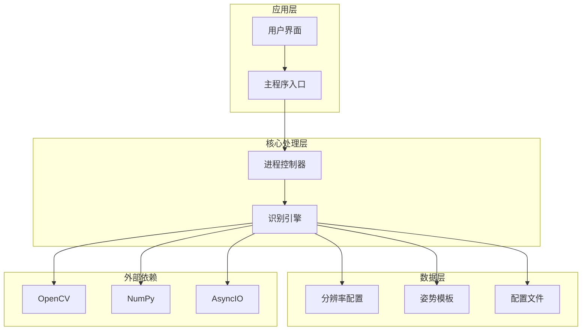
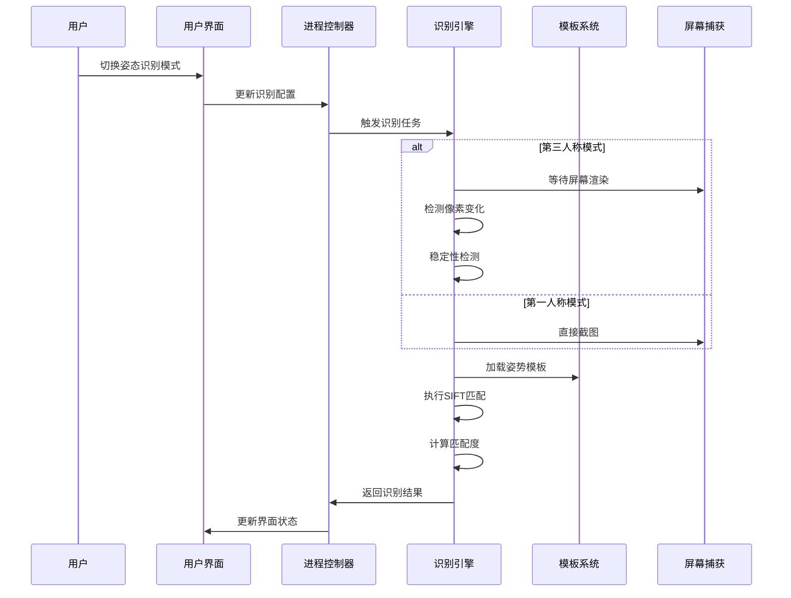
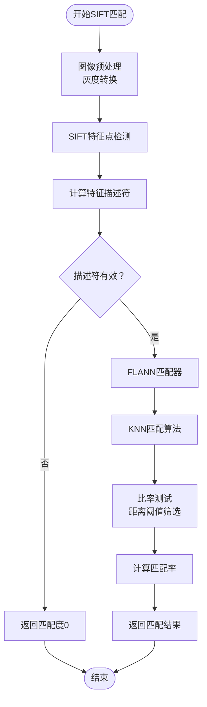
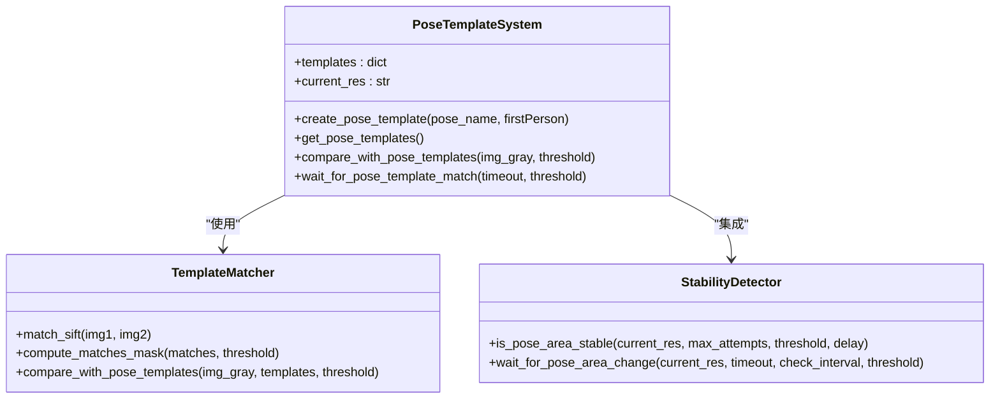
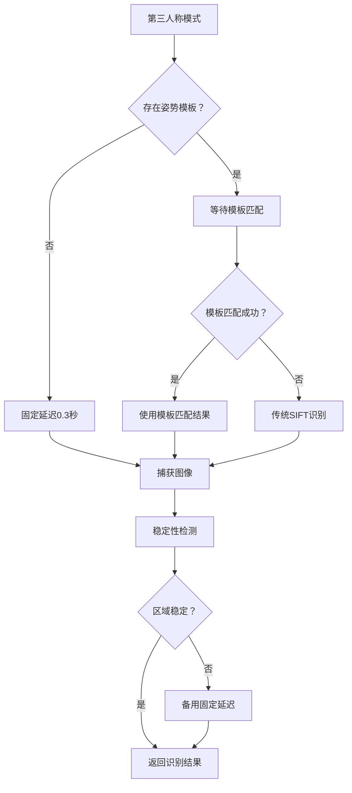
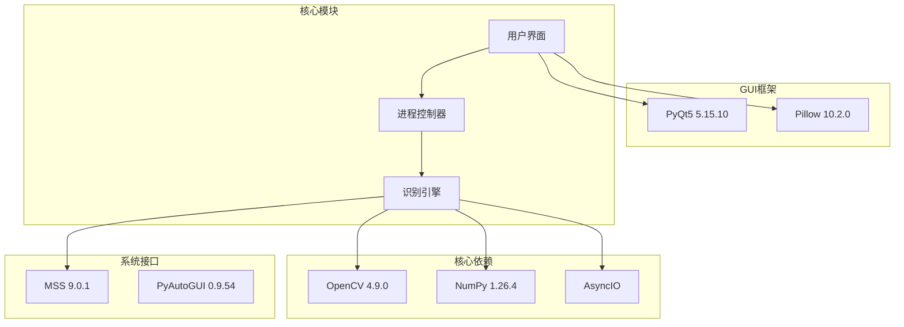

# 姿态识别系统

<cite>
**本文档引用的文件**
- [main.py](file://main.py)
- [core/recognition.py](file://core/recognition.py)
- [core/process.py](file://core/process.py)
- [data/resolution_setting.py](file://data/resolution_setting.py)
- [test_pose.py](file://test_pose.py)
- [requirements.txt](file://requirements.txt)
- [README.md](file://README.md)
- [Config/config.json](file://Config/config.json)
</cite>

## 目录
1. [简介](#简介)
2. [项目结构](#项目结构)
3. [核心组件](#核心组件)
4. [架构概览](#架构概览)
5. [详细组件分析](#详细组件分析)
6. [依赖关系分析](#依赖关系分析)
7. [性能考虑](#性能考虑)
8. [故障排除指南](#故障排除指南)
9. [结论](#结论)
10. [附录](#附录)

## 简介

姿态识别系统是一个基于图像模板匹配的计算机视觉系统，专门用于在PUBG游戏中自动识别玩家的射击姿态。该系统实现了两种主要的识别策略：基于SIFT特征点匹配的传统方法和基于图像模板的精确匹配方法。

系统的核心功能包括：
- **图像模板匹配**：通过预创建的姿势模板进行精确识别
- **自适应等待策略**：针对第三人称模式的屏幕渲染延迟进行智能等待
- **稳定性检测算法**：确保截图的稳定性和准确性
- **多分辨率支持**：支持多种屏幕分辨率的自适应识别

## 项目结构

该项目采用模块化的架构设计，主要分为以下几个核心模块：



**图表来源**
- [main.py:1-294](file://main.py#L1-L294)
- [core/process.py:1-405](file://core/process.py#L1-L405)
- [core/recognition.py:1-478](file://core/recognition.py#L1-L478)

**章节来源**
- [main.py:1-294](file://main.py#L1-L294)
- [README.md:22-67](file://README.md#L22-L67)

## 核心组件

### 1. 主程序入口 (main.py)

主程序负责用户界面管理和应用程序生命周期控制。它集成了姿态识别功能，允许用户通过GUI界面选择不同的识别模式和配置参数。

**主要功能**：
- GUI界面初始化和事件处理
- 姿态识别模式切换（第一人称/第三人称）
- 实时姿态状态显示
- 配置参数管理

### 2. 识别引擎 (core/recognition.py)

这是系统的核心模块，实现了完整的图像识别算法和姿态检测功能。

**核心算法**：
- SIFT特征点检测和匹配
- 模板匹配算法
- 自适应等待策略
- 稳定性检测机制

### 3. 进程控制器 (core/process.py)

负责协调各个组件之间的交互，管理识别任务的执行流程。

**主要职责**：
- 调度识别任务
- 管理状态同步
- 处理用户输入事件
- 控制识别频率

### 4. 分辨率配置 (data/resolution_setting.py)

提供了多分辨率下的屏幕截图区域配置，确保在不同分辨率下都能准确定位姿态区域。

**配置内容**：
- 姿态区域坐标定义
- 枪械识别区域配置
- 开镜状态检测坐标

**章节来源**
- [core/recognition.py:1-478](file://core/recognition.py#L1-L478)
- [core/process.py:1-405](file://core/process.py#L1-L405)
- [data/resolution_setting.py:1-147](file://data/resolution_setting.py#L1-L147)

## 架构概览

系统采用分层架构设计，实现了清晰的关注点分离：



**图表来源**
- [core/process.py:162-170](file://core/process.py#L162-L170)
- [core/recognition.py:365-423](file://core/recognition.py#L365-L423)

## 详细组件分析

### SIFT特征匹配算法

SIFT（Scale-Invariant Feature Transform）算法是系统的核心识别技术，具有以下特点：



**图表来源**
- [core/recognition.py:38-65](file://core/recognition.py#L38-L65)

**实现细节**：
- 使用FLANN（Fast Library for Approximate Nearest Neighbors）加速匹配过程
- 采用KNN算法获取最近的两个匹配点
- 通过距离比率测试（0.7阈值）过滤误匹配
- 计算匹配点数量占总特征点的比例作为匹配度

**章节来源**
- [core/recognition.py:38-65](file://core/recognition.py#L38-L65)

### 模板匹配系统

系统实现了完整的图像模板匹配功能，支持用户自定义姿势模板：



**图表来源**
- [core/recognition.py:252-317](file://core/recognition.py#L252-L317)
- [core/recognition.py:129-171](file://core/recognition.py#L129-L171)

**模板创建流程**：
1. **模板收集**：在第一人称模式下截取标准姿势图像
2. **模板存储**：同时保存灰度模板和彩色参考图像
3. **模板加载**：运行时动态加载可用的模板文件
4. **匹配比较**：使用SIFT算法与模板进行特征点匹配

**章节来源**
- [core/recognition.py:426-466](file://core/recognition.py#L426-L466)

### 自适应等待策略

系统针对第三人称模式的屏幕渲染特性，实现了智能的等待机制：



**图表来源**
- [core/recognition.py:365-423](file://core/recognition.py#L365-L423)

**等待策略优势**：
- **智能检测**：通过像素变化检测判断屏幕渲染状态
- **自适应调整**：根据实际渲染时间动态调整等待策略
- **容错机制**：提供备用的固定延迟作为兜底方案

**章节来源**
- [core/recognition.py:173-210](file://core/recognition.py#L173-L210)
- [core/recognition.py:129-171](file://core/recognition.py#L129-L171)

### 稳定性检测算法

系统实现了双重稳定性检测机制，确保识别结果的准确性：

**像素变化检测**：
- 通过计算连续截图间的相似度来检测像素变化
- 使用模板匹配算法计算归一化相关系数
- 动态阈值判断（默认0.8）来区分变化和稳定状态

**稳定性验证**：
- 连续多次截图比较，确保结果的可靠性
- 指数退避策略，避免过度等待
- 超时保护机制，防止无限等待

**章节来源**
- [core/recognition.py:129-171](file://core/recognition.py#L129-L171)

### 第三人称与第一人称模式差异

系统针对两种视角模式实现了不同的处理策略：

| 特性 | 第三人称模式 | 第一人称模式 |
|------|-------------|-------------|
| **渲染延迟** | 需要等待屏幕完全渲染 | 直接截图，延迟较小 |
| **稳定性要求** | 高，需要像素变化检测 | 相对较低 |
| **模板匹配** | 优先使用模板匹配 | 可选使用模板 |
| **等待策略** | 智能等待+备用延迟 | 直接等待 |
| **识别精度** | 模板匹配优先 | 传统SIFT识别 |

**章节来源**
- [core/recognition.py:211-248](file://core/recognition.py#L211-L248)
- [core/recognition.py:365-423](file://core/recognition.py#L365-L423)

## 依赖关系分析

系统依赖关系清晰，各模块职责明确：



**图表来源**
- [requirements.txt:1-25](file://requirements.txt#L1-L25)
- [core/recognition.py:1-8](file://core/recognition.py#L1-L8)

**依赖特性**：
- **OpenCV**：提供图像处理和特征匹配功能
- **NumPy**：高性能数值计算支持
- **AsyncIO**：异步并发处理能力
- **PyQt5**：图形用户界面框架
- **MSS**：跨平台屏幕捕获

**章节来源**
- [requirements.txt:1-25](file://requirements.txt#L1-L25)

## 性能考虑

### 1. 算法优化策略

**SIFT算法优化**：
- 使用FLANN匹配器替代暴力匹配，显著提升匹配速度
- 通过比率测试过滤误匹配，减少后续处理负担
- 特征点数量限制，避免过多计算开销

**内存管理**：
- 及时释放中间图像数据
- 模板图像缓存机制
- 异步处理避免阻塞主线程

### 2. 性能监控指标

| 指标 | 正常范围 | 优化建议 |
|------|----------|----------|
| **识别延迟** | < 0.1秒 | 优化SIFT参数，使用模板匹配 |
| **匹配准确率** | > 95% | 调整匹配阈值，增加模板数量 |
| **CPU使用率** | < 50% | 并行处理，减少不必要的计算 |
| **内存占用** | < 100MB | 及时清理临时数据 |

### 3. 系统调优建议

**模板匹配优化**：
- 在第一人称模式下创建高质量模板
- 定期更新和维护模板库
- 使用多角度模板提高识别鲁棒性

**识别频率控制**：
- 根据实际需求调整识别间隔
- 实现智能触发机制，避免频繁识别
- 缓存识别结果，减少重复计算

## 故障排除指南

### 常见问题及解决方案

**1. 模板匹配失败**

**症状**：模板匹配返回"None"结果
**可能原因**：
- 模板质量不佳
- 姿势角度偏差过大
- 环境光照变化

**解决步骤**：
1. 检查模板文件是否存在且格式正确
2. 在相同条件下重新创建模板
3. 调整匹配阈值（默认0.3）
4. 确保识别环境光线稳定

**2. 识别延迟过高**

**症状**：识别响应缓慢
**可能原因**：
- CPU性能不足
- 模板数量过多
- 分辨率设置不当

**解决步骤**：
1. 关闭不必要的后台程序
2. 减少模板数量
3. 调整识别频率
4. 优化系统性能

**3. 第三人称模式识别不稳定**

**症状**：第三人称模式下识别结果波动
**可能原因**：
- 等待策略配置不当
- 屏幕渲染延迟变化
- 模板质量不足

**解决步骤**：
1. 调整等待超时时间
2. 增加模板匹配重试次数
3. 优化稳定性检测阈值
4. 检查屏幕刷新率设置

### 调试工具和方法

**1. 日志分析**
- 启用详细日志输出
- 分析识别过程中的关键节点
- 监控性能指标变化

**2. 截图分析**
- 保存识别过程中的关键截图
- 对比模板和目标图像
- 分析匹配特征点分布

**3. 性能监控**
- 监控CPU和内存使用率
- 分析识别耗时分布
- 识别性能瓶颈

**章节来源**
- [core/recognition.py:319-361](file://core/recognition.py#L319-L361)
- [test_pose.py:144-254](file://test_pose.py#L144-L254)

## 结论

姿态识别系统通过结合传统SIFT特征匹配和现代模板匹配技术，实现了高精度、高可靠性的射击姿态识别。系统的主要优势包括：

**技术优势**：
- **双模式识别**：支持传统SIFT和模板匹配两种策略
- **智能等待**：针对第三人称模式的屏幕渲染特性优化
- **稳定性保障**：多重检测机制确保识别准确性
- **多分辨率支持**：完善的分辨率适配机制

**实用性特点**：
- **易于使用**：提供直观的GUI界面
- **可扩展性**：模块化设计便于功能扩展
- **性能优化**：异步处理和算法优化保证实时性
- **容错机制**：完善的错误处理和恢复机制

该系统为PUBG游戏的自动化识别提供了可靠的解决方案，具有良好的应用前景和实用价值。

## 附录

### 使用示例

**创建自定义姿势模板**：
```bash
python test_pose.py create_template 2304x1440 standing
python test_pose.py create_template 2304x1440 crouching  
python test_pose.py create_template 2304x1440 prone
```

**调整匹配阈值**：
```python
# 在wait_for_pose_template_match函数中修改match_threshold参数
# 默认值：0.3
# 建议范围：0.2-0.5
```

**处理识别失败**：
```python
# 检查模板文件是否存在
# 调整识别频率
# 重新创建模板
# 检查环境光线条件
```

### 性能优化建议

**算法层面**：
- 使用更高效的特征匹配算法
- 实现特征点降维处理
- 优化模板存储和加载机制

**系统层面**：
- 实现多线程并行处理
- 优化内存使用和垃圾回收
- 实现智能缓存机制

**硬件层面**：
- 升级CPU和GPU性能
- 增加内存容量
- 使用SSD存储模板文件