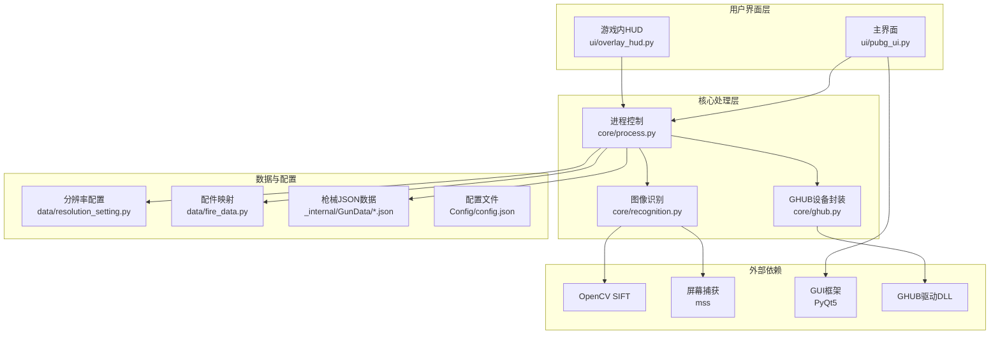
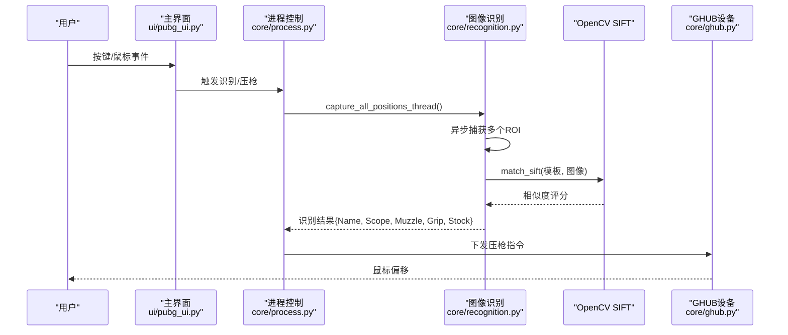
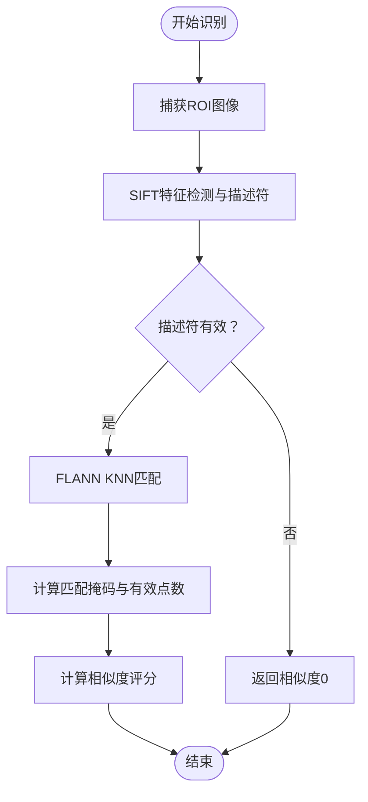
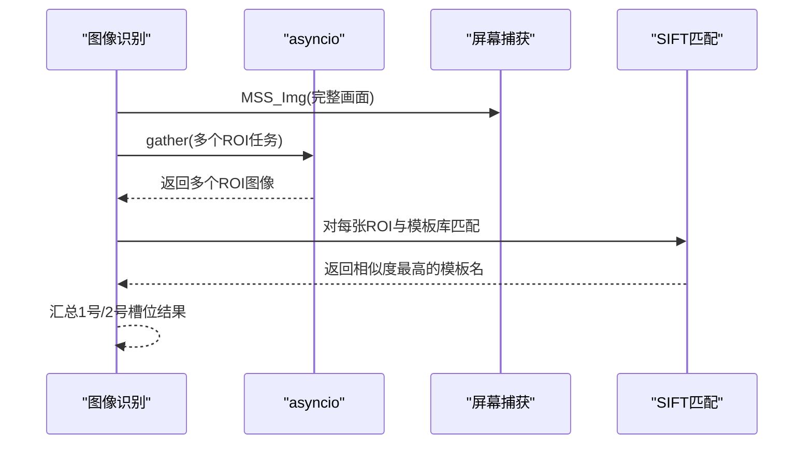
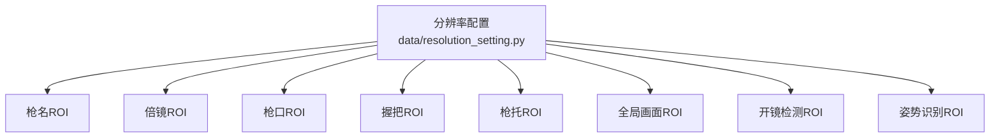
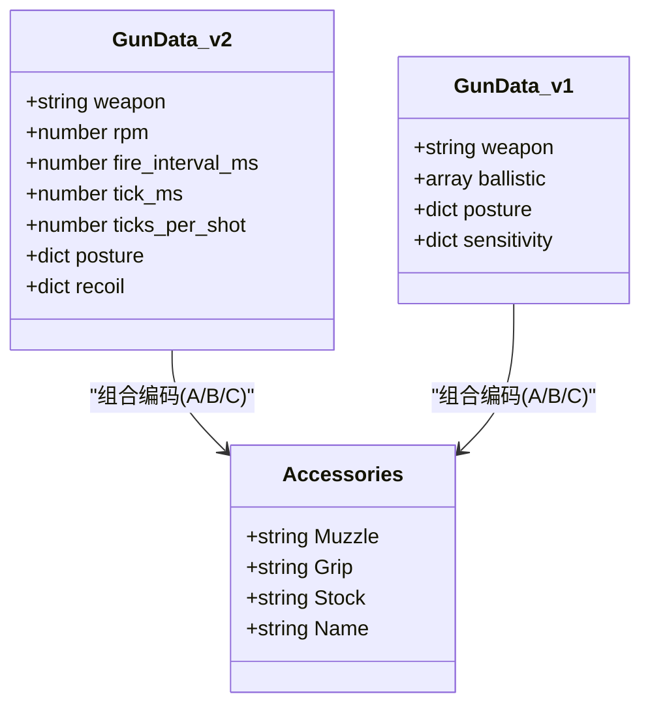
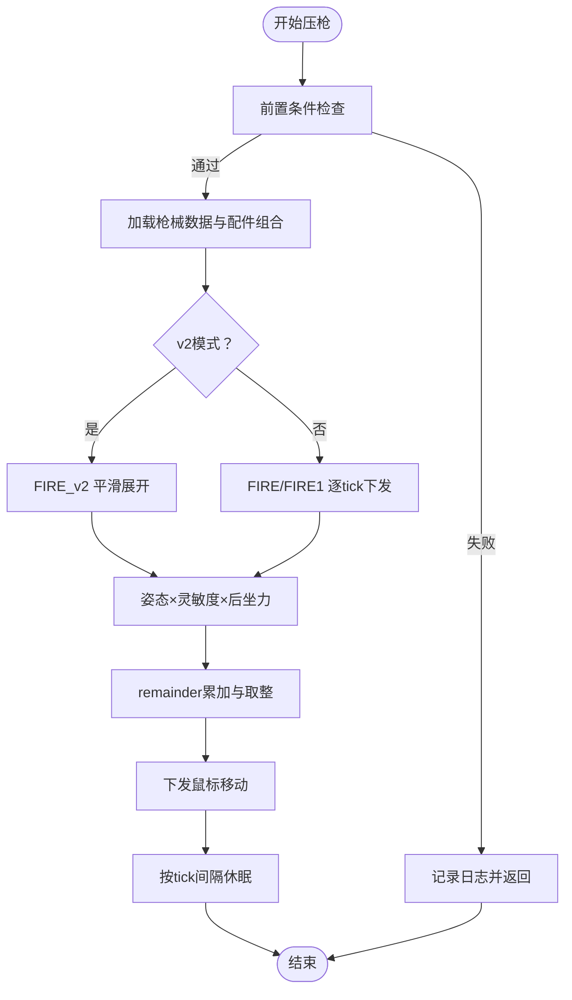
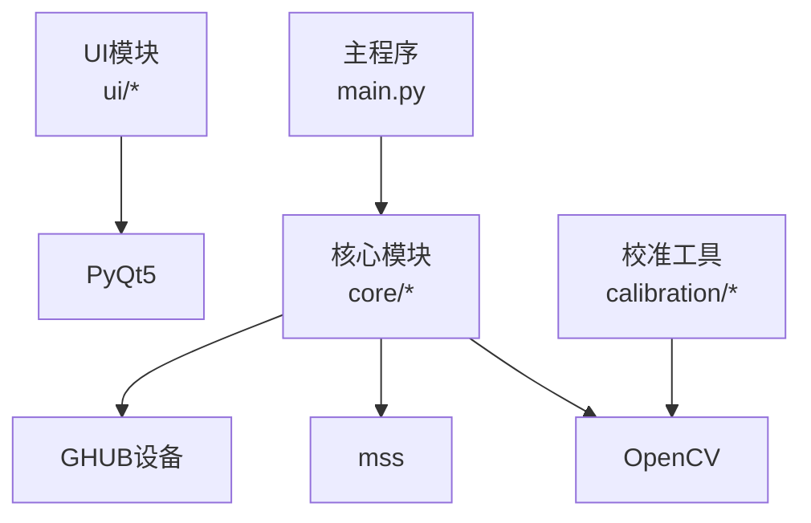

# 枪械识别系统

<cite>
**本文档引用的文件**
- [main.py](file://main.py)
- [core/recognition.py](file://core/recognition.py)
- [core/process.py](file://core/process.py)
- [data/resolution_setting.py](file://data/resolution_setting.py)
- [data/fire_data.py](file://data/fire_data.py)
- [core/ghub.py](file://core/ghub.py)
- [_internal/GunData/m416.json](file://_internal/GunData/m416.json)
- [_internal/GunData/scar-l.json](file://_internal/GunData/scar-l.json)
- [ui/pubg_ui.py](file://ui/pubg_ui.py)
- [ui/overlay_hud.py](file://ui/overlay_hud.py)
- [requirements.txt](file://requirements.txt)
- [README.md](file://README.md)
</cite>

## 目录
1. [简介](#简介)
2. [项目结构](#项目结构)
3. [核心组件](#核心组件)
4. [架构总览](#架构总览)
5. [详细组件分析](#详细组件分析)
6. [依赖关系分析](#依赖关系分析)
7. [性能考虑](#性能考虑)
8. [故障排除指南](#故障排除指南)
9. [结论](#结论)
10. [附录](#附录)

## 简介
本项目是一个基于 OpenCV SIFT 算法的枪械识别系统，能够自动识别游戏中的枪械名称、倍镜、枪口、握把、枪托等配件，并结合姿态、灵敏度与弹道数据实现智能压枪。系统支持多分辨率适配，采用异步图像捕获与模板匹配策略，具备良好的扩展性与准确性。

## 项目结构
项目采用模块化设计，核心模块包括：
- 核心识别与处理：core/recognition.py、core/process.py
- 分辨率与区域配置：data/resolution_setting.py
- 枪械与配件数据：_internal/GunData/*.json、data/fire_data.py
- UI 与 HUD：ui/pubg_ui.py、ui/overlay_hud.py
- 输入监听与设备：input/*、core/ghub.py
- 配置与依赖：Config/config.json、requirements.txt

**图表来源**
- [core/recognition.py](file://core/recognition.py)
- [core/process.py](file://core/process.py)
- [data/resolution_setting.py](file://data/resolution_setting.py)
- [data/fire_data.py](file://data/fire_data.py)
- [core/ghub.py](file://core/ghub.py)
- [ui/pubg_ui.py](file://ui/pubg_ui.py)
- [ui/overlay_hud.py](file://ui/overlay_hud.py)

**章节来源**
- [README.md](file://README.md)
- [requirements.txt](file://requirements.txt)

## 核心组件
- 图像识别与匹配：基于 OpenCV SIFT 特征点检测、描述符计算与 FLANN 匹配，实现跨分辨率的模板匹配与相似度评估。
- 异步图像捕获：使用 asyncio 并行捕获与处理多个 ROI 区域，显著降低识别延迟。
- 多分辨率支持：通过 RESOLUTION_SETTINGS、GUNS_REOLUTION_SETTINGS、Click、Zishi 等配置，适配多种分辨率与屏幕布局。
- 枪械数据结构：v1/v2 两种弹道数据格式，支持配件组合编码与姿态系数，实现精准压枪计算。
- 设备与输入：GHUB 设备封装与 PyQt5 键鼠监听，提供稳定的压枪输出与 UI 交互。

**章节来源**
- [core/recognition.py](file://core/recognition.py)
- [data/resolution_setting.py](file://data/resolution_setting.py)
- [core/process.py](file://core/process.py)
- [core/ghub.py](file://core/ghub.py)

## 架构总览
系统采用“UI 交互 → 进程控制 → 图像识别 → 数据处理 → 设备输出”的流水线架构。识别流程以异步并发为核心，保证在多 ROI 并行处理下的实时性。

**图表来源**
- [core/recognition.py](file://core/recognition.py)
- [core/process.py](file://core/process.py)
- [core/ghub.py](file://core/ghub.py)

## 详细组件分析

### 图像识别与匹配（SIFT）
- 特征点检测与描述符：使用 SIFT 算子提取关键点与描述符，作为模板与目标图像的特征表示。
- 特征匹配：采用 FLANN 匹配器进行 KNN 匹配，通过距离阈值过滤误匹配，计算匹配点数量与总关键点比例，得到相似度评分。
- 识别流程：对每个 ROI 区域与模板库逐一比对，返回最高相似度的模板名称。

**图表来源**
- [core/recognition.py](file://core/recognition.py)

**章节来源**
- [core/recognition.py](file://core/recognition.py)

### 异步图像捕获与并发处理
- 并行捕获：使用 asyncio.gather 并发捕获多个 ROI 区域，减少整体识别耗时。
- 分组处理：将捕获结果分为两组枪械槽位，分别进行模板匹配，最后汇总结果。
- 姿势识别：提供传统 SIFT 识别与模板匹配两种策略，模板匹配优先，失败时回退至传统方法。

**图表来源**
- [core/recognition.py](file://core/recognition.py)

**章节来源**
- [core/recognition.py](file://core/recognition.py)

### 多分辨率支持机制
- ROI 区域配置：RESOLUTION_SETTINGS 提供各分辨率下枪名、倍镜、枪口、握把、枪托的 ROI 坐标。
- 全局画面捕获：GUNS_REOLUTION_SETTINGS 定义全局画面捕获区域，用于一次性截图后按 ROI 分割。
- 开镜检测：Click 配置用于像素采样判断是否处于开镜状态。
- 姿势区域：Zishi 配置用于姿势识别的 ROI 区域。

**图表来源**
- [data/resolution_setting.py](file://data/resolution_setting.py)

**章节来源**
- [data/resolution_setting.py](file://data/resolution_setting.py)

### 枪械数据结构与配件组合识别
- v2 数据格式：每发子弹的 y/x 方向补偿数组，支持平滑展开与水平补偿，提升压枪精度。
- v1 数据格式：按 tick 分配的后坐力列表，兼容旧版数据。
- 配件组合编码：通过 KEY_DATA 将 Muzzle/Grip/Stock 映射为 A/B/C 编码，形成唯一组合键，从 JSON 中取对应弹道数据。
- 姿态系数：posture 字段提供不同姿态下的缩放系数，影响最终压枪强度。

**图表来源**
- [core/process.py](file://core/process.py)
- [_internal/GunData/m416.json](file://_internal/GunData/m416.json)
- [_internal/GunData/scar-l.json](file://_internal/GunData/scar-l.json)
- [data/fire_data.py](file://data/fire_data.py)

**章节来源**
- [core/process.py](file://core/process.py)
- [_internal/GunData/m416.json](file://_internal/GunData/m416.json)
- [_internal/GunData/scar-l.json](file://_internal/GunData/scar-l.json)
- [data/fire_data.py](file://data/fire_data.py)

### 压枪计算与设备输出
- 压枪入口：FIRE/FIRE1/FIRE_v2 根据是否为半自动与 v1/v2 数据格式选择不同路径。
- 计算流程：姿态系数 × (每 tick 后坐力 × 倍镜灵敏度)，累加 remainder 实现亚像素精度。
- 设备输出：通过 GHUB 设备封装下发鼠标移动指令，实现稳定压枪。

**图表来源**
- [core/process.py](file://core/process.py)
- [core/ghub.py](file://core/ghub.py)

**章节来源**
- [core/process.py](file://core/process.py)
- [core/ghub.py](file://core/ghub.py)

### UI 与 HUD
- 主界面：PyQt5 构建，提供分辨率选择、灵敏度配置、开镜模式、视角切换等功能。
- HUD：三档显示模式（极简/紧凑/完整），支持拖动与热键切换，实时展示识别结果与压枪状态。

**章节来源**
- [ui/pubg_ui.py](file://ui/pubg_ui.py)
- [ui/overlay_hud.py](file://ui/overlay_hud.py)

## 依赖关系分析
- OpenCV：提供 SIFT 特征检测与匹配能力。
- mss：高性能屏幕捕获，支持多平台。
- PyQt5：图形界面与事件处理。
- GHUB 驱动：稳定鼠标移动输出。
- numpy/pillow：图像处理与像素采样。

**图表来源**
- [main.py](file://main.py)
- [core/recognition.py](file://core/recognition.py)
- [core/ghub.py](file://core/ghub.py)
- [requirements.txt](file://requirements.txt)

**章节来源**
- [requirements.txt](file://requirements.txt)

## 性能考虑
- 异步并发：通过 asyncio.gather 并行处理多个 ROI，显著降低识别延迟。
- 特征匹配优化：使用 FLANN 匹配器与 KNN 过滤，提高匹配速度与鲁棒性。
- ROI 精准定位：依据分辨率配置精确裁剪 ROI，减少无效区域处理。
- 模板匹配回退：姿势识别优先使用模板匹配，失败时回退 SIFT，兼顾准确与速度。
- 压枪平滑：v2 模式将每发补偿均匀分配到多个 tick，消除锯齿，提升稳定性。

[本节为通用性能讨论，无需具体文件分析]

## 故障排除指南
- 识别不准确
  - 检查分辨率配置是否正确，必要时调整 RESOLUTION_SETTINGS 中的 ROI 坐标。
  - 参考 README 中的“分辨率适配”说明，启用调试截图查看 ROI 截图效果。
- 开镜状态误判
  - 确认 Click 配置与当前分辨率匹配，必要时微调像素采样坐标。
- 姿势识别异常
  - 若模板匹配失败，系统会回退至 SIFT 识别；也可手动创建姿势模板并放置于 _internal/data/pose_templates/。
- 压枪不稳定
  - 检查灵敏度配置是否合理，必要时在 GUI 中保存修改。
  - 确认 GHUB 驱动已正确安装，设备初始化信息正常。

**章节来源**
- [README.md](file://README.md)
- [core/recognition.py](file://core/recognition.py)
- [data/resolution_setting.py](file://data/resolution_setting.py)

## 结论
该系统通过 OpenCV SIFT 与异步并发技术实现了高效的枪械识别与压枪控制，具备良好的多分辨率适配能力与扩展性。通过 v2 弹道数据与配件组合编码，系统在准确性和稳定性方面均有显著提升。开发者可通过扩展模板与校准工具进一步优化识别效果。

[本节为总结性内容，无需具体文件分析]

## 附录

### 如何使用 match_sift 函数进行特征匹配
- 功能概述：对两张灰度图像进行 SIFT 特征检测与 FLANN 匹配，返回相似度评分。
- 使用场景：适用于模板匹配与跨分辨率识别。
- 关键步骤：创建 SIFT 检测器 → 计算描述符 → FLANN KNN 匹配 → 掩码过滤 → 计算相似度。

**章节来源**
- [core/recognition.py](file://core/recognition.py)

### 如何处理不同分辨率下的图像识别
- 步骤要点：
  - 在 RESOLUTION_SETTINGS 中配置各分辨率下的 ROI 坐标。
  - 在 GUNS_REOLUTION_SETTINGS 中配置全局画面捕获区域。
  - 在 Click/Zishi 中配置开镜检测与姿势识别区域。
- 调试建议：启用调试截图，检查 ROI 是否覆盖目标区域。

**章节来源**
- [data/resolution_setting.py](file://data/resolution_setting.py)

### 如何扩展新的枪械模板
- 模板存放：将模板图像放置于 _internal/data/firearms/类别/ 名称.png。
- 类别对应：Name/Scope/Muzzle/Grip/Stock/Click/zishi。
- 命名规范：模板名称与 JSON 中的键保持一致，便于自动匹配。

**章节来源**
- [core/recognition.py](file://core/recognition.py)

### 识别准确性的提升策略
- 模板质量：确保模板清晰、无遮挡，尽量使用高对比度图像。
- ROI 精准：根据实际屏幕布局微调 ROI 坐标，避免边缘噪声干扰。
- 多分辨率验证：在目标分辨率下进行多次测试，确认识别稳定性。
- v2 数据：优先使用 v2 弹道数据，结合平滑展开与水平补偿提升压枪精度。

**章节来源**
- [core/process.py](file://core/process.py)
- [_internal/GunData/m416.json](file://_internal/GunData/m416.json)