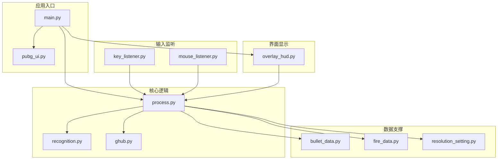
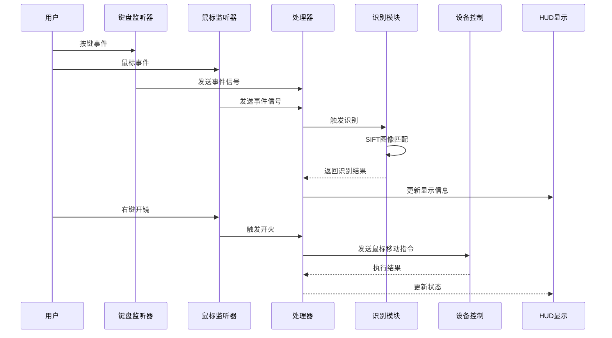
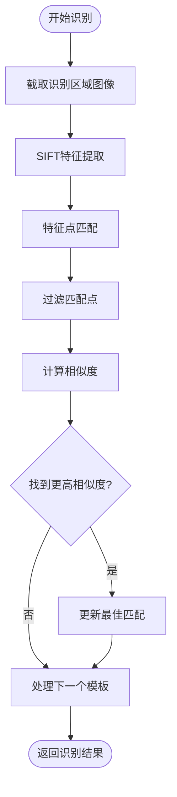
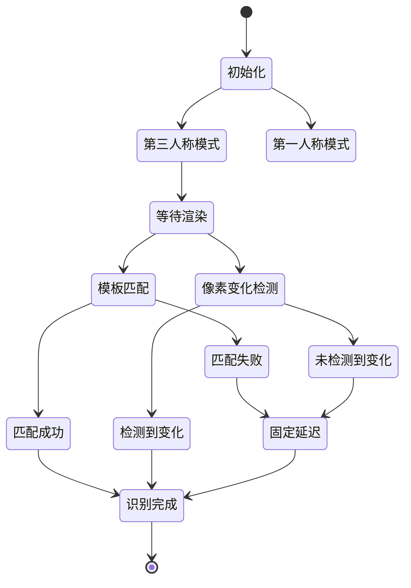
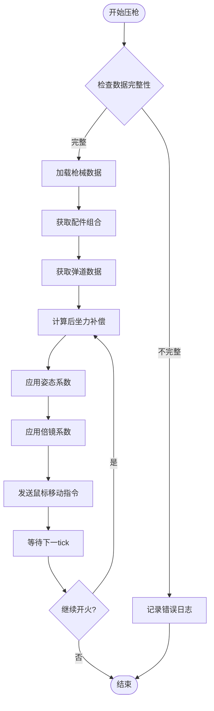
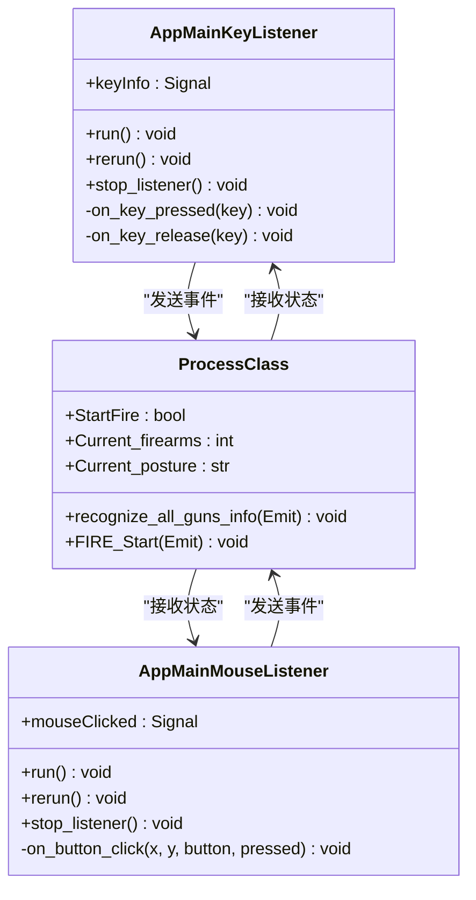
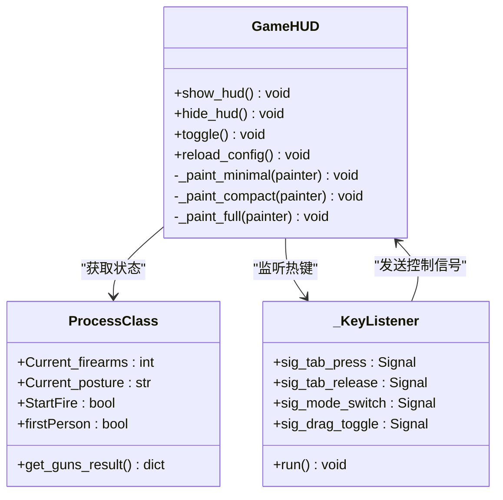
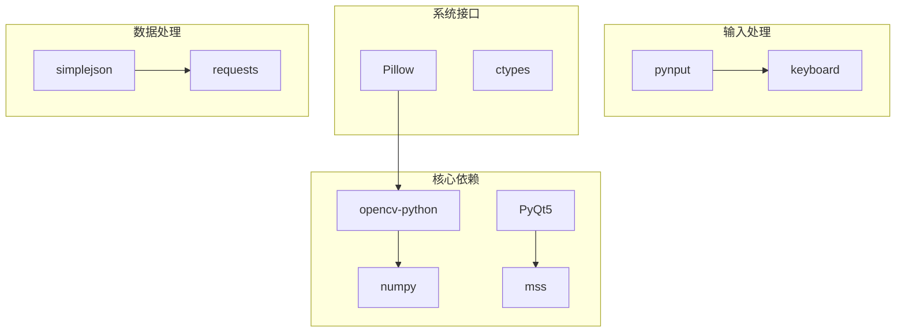

# 核心功能模块

<cite>
**本文档引用的文件**
- [main.py](file://main.py)
- [core/recognition.py](file://core/recognition.py)
- [core/process.py](file://core/process.py)
- [core/ghub.py](file://core/ghub.py)
- [input/key_listener.py](file://input/key_listener.py)
- [input/mouse_listener.py](file://input/mouse_listener.py)
- [ui/overlay_hud.py](file://ui/overlay_hud.py)
- [ui/pubg_ui.py](file://ui/pubg_ui.py)
- [data/bullet_data.py](file://data/bullet_data.py)
- [data/fire_data.py](file://data/fire_data.py)
- [data/resolution_setting.py](file://data/resolution_setting.py)
- [README.md](file://README.md)
- [requirements.txt](file://requirements.txt)
</cite>

## 目录
1. [简介](#简介)
2. [项目结构](#项目结构)
3. [核心组件](#核心组件)
4. [架构总览](#架构总览)
5. [详细组件分析](#详细组件分析)
6. [依赖关系分析](#依赖关系分析)
7. [性能考虑](#性能考虑)
8. [故障排查指南](#故障排查指南)
9. [结论](#结论)
10. [附录](#附录)

## 简介
本项目是一个基于Python的PUBG自动识别压枪工具，集成了枪械识别、姿态识别、压枪控制、输入监听和HUD显示五大核心功能模块。系统采用OpenCV SIFT算法进行图像识别，结合Logitech GHUB驱动实现精准的鼠标输入模拟，提供完整的自动化压枪解决方案。

## 项目结构
项目采用模块化设计，主要分为以下层次：
- **入口层**：main.py负责应用启动和UI集成
- **核心逻辑层**：core/目录包含识别、处理和设备控制逻辑
- **输入监听层**：input/目录处理键盘和鼠标事件
- **界面层**：ui/目录提供游戏内HUD和主窗口界面
- **数据层**：data/目录存储弹道数据、配置和分辨率设置
- **工具层**：calibration/目录提供弹痕校准工具



**图表来源**
- [main.py:1-294](file://main.py#L1-L294)
- [core/process.py:1-405](file://core/process.py#L1-L405)
- [core/recognition.py:1-478](file://core/recognition.py#L1-L478)

**章节来源**
- [README.md:22-67](file://README.md#L22-L67)
- [requirements.txt:1-25](file://requirements.txt#L1-L25)

## 核心组件
系统包含五大核心功能模块，每个模块都有明确的职责分工：

### 枪械识别系统
负责通过SIFT算法自动识别枪械及其配件，支持多种分辨率的统一识别。

### 姿态识别系统  
通过图像识别和键盘追踪双重策略，实时检测玩家的站立、蹲下、趴下等姿态。

### 压枪控制系统
基于弹道数据、配件组合、姿态系数和灵敏度计算，实现精准的后坐力补偿。

### 输入监听系统
监听键盘和鼠标事件，处理Tab识别、切枪、开镜、开火等用户操作。

### HUD显示系统
提供三档游戏内HUD显示，支持Tab切换显示模式，实时展示识别结果和状态信息。

**章节来源**
- [README.md:7-14](file://README.md#L7-L14)

## 架构总览
系统采用事件驱动架构，通过信号槽机制实现模块间通信。整体架构遵循单一职责原则，各模块职责清晰，耦合度低。



**图表来源**
- [input/key_listener.py:1-70](file://input/key_listener.py#L1-L70)
- [input/mouse_listener.py:1-64](file://input/mouse_listener.py#L1-L64)
- [core/process.py:138-262](file://core/process.py#L138-L262)
- [core/recognition.py:67-126](file://core/recognition.py#L67-L126)

## 详细组件分析

### 枪械识别系统分析

#### 实现原理
系统采用OpenCV SIFT算法进行特征点匹配，通过以下步骤实现枪械识别：

1. **图像采集**：使用mss库截取指定区域的图像
2. **特征提取**：SIFT算法提取关键点和描述符
3. **特征匹配**：使用FlannBasedMatcher进行快速匹配
4. **相似度计算**：通过匹配点数量和质量评估相似度
5. **结果输出**：返回最高相似度的枪械类型



**图表来源**
- [core/recognition.py:38-65](file://core/recognition.py#L38-L65)
- [core/recognition.py:67-100](file://core/recognition.py#L67-L100)

#### 关键算法实现
- **SIFT特征匹配**：使用OpenCV的SIFT_create()创建检测器
- **快速最近邻匹配**：通过FlannBasedMatcher实现高效匹配
- **匹配点过滤**：使用距离阈值过滤低质量匹配
- **相似度计算**：基于匹配点数量占总点数的比例

#### 性能优化策略
- **异步处理**：使用asyncio并发处理多个识别任务
- **图像缓存**：避免重复截图和处理
- **阈值优化**：动态调整匹配阈值提高准确性

**章节来源**
- [core/recognition.py:10-24](file://core/recognition.py#L10-L24)
- [core/recognition.py:38-65](file://core/recognition.py#L38-L65)
- [core/recognition.py:83-100](file://core/recognition.py#L83-L100)

### 姿态识别系统分析

#### 实现原理
系统提供两种姿态识别策略：

1. **模板匹配策略**：预先训练姿态模板，通过SIFT匹配识别
2. **像素变化检测策略**：检测特定区域像素变化判断姿态



**图表来源**
- [core/recognition.py:211-248](file://core/recognition.py#L211-L248)
- [core/recognition.py:365-423](file://core/recognition.py#L365-L423)

#### 关键特性
- **自适应等待**：第三人称模式下自动等待屏幕渲染完成
- **模板管理**：支持创建、保存、加载姿态模板
- **多策略切换**：根据可用性自动选择最优识别策略

**章节来源**
- [core/recognition.py:129-170](file://core/recognition.py#L129-L170)
- [core/recognition.py:251-285](file://core/recognition.py#L251-L285)
- [core/recognition.py:427-466](file://core/recognition.py#L427-L466)

### 压枪控制系统分析

#### 实现原理
压枪控制基于物理模型，通过以下公式计算每tick的鼠标移动量：

```
mouse_move = round(posture * (recoil * scope))
```

其中：
- `recoil`：枪械JSON中的基准补偿值
- `scope`：倍镜/机瞄灵敏度倍率
- `posture`：姿态系数（站立/蹲下/趴下）



**图表来源**
- [core/process.py:183-197](file://core/process.py#L183-L197)
- [core/process.py:207-262](file://core/process.py#L207-L262)

#### 支持的压枪模式
- **v1兼容模式**：基于预设弹道数组的逐tick补偿
- **v2高级模式**：支持每发子弹的平滑补偿和水平补偿
- **半自动模式**：针对非连发枪械的特殊处理

**章节来源**
- [core/process.py:183-197](file://core/process.py#L183-L197)
- [core/process.py:286-362](file://core/process.py#L286-L362)
- [core/process.py:368-404](file://core/process.py#L368-L404)

### 输入监听系统分析

#### 键盘监听器
负责处理键盘事件，包括：
- **Tab键**：触发枪械识别
- **1/2键**：切换枪械
- **Z/C键**：切换姿态
- **Shift键**：倍镜灵敏度调节
- **Insert键**：重置所有状态

#### 鼠标监听器
负责处理鼠标事件，包括：
- **左键**：开火控制和压枪
- **右键**：开镜控制
- **X1/X2键**：强制停止开火



**图表来源**
- [input/key_listener.py:6-70](file://input/key_listener.py#L6-L70)
- [input/mouse_listener.py:13-64](file://input/mouse_listener.py#L13-L64)
- [core/process.py:138-170](file://core/process.py#L138-L170)

**章节来源**
- [input/key_listener.py:14-56](file://input/key_listener.py#L14-L56)
- [input/mouse_listener.py:23-50](file://input/mouse_listener.py#L23-L50)

### HUD显示系统分析

#### 显示模式
系统提供三档HUD显示模式：
- **极简模式**：仅显示核心信息
- **紧凑模式**：显示详细枪械信息
- **完整模式**：显示所有相关信息

#### 功能特性
- **可配置布局**：支持位置、尺寸、颜色配置
- **热键控制**：F9切换模式，F10切换拖拽
- **Tab临时隐藏**：不影响游戏体验
- **自动保存**：拖拽位置自动保存到配置



**图表来源**
- [ui/overlay_hud.py:229-698](file://ui/overlay_hud.py#L229-L698)
- [ui/overlay_hud.py:192-227](file://ui/overlay_hud.py#L192-L227)

**章节来源**
- [ui/overlay_hud.py:68-126](file://ui/overlay_hud.py#L68-L126)
- [ui/overlay_hud.py:374-386](file://ui/overlay_hud.py#L374-L386)

## 依赖关系分析

### 外部依赖
系统依赖以下关键库：



**图表来源**
- [requirements.txt:1-25](file://requirements.txt#L1-L25)

### 内部模块依赖
- **main.py** 依赖所有核心模块
- **core/process.py** 依赖识别模块和设备控制
- **识别模块** 依赖OpenCV和NumPy
- **输入监听** 依赖pynput和PyQt5
- **HUD** 依赖PyQt5和配置文件

**章节来源**
- [requirements.txt:1-25](file://requirements.txt#L1-L25)

## 性能考虑

### 识别性能优化
1. **异步并发**：使用asyncio并行处理多个识别任务
2. **图像缓存**：避免重复截图和处理
3. **阈值优化**：动态调整匹配阈值提高准确性
4. **分辨率适配**：统一模板减少重复训练

### 压枪性能优化
1. **精确计算**：使用round()函数确保整数移动量
2. **余量累加**：使用remainder变量处理亚像素精度
3. **延迟优化**：根据系统版本调整计算延迟
4. **数据预加载**：提前加载弹道数据减少运行时开销

### 内存管理
1. **图像资源**：及时释放截图资源
2. **线程安全**：使用锁机制保护共享数据
3. **配置缓存**：避免频繁读写配置文件

## 故障排查指南

### 常见问题及解决方案

#### 驱动相关问题
- **问题**：驱动初始化失败
- **原因**：缺少GHUB/LGS驱动或文件缺失
- **解决**：安装正确版本的Logitech驱动

#### 识别精度问题
- **问题**：枪械识别不准确
- **原因**：截图区域配置不正确
- **解决**：调整resolution_setting.py中的坐标值

#### 压枪不准问题
- **问题**：压枪过度或不足
- **原因**：灵敏度设置不当
- **解决**：调整config.json中的灵敏度系数

#### HUD显示问题
- **问题**：HUD无法显示或显示异常
- **原因**：配置文件损坏或权限不足
- **解决**：删除配置文件重新生成

**章节来源**
- [core/ghub.py:8-21](file://core/ghub.py#L8-L21)
- [README.md:87-104](file://README.md#L87-L104)

## 结论
本项目通过模块化设计实现了完整的PUBG自动识别压枪解决方案。各模块职责明确，耦合度低，具有良好的可维护性和扩展性。系统采用先进的计算机视觉技术和精确的物理模型，能够提供稳定的压枪效果。通过合理的性能优化和故障处理机制，确保了系统的可靠性和用户体验。

## 附录

### 配置文件说明
- **config.json**：用户配置文件，包含分辨率和灵敏度设置
- **hud_config.json**：HUD显示配置，支持位置、颜色、字体等自定义

### 支持的枪械类型
系统支持多种主流枪械，包括步枪、狙击枪、冲锋枪和机枪等类别。

### 扩展开发建议
1. **添加新枪械支持**：在GunData目录添加对应的JSON文件
2. **优化识别算法**：考虑使用深度学习模型替代传统SIFT算法
3. **增加手势识别**：支持更多复杂的用户交互
4. **云端同步**：实现配置文件的云端备份和同步