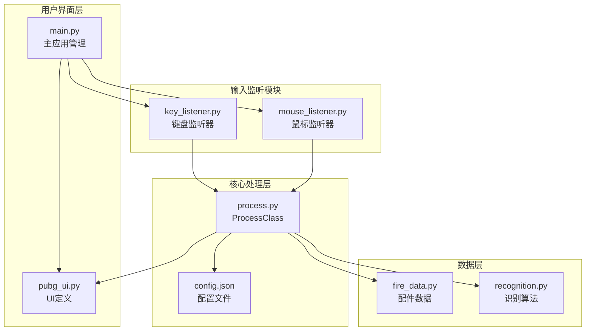
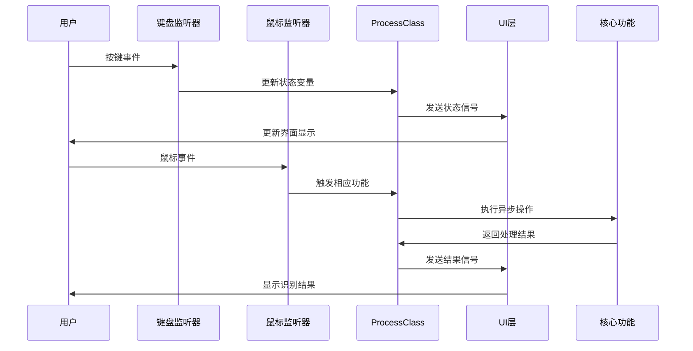
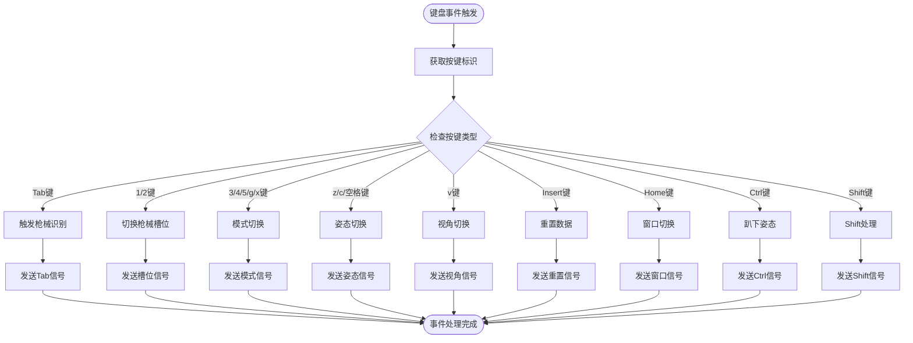
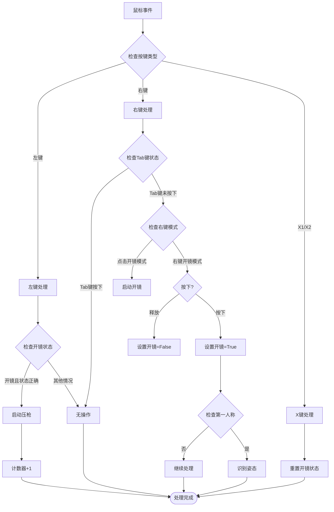
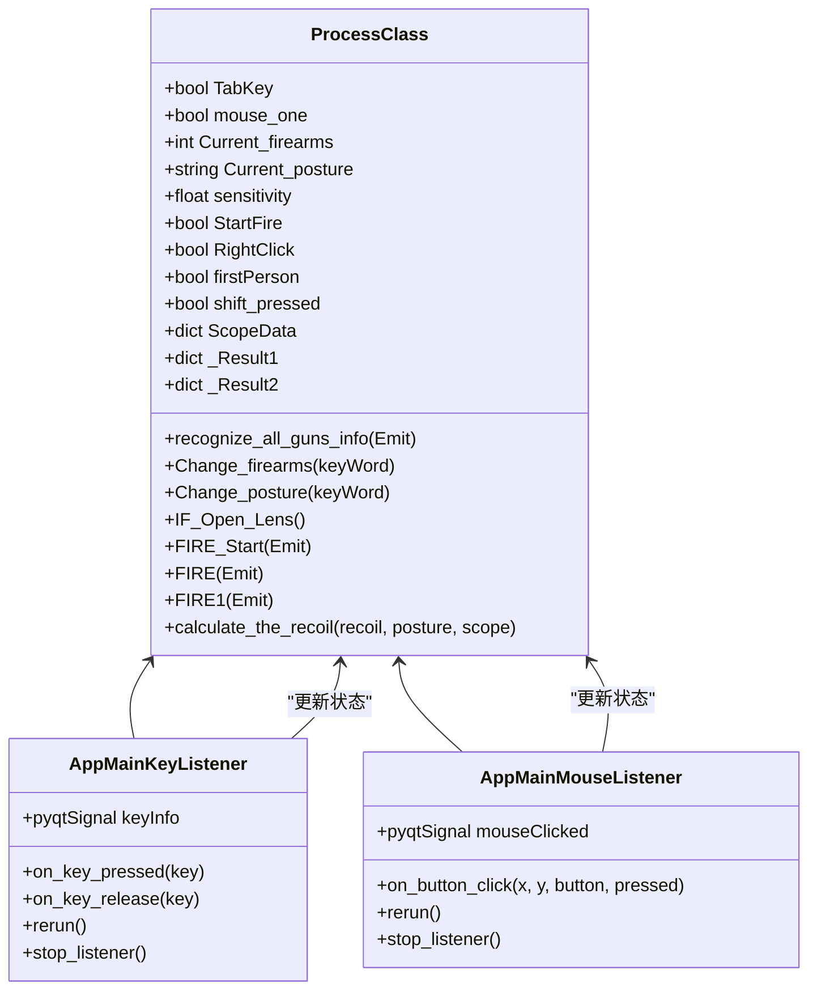
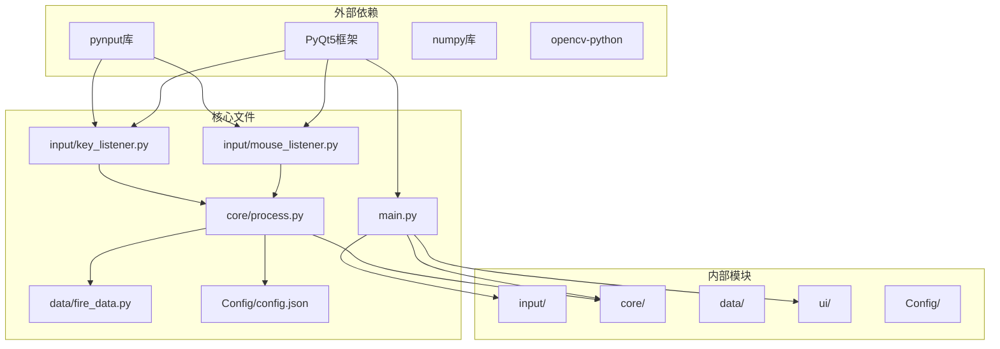

# 输入监听系统

<cite>
**本文档引用的文件**
- [input/key_listener.py](file://input/key_listener.py)
- [input/mouse_listener.py](file://input/mouse_listener.py)
- [main.py](file://main.py)
- [core/process.py](file://core/process.py)
- [ui/pubg_ui.py](file://ui/pubg_ui.py)
- [Config/config.json](file://Config/config.json)
- [data/fire_data.py](file://data/fire_data.py)
- [core/recognition.py](file://core/recognition.py)
- [main_new.py](file://main_new.py)
</cite>

## 目录
1. [简介](#简介)
2. [项目结构](#项目结构)
3. [核心组件](#核心组件)
4. [架构概览](#架构概览)
5. [详细组件分析](#详细组件分析)
6. [依赖关系分析](#依赖关系分析)
7. [性能考虑](#性能考虑)
8. [故障排除指南](#故障排除指南)
9. [结论](#结论)
10. [附录](#附录)

## 简介

输入监听系统是PUBG自动识别宏工具的核心组成部分，负责处理键盘和鼠标事件，实现热键映射、状态同步和异步处理机制。该系统采用多线程架构，通过PyQt5的信号槽机制实现事件通信，支持Tab键触发识别、1/2键切换枪械槽位、右键开镜控制等核心功能。

系统基于pynput库实现底层事件捕获，通过ProcessClass统一管理状态变量，实现跨平台兼容性和线程安全处理。整个架构设计注重可扩展性和维护性，为后续功能增强提供了良好的基础。

## 项目结构

输入监听系统位于项目的`input`目录下，主要包含两个核心文件：

**图表来源**
- [input/key_listener.py:1-70](file://input/key_listener.py#L1-L70)
- [input/mouse_listener.py:1-64](file://input/mouse_listener.py#L1-L64)
- [core/process.py:13-405](file://core/process.py#L13-L405)

**章节来源**
- [input/key_listener.py:1-70](file://input/key_listener.py#L1-L70)
- [input/mouse_listener.py:1-64](file://input/mouse_listener.py#L1-L64)
- [main.py:11-294](file://main.py#L11-L294)

## 核心组件

### AppMainKeyListener - 键盘监听器

AppMainKeyListener类继承自QThread，实现了完整的键盘事件监听功能：

- **事件捕获**：使用pynput.keyboard.Listener捕获键盘事件
- **热键映射**：支持Tab、1/2、3/4/5、g/x、z/c、空格、v、Insert、Home、Ctrl、Shift等按键
- **状态同步**：通过pyqtSignal向UI层发送状态更新
- **线程管理**：提供启动、重启、停止监听器的方法

### AppMainMouseListener - 鼠标监听器

AppMainMouseListener类同样继承自QThread，负责鼠标事件处理：

- **事件处理**：处理左键、右键、X1/X2键点击事件
- **开镜控制**：实现右键开镜的长按和单击模式
- **压枪功能**：在开镜状态下触发自动压枪
- **异步处理**：通过线程池处理长时间运行的操作

### ProcessClass - 状态管理中心

ProcessClass作为单例模式的中心控制器：

- **状态变量**：管理开镜状态、枪械槽位、姿态、灵敏度等
- **热键处理**：实现Shift键倍率调整、Tab键识别触发
- **异步操作**：提供枪械识别、姿态识别、压枪宏等异步方法
- **配置管理**：读取和保存配置数据

**章节来源**
- [input/key_listener.py:6-70](file://input/key_listener.py#L6-L70)
- [input/mouse_listener.py:13-64](file://input/mouse_listener.py#L13-L64)
- [core/process.py:13-405](file://core/process.py#L13-L405)

## 架构概览

输入监听系统采用分层架构设计，各组件职责明确：

**图表来源**
- [input/key_listener.py:14-47](file://input/key_listener.py#L14-L47)
- [input/mouse_listener.py:23-50](file://input/mouse_listener.py#L23-L50)
- [main.py:270-286](file://main.py#L270-L286)

系统架构特点：
- **事件驱动**：基于信号槽机制实现松耦合通信
- **异步处理**：识别和压枪操作使用异步方法避免阻塞
- **状态管理**：集中管理所有状态变量，确保一致性
- **线程安全**：通过QThread和信号机制保证线程安全

## 详细组件分析

### 键盘事件处理流程

**图表来源**
- [input/key_listener.py:14-47](file://input/key_listener.py#L14-L47)

#### Tab键触发识别机制

Tab键事件处理具有特殊优先级：
- 立即设置开镜状态为False，防止误触发
- 启动独立线程执行枪械识别
- 通过信号机制通知UI层更新状态
- 支持多枪识别，分别存储识别结果

#### 1/2键切换枪械槽位

槽位切换逻辑：
- 将开镜状态重置为False
- 更新当前枪械槽位状态
- 发送枪械信息信号到UI层
- 支持None值表示未选择特定槽位

#### Shift键倍率调整

Shift键处理机制：
- 按下时记录状态并调整灵敏度倍率
- 释放时恢复原始灵敏度设置
- 支持不同倍镜类型的差异化调整
- 避免重复调整，提高性能

**章节来源**
- [input/key_listener.py:14-47](file://input/key_listener.py#L14-L47)
- [core/process.py:97-124](file://core/process.py#L97-L124)

### 鼠标事件处理流程

**图表来源**
- [input/mouse_listener.py:23-50](file://input/mouse_listener.py#L23-L50)

#### 右键开镜控制机制

右键开镜支持两种模式：

**长按模式（默认）**：
- 按下右键时设置开镜状态为True
- 释放右键时设置开镜状态为False
- 支持第一人称下的姿态识别

**点击模式**：
- 单击右键时切换开镜状态
- 适用于不同的游戏习惯

#### 压枪功能实现

左键压枪机制：
- 仅在开镜状态下响应
- 检查当前是否有有效的枪械识别结果
- 通过独立线程执行压枪算法
- 支持全自动和半自动枪械的不同处理逻辑

**章节来源**
- [input/mouse_listener.py:23-50](file://input/mouse_listener.py#L23-L50)
- [core/process.py:207-262](file://core/process.py#L207-L262)

### 状态管理系统

ProcessClass作为状态管理中心，维护以下关键状态：

**图表来源**
- [core/process.py:13-405](file://core/process.py#L13-L405)
- [input/key_listener.py:6-70](file://input/key_listener.py#L6-L70)
- [input/mouse_listener.py:13-64](file://input/mouse_listener.py#L13-L64)

**章节来源**
- [core/process.py:31-82](file://core/process.py#L31-L82)
- [core/process.py:138-177](file://core/process.py#L138-L177)

## 依赖关系分析

输入监听系统的依赖关系呈现清晰的层次结构：

**图表来源**
- [input/key_listener.py:1-4](file://input/key_listener.py#L1-L4)
- [input/mouse_listener.py:9-11](file://input/mouse_listener.py#L9-L11)
- [main.py:1-10](file://main.py#L1-L10)

**章节来源**
- [input/key_listener.py:1-4](file://input/key_listener.py#L1-L4)
- [input/mouse_listener.py:9-11](file://input/mouse_listener.py#L9-L11)
- [main.py:1-10](file://main.py#L1-L10)

## 性能考虑

### 异步处理机制

系统采用多种异步处理策略：

1. **识别操作异步化**：使用asyncio.run()执行图像识别
2. **线程分离**：键盘和鼠标监听器各自运行在独立线程
3. **信号槽通信**：避免直接共享状态变量，减少锁竞争

### 内存管理

- **图像处理优化**：使用numpy数组进行高效图像处理
- **资源清理**：及时释放图像数据和临时变量
- **缓存策略**：合理使用配置数据缓存

### 线程安全

- **QThread使用**：通过PyQt5的线程机制保证UI线程安全
- **信号通信**：避免直接访问共享变量
- **状态同步**：通过ProcessClass统一管理状态

## 故障排除指南

### 常见问题及解决方案

#### 键盘事件无响应

**可能原因**：
- pynput权限不足
- 驱动程序冲突
- 线程未正确启动

**解决步骤**：
1. 确认程序以管理员权限运行
2. 检查键盘监听器状态
3. 验证信号连接是否正常

#### 鼠标事件异常

**可能原因**：
- 鼠标监听器未正确初始化
- 右键开镜模式配置错误
- 压枪功能未触发

**解决步骤**：
1. 检查鼠标监听器启动状态
2. 验证开镜模式设置
3. 确认枪械识别结果有效

#### 状态同步问题

**可能原因**：
- 信号槽连接断开
- 状态变量更新时机不当
- UI更新频率过高

**解决步骤**：
1. 检查信号连接状态
2. 验证状态更新逻辑
3. 优化UI更新频率

**章节来源**
- [input/key_listener.py:66-70](file://input/key_listener.py#L66-L70)
- [input/mouse_listener.py:60-64](file://input/mouse_listener.py#L60-L64)
- [main.py:244-252](file://main.py#L244-L252)

## 结论

输入监听系统通过精心设计的架构实现了高效的键盘和鼠标事件处理。系统的主要优势包括：

1. **模块化设计**：清晰的职责分离和接口定义
2. **异步处理**：避免阻塞主线程，提升用户体验
3. **状态管理**：统一的状态管理中心确保数据一致性
4. **线程安全**：通过信号槽机制实现安全的多线程通信
5. **可扩展性**：良好的架构为功能扩展提供了便利

该系统为PUBG自动识别宏工具提供了稳定可靠的输入处理基础，支持复杂的游戏交互场景，为用户提供流畅的使用体验。

## 附录

### 热键映射参考表

| 功能 | 热键 | 行为描述 |
|------|------|----------|
| 枪械识别 | Tab | 触发枪械识别，显示识别结果 |
| 槽位切换 | 1/2 | 切换1号/2号枪械槽位 |
| 模式切换 | 3/4/5/g/x | 切换不同识别模式 |
| 姿态切换 | z/c/空格 | 下蹲/趴下/站立切换 |
| 视角切换 | v | 第一人称/第三人称切换 |
| 数据重置 | Insert | 重置所有状态变量 |
| 窗口切换 | Home | 切换主窗口显示状态 |

### 扩展新热键功能指南

要扩展新的热键功能，需要：

1. **添加事件处理**：在相应的监听器类中添加新的按键处理逻辑
2. **更新状态管理**：在ProcessClass中添加必要的状态变量
3. **UI集成**：更新UI层以反映新的功能状态
4. **配置支持**：添加配置项支持用户自定义热键

### 跨平台兼容性

系统通过以下机制实现跨平台兼容：

- **pynput库**：提供统一的跨平台事件捕获接口
- **PyQt5**：确保UI层在不同平台的一致性
- **配置文件**：支持不同平台的配置差异
- **异步处理**：避免平台特定的阻塞操作