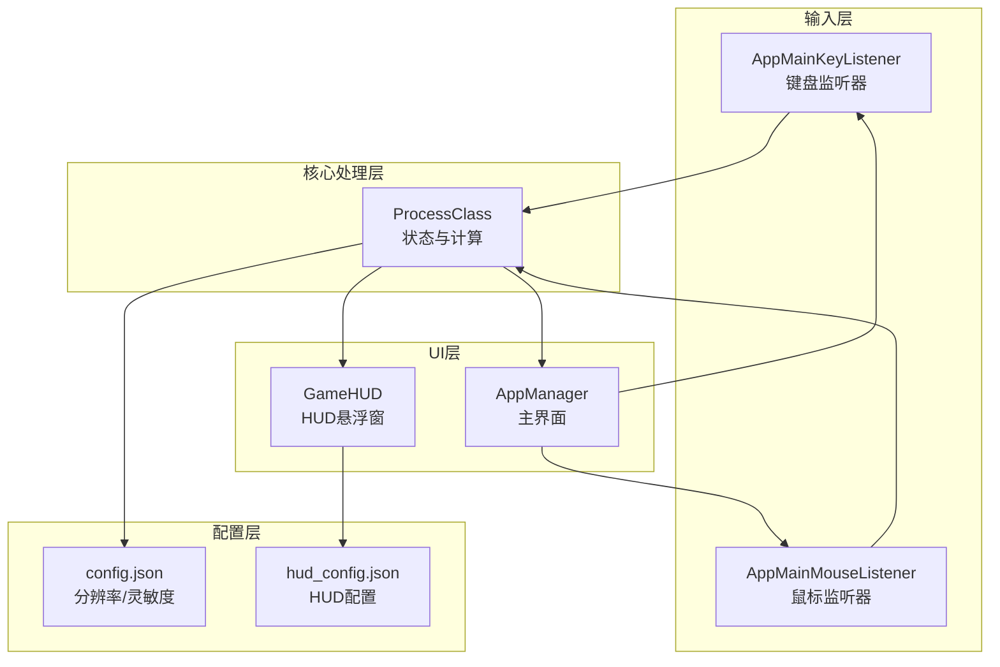
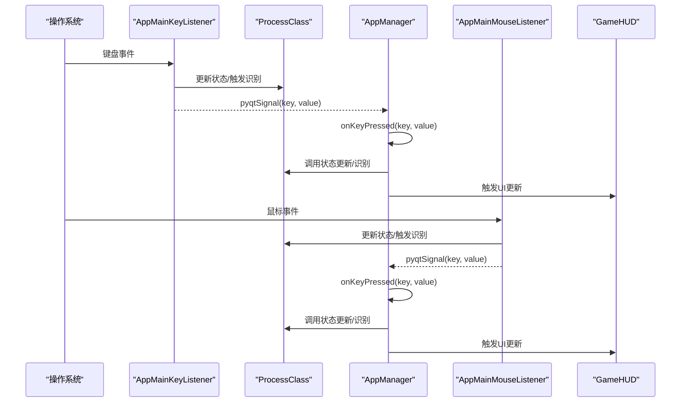
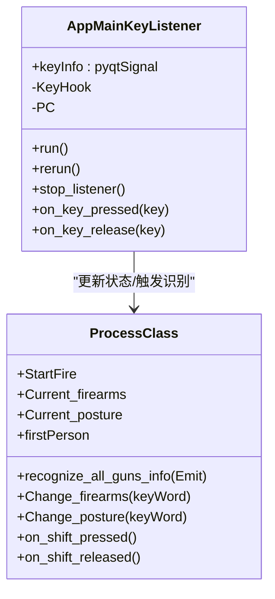
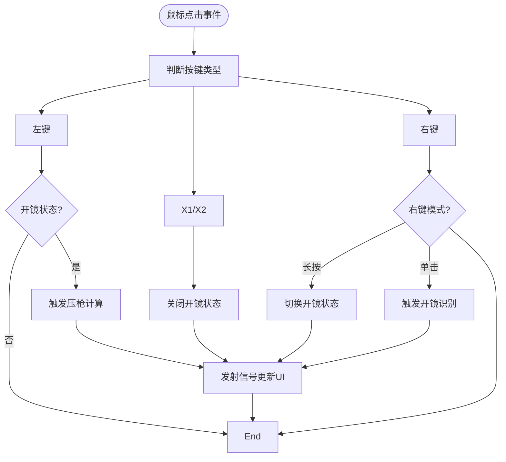
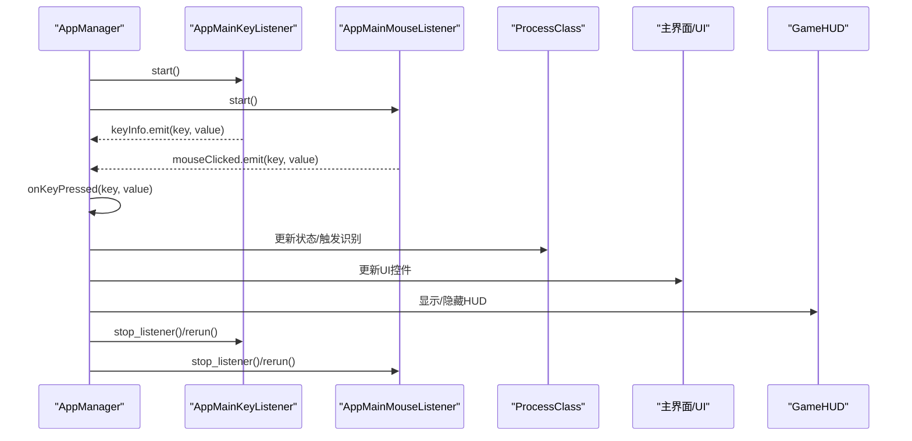
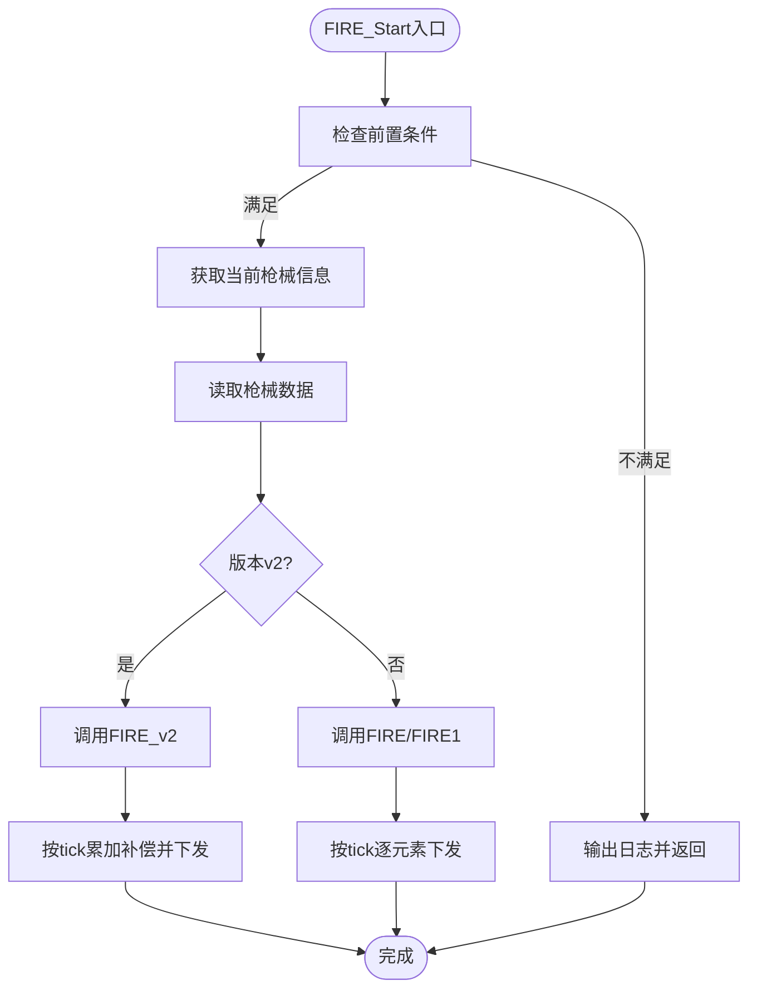
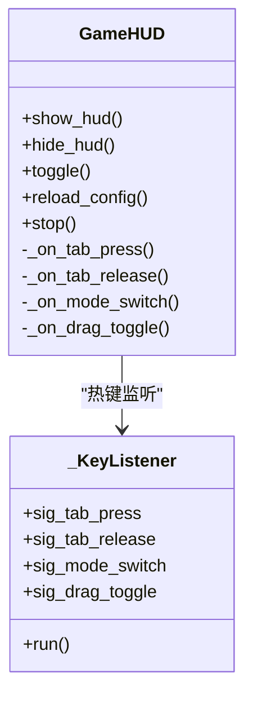
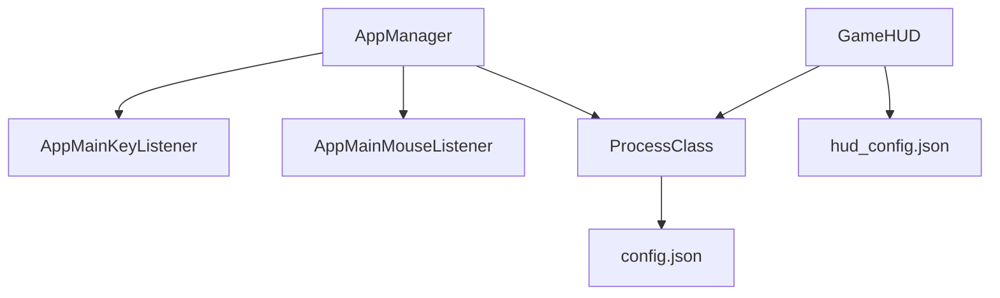

# 事件处理系统

<cite>
**本文档引用的文件**
- [main.py](file://main.py)
- [key_listener.py](file://input/key_listener.py)
- [mouse_listener.py](file://input/mouse_listener.py)
- [pubg_ui.py](file://ui/pubg_ui.py)
- [process.py](file://core/process.py)
- [overlay_hud.py](file://ui/overlay_hud.py)
- [config.json](file://Config/config.json)
- [hud_config.json](file://Config/hud_config.json)
</cite>

## 目录
1. [简介](#简介)
2. [项目结构](#项目结构)
3. [核心组件](#核心组件)
4. [架构总览](#架构总览)
5. [详细组件分析](#详细组件分析)
6. [依赖关系分析](#依赖关系分析)
7. [性能考量](#性能考量)
8. [故障排查指南](#故障排查指南)
9. [结论](#结论)

## 简介
本文件面向PUBG自动识别压枪工具的事件处理系统，系统采用事件驱动架构，结合PyQt5信号槽机制与多线程监听策略，实现键盘与鼠标的事件捕获、热键映射、事件分发与生命周期管理。文档重点覆盖：
- PyQt5信号槽在事件桥接中的使用
- 多线程事件监听策略与线程安全
- 键盘与鼠标事件监听器的设计与实现
- 事件生命周期：从产生到处理完成的完整流程
- 事件队列处理机制与优先级管理
- 热键映射与事件分发细节
- 事件过滤与异常处理机制

## 项目结构
项目采用模块化组织，事件处理相关的关键模块如下：
- 输入层：键盘监听器与鼠标监听器，分别位于input目录
- 核心处理层：ProcessClass封装压枪计算、识别与状态管理
- UI层：主界面与HUD悬浮窗，负责用户交互与可视化
- 配置层：JSON配置文件，存储分辨率、灵敏度与HUD配置

**图表来源**
- [main.py:223-234](file://main.py#L223-L234)
- [key_listener.py:6-70](file://input/key_listener.py#L6-L70)
- [mouse_listener.py:13-64](file://input/mouse_listener.py#L13-L64)
- [process.py:13-48](file://core/process.py#L13-L48)
- [overlay_hud.py:229-266](file://ui/overlay_hud.py#L229-L266)

**章节来源**
- [main.py:11-40](file://main.py#L11-L40)
- [pubg_ui.py:4-718](file://ui/pubg_ui.py#L4-L718)

## 核心组件
- AppManager：主应用管理器，负责UI初始化、按钮事件绑定、启动/停止/暂停逻辑以及键盘/鼠标事件的接收与分发。
- AppMainKeyListener：基于QThread的键盘监听器，通过pynput捕获键盘事件，经PyQt5信号桥接到AppManager。
- AppMainMouseListener：基于QThread的鼠标监听器，通过pynput捕获鼠标事件，经PyQt5信号桥接到AppManager。
- ProcessClass：核心状态与计算类，维护开镜状态、姿态、枪械选择、Shift倍率等状态，并提供压枪计算与识别接口。
- GameHUD：HUD悬浮窗，独立线程监听热键，控制HUD显示模式与拖动模式，并定时刷新绘制。

**章节来源**
- [main.py:11-286](file://main.py#L11-L286)
- [key_listener.py:6-70](file://input/key_listener.py#L6-L70)
- [mouse_listener.py:13-64](file://input/mouse_listener.py#L13-L64)
- [process.py:13-405](file://core/process.py#L13-L405)
- [overlay_hud.py:229-669](file://ui/overlay_hud.py#L229-L669)

## 架构总览
系统采用“监听器-处理器-UI”的事件驱动架构：
- 监听器层：键盘与鼠标监听器在独立线程中运行，使用pynput捕获底层事件。
- 事件桥接：监听器通过PyQt5信号将事件转发给AppManager。
- 事件分发：AppManager根据事件类型映射到具体处理函数，更新ProcessClass状态并触发UI更新。
- 状态计算：ProcessClass根据当前状态与配置进行压枪计算或识别。
- 可视化反馈：GameHUD与主界面实时反映状态变化。

**图表来源**
- [key_listener.py:14-47](file://input/key_listener.py#L14-L47)
- [mouse_listener.py:23-50](file://input/mouse_listener.py#L23-L50)
- [main.py:223-234](file://main.py#L223-L234)
- [main.py:270-286](file://main.py#L270-L286)
- [process.py:138-170](file://core/process.py#L138-L170)
- [overlay_hud.py:254-266](file://ui/overlay_hud.py#L254-L266)

## 详细组件分析

### 键盘事件监听器 AppMainKeyListener
- 设计要点
  - 继承QThread，确保监听在独立线程中运行，避免阻塞UI线程。
  - 使用pynput.keyboard.Listener捕获按键事件，分别处理按下与释放。
  - 通过pyqtSignal(key, value)将事件转发至AppManager。
- 热键映射与事件分发
  - Tab：触发识别并更新开镜状态
  - 1/2：切换枪械并更新UI
  - Home：切换窗口显示
  - Insert：重置所有状态
  - Ctrl/Shift：姿态与倍率调整
  - 其他键：开镜状态与姿态切换
- 异常与线程安全
  - stop_listener()安全停止监听器并清空句柄
  - rerun()重启监听器，保证多次启停的安全性

**图表来源**
- [key_listener.py:6-70](file://input/key_listener.py#L6-L70)
- [process.py:31-48](file://core/process.py#L31-L48)
- [process.py:138-170](file://core/process.py#L138-L170)

**章节来源**
- [key_listener.py:6-70](file://input/key_listener.py#L6-L70)
- [process.py:138-170](file://core/process.py#L138-L170)

### 鼠标事件监听器 AppMainMouseListener
- 设计要点
  - 继承QThread，独立线程运行。
  - 使用pynput.mouse.Listener捕获点击事件。
  - 左键：在开镜状态下触发压枪计算，同时记录计数。
  - 右键：根据开镜模式决定开镜状态或触发开镜识别。
  - X1/X2：统一处理为关闭开镜。
- 事件分发
  - 通过pyqtSignal(key, value)将事件转发至AppManager。
  - 压枪过程通过ProcessClass.FIRE_Start触发，内部异步线程执行。

**图表来源**
- [mouse_listener.py:23-50](file://input/mouse_listener.py#L23-L50)
- [process.py:207-262](file://core/process.py#L207-L262)

**章节来源**
- [mouse_listener.py:13-64](file://input/mouse_listener.py#L13-L64)
- [process.py:207-262](file://core/process.py#L207-L262)

### 主应用管理器 AppManager 与事件生命周期
- 生命周期管理
  - 启动：创建键盘/鼠标监听线程并启动，绑定信号到onKeyPressed。
  - 运行：onKeyPressed根据事件类型映射到具体处理函数，更新ProcessClass状态并触发UI更新。
  - 暂停/继续：停止/重启监听器，切换HUD显示。
  - 停止：终止监听线程并退出应用。
- 事件映射
  - l：日志输出
  - s：开镜状态更新
  - g：识别结果更新
  - e：枪械信息更新
  - p：姿态信息更新
  - c：重置数据
  - t：切换窗口
  - v：视角切换
- 线程安全
  - 监听器在独立线程中运行，通过信号槽跨线程通信，避免直接共享可变状态。
  - AppManager在UI线程中处理事件，避免与后台线程并发修改状态。

**图表来源**
- [main.py:223-286](file://main.py#L223-L286)
- [key_listener.py:58-70](file://input/key_listener.py#L58-L70)
- [mouse_listener.py:52-64](file://input/mouse_listener.py#L52-L64)

**章节来源**
- [main.py:223-286](file://main.py#L223-L286)

### ProcessClass：状态与计算核心
- 关键职责
  - 维护全局状态：开镜状态、姿态、枪械选择、Shift倍率、分辨率与灵敏度配置。
  - 提供识别与压枪计算接口：识别枪械与姿态、计算后坐力补偿、执行压枪循环。
  - 配置管理：读取/保存分辨率与灵敏度配置。
- 计算流程
  - v2路径：将每发子弹的总补偿量平滑展开到多个tick，支持水平补偿与亚像素精度。
  - v1路径：兼容旧数据格式，按tick逐元素下发补偿。
- 线程安全
  - 使用类级锁实现单例，避免重复实例化。
  - 状态字段在UI线程与后台线程间通过信号槽同步，避免直接共享。

**图表来源**
- [process.py:207-385](file://core/process.py#L207-L385)
- [process.py:310-362](file://core/process.py#L310-L362)

**章节来源**
- [process.py:13-405](file://core/process.py#L13-L405)

### GameHUD：HUD悬浮窗与热键监听
- 独立线程监听热键：Tab（临时隐藏/恢复）、F9（切换显示模式）、F10（切换拖动模式）。
- 定时刷新绘制：根据当前状态与配置渲染HUD内容。
- 线程安全：热键监听线程与UI线程分离，通过信号槽与定时器更新。

**图表来源**
- [overlay_hud.py:229-266](file://ui/overlay_hud.py#L229-L266)
- [overlay_hud.py:192-227](file://ui/overlay_hud.py#L192-L227)

**章节来源**
- [overlay_hud.py:229-669](file://ui/overlay_hud.py#L229-L669)

## 依赖关系分析
- 组件耦合
  - AppManager与AppMainKeyListener/AppMainMouseListener通过信号槽解耦。
  - AppManager与ProcessClass通过方法调用耦合，但状态更新通过信号槽间接同步。
  - GameHUD与ProcessClass通过状态读取耦合，避免写入。
- 外部依赖
  - pynput：底层事件捕获
  - PyQt5：信号槽与UI线程模型
  - JSON配置：分辨率与灵敏度、HUD外观与行为

**图表来源**
- [main.py:223-234](file://main.py#L223-L234)
- [process.py:53-71](file://core/process.py#L53-L71)
- [overlay_hud.py:61-101](file://ui/overlay_hud.py#L61-L101)

**章节来源**
- [main.py:223-234](file://main.py#L223-L234)
- [process.py:53-71](file://core/process.py#L53-L71)
- [overlay_hud.py:61-101](file://ui/overlay_hud.py#L61-L101)

## 性能考量
- 线程模型
  - 监听器与HUD均在独立线程中运行，避免阻塞UI线程。
  - 压枪计算在后台线程执行，主线程通过信号槽接收结果。
- 事件处理效率
  - 事件映射采用字典查找，时间复杂度O(1)。
  - 识别与压枪计算使用异步线程，避免UI卡顿。
- 资源管理
  - 监听器支持stop/rerun，避免资源泄漏。
  - HUD定时器按配置刷新，避免过度绘制。

[本节为通用性能讨论，无需特定文件来源]

## 故障排查指南
- 键盘/鼠标监听无法启动
  - 检查权限与管理员运行
  - 确认stop_listener()与rerun()正确调用
- 事件未触发或延迟
  - 确认信号槽连接正常（start时绑定）
  - 检查UI线程是否被阻塞
- 压枪无效或异常
  - 检查开镜状态与枪械选择
  - 确认Shift倍率与灵敏度配置
- HUD显示异常
  - 检查hud_config.json配置项
  - 确认热键监听线程运行状态

**章节来源**
- [key_listener.py:66-70](file://input/key_listener.py#L66-L70)
- [mouse_listener.py:60-64](file://input/mouse_listener.py#L60-L64)
- [overlay_hud.py:664-669](file://ui/overlay_hud.py#L664-L669)

## 结论
该事件处理系统通过PyQt5信号槽与多线程监听实现了稳定、可扩展的事件驱动架构。键盘与鼠标事件在独立线程中被捕获并通过信号槽安全地传递到UI线程，AppManager负责事件映射与状态更新，ProcessClass提供核心计算能力，GameHUD提供可视化反馈。整体设计具备良好的线程安全、可维护性与扩展性，适合在PUBG压枪场景中持续演进。