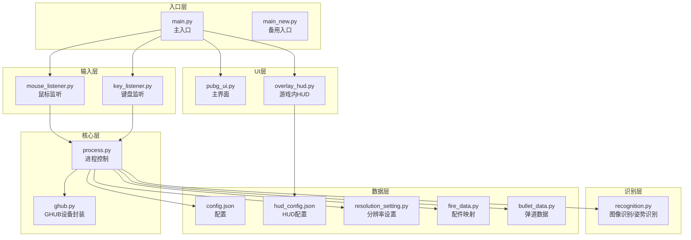
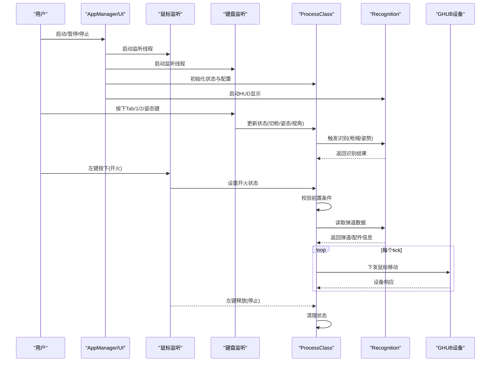
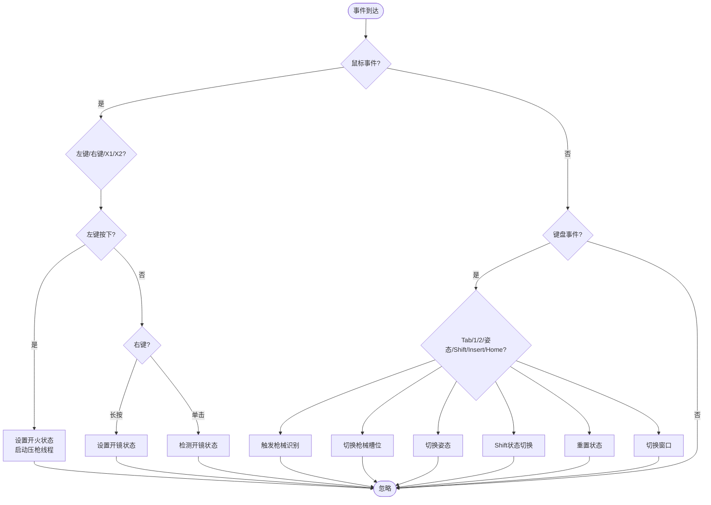
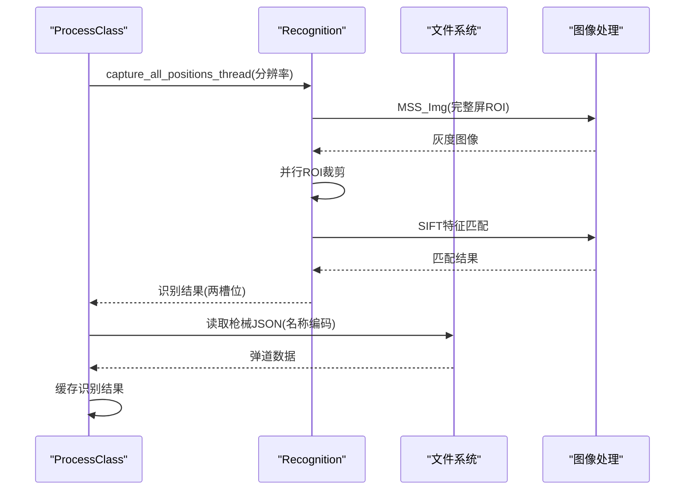
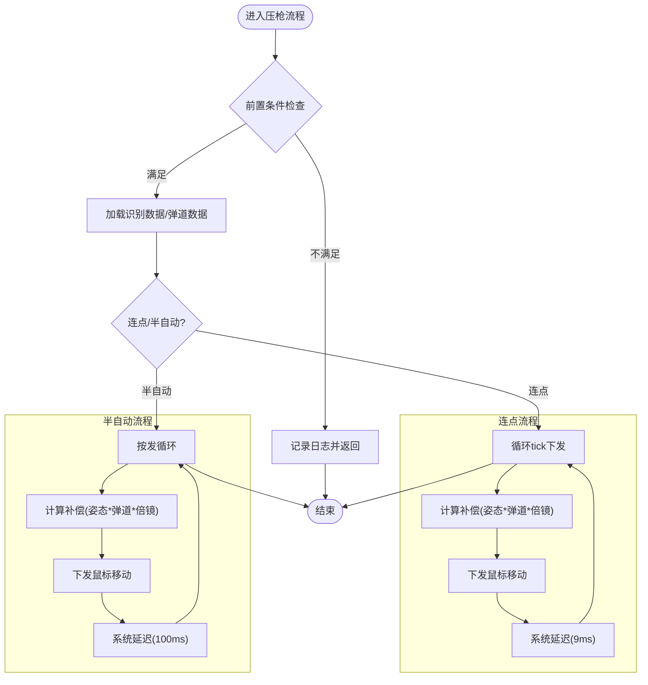
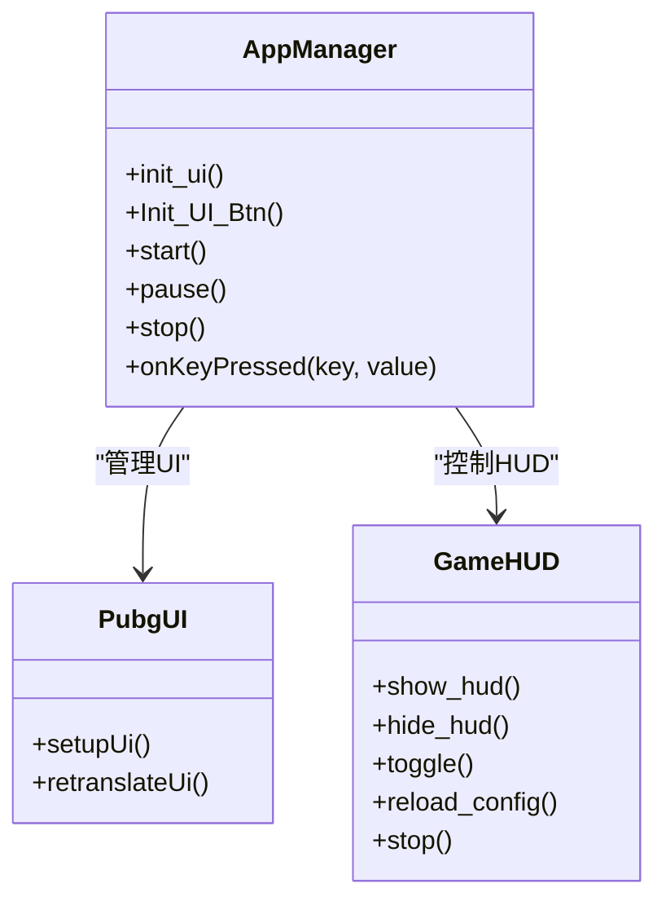
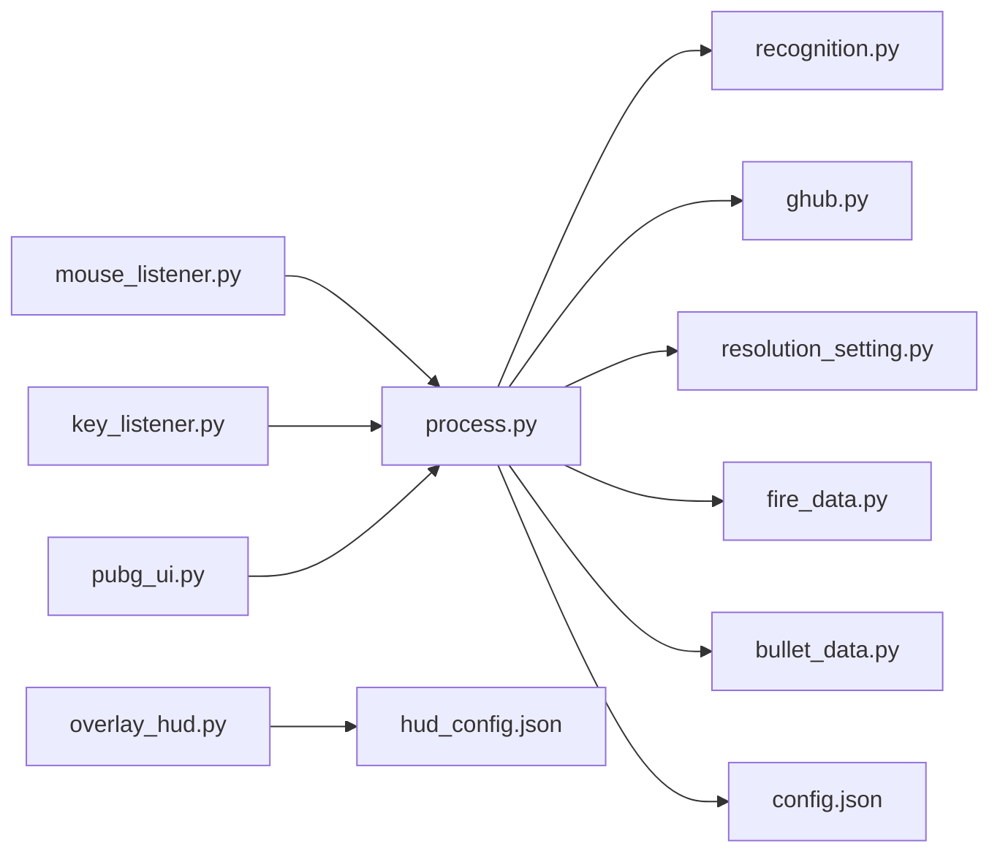

# 数据流与控制流

<cite>
**本文档引用的文件**
- [main.py](file://main.py)
- [main_new.py](file://main_new.py)
- [core/process.py](file://core/process.py)
- [core/recognition.py](file://core/recognition.py)
- [core/ghub.py](file://core/ghub.py)
- [input/mouse_listener.py](file://input/mouse_listener.py)
- [input/key_listener.py](file://input/key_listener.py)
- [ui/pubg_ui.py](file://ui/pubg_ui.py)
- [ui/overlay_hud.py](file://ui/overlay_hud.py)
- [data/fire_data.py](file://data/fire_data.py)
- [data/bullet_data.py](file://data/bullet_data.py)
- [data/resolution_setting.py](file://data/resolution_setting.py)
- [Config/config.json](file://Config/config.json)
- [Config/hud_config.json](file://Config/hud_config.json)
</cite>

## 目录
1. [引言](#引言)
2. [项目结构](#项目结构)
3. [核心组件](#核心组件)
4. [架构总览](#架构总览)
5. [详细组件分析](#详细组件分析)
6. [依赖关系分析](#依赖关系分析)
7. [性能考虑](#性能考虑)
8. [故障排除指南](#故障排除指南)
9. [结论](#结论)

## 引言
本文件面向PUBG自动识别压枪工具，系统性梳理其数据流与控制流。文档从输入事件到最终输出的完整处理链路出发，覆盖图像采集、特征提取、识别判断、压枪计算、设备控制等环节，解释各阶段数据格式与转换过程，分析控制流的分支逻辑与条件判断机制，并提供数据流图与控制流图，帮助开发者与用户理解系统执行路径与决策点。同时，阐述数据缓存与状态管理策略，包括临时数据生命周期与内存管理。

## 项目结构
项目采用模块化设计，主要分为以下层次：
- 入口层：主程序入口与备用入口，负责UI初始化、线程启动与事件绑定
- 输入层：鼠标与键盘监听，负责事件捕获与状态变更
- 核心层：进程控制与压枪计算，负责识别结果缓存、状态管理与设备控制
- 识别层：图像识别与姿势识别，负责SIFT特征匹配与模板比对
- UI层：主界面与游戏内HUD，负责状态展示与交互
- 数据层：配置、分辨率设置、弹道数据与配件映射
- 设备层：GHUB驱动封装，负责鼠标移动与按键模拟

**图表来源**
- [main.py:1-294](file://main.py#L1-L294)
- [main_new.py:1-112](file://main_new.py#L1-L112)
- [core/process.py:1-405](file://core/process.py#L1-L405)
- [core/recognition.py:1-478](file://core/recognition.py#L1-L478)
- [core/ghub.py:1-55](file://core/ghub.py#L1-L55)
- [input/mouse_listener.py:1-64](file://input/mouse_listener.py#L1-L64)
- [input/key_listener.py:1-70](file://input/key_listener.py#L1-L70)
- [ui/pubg_ui.py:1-718](file://ui/pubg_ui.py#L1-L718)
- [ui/overlay_hud.py:1-698](file://ui/overlay_hud.py#L1-L698)
- [data/resolution_setting.py:1-147](file://data/resolution_setting.py#L1-L147)
- [data/fire_data.py:1-83](file://data/fire_data.py#L1-L83)
- [data/bullet_data.py:1-800](file://data/bullet_data.py#L1-L800)
- [Config/config.json:1-1](file://Config/config.json#L1-L1)
- [Config/hud_config.json:1-91](file://Config/hud_config.json#L1-L91)

**章节来源**
- [main.py:1-294](file://main.py#L1-L294)
- [main_new.py:1-112](file://main_new.py#L1-L112)
- [ui/pubg_ui.py:1-718](file://ui/pubg_ui.py#L1-L718)

## 核心组件
本系统的核心组件围绕“输入事件 → 识别与状态更新 → 压枪计算 → 设备控制”的主线展开，关键组件职责如下：
- AppManager（主应用管理）：负责UI初始化、按钮事件绑定、日志输出、线程管理与HUD显示
- ProcessClass（进程控制）：负责识别结果缓存、状态管理、压枪计算、设备控制与配置读写
- Recognition（识别模块）：负责图像采集、SIFT特征匹配、姿势识别与开镜检测
- GHUB设备封装：负责鼠标移动、按键模拟与设备状态查询
- 输入监听：负责鼠标与键盘事件捕获，触发识别与压枪流程
- UI与HUD：负责状态展示、配置修改与显示模式切换

**章节来源**
- [core/process.py:13-405](file://core/process.py#L13-L405)
- [core/recognition.py:1-478](file://core/recognition.py#L1-L478)
- [core/ghub.py:1-55](file://core/ghub.py#L1-L55)
- [input/mouse_listener.py:1-64](file://input/mouse_listener.py#L1-L64)
- [input/key_listener.py:1-70](file://input/key_listener.py#L1-L70)
- [ui/overlay_hud.py:1-698](file://ui/overlay_hud.py#L1-L698)

## 架构总览
系统采用事件驱动与异步并发相结合的架构：
- 事件驱动：鼠标与键盘事件触发识别与压枪流程
- 异步并发：图像识别采用异步gather并行处理，提升吞吐
- 状态机：通过布尔标志与枚举状态控制流程分支
- 设备抽象：统一通过GHUB封装访问底层设备

**图表来源**
- [main.py:223-294](file://main.py#L223-L294)
- [input/mouse_listener.py:23-50](file://input/mouse_listener.py#L23-L50)
- [input/key_listener.py:14-56](file://input/key_listener.py#L14-L56)
- [core/process.py:207-404](file://core/process.py#L207-L404)
- [core/recognition.py:67-126](file://core/recognition.py#L67-L126)
- [core/ghub.py:32-51](file://core/ghub.py#L32-L51)

## 详细组件分析

### 输入事件与状态管理
- 鼠标事件：左键按下触发压枪流程，右键长按/单击控制开镜状态，X1/X2键用于强制关闭开镜
- 键盘事件：Tab触发枪械识别，1/2切换当前枪械，姿态键切换站立/蹲下/趴下，Shift用于灵敏度倍增，Insert重置状态，Home切换窗口
- 状态字段：开镜状态、当前枪械槽位、姿态、视角、Shift键状态、识别结果缓存等

**图表来源**
- [input/mouse_listener.py:23-50](file://input/mouse_listener.py#L23-L50)
- [input/key_listener.py:14-56](file://input/key_listener.py#L14-L56)

**章节来源**
- [input/mouse_listener.py:1-64](file://input/mouse_listener.py#L1-L64)
- [input/key_listener.py:1-70](file://input/key_listener.py#L1-L70)
- [core/process.py:32-82](file://core/process.py#L32-L82)

### 识别与数据缓存
- 枪械识别：异步并行捕获两个槽位ROI，使用SIFT特征匹配模板库，返回名称与配件信息
- 姿势识别：支持模板匹配与图标识别双策略，支持第三人称渲染等待与稳定性检测
- 识别结果缓存：ProcessClass维护两套识别结果字典，供压枪流程直接使用
- 配置读写：分辨率与灵敏度配置持久化至config.json，支持动态修改

**图表来源**
- [core/recognition.py:83-126](file://core/recognition.py#L83-L126)
- [core/recognition.py:102-126](file://core/recognition.py#L102-L126)
- [core/process.py:138-146](file://core/process.py#L138-L146)
- [data/resolution_setting.py:1-147](file://data/resolution_setting.py#L1-L147)
- [data/fire_data.py:54-83](file://data/fire_data.py#L54-L83)

**章节来源**
- [core/recognition.py:1-478](file://core/recognition.py#L1-L478)
- [core/process.py:83-146](file://core/process.py#L83-L146)
- [data/resolution_setting.py:1-147](file://data/resolution_setting.py#L1-L147)
- [data/fire_data.py:1-83](file://data/fire_data.py#L1-L83)

### 压枪计算与设备控制
- 压枪计算：根据姿态系数、倍镜灵敏度、弹道数据与当前开火状态，计算每tick的鼠标移动量
- v1/v2兼容路径：v1按tick累加，v2将每发总补偿平滑展开到多个tick，支持水平补偿与亚像素累积
- 设备控制：通过GHUB封装下发鼠标移动，考虑系统版本差异调整计算延迟
- 控制流分支：前置条件校验（开镜、选中槽位、识别结果非空），非连点枪械与连点枪械分流

**图表来源**
- [core/process.py:207-404](file://core/process.py#L207-L404)
- [core/ghub.py:32-51](file://core/ghub.py#L32-L51)

**章节来源**
- [core/process.py:183-404](file://core/process.py#L183-L404)
- [core/ghub.py:1-55](file://core/ghub.py#L1-L55)

### UI与HUD展示
- 主界面：提供分辨率设置、灵敏度设置、开镜模式、姿态与枪械槽位选择，实时日志输出
- HUD：三档显示模式（极简/紧凑/完整），支持Tab临时隐藏、F9模式切换、F10拖动模式
- 配置持久化：HUD位置、颜色、字体大小等配置存储于hud_config.json

**图表来源**
- [main.py:11-294](file://main.py#L11-L294)
- [ui/overlay_hud.py:229-698](file://ui/overlay_hud.py#L229-L698)
- [ui/pubg_ui.py:4-718](file://ui/pubg_ui.py#L4-L718)

**章节来源**
- [main.py:1-294](file://main.py#L1-L294)
- [ui/overlay_hud.py:1-698](file://ui/overlay_hud.py#L1-L698)
- [ui/pubg_ui.py:1-718](file://ui/pubg_ui.py#L1-L718)

## 依赖关系分析
系统模块间依赖清晰，遵循单一职责与解耦原则：
- 输入层依赖核心层的状态字段与识别接口
- 核心层依赖识别层的图像处理与数据读取
- 识别层依赖分辨率配置与模板库
- UI层依赖核心层的状态与识别结果
- 设备层独立封装，被核心层调用

**图表来源**
- [input/mouse_listener.py:1-64](file://input/mouse_listener.py#L1-L64)
- [input/key_listener.py:1-70](file://input/key_listener.py#L1-L70)
- [core/process.py:1-405](file://core/process.py#L1-L405)
- [core/recognition.py:1-478](file://core/recognition.py#L1-L478)
- [core/ghub.py:1-55](file://core/ghub.py#L1-L55)
- [data/resolution_setting.py:1-147](file://data/resolution_setting.py#L1-L147)
- [data/fire_data.py:1-83](file://data/fire_data.py#L1-L83)
- [data/bullet_data.py:1-800](file://data/bullet_data.py#L1-L800)
- [Config/config.json:1-1](file://Config/config.json#L1-L1)
- [Config/hud_config.json:1-91](file://Config/hud_config.json#L1-L91)
- [ui/pubg_ui.py:1-718](file://ui/pubg_ui.py#L1-L718)
- [ui/overlay_hud.py:1-698](file://ui/overlay_hud.py#L1-L698)

**章节来源**
- [core/process.py:1-405](file://core/process.py#L1-L405)
- [core/recognition.py:1-478](file://core/recognition.py#L1-L478)
- [data/resolution_setting.py:1-147](file://data/resolution_setting.py#L1-L147)

## 性能考虑
- 异步并行：识别阶段使用asyncio.gather并行处理ROI，显著降低总耗时
- 特征匹配优化：SIFT参数与掩码过滤减少误匹配，提高稳定性
- 姿势识别策略：模板匹配优先，图标识别作为后备，兼顾准确性与鲁棒性
- 系统延迟适配：根据Windows版本调整计算延迟，保证与游戏射速同步
- 内存管理：识别结果缓存在ProcessClass实例变量中，避免重复计算；图像处理使用numpy数组，及时释放中间变量

[本节为通用性能指导，无需特定文件引用]

## 故障排除指南
- 驱动问题：若GHUB设备初始化失败，检查DLL是否存在与驱动安装状态
- 识别不准确：调整分辨率设置中的ROI坐标，或增加模板数量；确认Tab识别时机
- 压枪异常：检查灵敏度配置与Shift倍增设置；确认开镜状态与姿态系数
- HUD显示异常：检查hud_config.json配置项，确认热键与刷新频率设置

**章节来源**
- [core/ghub.py:8-21](file://core/ghub.py#L8-L21)
- [data/resolution_setting.py:1-147](file://data/resolution_setting.py#L1-L147)
- [Config/hud_config.json:1-91](file://Config/hud_config.json#L1-L91)

## 结论
本系统通过事件驱动与异步并发实现了高效稳定的压枪流程，识别与压枪逻辑清晰分离，状态管理与设备控制通过统一接口实现。UI与HUD提供了良好的交互体验与可视化反馈。整体架构具备良好的扩展性与可维护性，便于后续功能增强与性能优化。