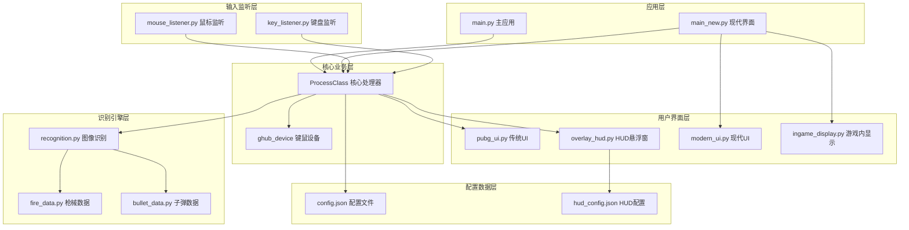
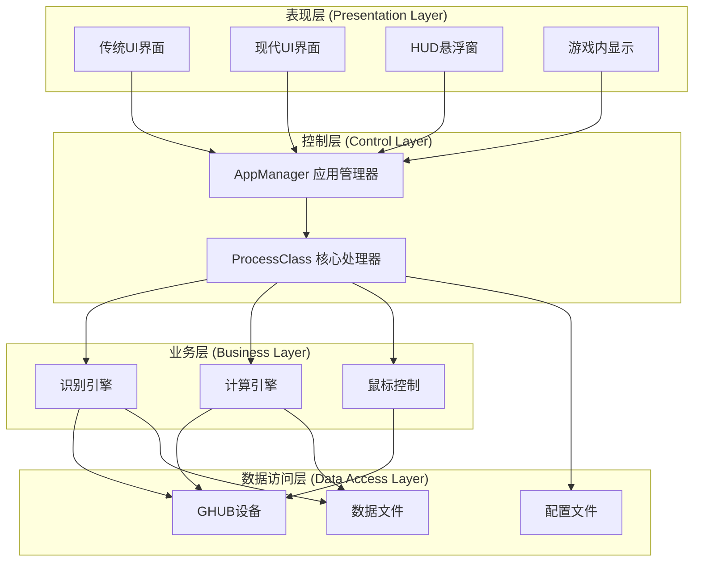
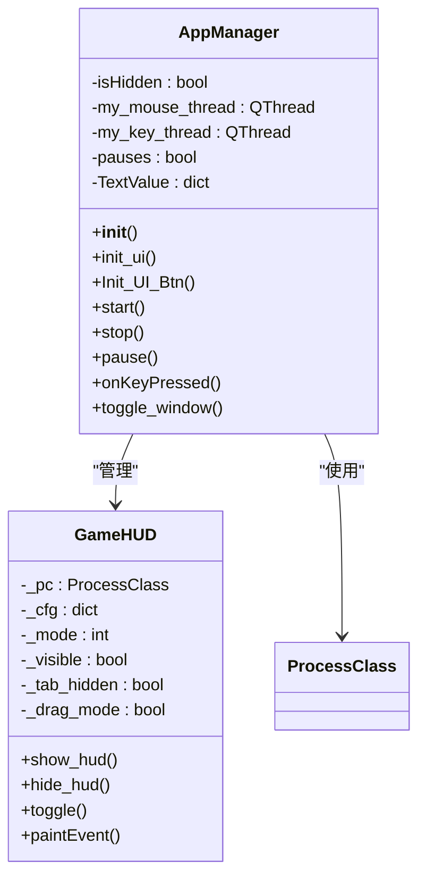
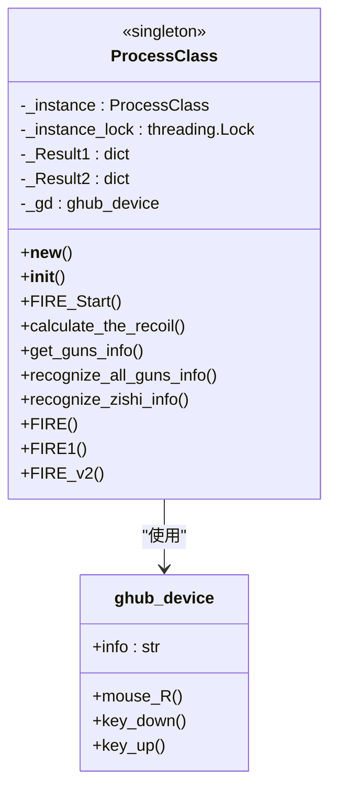
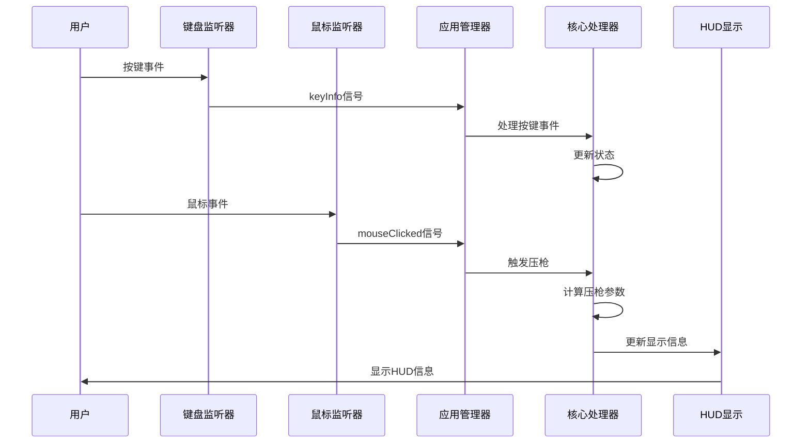
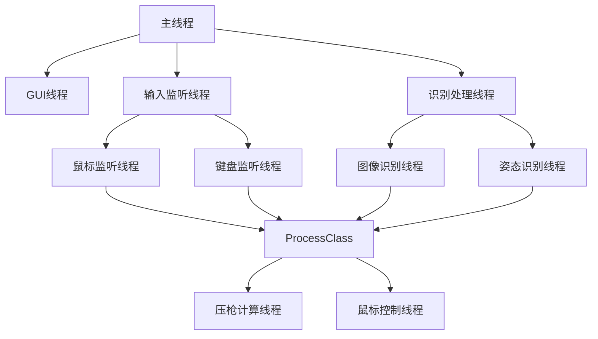
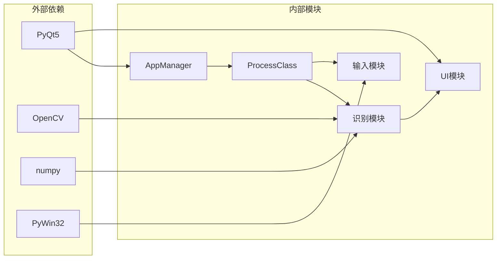

# 整体架构概览

<cite>
**本文档引用的文件**
- [main.py](file://main.py)
- [main_new.py](file://main_new.py)
- [process.py](file://core/process.py)
- [recognition.py](file://core/recognition.py)
- [pubg_ui.py](file://ui/pubg_ui.py)
- [mouse_listener.py](file://input/mouse_listener.py)
- [key_listener.py](file://input/key_listener.py)
- [overlay_hud.py](file://ui/overlay_hud.py)
- [modern_ui.py](file://ui/modern_ui.py)
- [ingame_display.py](file://ui/ingame_display.py)
- [ghub.py](file://core/ghub.py)
- [fire_data.py](file://data/fire_data.py)
- [config.json](file://Config/config.json)
- [hud_config.json](file://Config/hud_config.json)
- [bullet_data.py](file://data/bullet_data.py)
</cite>

## 目录
1. [项目简介](#项目简介)
2. [项目结构](#项目结构)
3. [核心组件](#核心组件)
4. [架构概览](#架构概览)
5. [详细组件分析](#详细组件分析)
6. [依赖关系分析](#依赖关系分析)
7. [性能考虑](#性能考虑)
8. [故障排除指南](#故障排除指南)
9. [结论](#结论)

## 项目简介

PUBG自动识别压枪工具是一个基于Python开发的桌面应用程序，旨在为《绝地求生》游戏提供智能的压枪辅助功能。该系统通过计算机视觉技术和实时按键监听，实现了枪械识别、姿态检测、压枪计算和鼠标控制的完整自动化流程。

## 项目结构

项目采用模块化设计，按照功能层次组织代码结构：

**图表来源**
- [main.py:1-294](file://main.py#L1-L294)
- [process.py:1-405](file://core/process.py#L1-L405)
- [recognition.py:1-478](file://core/recognition.py#L1-L478)

**章节来源**
- [main.py:1-294](file://main.py#L1-L294)
- [main_new.py:1-112](file://main_new.py#L1-L112)

## 核心组件

### AppManager - 主应用管理器

AppManager是整个系统的主控制器，采用单例模式设计，负责协调各个子系统的运行。它继承自QWidget和UI类，实现了完整的GUI应用程序框架。

**主要职责：**
- 管理应用程序生命周期
- 协调输入监听器和核心处理器
- 处理用户界面交互
- 管理HUD显示系统

### ProcessClass - 核心业务逻辑

ProcessClass是系统的核心处理器，实现了单例模式，封装了所有业务逻辑和状态管理。

**关键特性：**
- 单例模式确保全局唯一性
- 线程安全的实例创建
- 完整的状态管理系统
- 压枪算法的核心实现

### 输入监听系统

系统采用事件驱动架构，通过独立的监听器处理用户输入：

- **鼠标监听器**：实时监听鼠标按键事件
- **键盘监听器**：处理各种功能键和快捷键
- **异步事件处理**：使用PyQt5的信号槽机制

**章节来源**
- [process.py:13-405](file://core/process.py#L13-L405)
- [mouse_listener.py:1-64](file://input/mouse_listener.py#L1-L64)
- [key_listener.py:1-70](file://input/key_listener.py#L1-L70)

## 架构概览

系统采用分层架构设计，实现了清晰的关注点分离：

**图表来源**
- [pubg_ui.py:1-718](file://ui/pubg_ui.py#L1-L718)
- [overlay_hud.py:229-698](file://ui/overlay_hud.py#L229-L698)
- [process.py:13-405](file://core/process.py#L13-L405)

**章节来源**
- [pubg_ui.py:1-718](file://ui/pubg_ui.py#L1-L718)
- [overlay_hud.py:229-698](file://ui/overlay_hud.py#L229-L698)

## 详细组件分析

### AppManager组件分析

**图表来源**
- [main.py:11-294](file://main.py#L11-L294)
- [overlay_hud.py:229-698](file://ui/overlay_hud.py#L229-L698)

**章节来源**
- [main.py:11-294](file://main.py#L11-L294)

### ProcessClass核心处理器分析

**图表来源**
- [process.py:13-405](file://core/process.py#L13-L405)
- [ghub.py:5-55](file://core/ghub.py#L5-L55)

**章节来源**
- [process.py:13-405](file://core/process.py#L13-L405)

### 事件驱动架构序列图

**图表来源**
- [key_listener.py:14-70](file://input/key_listener.py#L14-L70)
- [mouse_listener.py:23-64](file://input/mouse_listener.py#L23-L64)
- [main.py:223-286](file://main.py#L223-L286)

**章节来源**
- [key_listener.py:1-70](file://input/key_listener.py#L1-L70)
- [mouse_listener.py:1-64](file://input/mouse_listener.py#L1-L64)

### 多线程处理策略

系统采用多线程架构确保响应性和性能：

**图表来源**
- [mouse_listener.py:52-64](file://input/mouse_listener.py#L52-L64)
- [key_listener.py:58-70](file://input/key_listener.py#L58-L70)
- [process.py:207-405](file://core/process.py#L207-L405)

**章节来源**
- [mouse_listener.py:1-64](file://input/mouse_listener.py#L1-L64)
- [key_listener.py:1-70](file://input/key_listener.py#L1-L70)

## 依赖关系分析

系统采用松耦合设计，通过接口和依赖注入实现模块间的解耦：

**图表来源**
- [main.py:1-10](file://main.py#L1-L10)
- [process.py:1-12](file://core/process.py#L1-L12)

**章节来源**
- [main.py:1-10](file://main.py#L1-L10)
- [process.py:1-12](file://core/process.py#L1-L12)

## 性能考虑

系统在设计时充分考虑了性能优化：

### 异步处理
- 使用asyncio进行图像识别
- 异步姿态检测
- 非阻塞的GUI更新

### 缓存机制
- 枪械数据缓存
- 识别结果缓存
- 配置数据缓存

### 资源管理
- 线程池管理
- 设备资源复用
- 内存使用优化

## 故障排除指南

### 常见问题及解决方案

**驱动问题**
- 症状：无法连接GHUB设备
- 解决：检查GHUB驱动安装，确保以管理员权限运行

**识别失败**
- 症状：枪械识别不准确
- 解决：调整分辨率设置，检查图像质量

**性能问题**
- 症状：系统响应缓慢
- 解决：降低识别频率，关闭不必要的功能

**章节来源**
- [ghub.py:8-21](file://core/ghub.py#L8-L21)
- [config.json:1-1](file://Config/config.json#L1-L1)

## 结论

PUBG自动识别压枪工具采用了现代化的软件架构设计，通过模块化、分层架构和事件驱动机制，实现了高性能、可维护的系统。系统的主要优势包括：

1. **清晰的架构分层**：实现了关注点分离，便于维护和扩展
2. **事件驱动设计**：响应式架构确保良好的用户体验
3. **模块化设计**：各组件职责明确，易于测试和调试
4. **性能优化**：多线程和异步处理确保系统流畅运行
5. **可扩展性**：接口抽象和依赖注入为未来功能扩展奠定基础

该架构为类似的游戏辅助工具开发提供了优秀的参考范例，具有良好的可移植性和可维护性。