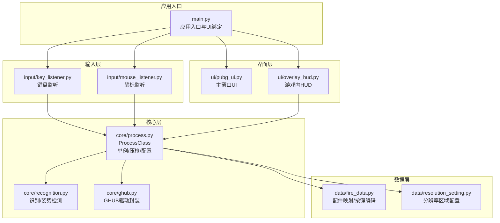
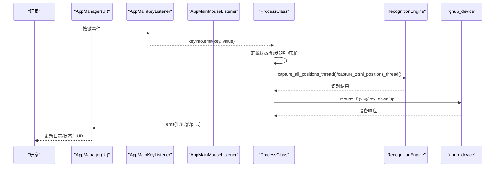
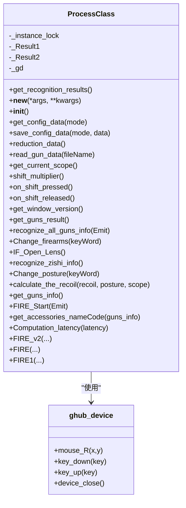
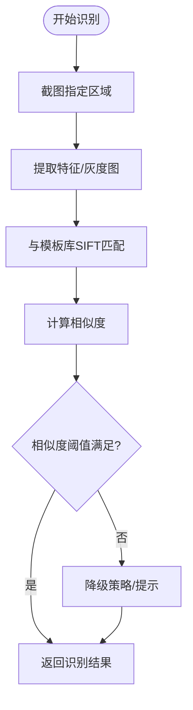
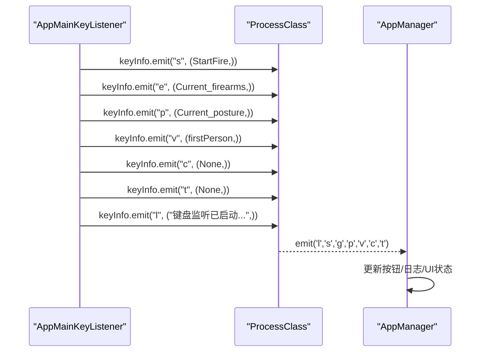
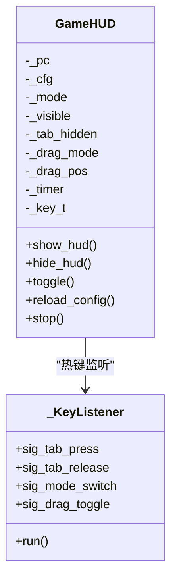
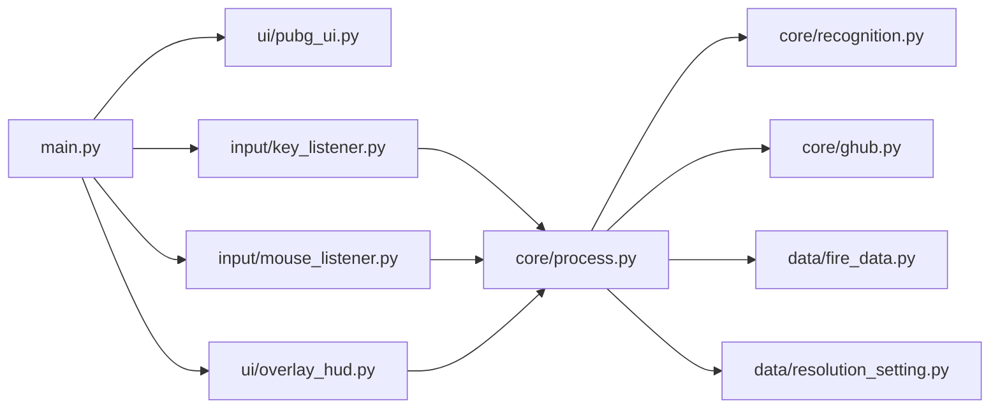

# 核心架构设计

<cite>
**本文引用的文件**
- [main.py](file://main.py)
- [process.py](file://core/process.py)
- [recognition.py](file://core/recognition.py)
- [key_listener.py](file://input/key_listener.py)
- [mouse_listener.py](file://input/mouse_listener.py)
- [pubg_ui.py](file://ui/pubg_ui.py)
- [ghub.py](file://core/ghub.py)
- [fire_data.py](file://data/fire_data.py)
- [resolution_setting.py](file://data/resolution_setting.py)
- [overlay_hud.py](file://ui/overlay_hud.py)
- [README.md](file://README.md)
</cite>

## 目录
1. [引言](#引言)
2. [项目结构](#项目结构)
3. [核心组件](#核心组件)
4. [架构总览](#架构总览)
5. [详细组件分析](#详细组件分析)
6. [依赖关系分析](#依赖关系分析)
7. [性能考量](#性能考量)
8. [故障排查指南](#故障排查指南)
9. [结论](#结论)
10. [附录](#附录)

## 引言
本项目是一个基于Python与PyQt5的PUBG自动识别压枪工具，目标是在游戏中实现“自动识别枪械与配件、自动检测开镜状态、根据姿态与灵敏度计算后坐力补偿并下发鼠标移动”的闭环系统。系统采用模块化设计、事件驱动架构与分层架构相结合的方式，通过输入监听器捕获用户输入，核心处理类统一调度识别与压枪逻辑，UI层负责配置与状态展示，底层通过GHUB驱动与Windows API实现鼠标事件下发。

## 项目结构
项目采用按功能域划分的模块化组织方式，主要目录与职责如下：
- core：核心业务逻辑（识别、压枪、设备驱动封装）
- input：输入监听（键盘、鼠标）
- ui：界面与HUD（主窗口UI、游戏内HUD）
- data：静态数据与配置（分辨率、弹道、按键映射）
- calibration：弹痕校准工具（GUI/CLI/HUD）
- Config：用户配置文件（分辨率、灵敏度）
- _internal：打包资源（DLL、GunData、模板）

图表来源
- [main.py:1-294](file://main.py#L1-L294)
- [process.py:1-405](file://core/process.py#L1-L405)
- [recognition.py:1-478](file://core/recognition.py#L1-L478)
- [key_listener.py:1-70](file://input/key_listener.py#L1-L70)
- [mouse_listener.py:1-64](file://input/mouse_listener.py#L1-L64)
- [pubg_ui.py:1-718](file://ui/pubg_ui.py#L1-L718)
- [ghub.py:1-55](file://core/ghub.py#L1-L55)
- [fire_data.py:1-83](file://data/fire_data.py#L1-L83)
- [resolution_setting.py:1-147](file://data/resolution_setting.py#L1-L147)
- [overlay_hud.py:1-698](file://ui/overlay_hud.py#L1-L698)

章节来源
- [README.md:22-67](file://README.md#L22-L67)

## 核心组件
- ProcessClass（核心处理类，单例）：集中管理配置、识别结果、压枪计算、设备驱动调用与状态机。提供识别入口、压枪入口、姿态/枪械切换、灵敏度调整等能力。
- RecognitionEngine（识别引擎）：封装SIFT图像识别、姿势识别、开镜状态检测等识别逻辑，支持多分辨率区域配置与异步并发。
- InputListener（输入监听器）：分别封装键盘与鼠标监听线程，通过PyQt5信号槽将事件传递给核心处理类。
- GameHUD（游戏内HUD）：三档显示模式（极简/紧凑/完整），支持拖动、热键切换、配置持久化。
- ghub_device（设备驱动封装）：通过CDLL封装GHUB/LGS驱动，提供鼠标移动、按键等底层事件下发。

章节来源
- [process.py:13-405](file://core/process.py#L13-L405)
- [recognition.py:1-478](file://core/recognition.py#L1-L478)
- [key_listener.py:6-70](file://input/key_listener.py#L6-L70)
- [mouse_listener.py:13-64](file://input/mouse_listener.py#L13-L64)
- [overlay_hud.py:229-698](file://ui/overlay_hud.py#L229-L698)
- [ghub.py:5-55](file://core/ghub.py#L5-L55)

## 架构总览
系统采用事件驱动与分层架构：
- 分层架构：UI层（PyQt5）、输入层（pynput）、核心层（ProcessClass/RecognitionEngine）、设备层（GHUB驱动）。
- 事件驱动：键盘/鼠标事件通过线程监听，经由PyQt5信号槽传递到核心处理类，核心类再触发识别或压枪流程。
- 单例模式：ProcessClass使用类级锁保证线程安全的单例实例，全局共享状态与配置。
- 异步识别：识别过程使用asyncio并发抓取与匹配，提升识别吞吐与响应速度。

图表来源
- [main.py:223-286](file://main.py#L223-L286)
- [key_listener.py:14-56](file://input/key_listener.py#L14-L56)
- [mouse_listener.py:23-50](file://input/mouse_listener.py#L23-L50)
- [process.py:138-170](file://core/process.py#L138-L170)
- [recognition.py:102-126](file://core/recognition.py#L102-L126)
- [ghub.py:32-51](file://core/ghub.py#L32-L51)

## 详细组件分析

### ProcessClass（核心处理类，单例）
设计理念与职责：
- 单例模式：通过类级锁与类变量确保全局唯一实例，避免多实例状态不一致。
- 状态聚合：维护分辨率、灵敏度、当前枪械、姿态、开镜状态、Shift倍率等全局状态。
- 识别与压枪：提供识别入口（识别枪械与配件、识别姿态）、压枪入口（FIRE/FIRE1/FIRE_v2），并计算每tick补偿。
- 设备交互：通过ghub_device封装鼠标移动与按键事件，实现压枪时的鼠标下发。
- 配置管理：读写config.json，支持分辨率与灵敏度配置持久化。

线程安全考虑：
- 单例构造使用类级锁，避免竞态创建多个实例。
- 全局状态字段（如识别结果、开镜状态、Shift倍率）在主线程通过信号槽更新，避免跨线程直接修改共享状态。
- 压枪循环内部通过标志位（mouse_one）与sleep控制，避免阻塞UI线程。

图表来源
- [process.py:13-405](file://core/process.py#L13-L405)
- [ghub.py:5-55](file://core/ghub.py#L5-L55)

章节来源
- [process.py:13-405](file://core/process.py#L13-L405)

### RecognitionEngine（识别引擎）
职责与算法：
- 枪械与配件识别：基于SIFT特征匹配，对指定区域截图后与模板库进行匹配，返回最高相似度的名称。
- 姿态识别：提供两种策略（SIFT模板匹配与像素变化检测），在第三人称模式下通过自适应等待与稳定性检测提升识别鲁棒性。
- 开镜检测：通过像素取色判断右键开镜状态，减少误判。
- 异步并发：使用asyncio并发抓取与匹配，缩短识别链路耗时。

图表来源
- [recognition.py:38-65](file://core/recognition.py#L38-L65)
- [recognition.py:83-100](file://core/recognition.py#L83-L100)
- [recognition.py:211-248](file://core/recognition.py#L211-L248)

章节来源
- [recognition.py:1-478](file://core/recognition.py#L1-L478)

### InputListener（输入监听器）
- 键盘监听：捕获Tab、1/2、Z/C/Space、V、Insert、Home、Shift等键，更新ProcessClass状态并通过信号槽通知UI与核心处理类。
- 鼠标监听：捕获左键开火、右键开镜、X1/X2键等，触发识别或压枪流程，并通过信号槽反馈状态。
- 多线程策略：键盘与鼠标监听分别在独立线程中运行，避免阻塞UI线程；通过PyQt5信号槽跨线程通信。

图表来源
- [key_listener.py:14-56](file://input/key_listener.py#L14-L56)
- [main.py:270-286](file://main.py#L270-L286)

章节来源
- [key_listener.py:6-70](file://input/key_listener.py#L6-L70)
- [mouse_listener.py:13-64](file://input/mouse_listener.py#L13-L64)
- [main.py:223-286](file://main.py#L223-L286)

### GameHUD（游戏内HUD）
特性：
- 三档显示模式：极简、紧凑、完整，支持热键切换与拖动定位。
- 点透与穿透：通过Win32 API设置窗口属性，实现与游戏无冲突的叠加显示。
- 配置持久化：位置、字体、颜色、刷新频率等配置保存至hud_config.json。
- 实时更新：定时器驱动绘制，实时反映当前枪械、姿态、开镜状态与开火状态。

图表来源
- [overlay_hud.py:229-698](file://ui/overlay_hud.py#L229-L698)
- [overlay_hud.py:192-227](file://ui/overlay_hud.py#L192-L227)

章节来源
- [overlay_hud.py:1-698](file://ui/overlay_hud.py#L1-L698)

### ghub_device（设备驱动封装）
职责：
- 通过CDLL加载GHUB/LGS驱动DLL，提供鼠标移动、按键、滚轮等底层事件接口。
- 对异常进行兜底处理，避免因驱动缺失或调用失败导致崩溃。

章节来源
- [ghub.py:1-55](file://core/ghub.py#L1-L55)

## 依赖关系分析
- 模块耦合：
  - main.py与UI、输入监听、HUD强耦合，负责应用生命周期与事件绑定。
  - ProcessClass依赖RecognitionEngine与ghub_device，承担状态与业务编排。
  - RecognitionEngine依赖分辨率配置与数据映射，提供识别结果。
  - UI与HUD依赖ProcessClass的状态与识别结果进行展示。
- 外部依赖：
  - PyQt5：UI与信号槽系统。
  - pynput：键盘/鼠标监听。
  - OpenCV/NumPy：图像识别与处理。
  - ctypes：调用本地DLL。
- 潜在风险：
  - 驱动缺失或版本不兼容可能导致设备调用失败。
  - 多线程共享状态需严格通过信号槽同步，避免竞态。

图表来源
- [main.py:1-294](file://main.py#L1-L294)
- [process.py:1-405](file://core/process.py#L1-L405)
- [recognition.py:1-478](file://core/recognition.py#L1-L478)
- [key_listener.py:1-70](file://input/key_listener.py#L1-L70)
- [mouse_listener.py:1-64](file://input/mouse_listener.py#L1-L64)
- [pubg_ui.py:1-718](file://ui/pubg_ui.py#L1-L718)
- [overlay_hud.py:1-698](file://ui/overlay_hud.py#L1-L698)
- [ghub.py:1-55](file://core/ghub.py#L1-L55)
- [fire_data.py:1-83](file://data/fire_data.py#L1-L83)
- [resolution_setting.py:1-147](file://data/resolution_setting.py#L1-L147)

章节来源
- [main.py:1-294](file://main.py#L1-L294)
- [process.py:1-405](file://core/process.py#L1-L405)

## 性能考量
- 识别性能：
  - 使用asyncio并发抓取与匹配，减少串行等待。
  - SIFT特征匹配在模板数量较多时可能成为瓶颈，可通过缓存热点模板或优化匹配策略降低CPU占用。
- 压枪性能：
  - v2模式将每发总补偿均匀分配到多个tick，减少锯齿与抖动，提高平滑度。
  - 通过remainder累加与取整，保证总位移量与理论值一致。
- UI与设备交互：
  - 通过信号槽跨线程通信，避免阻塞UI线程。
  - 设备调用封装在ghub_device中，尽量减少异常传播。
- 系统开销：
  - HUD定时器刷新频率可配置，过高会增加GPU/CPU负载，建议根据显示器刷新率与需求调整。

## 故障排查指南
- 驱动问题：
  - 现象：设备调用报错或无法移动鼠标。
  - 排查：确认GHUB/LGS驱动已正确安装且未被系统更新覆盖；检查dll是否存在。
- 识别不准确：
  - 现象：枪械/配件识别失败或误判。
  - 排查：检查分辨率配置是否正确；调整模板匹配阈值；确认截图区域与模板质量。
- 姿态识别不稳定：
  - 现象：第三人称模式下姿态识别频繁波动。
  - 排查：启用模板匹配策略；检查视角切换后的渲染等待逻辑；必要时增加固定延迟作为兜底。
- 压枪不准：
  - 现象：压过头或压不住。
  - 排查：调整config.json中的灵敏度系数；使用校准工具修正弹道参数；检查Shift倍率逻辑。

章节来源
- [ghub.py:8-21](file://core/ghub.py#L8-L21)
- [recognition.py:364-423](file://core/recognition.py#L364-L423)
- [README.md:87-104](file://README.md#L87-L104)

## 结论
该系统通过模块化与事件驱动架构实现了从输入到输出的完整闭环：输入监听器捕获用户行为，核心处理类统一编排识别与压枪，识别引擎提供高鲁棒性的图像识别能力，UI与HUD负责配置与状态展示。单例模式与信号槽系统保障了线程安全与跨线程通信的可靠性。未来可在识别模板缓存、匹配阈值自适应、压枪参数动态校准等方面进一步优化性能与准确性。

## 附录
- 关键配置项：
  - config.json：resolution、sensitivity（倍镜灵敏度系数）
  - hud_config.json：HUD位置、尺寸、颜色、刷新频率等
- 支持的枪械与配件：详见GunData与fire_data映射
- 快速启动：安装依赖后运行main.py，按提示进行配置与识别