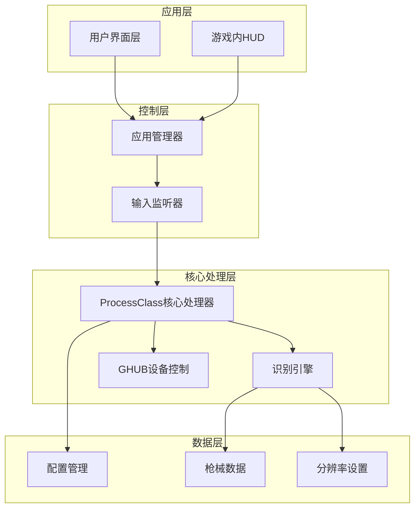
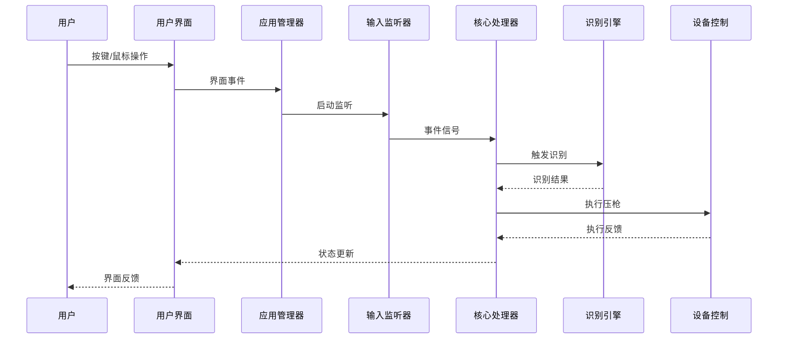
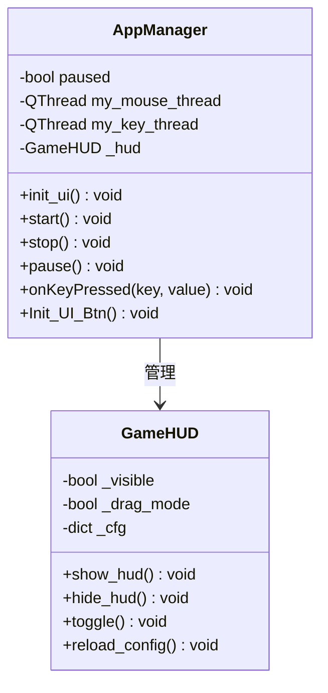
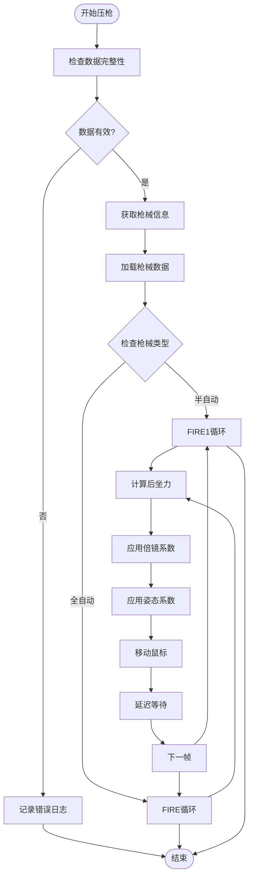
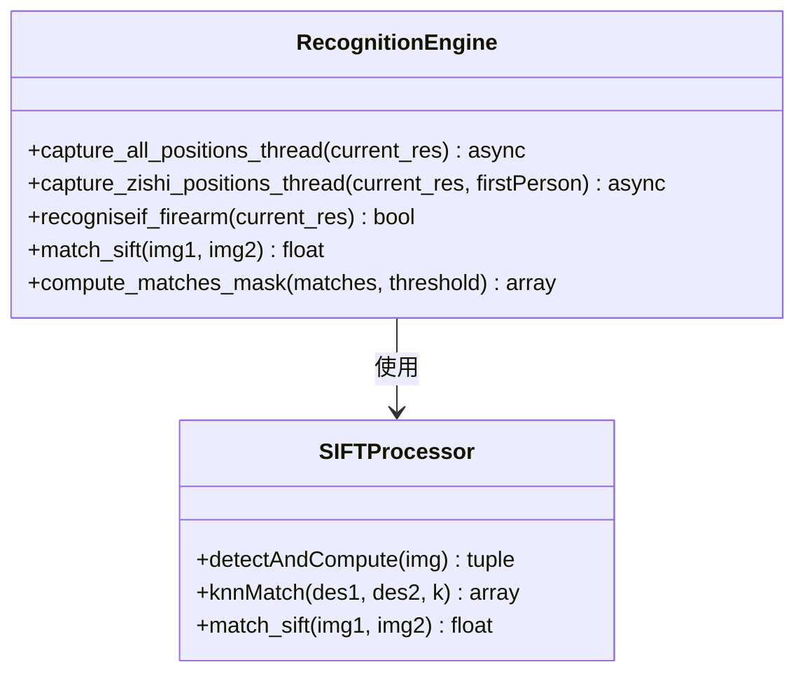
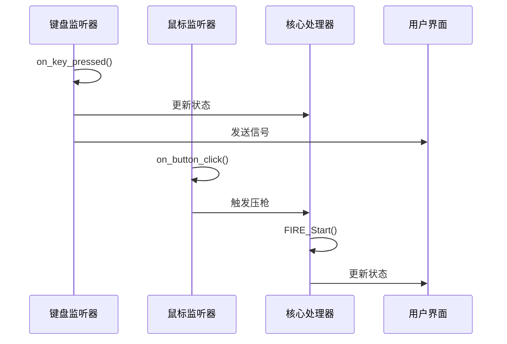
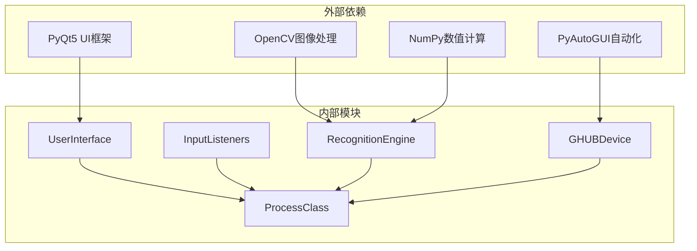

# 模块设计与职责

<cite>
**本文档引用的文件**
- [main.py](file://main.py)
- [process.py](file://core/process.py)
- [recognition.py](file://core/recognition.py)
- [ghub.py](file://core/ghub.py)
- [key_listener.py](file://input/key_listener.py)
- [mouse_listener.py](file://input/mouse_listener.py)
- [pubg_ui.py](file://ui/pubg_ui.py)
- [overlay_hud.py](file://ui/overlay_hud.py)
- [fire_data.py](file://data/fire_data.py)
- [bullet_data.py](file://data/bullet_data.py)
- [resolution_setting.py](file://data/resolution_setting.py)
- [config.json](file://Config/config.json)
- [hud_config.json](file://Config/hud_config.json)
- [requirements.txt](file://requirements.txt)
</cite>

## 目录
1. [引言](#引言)
2. [项目结构](#项目结构)
3. [核心组件](#核心组件)
4. [架构概览](#架构概览)
5. [详细组件分析](#详细组件分析)
6. [依赖分析](#依赖分析)
7. [性能考虑](#性能考虑)
8. [故障排除指南](#故障排除指南)
9. [结论](#结论)

## 引言

PUBG自动识别压枪工具是一个复杂的实时控制系统，旨在为玩家提供精准的自动压枪辅助。该系统通过多模态感知、智能识别和精确控制相结合的方式，在保证游戏公平性的前提下提升玩家体验。

系统采用模块化设计理念，将复杂的功能分解为独立的模块，每个模块都有明确的职责边界和清晰的接口定义。这种设计不仅提高了代码的可维护性，还为后续的功能扩展和优化奠定了坚实基础。

## 项目结构

项目采用分层架构设计，主要分为以下几个层次：

**图表来源**
- [main.py:1-294](file://main.py#L1-L294)
- [process.py:13-405](file://core/process.py#L13-L405)

**章节来源**
- [main.py:1-294](file://main.py#L1-L294)
- [requirements.txt:1-25](file://requirements.txt#L1-L25)

## 核心组件

### ProcessClass核心处理器

ProcessClass是整个系统的中枢控制器，负责协调各个模块的工作。它实现了单例模式，确保系统中只有一个核心处理器实例。

**主要职责：**
-  w:13-405](file://core/process.py#L13-L405)

**章节来源**
- [process.py:13-405](file://core/process.py#L13-L405)

### RecognitionEngine识别引擎

识别引擎专门负责图像识别和特征匹配，采用SIFT算法进行枪械和配件的识别。

**主要职责：**
- 实时图像捕获和处理
- SIFT特征匹配算法实现
- 枪械和配件识别
- 姿态识别功能

**章节来源**
- [recognition.py:1-478](file://core/recognition.py#L1-L478)

### InputListener输入监听器

输入监听器模块负责处理用户的键盘和鼠标输入，提供实时的交互响应。

**主要职责：**
- 键盘事件监听和处理
- 鼠标事件监听和处理
- 与核心处理器的事件通信
- 热键功能支持

**章节来源**
- [key_listener.py:1-70](file://input/key_listener.py#L1-L70)
- [mouse_listener.py:1-64](file://input/mouse_listener.py#L1-L64)

### GHUB设备控制模块

GHUB设备控制模块负责与罗技GHUB驱动进行通信，实现精确的鼠标控制。

**主要职责：**
- 鼠标移动控制
- 鼠标按键模拟
- 设备状态管理
- 键盘事件处理

**章节来源**
- [ghub.py:1-55](file://core/ghub.py#L1-L55)

## 架构概览

系统采用事件驱动的架构模式，通过信号槽机制实现模块间的松耦合通信。

**图表来源**
- [main.py:223-286](file://main.py#L223-L286)
- [process.py:207-405](file://core/process.py#L207-L405)

## 详细组件分析

### 应用管理器模块

应用管理器是系统的前端控制器，负责管理用户界面和协调各个子模块的工作。

**图表来源**
- [main.py:11-294](file://main.py#L11-L294)
- [overlay_hud.py:229-669](file://ui/overlay_hud.py#L229-L669)

**章节来源**
- [main.py:11-294](file://main.py#L11-L294)
- [pubg_ui.py:1-718](file://ui/pubg_ui.py#L1-L718)

### 核心处理模块深度分析

核心处理模块是系统的心脏，负责协调所有功能的执行。

**图表来源**
- [process.py:207-405](file://core/process.py#L207-L405)

**章节来源**
- [process.py:183-405](file://core/process.py#L183-L405)

### 识别引擎模块

识别引擎采用异步编程模型，通过多线程并行处理提高识别效率。

**图表来源**
- [recognition.py:67-478](file://core/recognition.py#L67-L478)

**章节来源**
- [recognition.py:10-478](file://core/recognition.py#L10-L478)

### 输入监听模块

输入监听模块采用多线程架构，分别处理键盘和鼠标事件。

**图表来源**
- [key_listener.py:14-70](file://input/key_listener.py#L14-L70)
- [mouse_listener.py:23-64](file://input/mouse_listener.py#L23-L64)

**章节来源**
- [key_listener.py:6-70](file://input/key_listener.py#L6-L70)
- [mouse_listener.py:13-64](file://input/mouse_listener.py#L13-L64)

## 依赖分析

系统采用模块化依赖管理，各模块间保持低耦合高内聚的设计原则。

**图表来源**
- [requirements.txt:1-25](file://requirements.txt#L1-L25)

**章节来源**
- [requirements.txt:1-25](file://requirements.txt#L1-L25)

### 模块间耦合度控制策略

系统通过以下策略控制模块间的耦合度：

1. **接口抽象**：所有模块都通过明确定义的接口进行通信
2. **事件驱动**：使用信号槽机制实现松耦合通信
3. **数据共享**：通过ProcessClass统一管理共享数据
4. **异常隔离**：每个模块都有独立的错误处理机制

## 性能考虑

系统在设计时充分考虑了性能优化：

### 实时性能优化
- 采用异步编程模型处理图像识别
- 多线程并行处理输入事件
- 智能缓存机制减少重复计算
- 动态分辨率适配优化

### 内存管理
- 及时释放图像资源
- 控制识别结果缓存大小
- 优化数据结构存储

### 系统资源管理
- 合理的线程池管理
- GPU加速支持（可选）
- 低延迟事件处理

## 故障排除指南

### 常见问题及解决方案

**GHUB驱动问题**
- 症状：设备初始化失败
- 解决方案：检查GHUB驱动安装，确保以管理员权限运行

**识别精度问题**
- 症状：枪械识别错误
- 解决方案：调整识别ROI区域，校准图像参数

**压枪不准问题**
- 症状：压枪效果不理想
- 解决方案：重新校准弹道数据，调整灵敏度设置

**性能问题**
- 症状：系统卡顿
- 解决方案：降低识别频率，关闭不必要的功能

**章节来源**
- [ghub.py:8-21](file://core/ghub.py#L8-L21)
- [process.py:53-71](file://core/process.py#L53-L71)

## 结论

PUBG自动识别压枪工具通过精心设计的模块化架构，实现了高性能、高可靠性的实时控制系统。各模块职责明确，接口清晰，为系统的可维护性和可扩展性提供了坚实基础。

系统的主要优势包括：
- 模块化设计便于维护和扩展
- 事件驱动架构提供良好的响应性
- 智能识别算法保证准确性
- 精确的设备控制确保效果
- 完善的错误处理机制提升稳定性

未来可以考虑的方向：
- 支持更多枪械类型
- 增强AI识别能力
- 优化用户体验界面
- 提供更多自定义选项