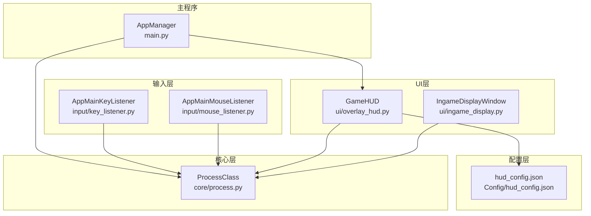
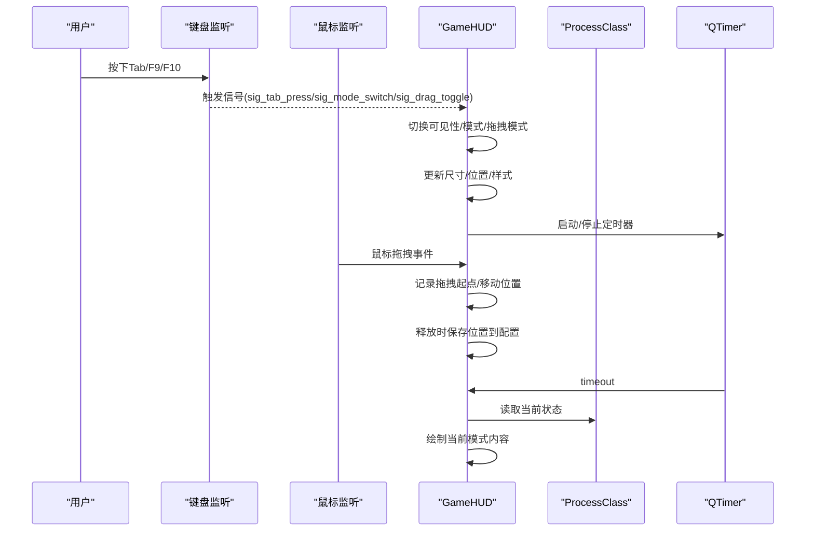
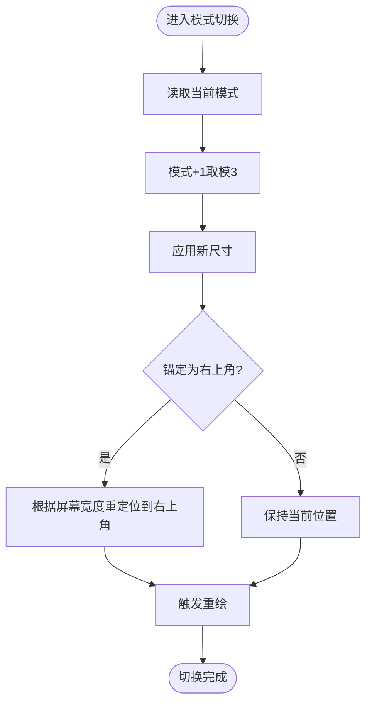
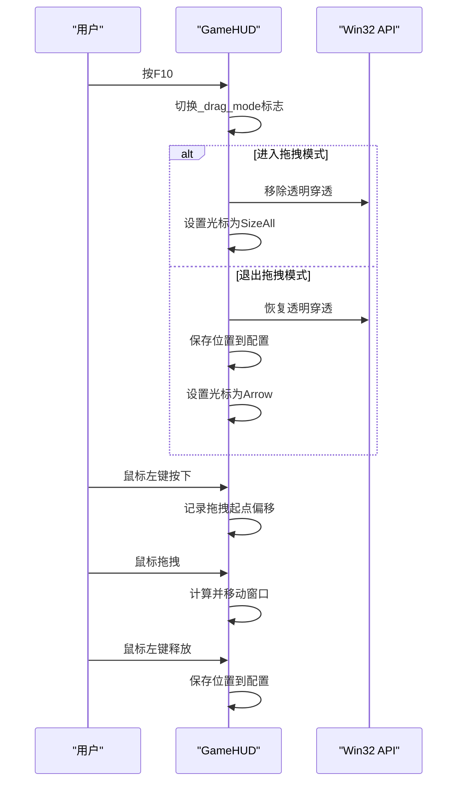
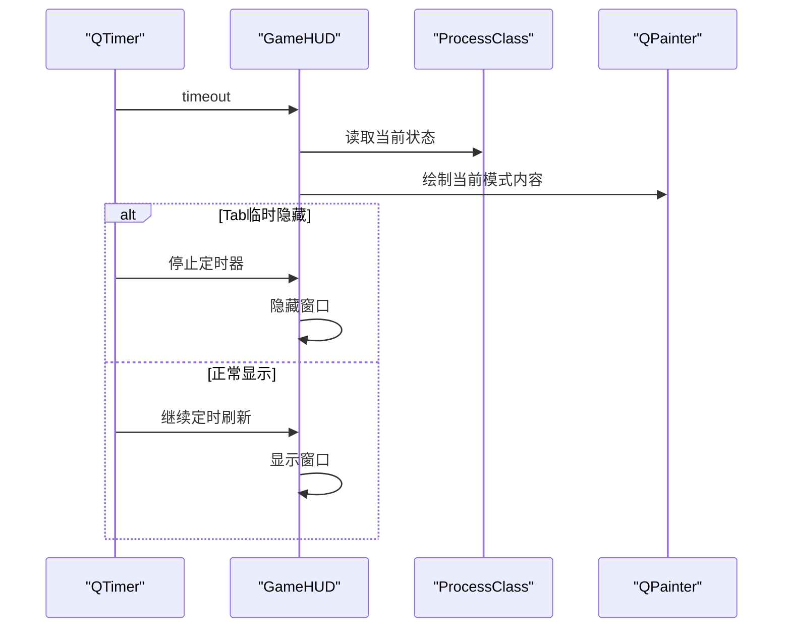
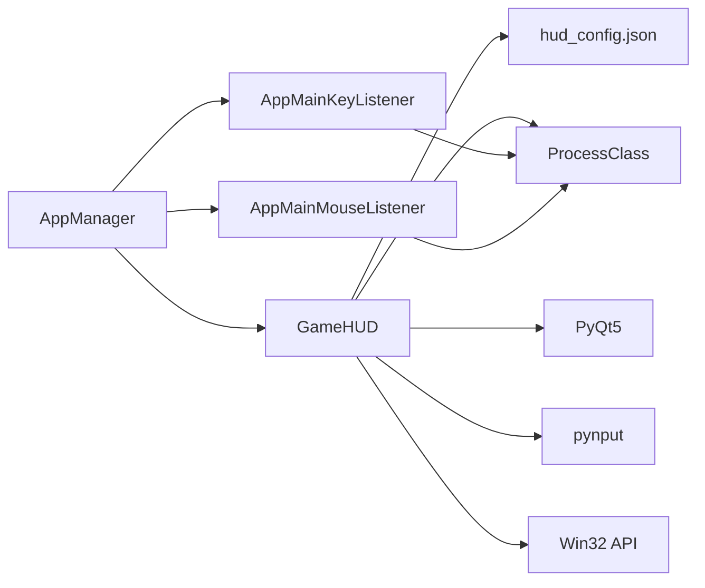

# HUD悬浮窗系统

<cite>
**本文档引用的文件**
- [ui/overlay_hud.py](file://ui/overlay_hud.py)
- [Config/hud_config.json](file://Config/hud_config.json)
- [main.py](file://main.py)
- [core/process.py](file://core/process.py)
- [input/key_listener.py](file://input/key_listener.py)
- [input/mouse_listener.py](file://input/mouse_listener.py)
- [ui/ingame_display.py](file://ui/ingame_display.py)
- [calibration/calibrate_hud.py](file://calibration/calibrate_hud.py)
</cite>

## 目录
1. [简介](#简介)
2. [项目结构](#项目结构)
3. [核心组件](#核心组件)
4. [架构总览](#架构总览)
5. [详细组件分析](#详细组件分析)
6. [依赖关系分析](#依赖关系分析)
7. [性能考虑](#性能考虑)
8. [故障排除指南](#故障排除指南)
9. [结论](#结论)

## 简介
本文件为PUBG自动识别压枪工具的HUD悬浮窗系统提供全面的技术文档。重点涵盖三档显示模式（极简、紧凑、完整）的实现原理与切换逻辑，悬浮窗的拖拽定位机制（鼠标事件处理、位置记忆与边界约束），HUD的实时更新机制（识别结果动态显示、状态变化即时反映），以及HUD配置选项（透明度、字体大小、颜色定制等）。同时给出性能优化策略与最佳实践及故障排除指南，帮助用户高效、稳定地使用该系统。

## 项目结构
HUD悬浮窗系统位于ui子模块中，核心文件为overlay_hud.py，配置文件为Config/hud_config.json。主程序入口main.py负责初始化并展示HUD，核心状态由core/process.py维护，输入事件由input子模块处理。

图表来源
- [ui/overlay_hud.py:229-668](file://ui/overlay_hud.py#L229-L668)
- [core/process.py:13-405](file://core/process.py#L13-L405)
- [input/key_listener.py:6-70](file://input/key_listener.py#L6-L70)
- [input/mouse_listener.py:13-64](file://input/mouse_listener.py#L13-L64)
- [Config/hud_config.json:1-91](file://Config/hud_config.json#L1-L91)
- [main.py:11-294](file://main.py#L11-L294)

章节来源
- [ui/overlay_hud.py:1-698](file://ui/overlay_hud.py#L1-L698)
- [Config/hud_config.json:1-91](file://Config/hud_config.json#L1-L91)
- [main.py:11-294](file://main.py#L11-L294)
- [core/process.py:13-405](file://core/process.py#L13-L405)
- [input/key_listener.py:6-70](file://input/key_listener.py#L6-L70)
- [input/mouse_listener.py:13-64](file://input/mouse_listener.py#L13-L64)
- [ui/ingame_display.py:31-558](file://ui/ingame_display.py#L31-L558)

## 核心组件
- GameHUD：三档显示模式的悬浮窗，支持配置、拖拽、键盘热键切换与实时更新。
- ProcessClass：全局状态管理，提供当前枪械、姿态、开镜状态、识别结果等。
- 输入监听：键盘监听（切换模式、姿态、视角等）与鼠标监听（开镜、开火、拖拽）。
- 配置系统：hud_config.json集中管理位置、尺寸、颜色、字体、透明度、刷新频率等。

章节来源
- [ui/overlay_hud.py:229-668](file://ui/overlay_hud.py#L229-L668)
- [core/process.py:13-405](file://core/process.py#L13-L405)
- [input/key_listener.py:6-70](file://input/key_listener.py#L6-L70)
- [input/mouse_listener.py:13-64](file://input/mouse_listener.py#L13-L64)
- [Config/hud_config.json:1-91](file://Config/hud_config.json#L1-L91)

## 架构总览
HUD悬浮窗采用“配置驱动 + 实时渲染”的架构：
- 配置驱动：从hud_config.json加载位置、尺寸、颜色、字体、透明度、刷新周期等。
- 状态驱动：从ProcessClass读取当前枪械、姿态、开镜状态、识别结果等。
- 事件驱动：键盘热键（Tab/F9/F10）与鼠标拖拽触发状态变更与绘制更新。
- 渲染驱动：定时器触发paintEvent，按当前模式绘制不同密度的信息。

图表来源
- [ui/overlay_hud.py:192-260](file://ui/overlay_hud.py#L192-L260)
- [ui/overlay_hud.py:314-371](file://ui/overlay_hud.py#L314-L371)
- [ui/overlay_hud.py:390-457](file://ui/overlay_hud.py#L390-L457)
- [ui/overlay_hud.py:458-525](file://ui/overlay_hud.py#L458-L525)
- [ui/overlay_hud.py:526-632](file://ui/overlay_hud.py#L526-L632)
- [core/process.py:131-170](file://core/process.py#L131-L170)

## 详细组件分析

### 三档显示模式实现原理
- 模式定义：极简（minimal）、紧凑（compact）、完整（full）三种模式，分别对应不同的信息密度与布局。
- 模式切换：通过热键F9循环切换，每次切换更新尺寸并保持右上角锚定（若配置为top-right）。
- 极简模式：仅显示当前武器名、瞄准具、姿态、状态指示灯与提示文字，适合最小干扰。
- 紧凑模式：显示武器槽位、当前武器名、瞄准具/枪口/握把/枪托等配件状态，以及姿态与开镜状态。
- 完整模式：显示HUD标题、状态指示、两把武器槽位及其名称与配件列、姿态、开镜状态、视角、提示文字等。

图表来源
- [ui/overlay_hud.py:328-341](file://ui/overlay_hud.py#L328-L341)
- [ui/overlay_hud.py:285-290](file://ui/overlay_hud.py#L285-L290)
- [ui/overlay_hud.py:334-340](file://ui/overlay_hud.py#L334-L340)

章节来源
- [ui/overlay_hud.py:188-189](file://ui/overlay_hud.py#L188-L189)
- [ui/overlay_hud.py:328-341](file://ui/overlay_hud.py#L328-L341)
- [ui/overlay_hud.py:401-457](file://ui/overlay_hud.py#L401-L457)
- [ui/overlay_hud.py:458-525](file://ui/overlay_hud.py#L458-L525)
- [ui/overlay_hud.py:526-632](file://ui/overlay_hud.py#L526-L632)

### 悬浮窗拖拽定位功能
- 拖拽开关：F10切换拖拽模式，进入拖拽模式时解除鼠标穿透，允许接收鼠标事件并改变光标形状。
- 鼠标事件：记录按下时的偏移量，移动时按偏移量计算新位置，释放时保存位置到配置文件。
- 边界约束：位置保存时写入配置，下次启动或重新定位时根据配置恢复；若配置为右上角锚定，则在切换模式时自动重定位到右上角。
- 窗口穿透：非拖拽模式下通过Win32 API设置窗口扩展样式为透明穿透，避免遮挡游戏画面。

图表来源
- [ui/overlay_hud.py:342-352](file://ui/overlay_hud.py#L342-L352)
- [ui/overlay_hud.py:356-371](file://ui/overlay_hud.py#L356-L371)
- [ui/overlay_hud.py:306-312](file://ui/overlay_hud.py#L306-L312)
- [ui/overlay_hud.py:41-55](file://ui/overlay_hud.py#L41-L55)

章节来源
- [ui/overlay_hud.py:342-352](file://ui/overlay_hud.py#L342-L352)
- [ui/overlay_hud.py:356-371](file://ui/overlay_hud.py#L356-L371)
- [ui/overlay_hud.py:41-55](file://ui/overlay_hud.py#L41-L55)

### HUD实时更新机制
- 定时刷新：基于QTimer以配置的refresh_ms为周期触发update，从而触发paintEvent。
- 数据来源：paintEvent中从ProcessClass读取当前状态（枪械识别结果、姿态、开镜状态、视角、开火状态等）。
- 动态显示：根据当前模式绘制不同密度的信息；状态变化（如开镜、开火、姿态）即时反映在界面中。
- 临时隐藏：Tab键临时隐藏HUD，释放Tab恢复显示，期间停止定时器以节省资源。

图表来源
- [ui/overlay_hud.py:262-266](file://ui/overlay_hud.py#L262-L266)
- [ui/overlay_hud.py:315-327](file://ui/overlay_hud.py#L315-L327)
- [ui/overlay_hud.py:390-457](file://ui/overlay_hud.py#L390-L457)

章节来源
- [ui/overlay_hud.py:262-266](file://ui/overlay_hud.py#L262-L266)
- [ui/overlay_hud.py:315-327](file://ui/overlay_hud.py#L315-L327)
- [core/process.py:131-170](file://core/process.py#L131-L170)

### HUD配置选项详解
- 位置与锚定：position.x/y、anchor、margin_right；当x<0时自动根据屏幕宽度与margin_right计算右上角位置。
- 默认模式：default_mode（minimal/compact/full）。
- 字体家族与大小：font_family与各模式下的font_size键值。
- 颜色体系：background、border、gold、green、red、yellow、white、gray、dim等RGBA配置。
- 尺寸：minimal、compact、full对应的[w,h]。
- 透明度：opacity（0~1）。
- 刷新周期：refresh_ms（毫秒）。
- 热键：hotkey_mode_switch（默认F9）。
- 配置加载与合并：优先读取Config/hud_config.json，支持深合并覆盖默认配置；保存时去除内部路径字段。

章节来源
- [Config/hud_config.json:1-91](file://Config/hud_config.json#L1-L91)
- [ui/overlay_hud.py:68-126](file://ui/overlay_hud.py#L68-L126)
- [ui/overlay_hud.py:291-305](file://ui/overlay_hud.py#L291-L305)
- [ui/overlay_hud.py:657-662](file://ui/overlay_hud.py#L657-L662)

### 与输入系统的集成
- 键盘热键：F9切换模式、F10切换拖拽、Tab临时隐藏；键盘监听线程通过信号向UI层传递状态变化。
- 鼠标事件：左键拖拽、右键开镜、左键开火；鼠标监听线程触发ProcessClass的状态更新与识别流程。
- 主程序集成：AppManager在启动时创建GameHUD并在运行时控制其显示/隐藏/暂停。

章节来源
- [input/key_listener.py:14-57](file://input/key_listener.py#L14-L57)
- [input/mouse_listener.py:23-50](file://input/mouse_listener.py#L23-L50)
- [main.py:223-268](file://main.py#L223-L268)

## 依赖关系分析
- GameHUD依赖：
  - 配置系统：hud_config.json
  - ProcessClass：状态数据源
  - PyQt5：窗口、事件、定时器、绘制
  - pynput：键盘监听
  - Windows Win32 API：窗口穿透控制
- 输入系统：
  - AppMainKeyListener/AppMainMouseListener：事件监听与状态更新
- 主程序：
  - AppManager：生命周期管理与HUD控制

图表来源
- [ui/overlay_hud.py:9-16](file://ui/overlay_hud.py#L9-L16)
- [ui/overlay_hud.py:61-100](file://ui/overlay_hud.py#L61-L100)
- [core/process.py:13-49](file://core/process.py#L13-L49)
- [input/key_listener.py:6-12](file://input/key_listener.py#L6-L12)
- [input/mouse_listener.py:13-21](file://input/mouse_listener.py#L13-L21)
- [main.py:11-39](file://main.py#L11-L39)

章节来源
- [ui/overlay_hud.py:9-16](file://ui/overlay_hud.py#L9-L16)
- [core/process.py:13-49](file://core/process.py#L13-L49)
- [input/key_listener.py:6-12](file://input/key_listener.py#L6-L12)
- [input/mouse_listener.py:13-21](file://input/mouse_listener.py#L13-L21)
- [main.py:11-39](file://main.py#L11-L39)

## 性能考虑
- 渲染频率控制：通过refresh_ms控制QTimer刷新周期，默认250ms，可在配置中降低以减少CPU占用。
- 窗口穿透：非拖拽模式启用透明穿透，避免不必要的输入事件处理与绘制遮挡。
- 临时隐藏：Tab临时隐藏时停止定时器，显著降低资源消耗。
- 字体与绘制：按需加载字体与颜色，避免重复创建QFont/QBrush对象；使用渐变背景与抗锯齿提升视觉质量的同时注意绘制成本。
- 配置持久化：拖拽结束后保存位置，避免频繁重算位置逻辑。

章节来源
- [ui/overlay_hud.py:262-266](file://ui/overlay_hud.py#L262-L266)
- [ui/overlay_hud.py:315-327](file://ui/overlay_hud.py#L315-L327)
- [ui/overlay_hud.py:41-55](file://ui/overlay_hud.py#L41-L55)

## 故障排除指南
- HUD不显示或无法交互
  - 检查是否正确初始化并调用show_hud；确认主程序已创建GameHUD实例。
  - 检查Windows版本与Win32 API可用性，若不可用则无法设置穿透样式。
- 拖拽无效
  - 确认已按F10切换到拖拽模式；检查鼠标事件是否被其他窗口拦截。
  - 检查配置文件中position.anchor与x/y是否合理。
- 模式切换异常
  - 确认热键F9未被其他程序占用；检查配置文件hotkey_mode_switch是否正确。
- 颜色/字体显示异常
  - 检查hud_config.json中colors与font_family是否合法；确认系统字体可用。
- 临时隐藏失效
  - Tab键临时隐藏仅在可见状态下生效；释放Tab应恢复显示，检查定时器状态。

章节来源
- [ui/overlay_hud.py:342-352](file://ui/overlay_hud.py#L342-L352)
- [ui/overlay_hud.py:328-341](file://ui/overlay_hud.py#L328-L341)
- [ui/overlay_hud.py:315-327](file://ui/overlay_hud.py#L315-L327)
- [Config/hud_config.json:1-91](file://Config/hud_config.json#L1-L91)
- [main.py:223-268](file://main.py#L223-L268)

## 结论
HUD悬浮窗系统通过清晰的三档显示模式、灵活的拖拽定位、实时的状态更新与完善的配置体系，为PUBG压枪工具提供了直观、可定制的可视化界面。结合合理的性能优化与完善的故障排除指南，用户可以在保证低干扰的前提下高效使用该系统。建议在实际使用中根据个人习惯调整配置项（如透明度、字体大小、刷新频率），并利用拖拽模式快速适配不同分辨率与显示器布局。