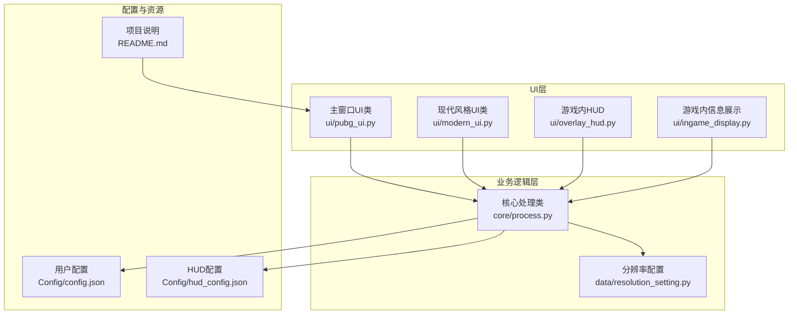
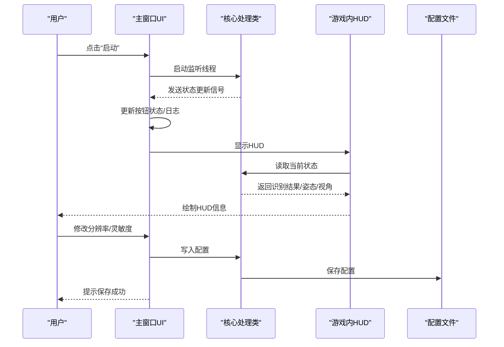
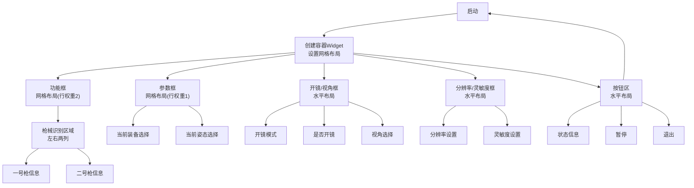
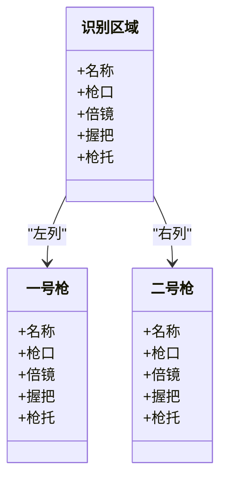
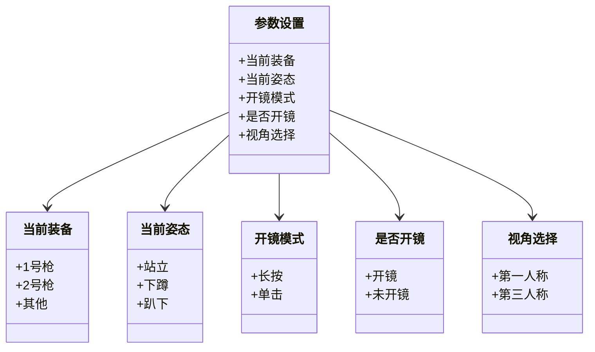
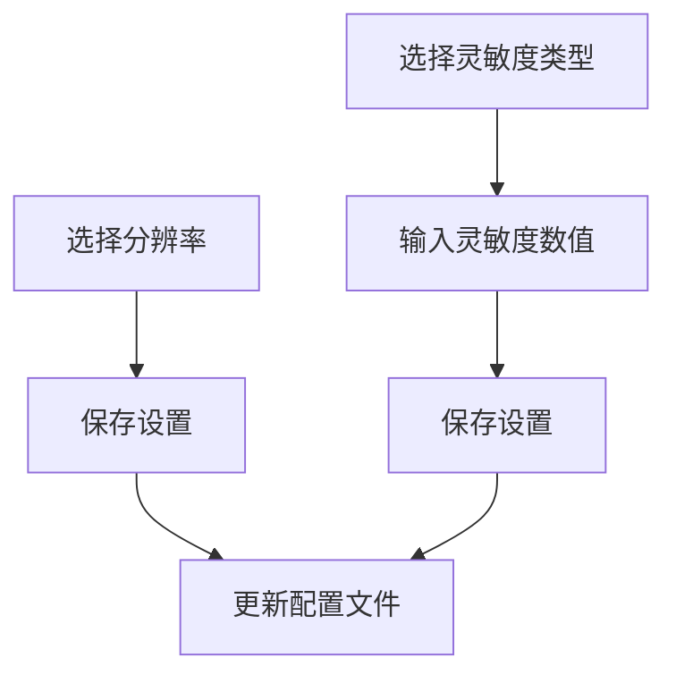
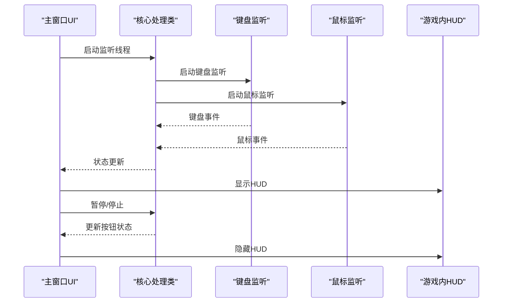
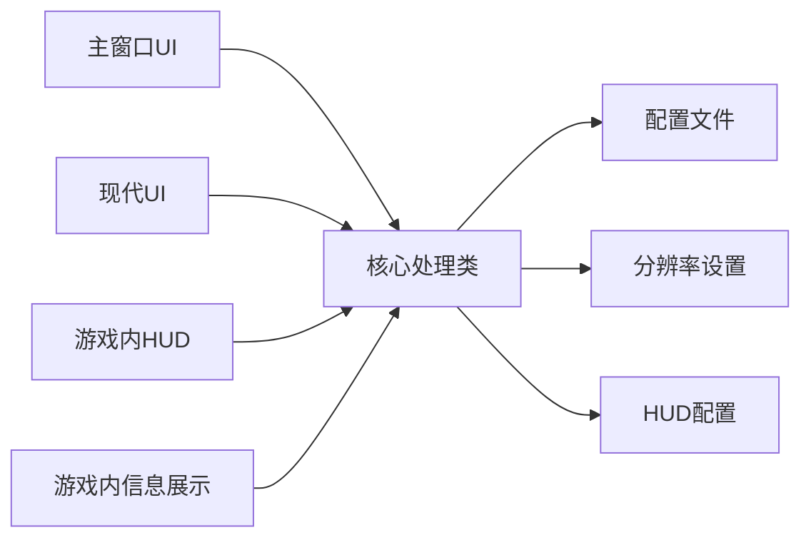

# 主窗口UI设计

<cite>
**本文引用的文件**
- [main.py](file://main.py)
- [pubg_ui.py](file://ui/pubg_ui.py)
- [modern_ui.py](file://ui/modern_ui.py)
- [overlay_hud.py](file://ui/overlay_hud.py)
- [ingame_display.py](file://ui/ingame_display.py)
- [process.py](file://core/process.py)
- [resolution_setting.py](file://data/resolution_setting.py)
- [config.json](file://Config/config.json)
- [hud_config.json](file://Config/hud_config.json)
- [README.md](file://README.md)
</cite>

## 目录
1. [简介](#简介)
2. [项目结构](#项目结构)
3. [核心组件](#核心组件)
4. [架构总览](#架构总览)
5. [详细组件分析](#详细组件分析)
6. [依赖关系分析](#依赖关系分析)
7. [性能考量](#性能考量)
8. [故障排查指南](#故障排查指南)
9. [结论](#结论)
10. [附录](#附录)

## 简介
本文件面向PUBG自动识别压枪工具的主窗口UI，系统性阐述其设计理念、布局结构、网格系统实现、控件层次关系、功能模块划分、响应式设计、事件处理机制以及界面定制与样式修改方案。文档同时提供实用的使用技巧与最佳实践，帮助用户高效上手并深度定制界面。

## 项目结构
该工具采用PyQt5构建桌面UI，主窗口UI由独立的UI类负责布局与样式，核心业务逻辑由ProcessClass集中管理，UI通过事件绑定与核心类交互，形成清晰的分层架构。

图表来源
- [pubg_ui.py:1-718](file://ui/pubg_ui.py#L1-L718)
- [modern_ui.py:1-738](file://ui/modern_ui.py#L1-L738)
- [overlay_hud.py:1-698](file://ui/overlay_hud.py#L1-L698)
- [ingame_display.py:1-558](file://ui/ingame_display.py#L1-L558)
- [process.py:1-405](file://core/process.py#L1-L405)
- [resolution_setting.py:1-147](file://data/resolution_setting.py#L1-L147)
- [config.json:1-1](file://Config/config.json#L1-L1)
- [hud_config.json:1-91](file://Config/hud_config.json#L1-L91)
- [README.md:1-156](file://README.md#L1-L156)

章节来源
- [README.md:22-67](file://README.md#L22-L67)

## 核心组件
- 主窗口UI类：负责整体布局、控件层次、事件绑定与状态更新。
- 现代风格UI类：提供更丰富的交互与样式，包含标签页、滑块、配置管理等。
- 游戏内HUD：三档可切换的悬浮窗，支持拖动与配置。
- 游戏内信息展示：可切换显示模式的悬浮信息窗。
- 核心处理类：统一管理分辨率、灵敏度、枪械识别、姿态识别、压枪计算等。

章节来源
- [pubg_ui.py:4-639](file://ui/pubg_ui.py#L4-L639)
- [modern_ui.py:4-738](file://ui/modern_ui.py#L4-L738)
- [overlay_hud.py:229-669](file://ui/overlay_hud.py#L229-L669)
- [ingame_display.py:31-558](file://ui/ingame_display.py#L31-L558)
- [process.py:13-405](file://core/process.py#L13-L405)

## 架构总览
主窗口UI通过事件绑定与核心处理类交互，核心类负责读取/写入配置、执行识别与压枪计算，并将状态回传至UI。游戏内HUD与信息展示作为独立组件，通过配置文件与核心类共享状态。

图表来源
- [main.py:223-286](file://main.py#L223-L286)
- [process.py:53-71](file://core/process.py#L53-L71)
- [overlay_hud.py:634-669](file://ui/overlay_hud.py#L634-L669)

## 详细组件分析

### 主窗口UI布局与网格系统
- 整体采用垂直布局容器，内部嵌套网格布局，实现模块化分区与弹性伸缩。
- 网格系统通过行列权重控制各区域高度占比，确保功能区、参数区、分辨率区、按钮区的视觉平衡与响应式适配。
- 控件层次清晰：容器Widget承载网格，网格内放置功能框、参数框、分辨率框、按钮框等子容器，子容器内进一步细分小组件。

图表来源
- [pubg_ui.py:19-639](file://ui/pubg_ui.py#L19-L639)

章节来源
- [pubg_ui.py:19-639](file://ui/pubg_ui.py#L19-L639)

### 功能模块设计与交互逻辑

#### 枪械识别区域
- 采用两列布局分别展示一号枪与二号枪的识别结果，包含名称、枪口、倍镜、握把、枪托等字段。
- 文本颜色与字体样式区分不同字段类型，提升可读性。
- 识别结果由核心类异步更新，UI通过事件回调刷新标签文本。

图表来源
- [pubg_ui.py:131-425](file://ui/pubg_ui.py#L131-L425)

章节来源
- [pubg_ui.py:131-425](file://ui/pubg_ui.py#L131-L425)

#### 参数设置区域
- 当前装备：单选按钮组，支持1号枪、2号枪与其他。
- 当前姿态：单选按钮组，支持站立、下蹲、趴下。
- 开镜模式：单选按钮组，支持长按与单击。
- 是否开镜：单选按钮组，支持开镜与未开镜。
- 视角选择：单选按钮组，支持第一人称与第三人称。

图表来源
- [pubg_ui.py:450-511](file://ui/pubg_ui.py#L450-L511)

章节来源
- [pubg_ui.py:450-511](file://ui/pubg_ui.py#L450-L511)

#### 分辨率配置区域
- 分辨率选择：下拉框提供多种分辨率选项，保存后写入配置文件。
- 灵敏度设置：下拉框选择灵敏度类型，输入框支持手动输入数值，保存后写入配置文件。

图表来源
- [pubg_ui.py:512-591](file://ui/pubg_ui.py#L512-L591)
- [process.py:53-71](file://core/process.py#L53-L71)

章节来源
- [pubg_ui.py:512-591](file://ui/pubg_ui.py#L512-L591)
- [process.py:53-71](file://core/process.py#L53-L71)

#### 按钮区与状态反馈
- 启动/暂停/停止按钮：控制监听线程与HUD显示。
- 状态信息：实时显示程序运行状态。
- 事件绑定：按钮点击触发相应动作，核心类通过信号回传状态更新。

图表来源
- [main.py:223-286](file://main.py#L223-L286)
- [overlay_hud.py:634-669](file://ui/overlay_hud.py#L634-L669)

章节来源
- [main.py:223-286](file://main.py#L223-L286)

### 响应式设计与自适应
- 网格行权重：通过设置行权重实现区域高度比例自适应，保证在不同窗口尺寸下保持视觉平衡。
- 字体与颜色：使用样式表与字体设置实现跨分辨率的可读性保障。
- 窗口特性：无边框、透明度、置顶等特性提升用户体验与游戏内可见性。

章节来源
- [pubg_ui.py:8-14](file://ui/pubg_ui.py#L8-L14)
- [pubg_ui.py:633-637](file://ui/pubg_ui.py#L633-L637)

### 界面定制与样式修改
- 主窗口样式：通过样式表设置背景透明度、颜色与字体，实现轻量化视觉效果。
- 现代风格UI：提供完整的CSS样式定义，包含标签页、按钮、输入框、滑块等控件的样式。
- HUD样式：通过配置文件控制颜色、字体、尺寸、透明度等，支持三档显示模式切换。

章节来源
- [pubg_ui.py:10](file://ui/pubg_ui.py#L10)
- [modern_ui.py:13-95](file://ui/modern_ui.py#L13-L95)
- [hud_config.json:18-87](file://Config/hud_config.json#L18-L87)

### 事件处理机制
- 按钮点击：通过clicked信号绑定到处理函数，实现装备切换、姿态切换、开镜模式切换、视角切换等。
- 下拉菜单选择：currentIndexChanged信号绑定到灵敏度标签更新函数。
- 文本输入：输入框验证数字格式后写入配置。
- 键盘/鼠标事件：核心类接收事件并通过信号回传UI，实现动态状态更新。

章节来源
- [main.py:40-57](file://main.py#L40-L57)
- [main.py:183-186](file://main.py#L183-L186)
- [main.py:270-286](file://main.py#L270-L286)

### 使用技巧与最佳实践
- 分辨率与灵敏度：根据实际屏幕分辨率选择匹配项，灵敏度数值可通过校准工具逐步微调。
- 枪械识别：在背包界面按Tab截图识别，确保截图区域覆盖完整枪械信息。
- HUD使用：Tab键临时隐藏HUD，F9切换显示模式，F10切换拖动模式。
- 状态监控：通过日志输出与状态信息了解程序运行状态，及时发现异常。

章节来源
- [README.md:69-84](file://README.md#L69-L84)
- [overlay_hud.py:229-260](file://ui/overlay_hud.py#L229-L260)

## 依赖关系分析
- UI层依赖核心处理类提供的状态与配置接口，通过事件绑定实现解耦。
- 核心处理类依赖配置文件与分辨率设置，读取/写入配置并驱动识别与压枪计算。
- HUD与信息展示组件独立于主窗口UI，通过配置文件与核心类共享状态。

图表来源
- [main.py:11-39](file://main.py#L11-L39)
- [process.py:53-71](file://core/process.py#L53-L71)
- [overlay_hud.py:236-266](file://ui/overlay_hud.py#L236-L266)
- [ingame_display.py:31-65](file://ui/ingame_display.py#L31-L65)

章节来源
- [main.py:11-39](file://main.py#L11-L39)
- [process.py:53-71](file://core/process.py#L53-L71)

## 性能考量
- UI刷新频率：主窗口日志与状态更新采用事件驱动，避免频繁重绘。
- HUD刷新：通过定时器控制刷新频率，降低CPU占用。
- 分辨率适配：通过配置文件与分辨率设置实现多分辨率支持，减少重复计算。
- 线程分离：键盘与鼠标监听独立线程，避免阻塞UI主线程。

章节来源
- [overlay_hud.py:262-266](file://ui/overlay_hud.py#L262-L266)
- [ingame_display.py:61-65](file://ui/ingame_display.py#L61-L65)
- [main.py:223-234](file://main.py#L223-L234)

## 故障排查指南
- 无法启动：检查驱动与权限，确认以管理员身份运行。
- 识别不准确：调整分辨率设置中的截图区域坐标，或使用校准工具。
- HUD不显示：检查配置文件路径与权限，确认配置文件存在且可读写。
- 灵敏度异常：在GUI中重新设置灵敏度并保存，核对配置文件中的数值。

章节来源
- [README.md:16-21](file://README.md#L16-L21)
- [README.md:111-114](file://README.md#L111-L114)
- [overlay_hud.py:88-126](file://ui/overlay_hud.py#L88-L126)
- [process.py:53-71](file://core/process.py#L53-L71)

## 结论
主窗口UI采用模块化网格布局，清晰的功能分区与事件绑定机制，实现了与核心业务逻辑的松耦合。通过配置文件与样式表，用户可以灵活定制界面外观与行为。结合现代风格UI与游戏内HUD，工具提供了从桌面到游戏内的完整可视化体验。

## 附录
- 快速开始：安装依赖后运行主程序，按提示进行分辨率与灵敏度配置，启动后按Tab截图识别。
- 配置文件：config.json存储分辨率与灵敏度，hud_config.json存储HUD显示配置。
- 分辨率适配：根据实际分辨率调整截图区域坐标，确保识别准确性。

章节来源
- [README.md:69-84](file://README.md#L69-L84)
- [config.json:1-1](file://Config/config.json#L1-L1)
- [hud_config.json:1-91](file://Config/hud_config.json#L1-L91)
- [resolution_setting.py:2-147](file://data/resolution_setting.py#L2-L147)