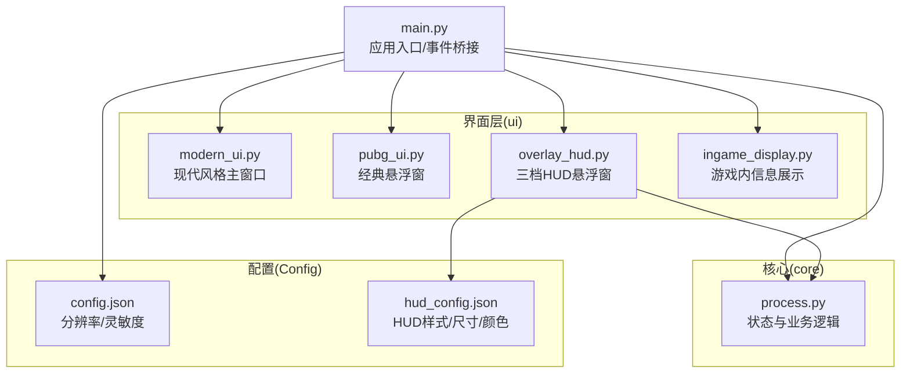
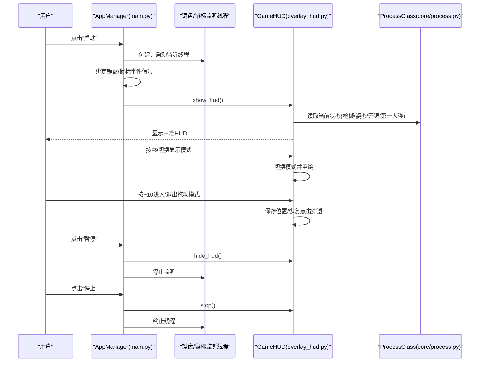
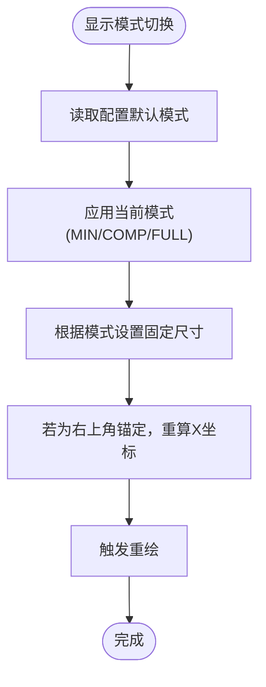
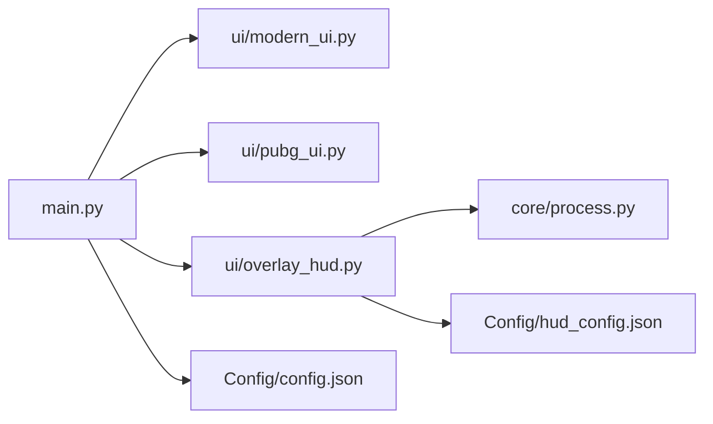

# 用户界面系统

<cite>
**本文引用的文件**
- [ui/modern_ui.py](file://ui/modern_ui.py)
- [ui/pubg_ui.py](file://ui/pubg_ui.py)
- [ui/overlay_hud.py](file://ui/overlay_hud.py)
- [ui/ingame_display.py](file://ui/ingame_display.py)
- [main.py](file://main.py)
- [core/process.py](file://core/process.py)
- [Config/hud_config.json](file://Config/hud_config.json)
- [Config/config.json](file://Config/config.json)
</cite>

## 目录
1. [简介](#简介)
2. [项目结构](#项目结构)
3. [核心组件](#核心组件)
4. [架构总览](#架构总览)
5. [详细组件分析](#详细组件分析)
6. [依赖关系分析](#依赖关系分析)
7. [性能考量](#性能考量)
8. [故障排查指南](#故障排查指南)
9. [结论](#结论)
10. [附录](#附录)

## 简介
本文件面向PUBG自动识别压枪工具的用户界面系统，聚焦以下目标：
- 主窗口UI的设计理念与布局结构，控件功能与交互流程
- HUD悬浮窗三档显示模式（极简、紧凑、完整）的实现与切换逻辑
- 界面响应式设计与用户体验优化策略
- 界面定制与样式修改指导
- 界面组件事件处理机制与状态管理
- 使用技巧与最佳实践

## 项目结构
本项目采用模块化组织，界面层主要位于ui目录，核心业务逻辑在core与data目录，配置文件集中在Config目录。主入口通过main.py连接UI与核心处理类，HUD悬浮窗独立于主窗口，通过GameHUD类实现。

图表来源
- [ui/modern_ui.py:1-738](file://ui/modern_ui.py#L1-L738)
- [ui/pubg_ui.py:1-718](file://ui/pubg_ui.py#L1-L718)
- [ui/overlay_hud.py:1-698](file://ui/overlay_hud.py#L1-L698)
- [ui/ingame_display.py:1-558](file://ui/ingame_display.py#L1-L558)
- [main.py:1-294](file://main.py#L1-L294)
- [core/process.py:1-405](file://core/process.py#L1-L405)
- [Config/hud_config.json:1-91](file://Config/hud_config.json#L1-L91)
- [Config/config.json:1-1](file://Config/config.json#L1-L1)

章节来源
- [main.py:287-294](file://main.py#L287-L294)
- [core/process.py:13-49](file://core/process.py#L13-L49)

## 核心组件
- 现代风格主窗口（Ui_ModernPUBG）：基于PyQt5的Tab页式界面，包含分辨率设置、灵敏度设置、枪械识别、姿态设置、压枪强度调整、快捷键设置、日志输出等区域。
- 经典悬浮窗（Ui_PUBG）：无边框透明悬浮窗，用于显示当前枪械与姿态信息，支持开镜模式、视角切换、分辨率与灵敏度设置。
- 三档HUD悬浮窗（GameHUD）：可配置的三档显示模式（极简/紧凑/完整），支持热键切换、拖动定位、透明度与颜色配置。
- 游戏内信息展示（IngameDisplayWindow/IngameDisplayManager）：简洁/标准/专业三档模式，支持拖动、透明度调节、快捷键提示。
- 核心处理类（ProcessClass）：提供当前状态（枪械、姿态、开镜、第一人称、Shift倍率等）与业务逻辑（压枪计算、识别结果等），供UI读取与渲染。

章节来源
- [ui/modern_ui.py:4-738](file://ui/modern_ui.py#L4-L738)
- [ui/pubg_ui.py:4-718](file://ui/pubg_ui.py#L4-L718)
- [ui/overlay_hud.py:229-698](file://ui/overlay_hud.py#L229-L698)
- [ui/ingame_display.py:31-558](file://ui/ingame_display.py#L31-L558)
- [core/process.py:13-405](file://core/process.py#L13-L405)

## 架构总览
主窗口与经典悬浮窗由main.py统一管理，启动/暂停/停止时控制键盘/鼠标监听线程与HUD显示；三档HUD悬浮窗独立于主窗口，通过GameHUD类与ProcessClass交互，实时绘制当前状态。

图表来源
- [main.py:223-268](file://main.py#L223-L268)
- [ui/overlay_hud.py:229-698](file://ui/overlay_hud.py#L229-L698)
- [core/process.py:13-49](file://core/process.py#L13-L49)

## 详细组件分析

### 主窗口UI（Ui_ModernPUBG）
- 设计理念
  - 采用现代风格样式表，统一字体与控件外观，强调清晰的信息层级与操作反馈。
  - 使用QTabWidget分页组织功能，便于扩展与维护。
- 布局结构
  - 状态指示区：运行状态点、状态文本、启动/停止按钮。
  - 基本设置页：分辨率设置、开镜模式（长按/单击）、灵敏度设置（基础/红点/2倍/4倍）。
  - 枪械识别页：一号/二号枪识别详情（名称/枪口/倍镜/握把/枪托）、姿态设置、压枪强度调整、快捷键设置、日志输出。
  - 高级设置/数据统计/帮助页占位。
  - 状态栏：CPU/内存资源显示。
- 交互流程
  - 启动/停止：通过按钮事件切换状态，更新UI控件可用性与状态栏提示。
  - 灵敏度滑块：实时同步数值标签。
  - 分辨率/灵敏度保存：写入配置文件并提示。
- 事件处理与状态管理
  - 通过信号槽连接控件事件，集中处理业务逻辑。
  - 状态点颜色与文本随运行状态动态更新。

章节来源
- [ui/modern_ui.py:4-738](file://ui/modern_ui.py#L4-L738)

### 经典悬浮窗（Ui_PUBG）
- 设计理念
  - 无边框透明悬浮窗，适合游戏内叠加显示，减少遮挡。
  - 采用网格布局，清晰划分“识别信息区/参数区/分辨率与灵敏度区/控制区”。
- 功能说明
  - 识别信息区：一号/二号枪名称、枪口、倍镜、握把、枪托。
  - 参数区：当前装备（1号/2号/其他）、当前姿态（下蹲/趴下/站立）、视角（第一/第三人称）。
  - 分辨率与灵敏度：分辨率选择、灵敏度类型选择与数值输入。
  - 控制区：启动/暂停/退出按钮。
- 交互流程
  - 启动后显示识别信息；暂停时隐藏；退出终止线程。
  - 支持开镜模式（长按/单击）与是否开镜（开镜/未开镜）切换。
- 事件处理与状态管理
  - 通过ProcessClass提供的状态字段更新UI显示。

章节来源
- [ui/pubg_ui.py:4-718](file://ui/pubg_ui.py#L4-L718)
- [main.py:66-87](file://main.py#L66-L87)

### HUD悬浮窗三档显示模式（GameHUD）
- 模式定义
  - 极简：仅显示当前枪械、倍镜、姿态与状态点，信息密度低，视觉干扰最小。
  - 紧凑：显示武器槽位、名称与主要配件，以及姿态/开镜状态，兼顾信息与空间。
  - 完整：显示两把武器的完整信息、姿态、开镜、视角与状态提示，适合调试与专业场景。
- 切换逻辑
  - 通过热键（默认F9）循环切换模式，切换时根据配置调整尺寸并保持右上角锚定。
  - Tab键临时隐藏/恢复HUD，便于背包识别不遮挡视线。
  - F10切换拖动模式：解除点击穿透以便拖动，退出拖动后自动保存位置。
- 绘制实现
  - paintEvent根据当前模式调用对应绘制函数，统一使用渐变背景、圆角边框与主题色。
  - 文字颜色区分重要性（金/绿/灰/白），状态点颜色随开火/开镜/鼠标左键状态变化。
- 配置与定制
  - 位置、默认模式、字体族与字号、颜色、尺寸、透明度、刷新周期、热键等均来自hud_config.json。
  - 支持热键切换模式、拖动保存位置、颜色与尺寸可调。
- 事件处理机制
  - _KeyListener线程监听键盘事件，发射信号给主线程，避免阻塞UI。
  - 鼠标拖动事件在拖动模式下生效，释放时保存位置。

图表来源
- [ui/overlay_hud.py:328-340](file://ui/overlay_hud.py#L328-L340)
- [ui/overlay_hud.py:285-305](file://ui/overlay_hud.py#L285-L305)

章节来源
- [ui/overlay_hud.py:188-190](file://ui/overlay_hud.py#L188-L190)
- [ui/overlay_hud.py:328-340](file://ui/overlay_hud.py#L328-L340)
- [ui/overlay_hud.py:356-371](file://ui/overlay_hud.py#L356-L371)
- [ui/overlay_hud.py:401-457](file://ui/overlay_hud.py#L401-L457)
- [ui/overlay_hud.py:458-525](file://ui/overlay_hud.py#L458-L525)
- [ui/overlay_hud.py:526-632](file://ui/overlay_hud.py#L526-L632)
- [Config/hud_config.json:1-91](file://Config/hud_config.json#L1-L91)

### 游戏内信息展示（IngameDisplay）
- 模式定义
  - 简洁：仅显示武器名称与配件，适合追求极简。
  - 标准：显示武器属性（伤害/射速/精度）与配件，平衡信息与可读性。
  - 专业：显示更多属性、识别可信度、推荐配件、姿态与压枪参数、压枪效果进度条与系统延迟。
- 响应式设计
  - 根据显示模式动态调整窗口尺寸与内容布局，确保文字与控件不溢出。
  - 支持四角定位（左上/右上/左下/右下），自动适配屏幕尺寸。
- 交互与快捷键
  - 支持拖动窗口，拖动时显示提示；释放保存位置。
  - 支持隐藏/显示窗口（默认F10），在非简洁模式下提供模式切换与设置入口提示。
- 事件处理机制
  - 定时器定期刷新，绘制背景、标题、内容与状态提示。
  - 提供公开接口更新武器信息与专业信息，供外部模块调用。

章节来源
- [ui/ingame_display.py:31-558](file://ui/ingame_display.py#L31-L558)

### 状态与数据源（ProcessClass）
- 状态字段
  - Current_firearms、Current_posture、StartFire、RightClick、firstPerson、mouse_one、Shift倍率等。
- 数据接口
  - get_guns_result()/get_guns_info()：提供识别结果与当前枪械信息。
  - recognize_all_guns_info()/recognize_zishi_info()：异步触发识别任务。
  - calculate_the_recoil()/FIRE/FIRE1/FIRE_v2：压枪计算与执行。
- 与UI的交互
  - 主窗口与HUD通过ProcessClass的状态字段读取当前状态并更新UI。
  - 键盘/鼠标监听线程通过事件映射触发UI更新。

章节来源
- [core/process.py:13-405](file://core/process.py#L13-L405)
- [main.py:270-286](file://main.py#L270-L286)

## 依赖关系分析
- 主入口依赖
  - main.py依赖UI模块（Ui_PUBG、Ui_ModernPUBG）、输入监听模块、HUD模块与核心处理类。
- HUD与核心
  - GameHUD依赖ProcessClass获取当前状态，依赖hud_config.json进行配置加载与保存。
- 配置文件
  - hud_config.json：HUD位置、默认模式、字体、颜色、尺寸、透明度、刷新周期、热键。
  - config.json：分辨率与灵敏度配置，供ProcessClass读取与保存。

图表来源
- [main.py:1-294](file://main.py#L1-L294)
- [ui/overlay_hud.py:61-126](file://ui/overlay_hud.py#L61-L126)
- [Config/hud_config.json:1-91](file://Config/hud_config.json#L1-L91)
- [Config/config.json:1-1](file://Config/config.json#L1-L1)

章节来源
- [main.py:1-294](file://main.py#L1-L294)
- [ui/overlay_hud.py:61-126](file://ui/overlay_hud.py#L61-L126)

## 性能考量
- 刷新频率与渲染
  - GameHUD默认刷新周期可配置，默认约250ms；IngameDisplay默认100ms刷新，兼顾流畅与资源占用。
- 点击穿透与拖动
  - 非拖动模式启用点击穿透，避免影响游戏输入；拖动时解除穿透，释放后自动保存位置。
- 字体与颜色
  - 使用抗锯齿绘制与渐变背景，提升可读性；颜色与透明度可调，降低视觉负担。
- 线程与事件
  - 键盘/鼠标监听在独立线程中运行，避免阻塞UI；HUD通过定时器触发重绘，避免频繁刷新。

[本节为通用性能讨论，不直接分析具体文件]

## 故障排查指南
- HUD无法显示/隐藏
  - 检查启动/暂停/停止流程是否正确调用show_hud/hide_hud/stop。
  - 确认键盘监听线程正常运行，热键（F9/F10/Tab）未被其他程序占用。
- 模式切换无效
  - 确认hud_config.json中的热键配置是否正确；检查GameHUD的_key_t线程是否启动。
- 拖动位置不保存
  - 拖动结束后需释放鼠标按键，触发保存逻辑；确认配置文件写入权限。
- 信息不更新
  - 确认ProcessClass的状态字段是否被正确更新；检查识别线程是否运行。
- 透明度与颜色异常
  - 检查hud_config.json中的colors与opacity配置；确认窗口透明度设置。

章节来源
- [main.py:223-268](file://main.py#L223-L268)
- [ui/overlay_hud.py:342-352](file://ui/overlay_hud.py#L342-L352)
- [ui/overlay_hud.py:111-126](file://ui/overlay_hud.py#L111-L126)

## 结论
本界面系统通过模块化设计实现了主窗口、经典悬浮窗与三档HUD悬浮窗的协同工作。三档HUD悬浮窗提供了从极简到完整的多种信息密度选项，配合可配置的颜色、字体、尺寸与热键，满足不同场景下的使用需求。通过ProcessClass统一的状态管理与事件桥接，UI能够实时反映系统状态，提供良好的用户体验。

[本节为总结性内容，不直接分析具体文件]

## 附录

### 界面定制与样式修改指导
- HUD样式定制
  - 位置：position.x/y与anchor/margin_right；当x为负时按右上角锚定自动计算X。
  - 默认模式：default_mode（minimal/compact/full）。
  - 字体：font_family与各模式字体大小（minimal/compact_header/body/full_header/body/hint）。
  - 颜色：background/border/gold/green/red/yellow/white/gray/dim。
  - 尺寸：minimal/compact/full的宽高。
  - 透明度：opacity（0~1）。
  - 刷新周期：refresh_ms。
  - 热键：hotkey_mode_switch（切换模式）。
- 游戏内信息展示
  - 通过IngameDisplayManager的setDisplayMode/setPosition/setOpacity等接口动态调整。
  - 内容布局随模式自动适配，注意文字宽度与控件间距。

章节来源
- [Config/hud_config.json:1-91](file://Config/hud_config.json#L1-L91)
- [ui/ingame_display.py:66-102](file://ui/ingame_display.py#L66-L102)

### 界面使用技巧与最佳实践
- HUD模式选择
  - 比赛/竞技：优先极简模式，减少视觉干扰；需要调试时切换至完整模式。
  - 训练/校准：使用紧凑模式查看主要配件；专业模式查看压枪参数与系统延迟。
- 快捷键使用
  - F9快速切换HUD模式；F10进入拖动模式；Tab临时隐藏HUD便于识别。
  - 游戏内信息展示：F10隐藏/显示；非简洁模式下可按F11切换模式。
- 拖动与定位
  - 拖动时注意提示文字；释放后自动保存位置，下次启动保持最新位置。
- 配置管理
  - 分辨率与灵敏度建议在主窗口保存后重启应用以确保生效。
  - HUD配置可随时修改，修改后重新加载配置或重启HUD。

[本节为通用使用建议，不直接分析具体文件]