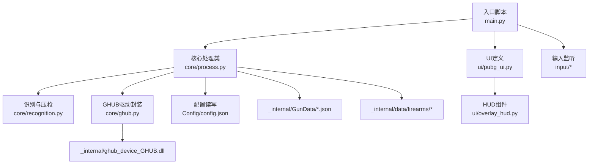
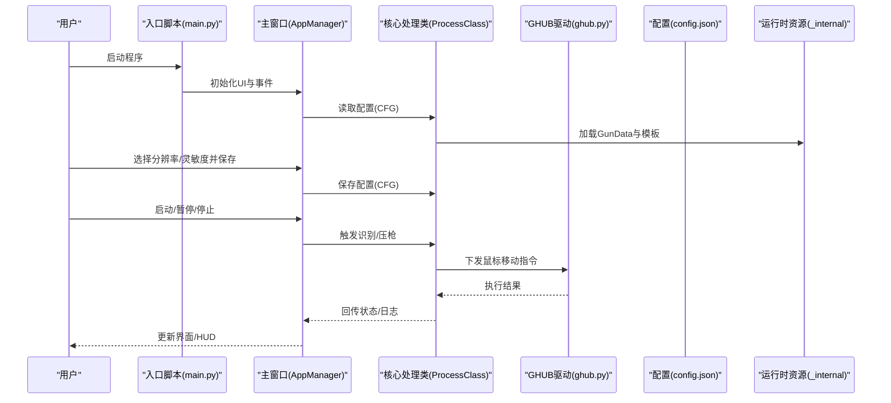
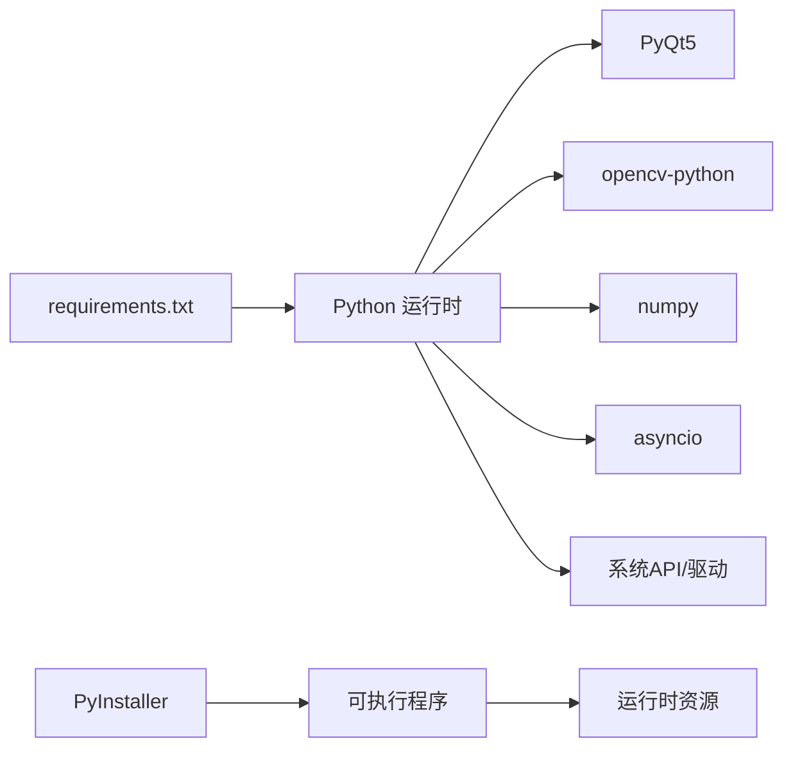

# 部署和打包

<cite>
**本文引用的文件**
- [main.py](file://main.py)
- [process.py](file://core/process.py)
- [ghub.py](file://core/ghub.py)
- [pubg_ui.py](file://ui/pubg_ui.py)
- [overlay_hud.py](file://ui/overlay_hud.py)
- [requirements.txt](file://requirements.txt)
- [config.json](file://Config/config.json)
- [README.md](file://README.md)
</cite>

## 目录
1. [简介](#简介)
2. [项目结构](#项目结构)
3. [核心组件](#核心组件)
4. [架构总览](#架构总览)
5. [详细组件分析](#详细组件分析)
6. [依赖分析](#依赖分析)
7. [性能考量](#性能考量)
8. [故障排查指南](#故障排查指南)
9. [结论](#结论)
10. [附录](#附录)

## 简介
本文件面向PUBG自动识别压枪工具的部署与打包，聚焦于PyInstaller打包配置与优化、资源文件管理、跨平台与Windows特定要求、发布流程、常见问题与解决方案、用户安装/卸载与版本维护建议，以及开发者自动化部署与持续集成的实践建议。目标是帮助开发者快速、稳定地将项目打包为可分发的Windows可执行程序，并确保用户端顺利安装与使用。

## 项目结构
该项目采用模块化组织，入口脚本负责UI与业务调度，核心逻辑集中在core目录，图像识别与输入监听分别在data与input目录，UI组件在ui目录，配置与资源在Config与_internal目录。打包时应确保以下关键路径与资源被正确包含：
- 入口脚本与UI生成文件
- 核心处理类与依赖库
- 配置文件与运行时资源（JSON弹道数据、SIFT模板、DLL驱动）
- 图标与HUD配置

图表来源
- [main.py:1-294](file://main.py#L1-L294)
- [process.py:1-405](file://core/process.py#L1-L405)
- [ghub.py:1-54](file://core/ghub.py#L1-L54)
- [pubg_ui.py:1-200](file://ui/pubg_ui.py#L1-L200)
- [overlay_hud.py:41-108](file://ui/overlay_hud.py#L41-L108)

章节来源
- [README.md:22-67](file://README.md#L22-L67)
- [main.py:1-294](file://main.py#L1-L294)
- [process.py:1-405](file://core/process.py#L1-L405)

## 核心组件
- 入口与UI管理：入口脚本负责创建应用、初始化UI、绑定事件与线程生命周期管理；UI定义文件负责界面布局与资源引用。
- 核心处理类：集中处理配置读取、识别结果缓存、压枪算法、与GHUB驱动交互。
- 驱动封装：通过ctypes加载本地DLL，提供键鼠操作能力。
- HUD组件：负责游戏内HUD的配置加载、渲染与透明穿透设置。
- 配置与资源：配置文件与运行时资源（GunData、SIFT模板、DLL）需随包分发。

章节来源
- [main.py:11-294](file://main.py#L11-L294)
- [process.py:13-405](file://core/process.py#L13-L405)
- [ghub.py:1-54](file://core/ghub.py#L1-L54)
- [pubg_ui.py:1-200](file://ui/pubg_ui.py#L1-L200)
- [overlay_hud.py:41-108](file://ui/overlay_hud.py#L41-L108)

## 架构总览
下图展示了从用户启动到压枪执行的关键流程，以及资源与配置的访问路径。

图表来源
- [main.py:287-294](file://main.py#L287-L294)
- [process.py:31-71](file://core/process.py#L31-L71)
- [ghub.py:8-21](file://core/ghub.py#L8-L21)
- [config.json:1-1](file://Config/config.json#L1-L1)

章节来源
- [main.py:223-286](file://main.py#L223-L286)
- [process.py:207-405](file://core/process.py#L207-L405)

## 详细组件分析

### PyInstaller 打包配置与优化
- 入口脚本与模块解析
  - 入口脚本为main.py，使用PyQt5 UI生成文件pubg_ui.py，需确保UI模块被正确收集。
  - 核心处理类process.py依赖OpenCV、NumPy、PyQt5、asyncio等，打包时应避免遗漏动态导入模块。
- 资源文件管理
  - 配置文件：Config/config.json需随包分发并在运行时可写。
  - 运行时资源：_internal/GunData/*.json、_internal/data/firearms/*、_internal/ghub_device_GHUB.dll。
  - UI图标：ui/pubg_ui.py中引用的图标路径需保持相对路径或使用PyInstaller的--add-data参数。
- 打包选项建议
  - 使用--onedir或--onefile，结合--windowed（无控制台）。
  - 使用--add-data添加资源目录，确保分隔符在Windows上为“;”，Linux/macOS为“:”。
  - 使用--hidden-import显式声明动态导入模块（如OpenCV子模块、PyQt5插件）。
  - 使用--exclude-module排除不必要的模块，减小体积。
- 特定优化
  - 将大体积资源（如模板图片）放在外部目录并通过配置文件指向，减少打包体积。
  - 对于DLL，确保其可执行权限与完整性，必要时在构建后检查。

章节来源
- [README.md:145-149](file://README.md#L145-L149)
- [pubg_ui.py:16](file://ui/pubg_ui.py#L16)
- [process.py:84-88](file://core/process.py#L84-L88)
- [ghub.py:10](file://core/ghub.py#L10)

### 发布流程指南
- 准备阶段
  - 安装依赖：pip install -r requirements.txt
  - 验证运行：python main.py
- 打包阶段
  - 生成spec文件：pyinstaller --name=PUBG-Macro --onedir --windowed --add-data="Config;Config;_internal;_internal;ui\GHUB.ico;ui\GHUB.ico" main.py
  - 或使用现有spec：pyinstaller main.spec
- 产物验证
  - 在dist目录中验证exe可运行、资源完整、配置文件可写。
- 分发与签名
  - 为exe与DLL进行代码签名，降低杀软误报。
  - 提供安装包（如NSIS/Inno Setup）或便携版。

章节来源
- [README.md:69-77](file://README.md#L69-L77)
- [README.md:145-149](file://README.md#L145-L149)

### 跨平台与Windows特定要求
- 平台限制
  - 项目明确要求Windows 10/11，依赖Win32 API与Logitech GHUB驱动。
- Windows特定
  - DLL驱动必须与可执行程序同级或在系统PATH中，且需管理员权限运行。
  - UI透明与穿透效果依赖Windows窗口样式，其他平台不可用。
- 跨平台注意事项
  - 如需跨平台，需替换GHUB驱动为通用输入模拟方案，并重写窗口样式相关逻辑。
  - 资源路径统一使用os.path.join或Pathlib，避免硬编码分隔符。

章节来源
- [README.md:18-20](file://README.md#L18-L20)
- [ghub.py:10](file://core/ghub.py#L10)
- [overlay_hud.py:41-55](file://ui/overlay_hud.py#L41-L55)

### 常见问题与解决方案
- 依赖缺失
  - 现象：运行时报错找不到模块或库。
  - 解决：使用--hidden-import声明缺失模块；确认OpenCV、PyQt5插件被收集。
- 资源文件无法读取
  - 现象：配置文件或GunData读取失败。
  - 解决：使用--add-data添加Config与_internal目录；在代码中使用sys._MEIPASS判断运行环境，动态定位资源路径。
- 文件权限问题
  - 现象：无法写入配置文件或DLL无法加载。
  - 解决：以管理员权限运行；确保安装目录具备写权限；将配置文件放置在用户目录（如AppData）。
- DLL加载失败
  - 现象：驱动初始化失败或键鼠操作无效。
  - 解决：确认DLL与可执行程序在同一目录；确保系统允许加载该DLL；必要时进行数字签名。

章节来源
- [process.py:54-70](file://core/process.py#L54-L70)
- [ghub.py:18-21](file://core/ghub.py#L18-L21)

### 用户安装与卸载指导
- 安装
  - 以管理员身份运行安装包或便携版exe。
  - 首次运行时选择分辨率并保存，随后根据需要调整灵敏度。
- 卸载
  - 删除安装目录；清理用户配置（如AppData下的相关配置）。
- 版本更新
  - 建议保留配置文件路径不变，升级时覆盖exe与资源目录。
  - 对于破坏性变更，提供迁移脚本或提示用户备份配置。

章节来源
- [README.md:79-83](file://README.md#L79-L83)
- [config.json:1-1](file://Config/config.json#L1-L1)

### 维护与最佳实践
- 配置管理
  - 将默认配置与用户配置分离；提供导入/导出功能。
- 资源版本化
  - GunData与模板版本与主程序解耦，便于独立更新。
- 错误处理
  - 对文件读写、DLL加载、网络请求增加异常捕获与用户提示。
- 自动化
  - CI中执行打包与基本回归测试（启动、识别、压枪流程）。

章节来源
- [overlay_hud.py:111-125](file://ui/overlay_hud.py#L111-L125)
- [process.py:63-70](file://core/process.py#L63-L70)

## 依赖分析
- 运行时依赖
  - Python 3.8+，PyQt5，OpenCV，NumPy，asyncio，keyboard/mouse监听库，GHUB驱动DLL。
- 打包期依赖
  - PyInstaller，依赖扫描与收集工具。
- 关系图

图表来源
- [requirements.txt:1-25](file://requirements.txt#L1-L25)

章节来源
- [requirements.txt:1-25](file://requirements.txt#L1-L25)

## 性能考量
- 打包体积
  - 通过--exclude-module与资源外置降低体积；优先使用one-dir以便缓存与增量更新。
- 运行性能
  - 识别与压枪涉及图像处理与高频鼠标事件，建议在CPU与GPU资源充足的机器上运行。
- 资源访问
  - 使用相对路径与运行时资源定位，避免重复IO。

## 故障排查指南
- 启动即崩溃
  - 检查DLL是否存在且可加载；确认以管理员权限运行。
- 识别不准确
  - 调整分辨率截图区域配置；确保模板与GunData版本匹配。
- HUD不显示
  - 检查配置文件路径与权限；确认Windows窗口样式设置。
- 灵敏度不生效
  - 检查配置文件写入；确认倍镜类型映射与Shift倍率设置。

章节来源
- [process.py:54-70](file://core/process.py#L54-L70)
- [overlay_hud.py:88-100](file://ui/overlay_hud.py#L88-L100)

## 结论
通过合理的PyInstaller配置、资源文件管理与Windows特定适配，可稳定地将PUBG自动识别压枪工具打包为可分发的exe。建议在CI中自动化执行打包与回归测试，配合清晰的用户指引与版本维护策略，确保用户体验与可靠性。

## 附录
- 快速打包命令参考
  - pyinstaller --name=PUBG-Macro --onedir --windowed --add-data="Config;Config;_internal;_internal;ui\GHUB.ico;ui\GHUB.ico" main.py
- 关键路径清单
  - Config/config.json
  - _internal/GunData/*.json
  - _internal/data/firearms/*
  - _internal/ghub_device_GHUB.dll
  - ui/pubg_ui.py引用的图标