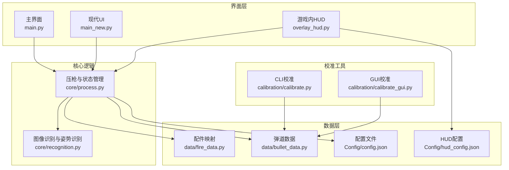
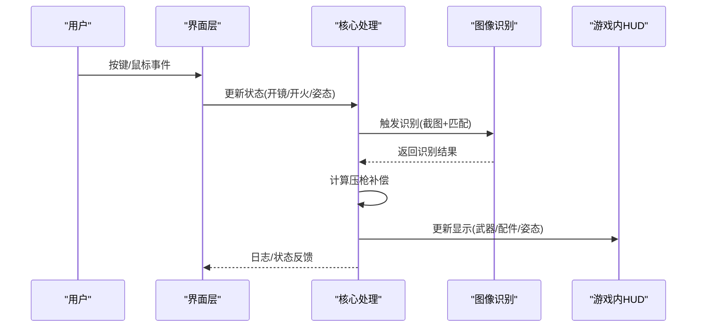
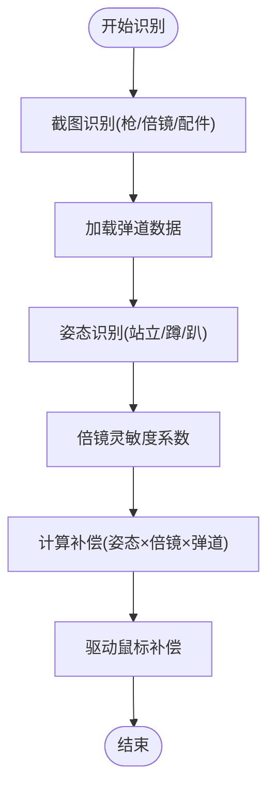
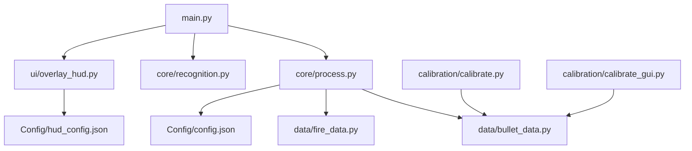

# 应用场景与价值

<cite>
**本文引用的文件**
- [README.md](file://README.md)
- [main.py](file://main.py)
- [main_new.py](file://main_new.py)
- [process.py](file://core/process.py)
- [recognition.py](file://core/recognition.py)
- [overlay_hud.py](file://ui/overlay_hud.py)
- [calibrate.py](file://calibration/calibrate.py)
- [calibrate_gui.py](file://calibration/calibrate_gui.py)
- [config.json](file://Config/config.json)
- [hud_config.json](file://Config/hud_config.json)
- [fire_data.py](file://data/fire_data.py)
- [bullet_data.py](file://data/bullet_data.py)
- [requirements.txt](file://requirements.txt)
</cite>

## 目录
1. [简介](#简介)
2. [项目结构](#项目结构)
3. [核心组件](#核心组件)
4. [架构总览](#架构总览)
5. [详细组件分析](#详细组件分析)
6. [依赖关系分析](#依赖关系分析)
7. [性能考虑](#性能考虑)
8. [故障排除指南](#故障排除指南)
9. [结论](#结论)
10. [附录](#附录)

## 简介
本项目是一个面向PUBG的自动识别压枪工具，旨在通过图像识别与弹道数据计算，为玩家提供精准、稳定的后坐力补偿。其核心价值体现在：
- 提升射击精度：基于真实弹道数据与实时姿态/倍镜系数，自动计算补偿量，减少人为误差。
- 降低操作负担：一键识别枪械与配件、自动开镜检测、自动压枪，减少手动操作频率。
- 提高游戏效率：通过智能HUD与校准工具，缩短调试与上手时间，提升训练与实战效率。

## 项目结构
项目采用模块化设计，围绕“识别-计算-反馈”闭环构建，主要模块包括：
- 核心逻辑：图像识别、压枪计算、输入监听与状态管理。
- 数据层：弹道数据、配件映射、分辨率配置。
- 界面层：主界面与现代UI、游戏内HUD、校准工具GUI。
- 校准工具：CLI与GUI两种模式，支持交互式标注与参数修正。

**图表来源**
- [main.py](file://main.py)
- [main_new.py](file://main_new.py)
- [overlay_hud.py](file://ui/overlay_hud.py)
- [process.py](file://core/process.py)
- [recognition.py](file://core/recognition.py)
- [fire_data.py](file://data/fire_data.py)
- [bullet_data.py](file://data/bullet_data.py)
- [config.json](file://Config/config.json)
- [hud_config.json](file://Config/hud_config.json)
- [calibrate.py](file://calibration/calibrate.py)
- [calibrate_gui.py](file://calibration/calibrate_gui.py)

**章节来源**
- [README.md](file://README.md)
- [requirements.txt](file://requirements.txt)

## 核心组件
- 图像识别与姿态识别：基于SIFT算法与模板匹配，实现枪械与配件的快速识别，以及姿势区域的稳定检测。
- 压枪计算与执行：根据弹道数据、姿态系数、倍镜灵敏度与当前开镜状态，计算每tick的补偿量并驱动鼠标移动。
- 输入监听与状态管理：监听键盘/鼠标事件，维护开镜、开火、姿态、视角等状态，协调识别与压枪流程。
- 游戏内HUD：三档可切换HUD，实时展示当前武器、配件、姿态与状态，支持拖动与热键切换。
- 校准工具：提供CLI与GUI两种模式，支持交互式弹孔标注、参数修正与多轮迭代优化。

**章节来源**
- [process.py](file://core/process.py)
- [recognition.py](file://core/recognition.py)
- [overlay_hud.py](file://ui/overlay_hud.py)
- [calibrate.py](file://calibration/calibrate.py)
- [calibrate_gui.py](file://calibration/calibrate_gui.py)

## 架构总览
系统采用“事件驱动 + 异步识别”的架构：
- 事件驱动：键盘/鼠标事件触发状态变更与HUD刷新。
- 异步识别：图像识别在独立线程中进行，避免阻塞主线程。
- 数据驱动：配置与弹道数据决定压枪参数，保证一致性与可扩展性。

**图表来源**
- [main.py](file://main.py)
- [process.py](file://core/process.py)
- [recognition.py](file://core/recognition.py)
- [overlay_hud.py](file://ui/overlay_hud.py)

## 详细组件分析

### 场景一：步枪类（如M416、AKM、SCAR-L、M762）
- 适用场景
  - 短中距离交火与持续压制，需要稳定后坐力控制。
  - 多人对局中频繁移动与换弹，依赖自动压枪提升命中率。
- 使用要点
  - 通过Tab截图识别当前槽位武器与配件，自动匹配弹道数据。
  - 根据倍镜类型与灵敏度配置，自动调整补偿强度。
  - 结合姿态识别（站立/蹲下/趴下）与Shift长按倍率，优化不同场景下的补偿曲线。
- 效果评估
  - 显著降低后坐力对精度的影响，减少手动微调频率。
  - 在全自动射击中保持弹道稳定，提升持续输出能力。

**图表来源**
- [process.py](file://core/process.py)
- [recognition.py](file://core/recognition.py)
- [fire_data.py](file://data/fire_data.py)

**章节来源**
- [process.py](file://core/process.py)
- [recognition.py](file://core/recognition.py)
- [fire_data.py](file://data/fire_data.py)

### 场景二：狙击/射手类（如Mini14、SKS、MK12、MK14、QBU、VSS）
- 适用场景
  - 长距离精准打击，强调首发射击精度与弹着点控制。
  - 半自动射击节奏，需要更精细的补偿与弹道展开。
- 使用要点
  - 识别半自动枪械路径，采用FIRE1模式，按100ms间隔逐元素下发补偿。
  - 结合高倍镜与消音器等配件，调整scope系数与补偿曲线。
- 效果评估
  - 提升首发射击稳定性，减少因后坐力导致的脱靶。
  - 在半自动节奏下保持弹着点一致性，提升击杀效率。

**章节来源**
- [process.py](file://core/process.py)
- [bullet_data.py](file://data/bullet_data.py)

### 场景三：冲锋枪类（如UZI、Vector、MP5K、UMP45、PP-19、P90、JS9）
- 适用场景
  - 狭窄地形与近距离遭遇战，强调火力密度与快速压制。
  - 高速移动与频繁转向，需要更短的补偿响应周期。
- 使用要点
  - 识别冲锋枪类型，采用FIRE模式（约9ms/tick），实现高频补偿。
  - 配合垂直握把/直角握把等配件，优化控制性与补偿效果。
- 效果评估
  - 在高射速下维持弹道稳定，减少散布扩大。
  - 提升近距离战斗的命中率与控制力。

**章节来源**
- [process.py](file://core/process.py)
- [fire_data.py](file://data/fire_data.py)

### 场景四：机枪类（如DP-28、M249、MG3）
- 适用场景
  - 团队推进与火力压制，强调持续输出与弹药管理。
  - 需要长时间扫射与稳定弹着点，减少后坐力对精度影响。
- 使用要点
  - 识别机枪类型与战术枪托等配件，调整姿态系数与补偿强度。
  - 在趴下/蹲下等低姿态下，利用更低的后坐力系数提升精度。
- 效果评估
  - 在长时间扫射中保持弹道稳定，提升压制效果。
  - 减少因疲劳导致的操作偏差，提升持续作战能力。

**章节来源**
- [process.py](file://core/process.py)
- [bullet_data.py](file://data/bullet_data.py)

### 场景五：不同游戏阶段的应用价值
- 起飞/跳伞阶段
  - 侧重快速适应与基础压枪，使用极简HUD与自动识别，降低学习成本。
- 推进/交火阶段
  - 强调实时补偿与姿态切换，使用紧凑HUD，快速获取关键信息。
- 团战/残局阶段
  - 注重高精度与稳定性，使用完整HUD，全面监控状态与参数。

**章节来源**
- [overlay_hud.py](file://ui/overlay_hud.py)
- [hud_config.json](file://Config/hud_config.json)

### 玩家体验改善
- 提高射击精度：基于真实弹道数据与实时状态，自动计算补偿，减少手动调节。
- 减少手动操作负担：自动识别、自动开镜检测、自动压枪，降低操作复杂度。
- 提升游戏效率：通过校准工具与HUD，缩短调试时间，加速上手与进阶。

**章节来源**
- [process.py](file://core/process.py)
- [overlay_hud.py](file://ui/overlay_hud.py)
- [calibrate.py](file://calibration/calibrate.py)

### 学习价值与技术价值
- 学习价值
  - 图像识别与模板匹配：理解SIFT特征与匹配策略。
  - 弹道建模与参数修正：掌握后坐力补偿的数学模型与迭代优化。
  - 事件驱动与异步编程：学习多线程与事件处理在游戏自动化中的应用。
- 技术价值
  - 可扩展的弹道数据格式：支持v1/v2两种格式，便于演进与迁移。
  - 可配置的HUD与校准工具：提供良好的用户体验与工程化实践。

**章节来源**
- [recognition.py](file://core/recognition.py)
- [calibrate_gui.py](file://calibration/calibrate_gui.py)
- [bullet_data.py](file://data/bullet_data.py)

### 局限性与注意事项
- 识别准确性依赖截图质量与分辨率配置，需按说明书调整截图区域。
- 姿态识别在第三人称模式下可能存在延迟，建议使用第一人称模板匹配。
- 校准工具需要稳定的墙面背景与足够的弹孔数量，以保证对比分析的可靠性。
- 工具依赖Windows环境与Logitech GHUB驱动，需确保系统兼容性。

**章节来源**
- [README.md](file://README.md)
- [recognition.py](file://core/recognition.py)
- [calibrate.py](file://calibration/calibrate.py)

### 用户群体建议与最佳实践
- 新手用户
  - 从极简HUD开始，逐步熟悉自动识别与压枪流程。
  - 使用校准工具进行基础校准，记录倍镜灵敏度系数。
  - 优先掌握常用步枪（如M416、AKM）的弹道特性。
- 高级用户
  - 使用完整HUD与自定义配置，精细化调整补偿参数。
  - 结合多轮迭代校准，优化不同地图与场景下的参数。
  - 探索不同枪械与配件组合的压枪策略，形成个人数据库。

**章节来源**
- [overlay_hud.py](file://ui/overlay_hud.py)
- [calibrate_gui.py](file://calibration/calibrate_gui.py)
- [config.json](file://Config/config.json)

## 依赖关系分析
系统依赖关系清晰，核心模块间耦合度低，便于维护与扩展。

**图表来源**
- [main.py](file://main.py)
- [process.py](file://core/process.py)
- [recognition.py](file://core/recognition.py)
- [overlay_hud.py](file://ui/overlay_hud.py)
- [fire_data.py](file://data/fire_data.py)
- [bullet_data.py](file://data/bullet_data.py)
- [config.json](file://Config/config.json)
- [hud_config.json](file://Config/hud_config.json)
- [calibrate.py](file://calibration/calibrate.py)
- [calibrate_gui.py](file://calibration/calibrate_gui.py)

**章节来源**
- [requirements.txt](file://requirements.txt)

## 性能考虑
- 异步识别：图像识别在独立线程中进行，避免阻塞主线程，提升响应速度。
- 压枪计算：采用整数取整与余量累加机制，平衡精度与性能。
- HUD刷新：可配置刷新间隔，兼顾信息实时性与系统负载。
- 校准工具：支持ROI选区与模板匹配，减少误检与提升检测效率。

**章节来源**
- [process.py](file://core/process.py)
- [overlay_hud.py](file://ui/overlay_hud.py)
- [calibrate_gui.py](file://calibration/calibrate_gui.py)

## 故障排除指南
- 识别不准确
  - 检查分辨率配置与截图区域，必要时调整分辨率设置。
  - 在第三人称模式下，等待姿势区域稳定后再进行识别。
- HUD不显示或闪烁
  - 确认热键设置与拖动模式，避免鼠标穿透影响。
  - 检查配置文件路径与权限，确保HUD配置正确加载。
- 校准结果偏差
  - 使用GUI模式进行交互式标注，修正弹孔位置与顺序。
  - 多轮迭代校准，结合不同场景与地图进行参数优化。

**章节来源**
- [recognition.py](file://core/recognition.py)
- [overlay_hud.py](file://ui/overlay_hud.py)
- [calibrate_gui.py](file://calibration/calibrate_gui.py)

## 结论
本工具通过“识别-计算-反馈”的闭环设计，为PUBG玩家提供了高精度、低负担的压枪解决方案。其在不同枪械类型与游戏阶段中均展现出显著的价值，既能帮助新手快速上手，也能满足高级用户的深度定制需求。配合校准工具与可配置HUD，用户可在不同场景下持续优化参数，提升射击精度与游戏效率。

## 附录
- 快速开始
  - 安装依赖：pip install -r requirements.txt
  - 启动主程序：python main.py
  - 按Tab打开背包截图识别，按1/2切换枪械，右键开镜后自动压枪。
- 配置说明
  - 在GUI中选择分辨率并保存，配置倍镜灵敏度系数。
  - 通过HUD配置文件调整字体、颜色与刷新间隔。

**章节来源**
- [README.md](file://README.md)
- [config.json](file://Config/config.json)
- [hud_config.json](file://Config/hud_config.json)