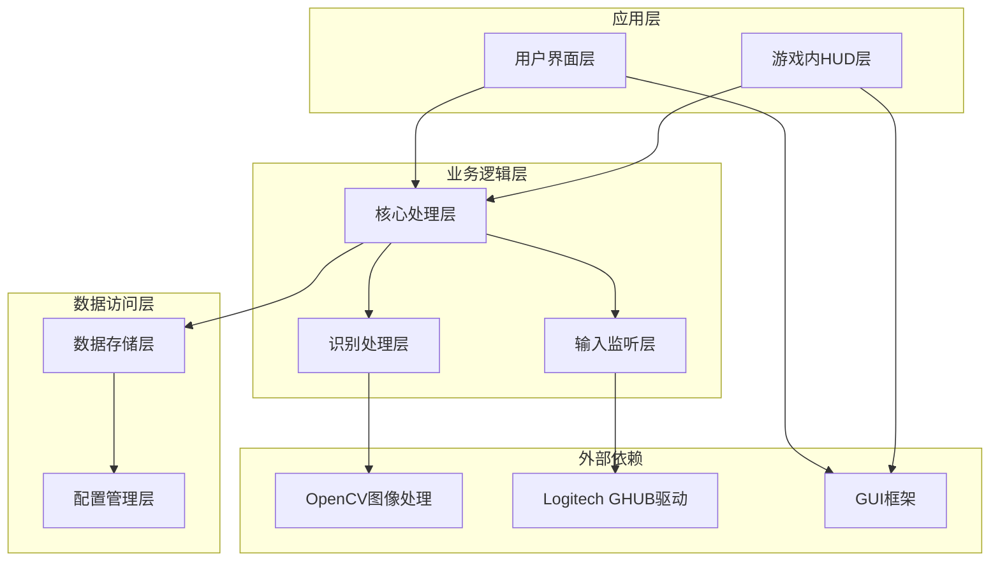
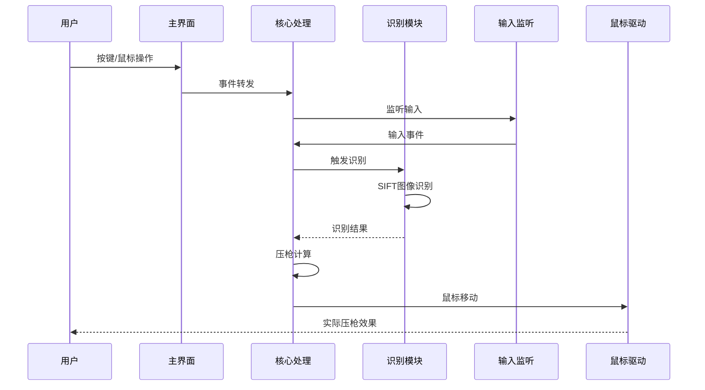
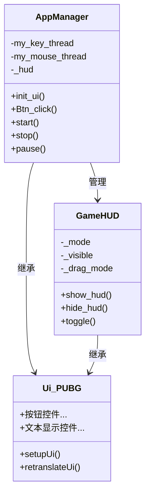
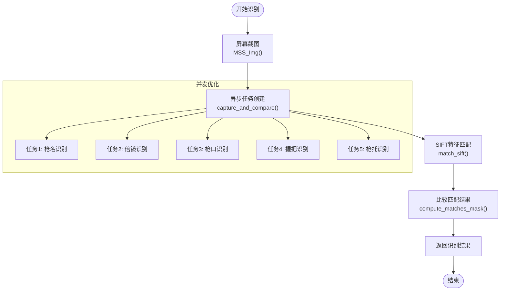
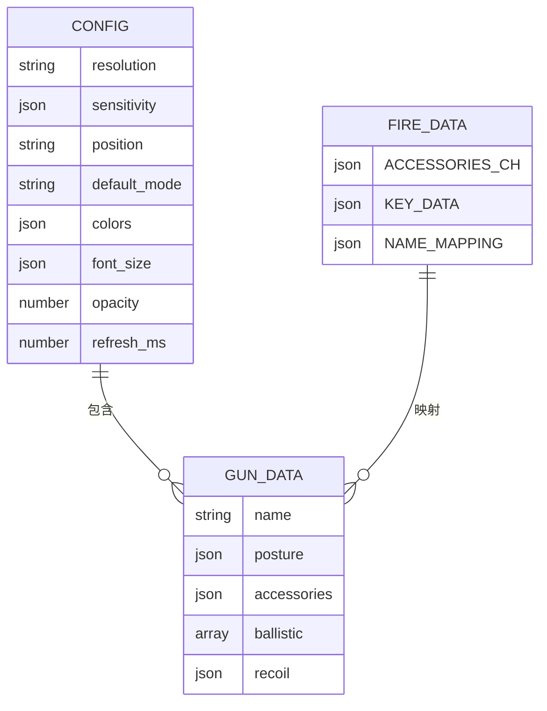
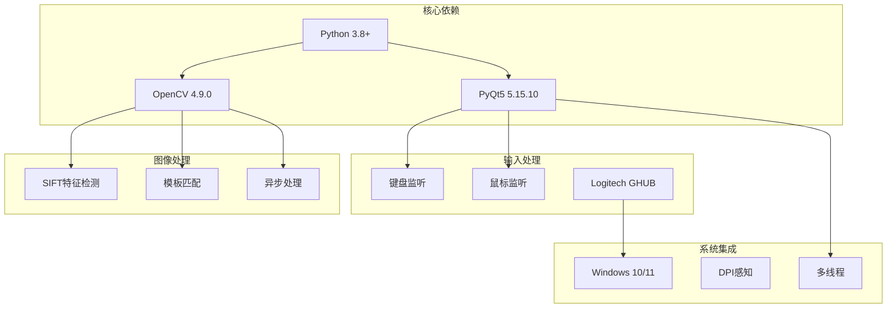

# 技术架构概览

<cite>
**本文档引用的文件**
- [README.md](file://README.md)
- [main.py](file://main.py)
- [requirements.txt](file://requirements.txt)
- [process.py](file://core/process.py)
- [recognition.py](file://core/recognition.py)
- [ghub.py](file://core/ghub.py)
- [key_listener.py](file://input/key_listener.py)
- [mouse_listener.py](file://input/mouse_listener.py)
- [pubg_ui.py](file://ui/pubg_ui.py)
- [overlay_hud.py](file://ui/overlay_hud.py)
- [fire_data.py](file://data/fire_data.py)
- [bullet_data.py](file://data/bullet_data.py)
- [resolution_setting.py](file://data/resolution_setting.py)
- [config.json](file://Config/config.json)
- [hud_config.json](file://Config/hud_config.json)
</cite>

## 目录
1. [项目简介](#项目简介)
2. [项目结构](#项目结构)
3. [核心组件](#核心组件)
4. [架构概览](#架构概览)
5. [详细组件分析](#详细组件分析)
6. [依赖关系分析](#依赖关系分析)
7. [性能考虑](#性能考虑)
8. [故障排除指南](#故障排除指南)
9. [结论](#结论)

## 项目简介

PUBG自动识别压枪工具是一个基于Python开发的桌面应用程序，旨在为《绝地求生》游戏提供智能的枪械识别和自动压枪功能。该系统利用OpenCV SIFT算法实现枪械与配件的自动识别，结合弹道数据和姿态识别，为玩家提供精准的后坐力补偿。

**章节来源**
- [README.md:1-156](file://README.md#L1-L156)

## 项目结构

项目采用模块化的分层架构设计，主要分为以下层次：



**图表来源**
- [main.py:1-294](file://main.py#L1-L294)
- [process.py:13-405](file://core/process.py#L13-L405)

**章节来源**
- [README.md:22-67](file://README.md#L22-L67)

## 核心组件

### 主应用管理器 (AppManager)
主应用管理器是整个系统的协调中心，负责管理UI界面、输入监听和核心处理逻辑之间的交互。

**章节来源**
- [main.py:11-294](file://main.py#L11-L294)

### 核心处理类 (ProcessClass)
ProcessClass实现了单例模式，统一管理所有系统状态和业务逻辑，包括枪械识别、姿态识别、压枪计算等功能。

**章节来源**
- [process.py:13-405](file://core/process.py#L13-L405)

### 图像识别模块
基于OpenCV SIFT算法的图像识别系统，能够自动识别枪械名称、倍镜、枪口、握把、枪托等配件信息。

**章节来源**
- [recognition.py:1-478](file://core/recognition.py#L1-L478)

### 输入监听系统
实时监听键盘和鼠标事件，处理游戏中的各种操作指令。

**章节来源**
- [key_listener.py:1-70](file://input/key_listener.py#L1-L70)
- [mouse_listener.py:1-64](file://input/mouse_listener.py#L1-L64)

## 架构概览

系统采用典型的三层架构设计，实现了清晰的职责分离和模块化组织：



**图表来源**
- [main.py:223-294](file://main.py#L223-L294)
- [process.py:207-405](file://core/process.py#L207-L405)

## 详细组件分析

### UI层架构

UI层采用PyQt5框架构建，提供了现代化的用户界面和游戏内HUD显示功能。



**图表来源**
- [main.py:11-88](file://main.py#L11-L88)
- [pubg_ui.py:4-718](file://ui/pubg_ui.py#L4-L718)
- [overlay_hud.py:229-698](file://ui/overlay_hud.py#L229-L698)

**章节来源**
- [pubg_ui.py:1-718](file://ui/pubg_ui.py#L1-L718)
- [overlay_hud.py:1-698](file://ui/overlay_hud.py#L1-L698)

### 识别系统架构

识别系统是整个系统的核心，采用了异步并发处理和多线程优化：



**图表来源**
- [recognition.py:102-126](file://core/recognition.py#L102-L126)
- [recognition.py:38-65](file://core/recognition.py#L38-L65)

**章节来源**
- [recognition.py:1-478](file://core/recognition.py#L1-L478)

### 压枪计算引擎

压枪计算引擎实现了复杂的数学模型，结合弹道数据、姿态系数和灵敏度进行精确计算：

```mermaid
flowchart TD
Input[输入参数] --> Calc1[姿态系数<br/>calculate_the_recoil]
Input --> Calc2[倍镜灵敏度<br/>ScopeData查询]
Input --> Calc3[配件组合<br/>get_accessories_nameCode]
Calc1 --> Formula[合成公式<br/>posture * (recoil * scope)]
Calc2 --> Formula
Calc3 --> Formula
Formula --> Round[四舍五入取整<br/>int(round())]
Round --> Output[输出鼠标移动量]
subgraph "数据来源"
Input --> GunData[GunData弹道数据]
Input --> FireData[FireData配件映射]
Input --> ConfigData[配置文件灵敏度]
end
```

**图表来源**
- [process.py:183-197](file://core/process.py#L183-L197)
- [process.py:263-275](file://core/process.py#L263-L275)

**章节来源**
- [process.py:183-405](file://core/process.py#L183-L405)

### 数据层设计

系统采用JSON格式存储配置和数据，实现了良好的可扩展性和跨平台兼容性：



**图表来源**
- [config.json:1-1](file://Config/config.json#L1-L1)
- [hud_config.json:1-91](file://Config/hud_config.json#L1-L91)
- [fire_data.py:1-83](file://data/fire_data.py#L1-L83)

**章节来源**
- [config.json:1-1](file://Config/config.json#L1-L1)
- [hud_config.json:1-91](file://Config/hud_config.json#L1-L91)
- [fire_data.py:1-83](file://data/fire_data.py#L1-L83)

## 依赖关系分析

系统的技术栈选择体现了针对性的功能需求和性能考量：



**图表来源**
- [requirements.txt:1-25](file://requirements.txt#L1-L25)
- [main.py:1-10](file://main.py#L1-L10)

**章节来源**
- [requirements.txt:1-25](file://requirements.txt#L1-L25)

### 设计模式应用

系统中应用了多种设计模式来提升代码质量和可维护性：

#### 单例模式 (ProcessClass)
确保系统状态的唯一性和一致性，避免重复创建昂贵的对象。

#### 观察者模式 (信号机制)
通过PyQt5的信号槽机制实现松耦合的事件通信。

#### 工厂模式 (配置加载)
统一的配置文件解析和数据加载机制。

**章节来源**
- [process.py:19-29](file://core/process.py#L19-L29)
- [main.py:270-286](file://main.py#L270-L286)

## 性能考虑

系统在性能方面采用了多项优化策略：

### 异步并发处理
- 使用asyncio实现图像识别的异步处理
- 多线程并行处理不同的识别任务
- 异步图像捕获和处理减少阻塞

### 内存优化
- 使用numpy数组进行高效的图像处理
- 及时释放图像资源和内存
- 优化数据结构减少内存占用

### 算法优化
- SIFT算法的参数调优提高识别速度
- 模板匹配的缓存机制
- 合理的阈值设置平衡准确性和速度

## 故障排除指南

### 常见问题及解决方案

#### 鼠标驱动问题
**症状**: 鼠标移动无效或报错
**原因**: GHUB驱动未正确安装
**解决**: 确保安装Logitech GHUB 21版本或LGS蓝驱驱动

#### 识别准确率低
**症状**: 枪械识别失败或识别错误
**原因**: 分辨率配置不正确或模板文件缺失
**解决**: 检查resolution_setting.py配置，确保模板文件存在

#### 性能问题
**症状**: 系统响应缓慢或卡顿
**原因**: CPU占用过高或图像处理参数不当
**解决**: 调整识别参数，关闭不必要的功能

**章节来源**
- [README.md:16-21](file://README.md#L16-L21)

## 结论

PUBG自动识别压枪工具展现了优秀的软件架构设计，通过合理的分层架构、清晰的职责分离和高效的技术实现，成功解决了复杂的游戏自动化需求。系统采用的异步并发处理、单例模式和观察者模式等设计模式，为代码的可维护性和扩展性提供了坚实基础。

未来的发展方向包括：
- 支持更多游戏和分辨率
- 优化识别算法的准确性和速度
- 增强系统的稳定性和容错能力
- 提供更丰富的配置选项和用户界面