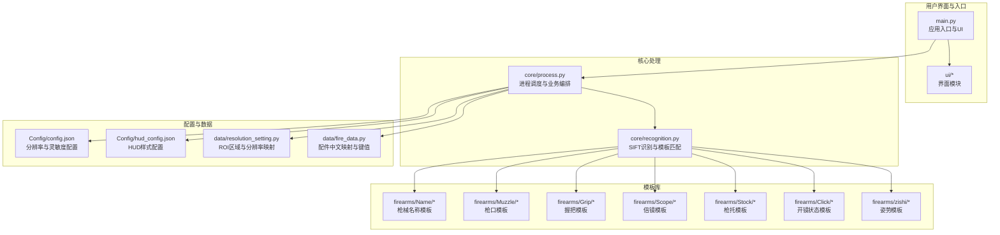
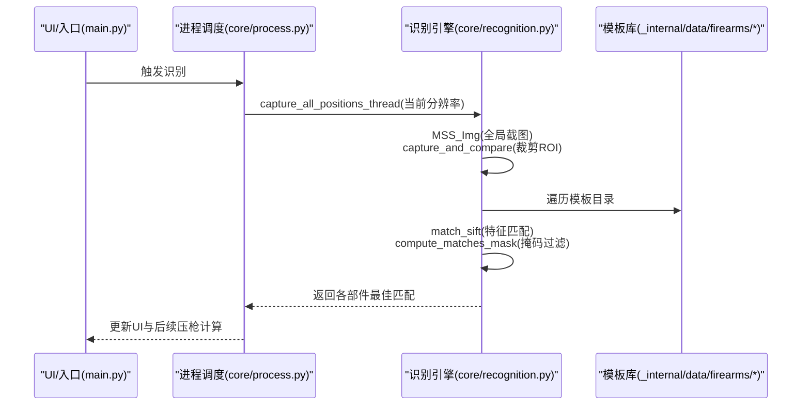
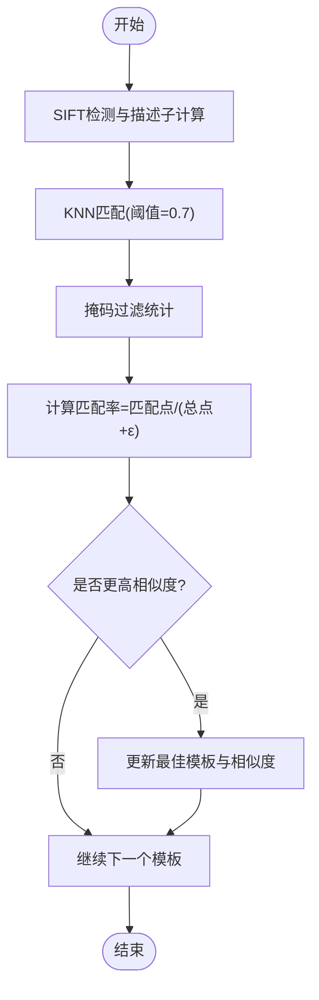
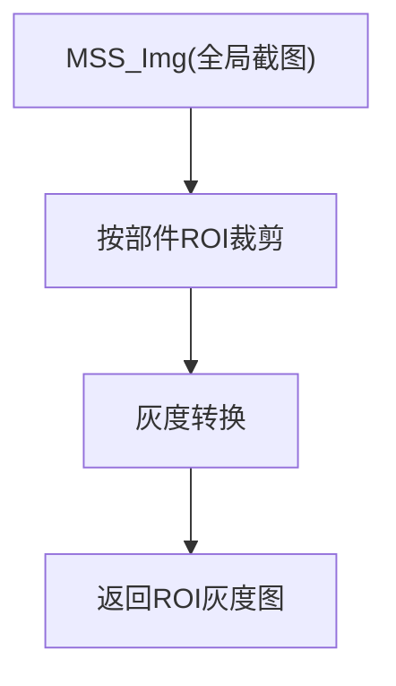
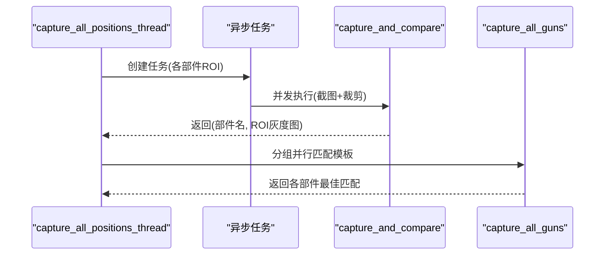
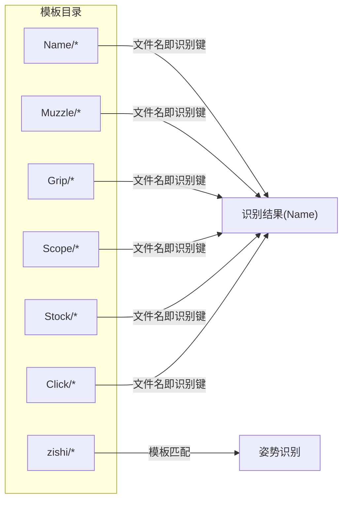
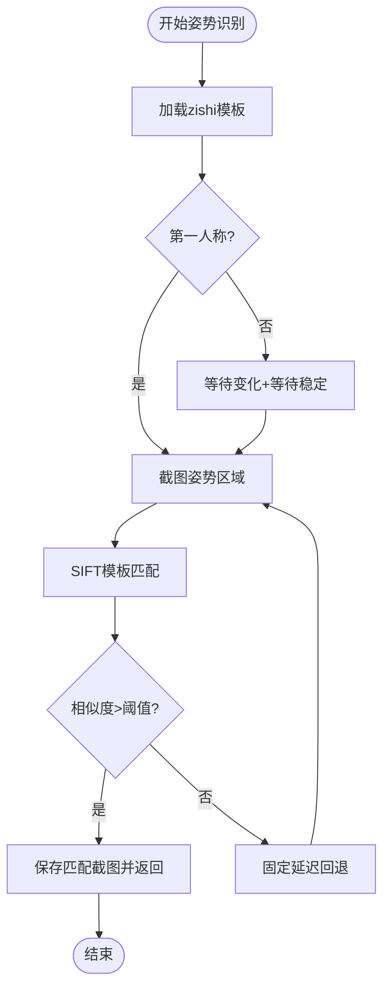
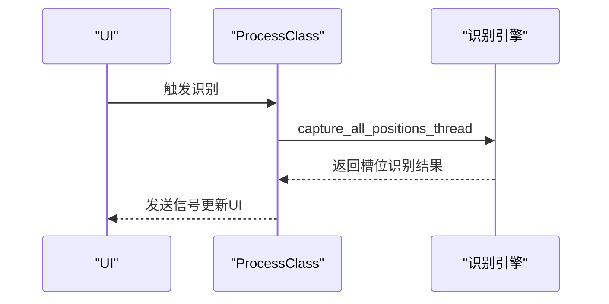

# SIFT枪械识别系统

<cite>
**本文引用的文件**
- [core/recognition.py](file://core/recognition.py)
- [core/process.py](file://core/process.py)
- [data/resolution_setting.py](file://data/resolution_setting.py)
- [data/fire_data.py](file://data/fire_data.py)
- [Config/config.json](file://Config/config.json)
- [Config/hud_config.json](file://Config/hud_config.json)
- [_internal/data/firearms/Name/012.png](file://_internal/data/firearms/Name/012.png)
- [_internal/data/firearms/Name/98k.png](file://_internal/data/firearms/Name/98k.png)
- [_internal/data/firearms/Name/SLR.png](file://_internal/data/firearms/Name/SLR.png)
- [_internal/data/firearms/Name/Tommy_gun.png](file://_internal/data/firearms/Name/Tommy_gun.png)
- [_internal/data/firearms/Name/m416.png](file://_internal/data/firearms/Name/m416.png)
- [_internal/data/firearms/Grip/BanJieShi.png](file://_internal/data/firearms/Grip/BanJieShi.png)
- [_internal/data/firearms/Grip/MuZhi.png](file://_internal/data/firearms/Grip/MuZhi.png)
- [_internal/data/firearms/Grip/chuizhi.png](file://_internal/data/firearms/Grip/chuizhi.png)
- [_internal/data/firearms/Grip/zhijiao.png](file://_internal/data/firearms/Grip/zhijiao.png)
- [_internal/data/firearms/Muzzle/BuQiangBuChang.png](file://_internal/data/firearms/Muzzle/BuQiangBuChang.png)
- [_internal/data/firearms/Muzzle/BuQiangXiaoYan.png](file://_internal/data/firearms/Muzzle/BuQiangXiaoYan.png)
- [_internal/data/firearms/Muzzle/ChongFengQiangXIaoYan.png](file://_internal/data/firearms/Muzzle/ChongFengQiangXIaoYan.png)
- [_internal/data/firearms/Muzzle/eliuquan.png](file://_internal/data/firearms/Muzzle/eliuquan.png)
- [_internal/data/firearms/Muzzle/jujiqiangbuchang.png](file://_internal/data/firearms/Muzzle/jujiqiangbuchang.png)
- [_internal/data/firearms/Muzzle/xiaoyin.png](file://_internal/data/firearms/Muzzle/xiaoyin.png)
- [_internal/data/firearms/Muzzle/yazuiqiangkou.png](file://_internal/data/firearms/Muzzle/yazuiqiangkou.png)
- [_internal/data/firearms/Click/False.png](file://_internal/data/firearms/Click/False.png)
- [_internal/data/firearms/Click/Ture.png](file://_internal/data/firearms/Click/Ture.png)
- [_internal/data/firearms/zishi/](file://_internal/data/firearms/zishi/)
- [requirements.txt](file://requirements.txt)
</cite>

## 目录
1. [简介](#简介)
2. [项目结构](#项目结构)
3. [核心组件](#核心组件)
4. [架构总览](#架构总览)
5. [详细组件分析](#详细组件分析)
6. [依赖分析](#依赖分析)
7. [性能考虑](#性能考虑)
8. [故障排查指南](#故障排查指南)
9. [结论](#结论)
10. [附录](#附录)

## 简介
本文件针对PUBG自动识别压枪工具中的SIFT枪械识别系统进行深入文档化，重点阐述以下方面：
- SIFT（尺度不变特征变换）算法在枪械识别中的应用原理：特征点检测、描述子计算、特征匹配与相似度评分机制
- 图像预处理流程：灰度转换、感兴趣区域（ROI）提取、多分辨率适配策略
- 模板库管理机制：枪械模板的组织结构、文件命名规则与批量匹配算法
- 实际使用示例：新增枪械模板、调整匹配阈值、优化识别性能
- 性能优化建议与常见问题解决方案

## 项目结构
该系统围绕“识别-计算-执行”闭环构建，核心识别逻辑位于core/recognition.py，进程调度与UI交互位于core/process.py与main.py，分辨率与模板区域配置位于data/resolution_setting.py，枪械与配件的中文映射位于data/fire_data.py，配置文件位于Config目录。

图表来源
- [core/recognition.py:1-478](file://core/recognition.py#L1-L478)
- [core/process.py:1-405](file://core/process.py#L1-L405)
- [data/resolution_setting.py:1-147](file://data/resolution_setting.py#L1-L147)
- [data/fire_data.py:1-83](file://data/fire_data.py#L1-L83)
- [Config/config.json:1-1](file://Config/config.json#L1-L1)
- [Config/hud_config.json:1-91](file://Config/hud_config.json#L1-L91)

章节来源
- [core/recognition.py:1-478](file://core/recognition.py#L1-L478)
- [core/process.py:1-405](file://core/process.py#L1-L405)
- [data/resolution_setting.py:1-147](file://data/resolution_setting.py#L1-L147)
- [data/fire_data.py:1-83](file://data/fire_data.py#L1-L83)
- [Config/config.json:1-1](file://Config/config.json#L1-L1)
- [Config/hud_config.json:1-91](file://Config/hud_config.json#L1-L91)

## 核心组件
- SIFT识别引擎：负责灰度图采集、特征点检测与描述子计算、KNN匹配与掩码过滤、相似度评分与模板匹配
- 异步捕获与批处理：并发捕获多个ROI区域，分组并行匹配模板库
- 多分辨率适配：基于分辨率映射的ROI区域与全局截图范围
- 模板库管理：按部件分类的模板目录结构与命名规范
- 姿势识别扩展：基于模板匹配的姿势区域识别与自适应等待策略

章节来源
- [core/recognition.py:38-126](file://core/recognition.py#L38-L126)
- [core/recognition.py:102-126](file://core/recognition.py#L102-L126)
- [data/resolution_setting.py:2-147](file://data/resolution_setting.py#L2-L147)

## 架构总览
SIFT识别系统采用“异步捕获+并行匹配”的流水线设计：
- 输入：根据当前分辨率确定全局截图范围与各部件ROI区域
- 处理：异步并发截图，裁剪ROI，灰度化，SIFT特征匹配
- 输出：返回每个部件的最佳匹配模板名称与相似度

图表来源
- [core/recognition.py:67-126](file://core/recognition.py#L67-L126)
- [core/recognition.py:38-66](file://core/recognition.py#L38-L66)
- [core/process.py:138-147](file://core/process.py#L138-L147)

## 详细组件分析

### SIFT特征匹配与相似度评分
- 特征点检测与描述子计算：使用SIFT检测器对目标图与模板图分别提取特征点与描述子
- KNN匹配与距离阈值：使用FlannBasedMatcher进行KNN匹配，通过距离阈值筛选可靠匹配
- 掩码统计与匹配率：统计满足阈值的匹配点数量，计算匹配点总数与匹配率作为相似度指标
- 批量匹配：遍历模板目录，记录最高相似度与对应模板名

图表来源
- [core/recognition.py:38-66](file://core/recognition.py#L38-L66)
- [core/recognition.py:26-36](file://core/recognition.py#L26-L36)

章节来源
- [core/recognition.py:38-66](file://core/recognition.py#L38-L66)
- [core/recognition.py:26-36](file://core/recognition.py#L26-L36)

### 图像预处理与ROI提取
- 全局截图：根据当前分辨率获取全局截图范围，使用mss进行高性能截图
- ROI裁剪：依据RESOLUTION_SETTINGS中的各部件区域坐标，从全局图中裁剪对应ROI
- 灰度转换：统一转为灰度图，减少计算复杂度并提升SIFT鲁棒性
- 多分辨率适配：不同分辨率下ROI坐标与全局截图范围独立配置，保证跨屏适配

图表来源
- [core/recognition.py:10-24](file://core/recognition.py#L10-L24)
- [core/recognition.py:67-81](file://core/recognition.py#L67-L81)
- [data/resolution_setting.py:2-147](file://data/resolution_setting.py#L2-L147)

章节来源
- [core/recognition.py:10-24](file://core/recognition.py#L10-L24)
- [core/recognition.py:67-81](file://core/recognition.py#L67-L81)
- [data/resolution_setting.py:2-147](file://data/resolution_setting.py#L2-L147)

### 异步捕获与并行匹配
- 异步任务：为每个部件ROI创建异步任务，使用asyncio.gather并发执行
- 分组处理：将部件分为两组，分别并行匹配，最后合并结果
- 性能计时：记录从截图到识别的总耗时，便于性能评估与优化

图表来源
- [core/recognition.py:83-126](file://core/recognition.py#L83-L126)

章节来源
- [core/recognition.py:83-126](file://core/recognition.py#L83-L126)

### 模板库管理与命名规范
- 目录结构：按部件分类存放模板，如Name、Muzzle、Grip、Scope、Stock、Click、zishi
- 文件命名：模板文件名即为识别结果的标识，例如Name目录下的m416.png对应“m416”
- 模板读取：识别时按部件目录遍历模板，灰度读取后与ROI进行SIFT匹配
- 姿势模板：zishi目录用于姿势识别，支持模板匹配与自适应等待策略

图表来源
- [core/recognition.py:83-100](file://core/recognition.py#L83-L100)
- [core/recognition.py:364-423](file://core/recognition.py#L364-L423)

章节来源
- [core/recognition.py:83-100](file://core/recognition.py#L83-L100)
- [core/recognition.py:364-423](file://core/recognition.py#L364-L423)

### 姿势识别扩展与自适应策略
- 模板匹配：加载zishi目录下的模板，与当前截图进行SIFT匹配，返回最佳匹配与相似度
- 自适应等待：在第三人称模式下，先等待姿势区域发生变化，再等待其稳定，最后进行模板匹配
- 固定延迟回退：若模板匹配不可用或失败，回退到固定延迟策略

图表来源
- [core/recognition.py:251-423](file://core/recognition.py#L251-L423)

章节来源
- [core/recognition.py:251-423](file://core/recognition.py#L251-L423)

### 识别流程与UI集成
- 识别触发：UI通过ProcessClass触发识别，返回两个槽位的识别结果
- 结果更新：识别结果写入ProcessClass内部状态，UI定时刷新显示
- 压枪联动：识别完成后，可基于识别结果与当前姿态、倍镜进行压枪计算

图表来源
- [core/process.py:138-147](file://core/process.py#L138-L147)
- [main.py:270-286](file://main.py#L270-L286)

章节来源
- [core/process.py:138-147](file://core/process.py#L138-L147)
- [main.py:270-286](file://main.py#L270-L286)

## 依赖分析
- OpenCV：SIFT特征检测、描述子计算、KNN匹配、模板匹配
- mss：高性能屏幕截图
- numpy：图像数组处理
- pillow：屏幕像素颜色检测辅助
- PyQt5：UI与事件处理

章节来源
- [requirements.txt:1-25](file://requirements.txt#L1-L25)

## 性能考虑
- 异步并发：对多个ROI区域并行处理，显著降低整体识别耗时
- ROI裁剪：仅对必要区域进行特征匹配，减少计算量
- 模糊阈值：KNN距离阈值为0.7，兼顾召回与精度
- 多分辨率适配：通过配置文件集中管理不同分辨率的ROI与截图范围，避免重复计算
- 姿势识别优化：在第三人称模式下采用自适应等待策略，减少无效截图与匹配

## 故障排查指南
- 识别结果为空或错误
  - 检查当前分辨率是否在RESOLUTION_SETTINGS中配置
  - 确认模板文件命名与内容正确，且灰度读取无误
  - 调整SIFT匹配阈值或增加模板数量
- 识别耗时过长
  - 减少模板数量或优化模板质量
  - 检查是否存在过多并发任务导致CPU瓶颈
- 姿势识别不稳定
  - 确认zishi模板目录存在且模板清晰
  - 在第三人称模式下启用自适应等待策略
- 开镜状态识别异常
  - 检查Click目录下的模板是否覆盖不同状态
  - 确认Click坐标与当前分辨率匹配

章节来源
- [core/recognition.py:83-100](file://core/recognition.py#L83-L100)
- [core/recognition.py:364-423](file://core/recognition.py#L364-L423)
- [data/resolution_setting.py:2-147](file://data/resolution_setting.py#L2-L147)

## 结论
SIFT枪械识别系统通过特征点检测与描述子匹配实现了对枪械部件的高鲁棒识别，配合异步并发与多分辨率适配，能够在不同分辨率与视角下保持稳定性能。模板库的规范化管理与命名规则简化了扩展流程，而姿势识别的模板匹配与自适应策略进一步提升了系统在复杂场景下的可靠性。建议在实际部署中持续优化模板质量与阈值参数，并结合硬件性能进行并发度调优。

## 附录

### 使用示例

- 添加新的枪械模板
  - 步骤：将灰度化的枪械名称模板图片放入Name目录，文件名为对应枪械识别键（如m416.png）
  - 验证：重新运行识别，确认新模板被纳入匹配
  - 参考路径：[_internal/data/firearms/Name/m416.png](file://_internal/data/firearms/Name/m416.png)

- 调整匹配阈值
  - 位置：SIFT匹配阶段的距离阈值（默认0.7）
  - 作用：控制匹配点的可信度，提高或降低召回与精度
  - 参考路径：[core/recognition.py:52-63](file://core/recognition.py#L52-L63)

- 优化识别性能
  - 减少模板数量：仅保留高质量模板
  - 提升模板质量：确保模板清晰、背景简洁
  - 调整并发度：根据CPU性能调整异步任务数量
  - 参考路径：[core/recognition.py:102-126](file://core/recognition.py#L102-L126)

- 多分辨率适配
  - 步骤：在RESOLUTION_SETTINGS中为新分辨率添加ROI与截图范围
  - 参考路径：[data/resolution_setting.py:2-147](file://data/resolution_setting.py#L2-L147)

- 姿势模板管理
  - 步骤：在zishi目录下放置姿势模板，或使用创建模板函数生成
  - 参考路径：[core/recognition.py:426-466](file://core/recognition.py#L426-L466)