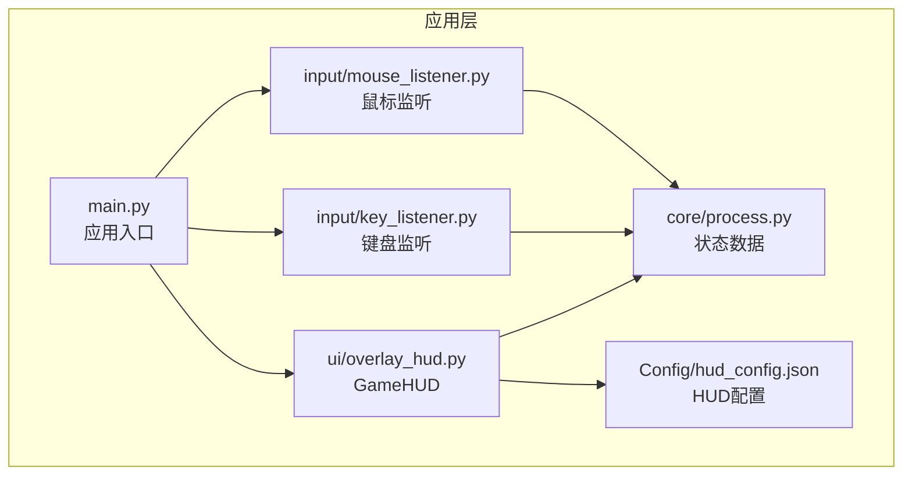
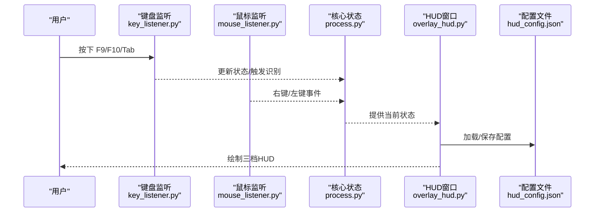
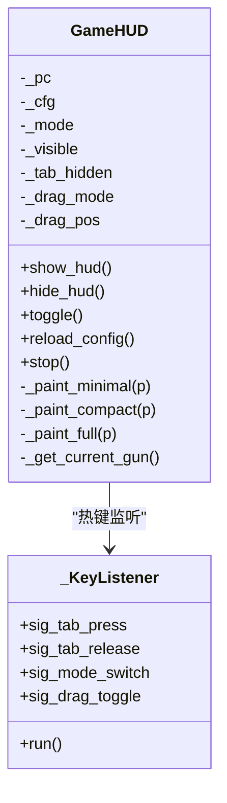
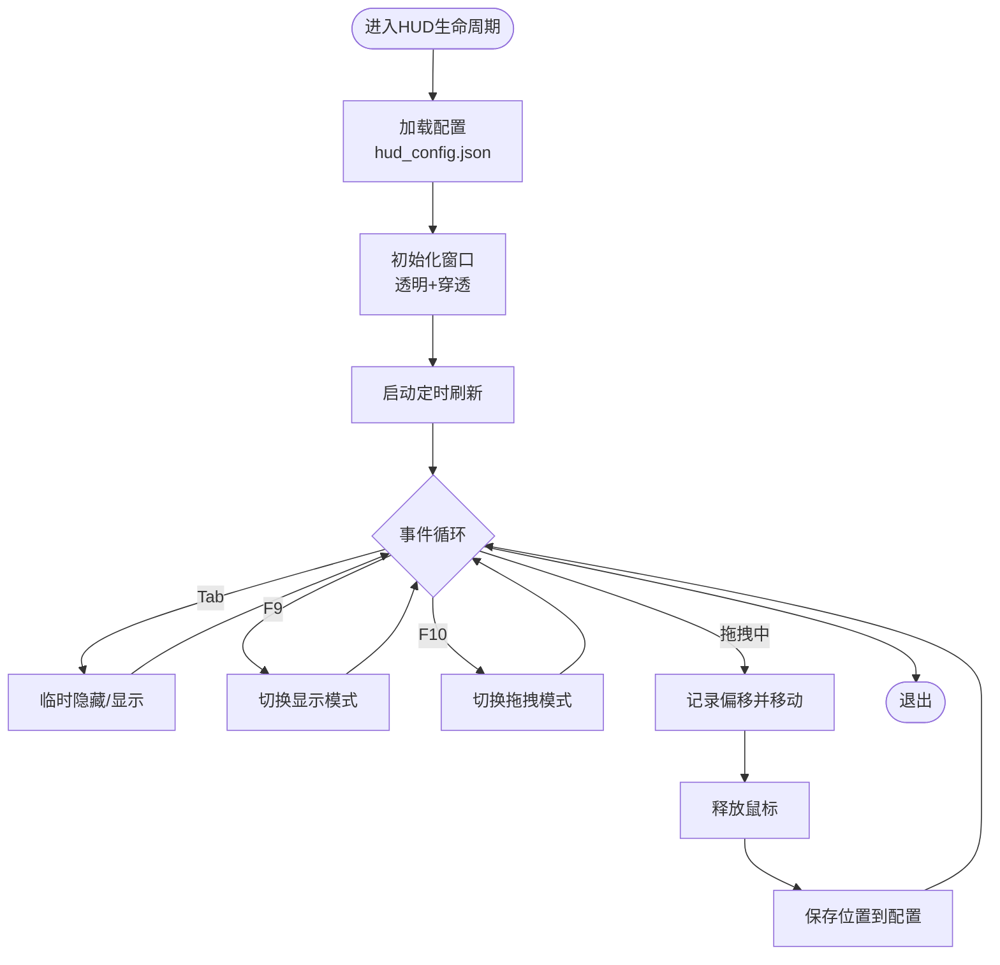
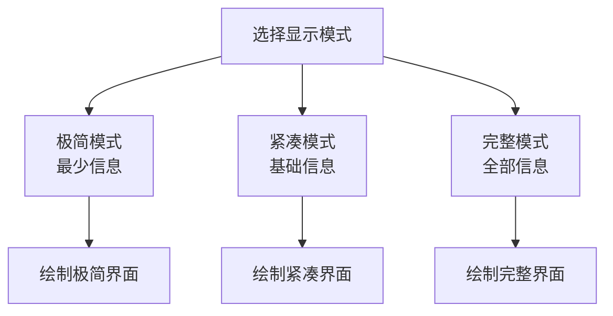
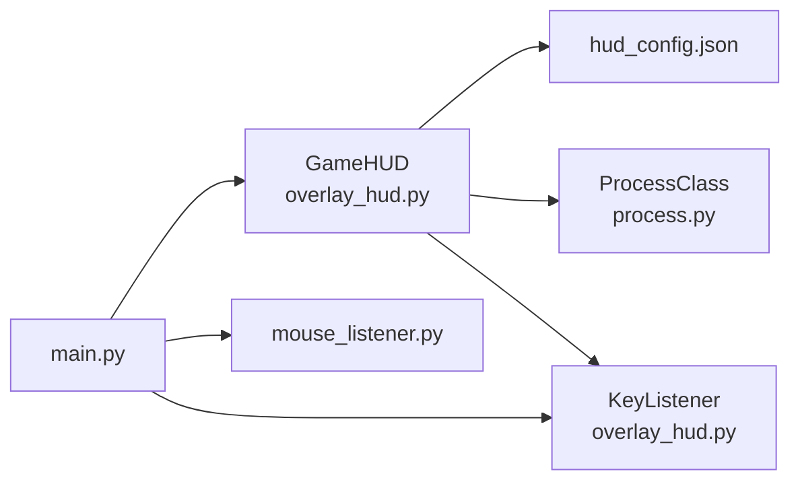

# 三档HUD显示系统

<cite>
**本文引用的文件**
- [overlay_hud.py](file://ui/overlay_hud.py)
- [ingame_display.py](file://ui/ingame_display.py)
- [hud_config.json](file://Config/hud_config.json)
- [config.json](file://Config/config.json)
- [main.py](file://main.py)
- [process.py](file://core/process.py)
- [key_listener.py](file://input/key_listener.py)
- [mouse_listener.py](file://input/mouse_listener.py)
</cite>

## 目录
1. [简介](#简介)
2. [项目结构](#项目结构)
3. [核心组件](#核心组件)
4. [架构总览](#架构总览)
5. [详细组件分析](#详细组件分析)
6. [依赖关系分析](#依赖关系分析)
7. [性能考量](#性能考量)
8. [故障排查指南](#故障排查指南)
9. [结论](#结论)
10. [附录](#附录)

## 简介
本文件面向PUBG自动识别压枪工具的“三档HUD显示系统”，系统通过可配置、可拖动的悬浮窗在游戏内实时呈现枪械与姿态信息，支持三种显示模式：极简、紧凑、完整。系统围绕以下目标设计：
- 信息层级清晰：根据使用场景选择合适的信息密度
- 用户体验优化：热键控制、拖拽定位、透明窗口、配置持久化
- 可扩展性：颜色、字体、尺寸、刷新频率均可配置

## 项目结构
与HUD系统直接相关的模块与文件如下：
- ui/overlay_hud.py：三档HUD实现，含透明窗口、拖拽、热键、配置加载与保存
- ui/ingame_display.py：另一套游戏内显示方案（非本系统），用于对比参考
- Config/hud_config.json：HUD配置文件（位置、模式、字体、颜色、尺寸、刷新频率、热键）
- Config/config.json：全局配置（分辨率、灵敏度）
- main.py：主应用入口，负责启动HUD与热键/鼠标监听
- core/process.py：核心状态数据（当前枪械、姿态、开镜状态等），供HUD绘制使用
- input/key_listener.py、input/mouse_listener.py：键盘/鼠标事件监听，驱动核心状态变化

图表来源
- [main.py:37-38](file://main.py#L37-L38)
- [overlay_hud.py:236-260](file://ui/overlay_hud.py#L236-L260)
- [hud_config.json:1-91](file://Config/hud_config.json#L1-L91)
- [process.py:131-136](file://core/process.py#L131-L136)
- [key_listener.py:14-47](file://input/key_listener.py#L14-L47)
- [mouse_listener.py:23-44](file://input/mouse_listener.py#L23-L44)

章节来源
- [main.py:37-38](file://main.py#L37-L38)
- [overlay_hud.py:236-260](file://ui/overlay_hud.py#L236-L260)
- [hud_config.json:1-91](file://Config/hud_config.json#L1-L91)
- [process.py:131-136](file://core/process.py#L131-L136)
- [key_listener.py:14-47](file://input/key_listener.py#L14-L47)
- [mouse_listener.py:23-44](file://input/mouse_listener.py#L23-L44)

## 核心组件
- GameHUD：三档HUD核心类，负责窗口创建、透明与穿透、拖拽、热键、定时刷新、绘制
- 配置系统：hud_config.json提供位置、默认模式、字体、颜色、尺寸、透明度、刷新频率、热键
- 状态数据：来自ProcessClass，提供当前枪械、姿态、开镜状态、第一人称等
- 热键监听：键盘线程监听Tab/F9/F10等热键，触发HUD行为
- 鼠标监听：驱动开镜、开火、姿态识别等状态变化

章节来源
- [overlay_hud.py:229-260](file://ui/overlay_hud.py#L229-L260)
- [overlay_hud.py:88-126](file://ui/overlay_hud.py#L88-L126)
- [process.py:31-48](file://core/process.py#L31-L48)
- [key_listener.py:14-47](file://input/key_listener.py#L14-L47)
- [mouse_listener.py:23-44](file://input/mouse_listener.py#L23-L44)

## 架构总览
三档HUD采用“配置驱动 + 状态驱动”的架构：
- 配置驱动：从hud_config.json加载初始布局、颜色、字体、尺寸、刷新频率、热键
- 状态驱动：通过ProcessClass提供的实时状态决定绘制内容
- 事件驱动：键盘线程监听Tab/F9/F10，鼠标线程监听右键/左键，驱动状态变化与HUD行为

图表来源
- [overlay_hud.py:192-227](file://ui/overlay_hud.py#L192-L227)
- [overlay_hud.py:314-352](file://ui/overlay_hud.py#L314-L352)
- [key_listener.py:14-47](file://input/key_listener.py#L14-L47)
- [mouse_listener.py:23-44](file://input/mouse_listener.py#L23-L44)
- [process.py:131-136](file://core/process.py#L131-L136)
- [hud_config.json:1-91](file://Config/hud_config.json#L1-L91)

## 详细组件分析

### GameHUD类与三档显示模式
- 模式定义：极简(MINIMAL)、紧凑(COMPACT)、完整(FULL)，通过MODE_MINIMAL/MODE_COMPACT/MODE_FULL枚举区分
- 绘制逻辑：paintEvent根据当前模式调用_paint_minimal/_paint_compact/_paint_full
- 信息层级设计：
  - 极简：仅显示枪名、瞄具、姿态、状态指示灯与提示
  - 紧凑：显示两把枪的配件信息、姿态、开镜状态、开火状态
  - 完整：显示HUD标题、状态指示灯、两把枪的完整信息、姿态、开镜/视角、提示
- 显示优先级管理：优先显示当前有效状态（如当前开镜、当前姿态），次要信息（如未装备）以灰色弱化

图表来源
- [overlay_hud.py:188-189](file://ui/overlay_hud.py#L188-L189)
- [overlay_hud.py:229-260](file://ui/overlay_hud.py#L229-L260)
- [overlay_hud.py:390-399](file://ui/overlay_hud.py#L390-L399)
- [overlay_hud.py:192-227](file://ui/overlay_hud.py#L192-L227)

章节来源
- [overlay_hud.py:188-189](file://ui/overlay_hud.py#L188-L189)
- [overlay_hud.py:390-399](file://ui/overlay_hud.py#L390-L399)
- [overlay_hud.py:401-457](file://ui/overlay_hud.py#L401-L457)
- [overlay_hud.py:458-525](file://ui/overlay_hud.py#L458-L525)
- [overlay_hud.py:526-632](file://ui/overlay_hud.py#L526-L632)

### HUD悬浮窗实现技术
- 透明窗口与穿透：
  - 使用Qt的FramelessWindowHint、WindowStaysOnTopHint、Tool窗口标志
  - 通过Win32 API设置WS_EX_TRANSPARENT/WS_EX_LAYERED/WS_EX_NOACTIVATE，实现鼠标穿透
  - 拖拽模式时解除穿透，允许拖动
- 拖拽定位：
  - 鼠标按下记录偏移，移动时计算新位置，释放时保存位置到配置
  - 位置保存后写回hud_config.json
- 热键控制：
  - Tab：临时隐藏/恢复HUD（用于背包识别不遮挡视线）
  - F9：循环切换三档模式
  - F10：切换拖拽模式（拖动后自动保存位置）
- 配置持久化：
  - 配置候选路径：Config/hud_config.json、./Config/hud_config.json、../Config/hud_config.json
  - 默认配置包含位置、默认模式、字体族、字体大小、颜色、尺寸、透明度、刷新周期、热键

图表来源
- [overlay_hud.py:88-126](file://ui/overlay_hud.py#L88-L126)
- [overlay_hud.py:249-265](file://ui/overlay_hud.py#L249-L265)
- [overlay_hud.py:314-352](file://ui/overlay_hud.py#L314-L352)
- [overlay_hud.py:356-371](file://ui/overlay_hud.py#L356-L371)
- [overlay_hud.py:306-312](file://ui/overlay_hud.py#L306-L312)

章节来源
- [overlay_hud.py:41-55](file://ui/overlay_hud.py#L41-L55)
- [overlay_hud.py:249-265](file://ui/overlay_hud.py#L249-L265)
- [overlay_hud.py:314-352](file://ui/overlay_hud.py#L314-L352)
- [overlay_hud.py:356-371](file://ui/overlay_hud.py#L356-L371)
- [overlay_hud.py:306-312](file://ui/overlay_hud.py#L306-L312)

### 三档显示模式详解
- 模式一（极简）：适合追求最小视觉干扰的用户，仅显示枪名、瞄具、姿态、状态指示灯与提示
- 模式二（紧凑）：在极简基础上增加两把枪的配件信息、姿态、开镜/开火状态
- 模式三（完整）：在紧凑基础上增加HUD标题、状态指示灯文字描述、两把枪的完整信息、姿态、开镜/视角、提示

图表来源
- [overlay_hud.py:390-399](file://ui/overlay_hud.py#L390-L399)
- [overlay_hud.py:401-457](file://ui/overlay_hud.py#L401-L457)
- [overlay_hud.py:458-525](file://ui/overlay_hud.py#L458-L525)
- [overlay_hud.py:526-632](file://ui/overlay_hud.py#L526-L632)

章节来源
- [overlay_hud.py:401-457](file://ui/overlay_hud.py#L401-L457)
- [overlay_hud.py:458-525](file://ui/overlay_hud.py#L458-L525)
- [overlay_hud.py:526-632](file://ui/overlay_hud.py#L526-L632)

### HUD样式定制指南
- 颜色调整：通过colors字段设置背景、边框、金、绿、红、黄、白、灰、暗色
- 字体设置：通过font_family与font_size分别设置字体族与各模式字体大小
- 位置微调：通过position设置x/y、锚点（top-right/custom）与margin_right
- 显示内容配置：通过default_mode选择默认模式，通过size为各模式设置固定宽高
- 刷新频率：通过refresh_ms控制绘制刷新周期
- 热键控制：通过hotkey_mode_switch设置模式切换热键

章节来源
- [hud_config.json:1-91](file://Config/hud_config.json#L1-L91)
- [overlay_hud.py:68-85](file://ui/overlay_hud.py#L68-L85)
- [overlay_hud.py:267-284](file://ui/overlay_hud.py#L267-L284)
- [overlay_hud.py:291-302](file://ui/overlay_hud.py#L291-L302)
- [overlay_hud.py:285-289](file://ui/overlay_hud.py#L285-L289)

### 使用示例与最佳实践
- 启动HUD：在主应用中创建GameHUD实例并在启动流程中调用show_hud
- 临时隐藏：按Tab键临时隐藏HUD，便于背包识别
- 切换模式：按F9在极简/紧凑/完整间循环切换
- 拖拽定位：按F10进入拖拽模式，拖动HUD后自动保存位置
- 最佳实践：
  - 在高分辨率下优先使用极简模式，减少遮挡
  - 紧凑模式适合快速确认两把枪的配件与姿态
  - 完整模式适合调试与教学演示
  - 合理设置refresh_ms以平衡流畅度与资源占用

章节来源
- [main.py:234](file://main.py#L234)
- [overlay_hud.py:314-352](file://ui/overlay_hud.py#L314-L352)
- [overlay_hud.py:342-352](file://ui/overlay_hud.py#L342-L352)

## 依赖关系分析
- GameHUD依赖：
  - 配置系统：hud_config.json
  - 核心状态：ProcessClass提供的get_guns_result、Current_firearms、Current_posture、StartFire、firstPerson、mouse_one等
  - 热键监听：_KeyListener线程
  - Windows Win32 API：实现透明与穿透
- 主应用依赖：
  - GameHUD：用于显示HUD
  - 键盘/鼠标监听：用于驱动状态变化

图表来源
- [overlay_hud.py:236-260](file://ui/overlay_hud.py#L236-L260)
- [overlay_hud.py:88-126](file://ui/overlay_hud.py#L88-L126)
- [process.py:131-136](file://core/process.py#L131-L136)
- [main.py:37-38](file://main.py#L37-L38)
- [mouse_listener.py:23-44](file://input/mouse_listener.py#L23-L44)

章节来源
- [overlay_hud.py:236-260](file://ui/overlay_hud.py#L236-L260)
- [process.py:131-136](file://core/process.py#L131-L136)
- [main.py:37-38](file://main.py#L37-L38)
- [mouse_listener.py:23-44](file://input/mouse_listener.py#L23-L44)

## 性能考量
- 刷新频率：默认250ms，可通过refresh_ms调整；过低可能卡顿，过高增加CPU/GPU负载
- 绘制复杂度：完整模式绘制项最多，建议在高帧率显示器上使用
- 透明与穿透：启用穿透减少输入事件处理开销，拖拽模式时解除穿透以便交互
- 线程模型：热键监听独立线程，避免阻塞UI线程

[本节为通用指导，无需特定文件引用]

## 故障排查指南
- HUD不显示：
  - 检查是否调用show_hud
  - 检查配置文件路径与权限
- 无法拖拽：
  - 确认F10已切换至拖拽模式
  - 检查Windows Dpi感知设置
- 热键无效：
  - 确认键盘监听线程正常运行
  - 检查热键冲突
- 颜色/字体异常：
  - 检查hud_config.json格式与字段拼写
  - 确认字体在系统中可用

章节来源
- [overlay_hud.py:61-100](file://ui/overlay_hud.py#L61-L100)
- [overlay_hud.py:342-352](file://ui/overlay_hud.py#L342-L352)
- [key_listener.py:58-69](file://input/key_listener.py#L58-L69)

## 结论
三档HUD显示系统通过“配置驱动 + 状态驱动 + 事件驱动”的架构，在保证信息完整性的同时兼顾了用户体验与性能。其透明穿透、拖拽定位、热键控制与配置持久化机制，使得用户能够在不同分辨率与使用场景下获得稳定一致的视觉反馈。建议用户根据实际需求选择合适的显示模式，并通过配置文件微调以达到最佳视觉体验。

[本节为总结，无需特定文件引用]

## 附录
- 与本系统对比的另一套游戏内显示方案位于ui/ingame_display.py，提供简单/标准/专业三档模式，可作为参考但非本系统实现。

章节来源
- [ingame_display.py:7-30](file://ui/ingame_display.py#L7-L30)