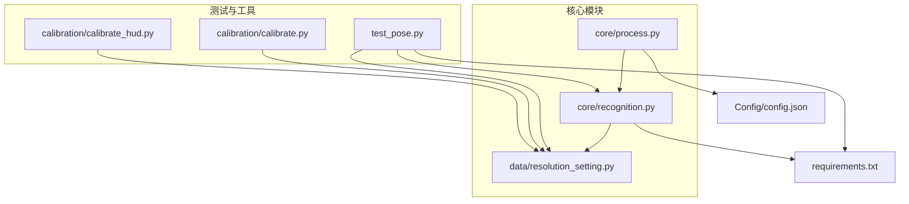
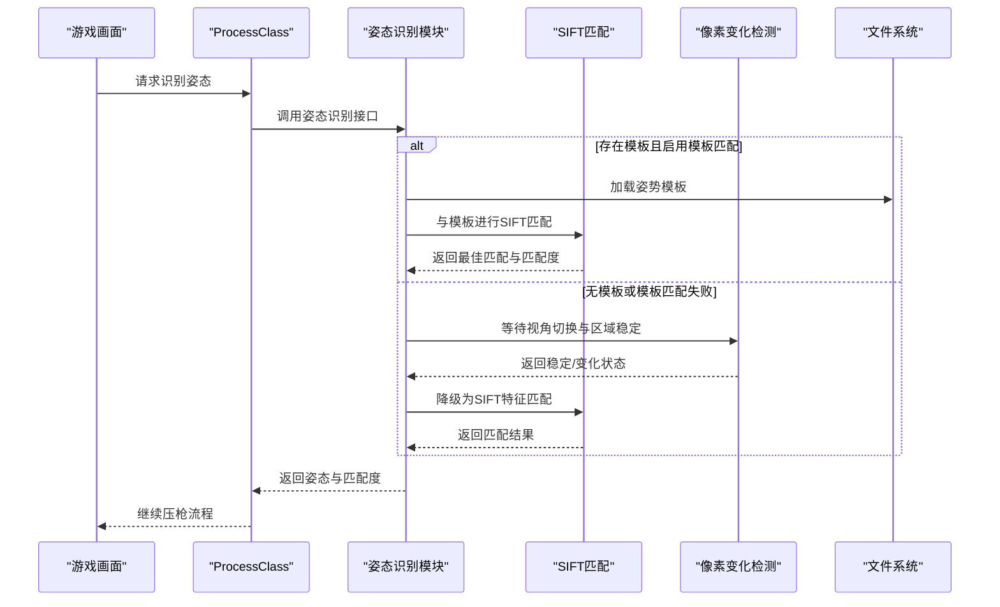
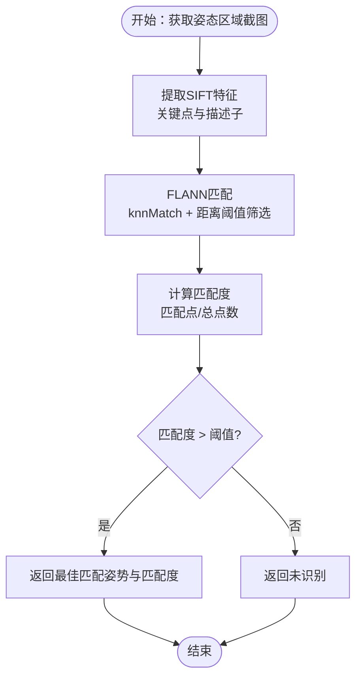
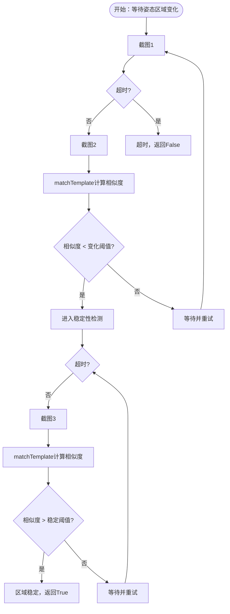
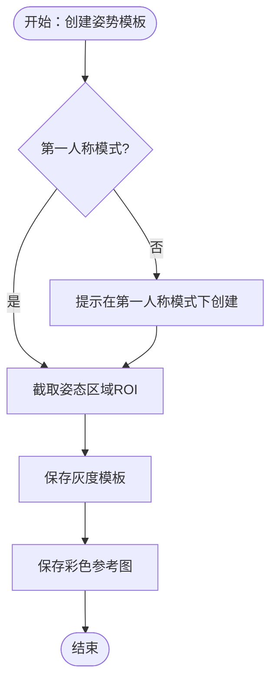
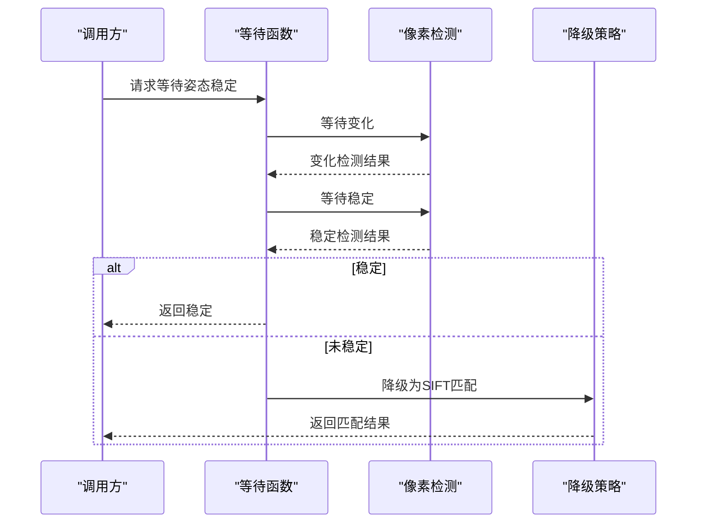
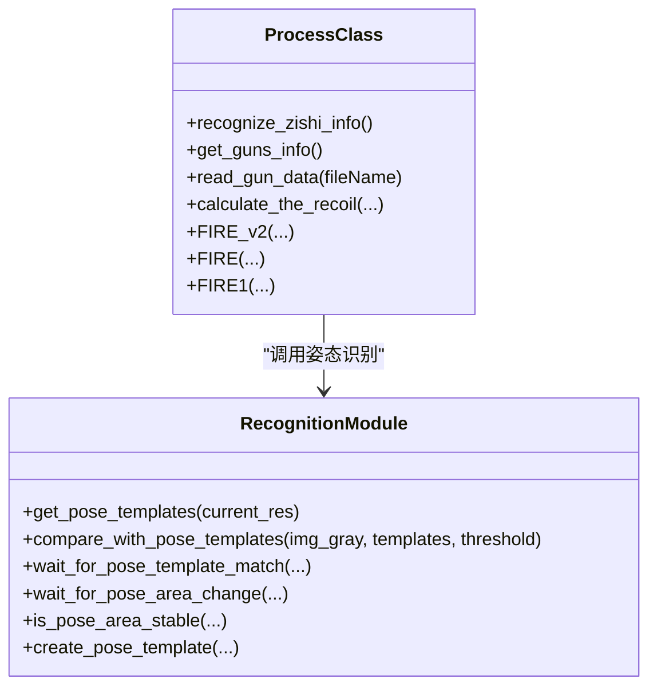
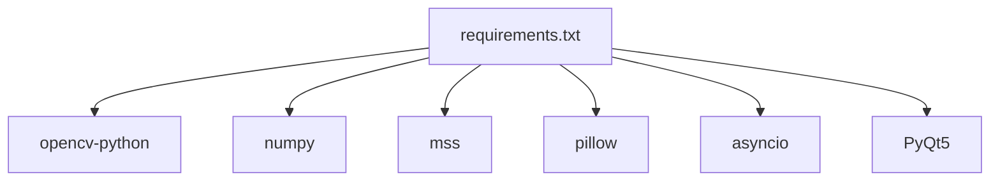

# 姿态识别系统

<cite>
**本文引用的文件**
- [core/recognition.py](file://core/recognition.py)
- [test_pose.py](file://test_pose.py)
- [data/resolution_setting.py](file://data/resolution_setting.py)
- [core/process.py](file://core/process.py)
- [calibration/calibrate.py](file://calibration/calibrate.py)
- [calibration/calibrate_hud.py](file://calibration/calibrate_hud.py)
- [Config/config.json](file://Config/config.json)
- [README.md](file://README.md)
- [requirements.txt](file://requirements.txt)
</cite>

## 目录
1. [简介](#简介)
2. [项目结构](#项目结构)
3. [核心组件](#核心组件)
4. [架构总览](#架构总览)
5. [详细组件分析](#详细组件分析)
6. [依赖关系分析](#依赖关系分析)
7. [性能考量](#性能考量)
8. [故障排除指南](#故障排除指南)
9. [结论](#结论)
10. [附录](#附录)

## 简介
本文件面向PUBG自动识别压枪工具的姿态识别系统，提供从技术实现到工程实践的完整文档。系统采用两种姿态识别策略：
- 基于SIFT的模板匹配法：通过预先创建的姿势模板与实时截图进行特征匹配，适用于多分辨率、多环境的稳定识别。
- 像素变化检测法：通过连续截图比较，检测姿势区域像素变化与稳定性，用于第三人称视角切换时的自适应等待与错误恢复。

文档还涵盖姿势模板的创建、管理与维护流程（质量要求、命名规范、存储结构）、稳定性保障机制（自适应等待、像素相似度检测、错误恢复策略），以及使用示例与故障排除指南。

## 项目结构
该项目采用“功能分层 + 模块化”的组织方式，核心与姿态识别相关的模块如下：
- core/recognition.py：姿态识别与SIFT模板匹配、像素变化检测、模板创建与等待匹配等核心逻辑。
- test_pose.py：姿态模板匹配的独立测试脚本，包含模板创建、匹配测试与报告生成。
- data/resolution_setting.py：分辨率与截图区域配置，包含姿势区域Zishi坐标。
- core/process.py：进程控制与集成，调用姿态识别接口并整合到压枪流程。
- calibration/calibrate*.py：弹痕校准工具，辅助验证识别结果与参数调整。
- Config/config.json：全局配置（分辨率、灵敏度）。
- README.md：项目说明与使用指南。

图表来源
- [core/recognition.py](file://core/recognition.py)
- [core/process.py](file://core/process.py)
- [data/resolution_setting.py](file://data/resolution_setting.py)
- [test_pose.py](file://test_pose.py)
- [calibration/calibrate.py](file://calibration/calibrate.py)
- [calibration/calibrate_hud.py](file://calibration/calibrate_hud.py)
- [Config/config.json](file://Config/config.json)
- [requirements.txt](file://requirements.txt)

章节来源
- [README.md](file://README.md)
- [requirements.txt](file://requirements.txt)

## 核心组件
- 姿态识别核心（SIFT模板匹配 + 像素变化检测）
  - SIFT特征匹配：基于OpenCV SIFT特征点与FLANN匹配器，计算两幅图像的匹配度。
  - 模板匹配：加载预存姿势模板，与实时截图进行SIFT匹配，返回最佳匹配姿势与匹配度。
  - 像素变化检测：通过matchTemplate计算相邻截图的归一化相关性，判断区域是否稳定或发生改变。
  - 自适应等待：在第三人称视角切换后，先等待姿势区域发生变化，再等待其稳定，提升识别鲁棒性。
- 姿态模板管理
  - 模板创建：在第一人称模式下截图并保存灰度模板与彩色参考图。
  - 模板加载：扫描模板目录，加载所有可用模板，支持阈值过滤。
  - 模板命名与存储：模板文件名为姿势名称，灰度模板用于匹配，彩色模板用于人工核验。
- 集成与控制
  - 进程控制：ProcessClass统一调度识别与压枪流程，调用姿态识别接口。
  - 分辨率适配：通过Zishi坐标与分辨率设置，确保不同分辨率下的姿态区域一致。

章节来源
- [core/recognition.py](file://core/recognition.py)
- [test_pose.py](file://test_pose.py)
- [data/resolution_setting.py](file://data/resolution_setting.py)
- [core/process.py](file://core/process.py)

## 架构总览
姿态识别系统在整体压枪流程中的位置如下：
- 输入：游戏画面（姿态区域ROI）。
- 处理：SIFT特征匹配或像素变化检测；模板匹配或自适应等待。
- 输出：姿态类别（站立/蹲伏/趴下）与匹配度，或等待超时后的默认策略。

图表来源
- [core/process.py](file://core/process.py)
- [core/recognition.py](file://core/recognition.py)

## 详细组件分析

### SIFT模板匹配法
- 实现要点
  - 特征提取：使用SIFT检测关键点与描述子。
  - 匹配策略：使用FLANN匹配器进行knnMatch，通过距离阈值筛选可靠匹配点，计算匹配比例。
  - 匹配度评估：匹配点数量占总特征点的比例作为匹配度指标。
- 适用场景
  - 多分辨率通用：同一模板可在不同分辨率下使用，减少模板维护成本。
  - 稳定环境：模板质量高、背景变化小的场景识别效果更佳。
- 参数与阈值
  - 匹配阈值（如0.7）影响匹配稳健性；匹配度阈值（如0.3）决定是否接受识别结果。
- 代码路径
  - SIFT特征与匹配：[match_sift](file://core/recognition.py)
  - 模板加载与比较：[get_pose_templates](file://core/recognition.py), [compare_with_pose_templates](file://core/recognition.py)
  - 模板创建：[create_pose_template](file://core/recognition.py)

图表来源
- [core/recognition.py](file://core/recognition.py)

章节来源
- [core/recognition.py](file://core/recognition.py)

### 像素变化检测法
- 实现要点
  - 变化检测：通过matchTemplate计算相邻截图的归一化相关性，低于阈值认为发生变化。
  - 稳定性检测：多次连续截图比较，达到阈值认为区域稳定。
  - 自适应等待：先等待变化，再等待稳定，提升第三人称视角切换时的识别可靠性。
- 适用场景
  - 第三人称视角频繁切换：通过变化检测与稳定性检测规避渲染未完成导致的误判。
  - 模板缺失或质量不佳：作为降级策略使用SIFT特征匹配。
- 参数与阈值
  - 变化阈值（如0.8）与稳定性阈值（如0.95）需根据具体场景调优。
- 代码路径
  - 等待变化：[wait_for_pose_area_change](file://core/recognition.py)
  - 等待稳定：[is_pose_area_stable](file://core/recognition.py)

图表来源
- [core/recognition.py](file://core/recognition.py)

章节来源
- [core/recognition.py](file://core/recognition.py)

### 姿态模板的创建、管理与维护
- 创建流程
  - 建议在第一人称模式下创建模板，以减少视角与渲染差异带来的噪声。
  - 截取姿态区域ROI，分别保存灰度模板与彩色参考图，便于人工核验。
- 管理与维护
  - 存储结构：模板文件位于“_internal/data/pose_templates/”，文件名为姿势名称（如standing、crouching、prone）。
  - 质量要求：模板应清晰、背景简洁、无遮挡；尽量在相同光照条件下采集。
  - 命名规范：使用语义明确的英文名称，避免特殊字符与空格。
- 代码路径
  - 模板创建：[create_pose_template](file://core/recognition.py)
  - 模板加载：[get_pose_templates](file://core/recognition.py)
  - 测试脚本（含模板创建与匹配测试）：[test_pose.py](file://test_pose.py)

图表来源
- [core/recognition.py](file://core/recognition.py)
- [test_pose.py](file://test_pose.py)

章节来源
- [core/recognition.py](file://core/recognition.py)
- [test_pose.py](file://test_pose.py)

### 稳定性保障机制
- 自适应等待
  - 视角切换后先等待姿态区域发生变化（表示渲染开始），再等待其稳定（表示渲染完成）。
- 像素相似度检测
  - 使用matchTemplate计算相邻截图的归一化相关性，作为稳定性与变化的量化指标。
- 错误恢复策略
  - 模板匹配失败时降级为SIFT特征匹配；若仍失败，使用固定延迟作为兜底。
- 代码路径
  - 等待变化/稳定：[wait_for_pose_area_change](file://core/recognition.py), [is_pose_area_stable](file://core/recognition.py)
  - 模板匹配等待：[wait_for_pose_template_match](file://core/recognition.py)
  - 降级策略：[capture_zishi_positions_thread](file://core/recognition.py)

图表来源
- [core/recognition.py](file://core/recognition.py)

章节来源
- [core/recognition.py](file://core/recognition.py)

### 与进程控制的集成
- ProcessClass统一调度姿态识别与压枪流程，调用姿态识别接口并整合到整体压枪逻辑。
- 代码路径
  - 姿态识别入口：[recognize_zishi_info](file://core/process.py)
  - 调用识别函数：[capture_zishi_positions_thread](file://core/recognition.py)

图表来源
- [core/process.py](file://core/process.py)
- [core/recognition.py](file://core/recognition.py)

章节来源
- [core/process.py](file://core/process.py)
- [core/recognition.py](file://core/recognition.py)

## 依赖关系分析
- OpenCV：SIFT特征提取、模板匹配、matchTemplate、图像处理。
- NumPy：数组运算与图像矩阵处理。
- mss：高性能屏幕截图。
- Pillow：像素颜色采样（开火状态检测）。
- asyncio：异步并发处理，提升识别吞吐。
- PyQt5：GUI与HUD界面（与姿态识别间接相关）。

图表来源
- [requirements.txt](file://requirements.txt)

章节来源
- [requirements.txt](file://requirements.txt)

## 性能考量
- SIFT匹配性能
  - 特征点数量与匹配复杂度正相关，建议控制模板尺寸与数量，避免过多特征导致匹配耗时增加。
  - 使用阈值筛选可靠匹配点，减少误匹配带来的后续处理开销。
- 像素变化检测性能
  - 连续截图与模板匹配会带来CPU与内存压力，建议合理设置检查间隔与最大尝试次数。
  - 在模板可用时优先使用模板匹配，减少像素变化检测的频率。
- 异步并发
  - 通过asyncio并行处理多个姿态区域的识别任务，缩短整体识别耗时。
- 分辨率适配
  - 使用Zishi坐标与分辨率设置，确保不同分辨率下的ROI一致，减少重复模板需求。

## 故障排除指南
- 模板匹配失败
  - 检查模板质量：确保模板清晰、背景简洁、无遮挡；在第一人称模式下重新创建模板。
  - 调整匹配阈值：根据实际场景提高或降低匹配度阈值。
  - 确认模板命名：文件名为姿势名称，避免特殊字符与空格。
- 像素变化检测不稳定
  - 调整变化阈值与稳定性阈值：根据屏幕渲染速度与光照变化适当提高阈值。
  - 增加等待时间：延长等待超时与检查间隔，避免过早判断。
- 第三人称视角识别异常
  - 确保在视角切换后等待变化与稳定；若模板存在，优先使用模板匹配。
  - 固定延迟作为兜底：当稳定性检测失败时使用固定延迟，保证基本可用性。
- 分辨率不匹配
  - 检查Zishi坐标与分辨率设置：确保当前分辨率对应的Zishi坐标正确。
  - 更新分辨率配置：在data/resolution_setting.py中确认坐标与分辨率映射。
- 开火状态检测误判
  - 检查开镜像素采样区域：确保Click坐标与当前分辨率一致。
  - 调整采样阈值：根据实际屏幕色彩差异调整RGB阈值范围。

章节来源
- [core/recognition.py](file://core/recognition.py)
- [data/resolution_setting.py](file://data/resolution_setting.py)
- [core/process.py](file://core/process.py)

## 结论
姿态识别系统通过SIFT模板匹配与像素变化检测相结合的方式，实现了在多分辨率、多环境下稳定可靠的姿势识别。模板匹配法具备跨分辨率能力与较高的准确性，像素变化检测法则提供了自适应等待与错误恢复能力，二者协同提升了系统的鲁棒性。通过规范的模板创建与管理流程、合理的参数阈值与等待策略，用户可以在不同游戏场景中获得稳定且高效的姿态识别体验。

## 附录

### 使用示例
- 创建姿势模板
  - 命令行方式：在test_pose.py中使用“create_template”参数创建模板，指定分辨率与姿势名称。
  - 代码路径：[create_pose_template](file://test_pose.py)
- 测试模板匹配
  - 运行test_pose.py进行模板匹配测试，查看成功率与平均匹配时间。
  - 代码路径：[test_template_matching](file://test_pose.py)
- 集成到压枪流程
  - 通过ProcessClass调用姿态识别接口，获取姿态并参与压枪计算。
  - 代码路径：[recognize_zishi_info](file://core/process.py)

章节来源
- [test_pose.py](file://test_pose.py)
- [core/process.py](file://core/process.py)