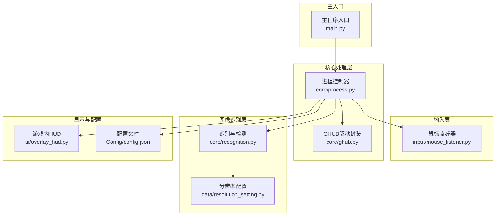
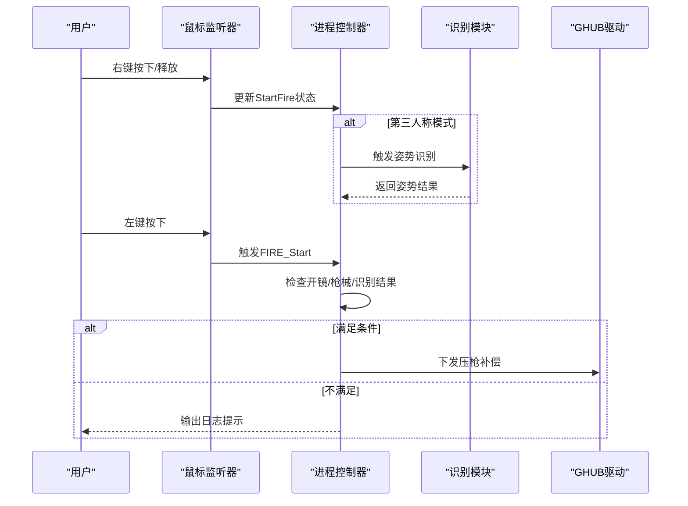
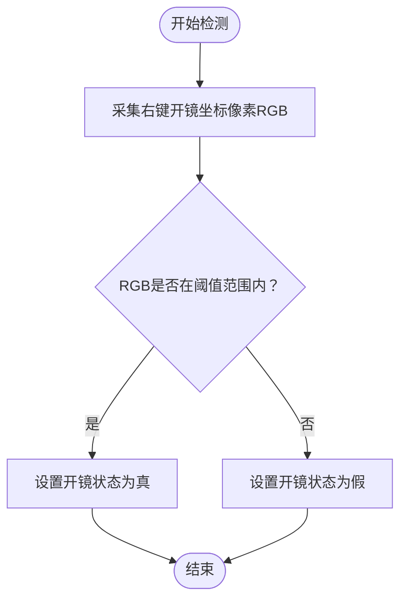
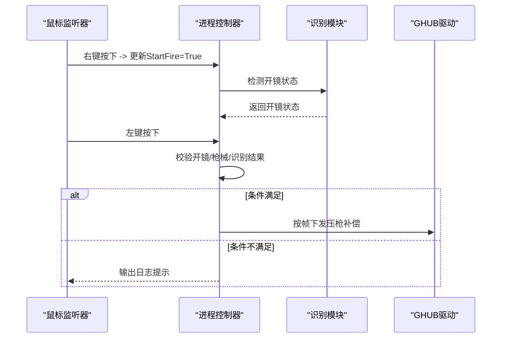
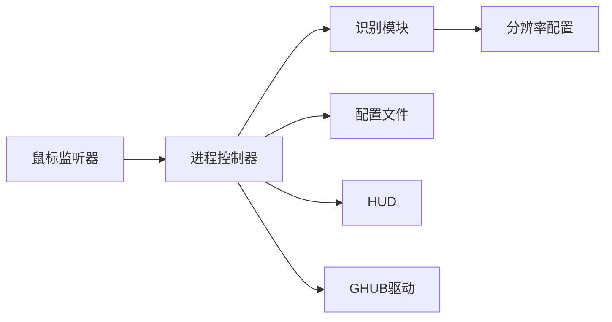

# 开火状态检测系统

<cite>
**本文档引用的文件**
- [main.py](file://main.py)
- [core/recognition.py](file://core/recognition.py)
- [core/process.py](file://core/process.py)
- [core/ghub.py](file://core/ghub.py)
- [data/resolution_setting.py](file://data/resolution_setting.py)
- [input/mouse_listener.py](file://input/mouse_listener.py)
- [ui/overlay_hud.py](file://ui/overlay_hud.py)
- [Config/config.json](file://Config/config.json)
- [README.md](file://README.md)
</cite>

## 目录
1. [简介](#简介)
2. [项目结构](#项目结构)
3. [核心组件](#核心组件)
4. [架构总览](#架构总览)
5. [详细组件分析](#详细组件分析)
6. [依赖关系分析](#依赖关系分析)
7. [性能考量](#性能考量)
8. [故障排查指南](#故障排查指南)
9. [结论](#结论)
10. [附录](#附录)

## 简介
本文件针对PUBG自动识别压枪工具中的“开火状态检测系统”进行深入技术文档化，重点解释基于像素颜色的检测方法、RGB阈值设定策略、检测区域选择原则与坐标定位机制、检测精度优化技巧、以及在压枪控制中的作用与时机（检测频率、响应延迟、状态同步）。文档还提供配置示例与调试方法，帮助用户根据游戏画面微调参数以达到最佳识别效果。

## 项目结构
该系统围绕以下模块协同工作：
- 输入层：鼠标监听器负责捕获右键开镜与左键开火事件，触发状态更新与压枪流程。
- 核心处理层：进程控制器负责状态管理、开火状态检测、压枪计算与驱动调用。
- 图像识别层：基于SIFT的枪械与姿势识别，以及开镜状态的像素颜色检测。
- 配置与显示层：分辨率与灵敏度配置、游戏内HUD显示。

图表来源
- [main.py:1-294](file://main.py#L1-L294)
- [core/process.py:1-405](file://core/process.py#L1-L405)
- [core/recognition.py:1-478](file://core/recognition.py#L1-L478)
- [data/resolution_setting.py:1-147](file://data/resolution_setting.py#L1-L147)
- [input/mouse_listener.py:1-64](file://input/mouse_listener.py#L1-L64)
- [ui/overlay_hud.py:1-698](file://ui/overlay_hud.py#L1-L698)
- [Config/config.json:1-1](file://Config/config.json#L1-L1)

章节来源
- [README.md:1-156](file://README.md#L1-L156)

## 核心组件
- 开火状态检测器：基于右键单击开镜坐标处的像素颜色进行判定，采用RGB阈值策略。
- 姿势识别与开镜状态联动：在第三人称模式下，通过模板匹配或稳定性检测确保截图一致性，再进行开镜状态判断。
- 压枪控制：当满足“已开镜+已选枪+识别结果有效”时，进入压枪循环，按帧下发补偿。

章节来源
- [core/recognition.py:467-477](file://core/recognition.py#L467-L477)
- [core/process.py:159-170](file://core/process.py#L159-L170)
- [core/process.py:207-262](file://core/process.py#L207-L262)

## 架构总览
开火状态检测贯穿于输入监听、状态管理与压枪控制之间，形成闭环：
- 鼠标监听捕获右键按下/释放事件，触发开镜状态更新与识别。
- 进程控制器维护StartFire状态，并在左键按下时检查开镜状态以决定是否启动压枪。
- 识别模块提供像素颜色检测与姿势识别，保障状态判断的准确性。

图表来源
- [input/mouse_listener.py:23-50](file://input/mouse_listener.py#L23-L50)
- [core/process.py:159-170](file://core/process.py#L159-L170)
- [core/process.py:207-262](file://core/process.py#L207-L262)
- [core/ghub.py:32-51](file://core/ghub.py#L32-L51)

## 详细组件分析

### 开火状态检测器（基于像素颜色）
- 检测原理：在右键单击开镜的固定坐标处采集单像素RGB值，通过预设阈值范围判断是否处于开镜状态。
- 坐标定位：依据分辨率配置文件中的Click区域，统一不同分辨率下的右键开镜坐标。
- 阈值策略：采用RGB三通道的上下限阈值，确保在不同亮度与色彩环境下具备鲁棒性。
- 实现位置：识别模块中的开镜状态检测函数。

图表来源
- [core/recognition.py:467-477](file://core/recognition.py#L467-L477)
- [data/resolution_setting.py:123-133](file://data/resolution_setting.py#L123-L133)

章节来源
- [core/recognition.py:467-477](file://core/recognition.py#L467-L477)
- [data/resolution_setting.py:123-133](file://data/resolution_setting.py#L123-L133)

### 检测区域选择原则与坐标定位机制
- 选择原则：
  - 优先选择右键单击开镜的固定坐标，确保在开镜动画结束后像素颜色稳定。
  - 坐标应避开UI遮挡区域，尽量位于开镜图标或开镜指示区域。
  - 针对不同分辨率，提供独立的坐标配置，保证跨屏适配。
- 坐标定位：
  - Click区域定义了各分辨率下的右键开镜坐标。
  - 识别模块通过读取当前分辨率配置，调用像素采集函数进行检测。

章节来源
- [data/resolution_setting.py:123-133](file://data/resolution_setting.py#L123-L133)
- [core/recognition.py:467-477](file://core/recognition.py#L467-L477)

### RGB阈值设定策略
- 设定思路：
  - 通过观察开镜状态下该像素的颜色分布，确定合理的RGB上下限。
  - 考虑不同显示器色温、亮度与游戏UI色调差异，适当放宽阈值范围以提升鲁棒性。
  - 避免使用单一通道阈值，采用RGB三通道联合判断，降低误检概率。
- 调优建议：
  - 在测试目录中保存截图，人工核对像素颜色，逐步微调阈值。
  - 在不同场景（白天/夜晚、不同UI主题）下验证阈值稳定性。

章节来源
- [core/recognition.py:467-477](file://core/recognition.py#L467-L477)

### 检测精度优化技巧
- 阈值调整：
  - 以RGB三通道为中心值，设定对称或不对称的上下限，平衡误检与漏检。
  - 对于动态UI（如开镜动画），可增加多次采样取多数投票。
- 噪声过滤：
  - 对连续N帧的检测结果进行滑动窗口统计，仅在多数帧一致时才更新状态。
  - 引入状态机，区分“稳定状态”与“过渡状态”，避免抖动。
- 误检处理：
  - 在检测到异常波动时，延时重采样确认，或回退到上一帧状态。
  - 对于特定分辨率或特定UI主题，提供独立阈值配置。

章节来源
- [core/recognition.py:467-477](file://core/recognition.py#L467-L477)

### 开火状态检测在压枪控制中的作用与时机
- 作用：
  - 作为压枪启动/停止的前置条件之一，确保仅在开镜状态下执行压枪。
  - 与枪械识别结果、姿态识别结果共同构成压枪的必要条件。
- 时机：
  - 右键按下时立即检测开镜状态，若为真则保持开镜标志，释放时清零。
  - 左键按下时检查开镜标志，满足条件后启动压枪循环。
- 响应延迟与状态同步：
  - 鼠标监听线程与压枪线程分离，通过共享状态变量进行同步。
  - 在第三人称模式下，先进行姿势识别与稳定性检测，再进行开镜状态判断，减少误判。

图表来源
- [input/mouse_listener.py:23-50](file://input/mouse_listener.py#L23-L50)
- [core/process.py:159-170](file://core/process.py#L159-L170)
- [core/process.py:207-262](file://core/process.py#L207-L262)

章节来源
- [input/mouse_listener.py:23-50](file://input/mouse_listener.py#L23-L50)
- [core/process.py:159-170](file://core/process.py#L159-L170)
- [core/process.py:207-262](file://core/process.py#L207-L262)

### 配置示例与调试方法
- 分辨率配置：
  - 在分辨率配置文件中为各分辨率设置Click坐标，确保右键开镜坐标准确。
  - 如需调整，可参考注释中提供的调试截图保存路径，观察ROI区域是否正确。
- 灵敏度配置：
  - 在配置文件中设置各倍镜的灵敏度系数，压过头调低、压不住调高。
  - 修改后需在GUI中保存，以便进程控制器读取生效。
- 调试方法：
  - 取消识别模块中的调试截图注释，运行后在test目录查看ROI截图，核对像素颜色。
  - 在GUI中切换HUD显示模式，观察开镜状态指示灯是否与实际一致。

章节来源
- [data/resolution_setting.py:123-133](file://data/resolution_setting.py#L123-L133)
- [Config/config.json:1-1](file://Config/config.json#L1-L1)
- [core/recognition.py:102-126](file://core/recognition.py#L102-L126)

## 依赖关系分析
- 输入监听依赖进程控制器的状态字段（StartFire、RightClick、firstPerson等）。
- 进程控制器依赖识别模块的开镜状态检测与姿势识别能力。
- 识别模块依赖分辨率配置文件中的坐标定义。
- HUD依赖进程控制器的状态字段进行实时显示。

图表来源
- [input/mouse_listener.py:23-50](file://input/mouse_listener.py#L23-L50)
- [core/process.py:159-170](file://core/process.py#L159-L170)
- [core/recognition.py:102-126](file://core/recognition.py#L102-L126)
- [data/resolution_setting.py:123-133](file://data/resolution_setting.py#L123-L133)
- [ui/overlay_hud.py:445-449](file://ui/overlay_hud.py#L445-L449)

章节来源
- [input/mouse_listener.py:23-50](file://input/mouse_listener.py#L23-L50)
- [core/process.py:159-170](file://core/process.py#L159-L170)
- [core/recognition.py:102-126](file://core/recognition.py#L102-L126)
- [data/resolution_setting.py:123-133](file://data/resolution_setting.py#L123-L133)
- [ui/overlay_hud.py:445-449](file://ui/overlay_hud.py#L445-L449)

## 性能考量
- 检测频率：像素颜色检测为轻量级操作，可在高频轮询中使用，但建议结合滑动窗口与状态机，避免频繁抖动。
- 响应延迟：鼠标事件与压枪下发之间存在系统调度与驱动调用延迟，需在配置中预留合理余量。
- 状态同步：通过共享状态变量与线程安全机制，确保多线程环境下的状态一致性。
- 第三人称模式：姿势识别与稳定性检测会引入额外开销，建议在需要时启用，或在检测失败时回退到固定延迟策略。

## 故障排查指南
- 开镜状态不稳定：
  - 检查阈值范围是否过窄，适当放宽RGB上下限。
  - 确认Click坐标是否正确，避免UI遮挡或分辨率不匹配。
- 压枪不启动：
  - 确认已开镜且已选中枪械，识别结果非空。
  - 检查灵敏度配置是否合理，必要时进行校准。
- HUD显示异常：
  - 检查配置文件路径与权限，确保HUD配置可读写。
  - 重启HUD以重新加载配置。

章节来源
- [core/recognition.py:467-477](file://core/recognition.py#L467-L477)
- [core/process.py:207-262](file://core/process.py#L207-L262)
- [ui/overlay_hud.py:634-669](file://ui/overlay_hud.py#L634-L669)

## 结论
开火状态检测系统通过在右键单击开镜坐标处进行像素颜色采样与阈值判断，实现了对开镜状态的快速、稳定的识别。结合分辨率配置与阈值策略，系统能够在不同显示器与UI主题下保持较高识别精度。通过与姿势识别、压枪控制的协同，形成了完整的自动压枪闭环。用户可通过调整阈值、优化检测策略与校准灵敏度，进一步提升系统的鲁棒性与适用性。

## 附录
- 快速开始与配置说明可参考项目README。
- 弹痕校准工具可用于验证灵敏度配置与压枪效果。

章节来源
- [README.md:69-156](file://README.md#L69-L156)