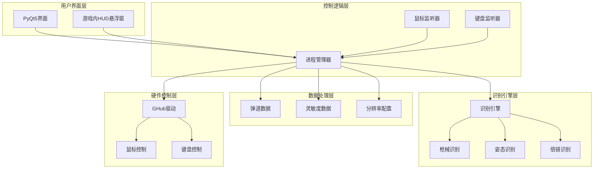
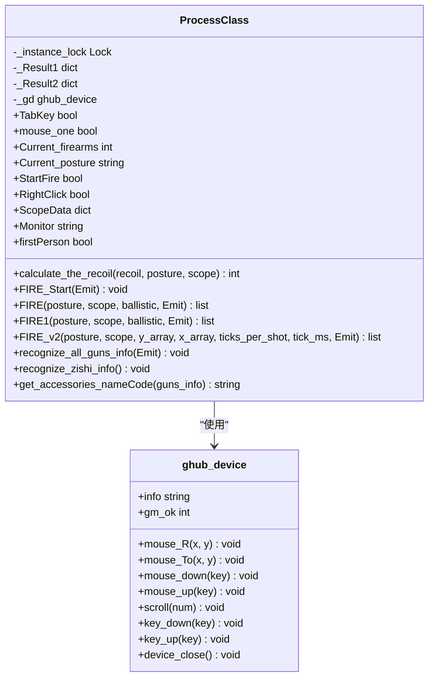
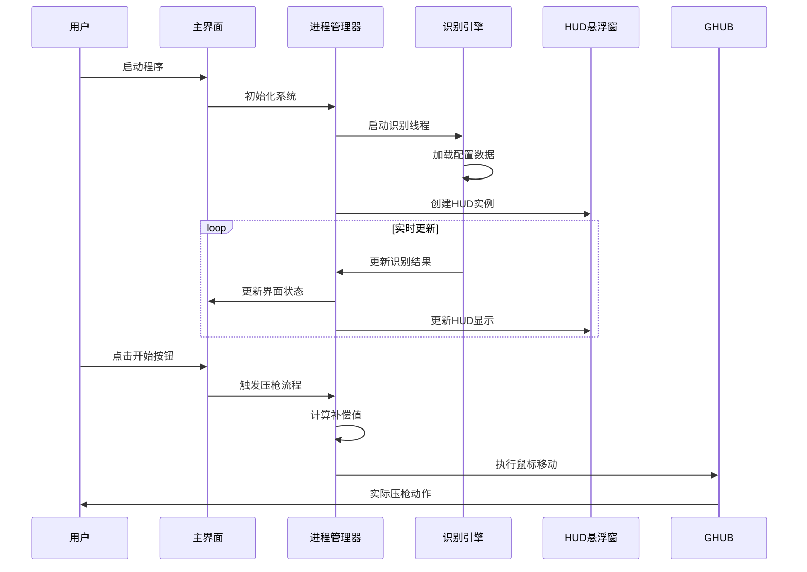
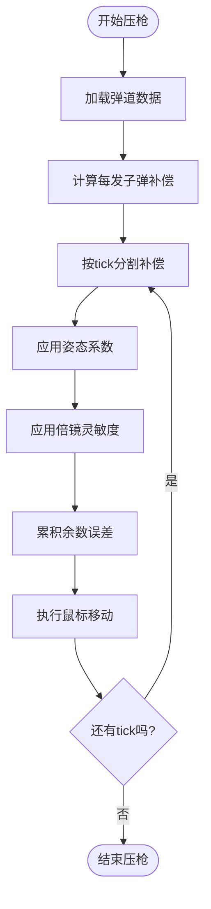
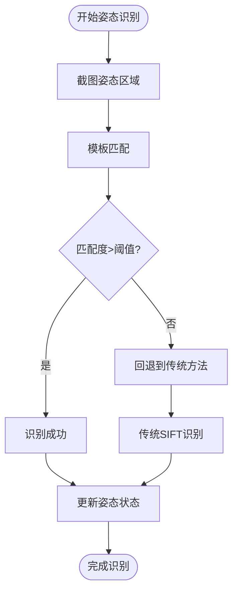
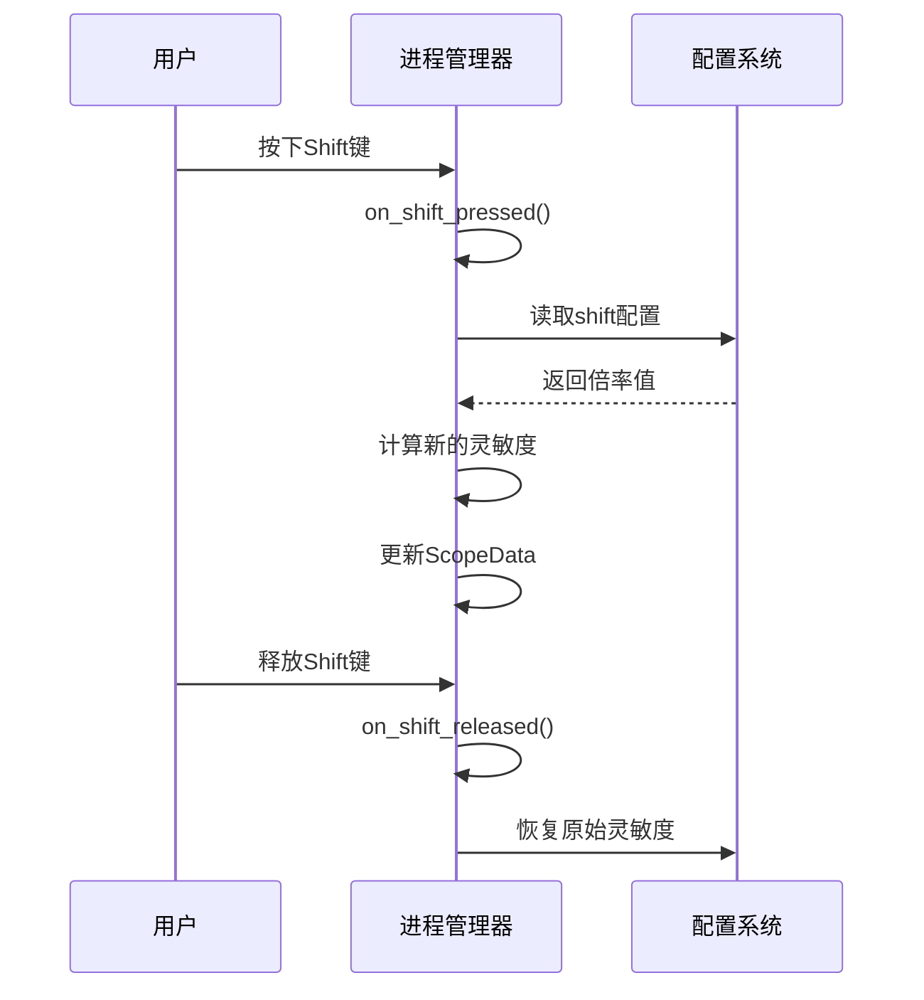
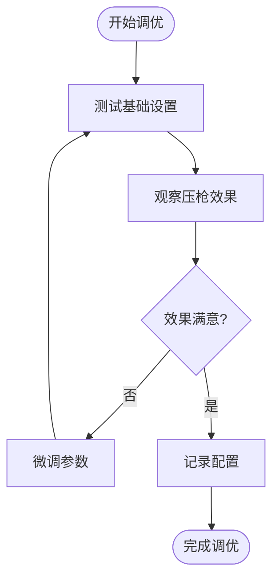
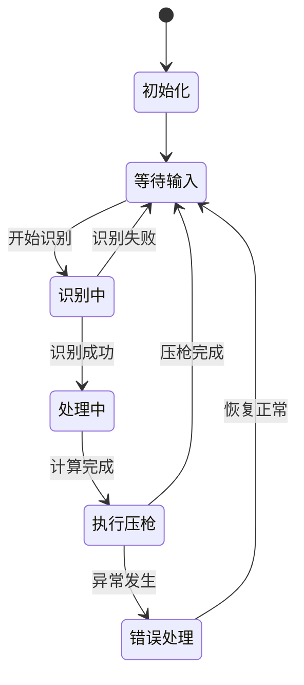

# 智能压枪控制系统

<cite>
**本文档引用的文件**
- [main.py](file://main.py)
- [process.py](file://core/process.py)
- [recognition.py](file://core/recognition.py)
- [bullet_data.py](file://data/bullet_data.py)
- [fire_data.py](file://data/fire_data.py)
- [resolution_setting.py](file://data/resolution_setting.py)
- [mouse_listener.py](file://input/mouse_listener.py)
- [ghub.py](file://core/ghub.py)
- [pubg_ui.py](file://ui/pubg_ui.py)
- [overlay_hud.py](file://ui/overlay_hud.py)
- [config.json](file://Config/config.json)
- [hud_config.json](file://Config/hud_config.json)
- [m416.json](file://_internal/GunData/m416.json)
</cite>

## 目录
1. [项目概述](#项目概述)
2. [系统架构](#系统架构)
3. [核心组件](#核心组件)
4. [压枪算法详解](#压枪算法详解)
5. [弹道数据结构](#弹道数据结构)
6. [姿态识别系统](#姿态识别系统)
7. [灵敏度调节机制](#灵敏度调节机制)
8. [配置示例与调优指南](#配置示例与调优指南)
9. [性能优化与稳定性](#性能优化与稳定性)
10. [故障排除指南](#故障排除指南)
11. [总结](#总结)

## 项目概述

智能压枪控制系统是一个基于计算机视觉和机器学习的PUBG自动识别压枪工具。该系统通过实时识别游戏界面中的枪械信息、姿态状态和倍镜配置，动态计算并执行精确的后坐力补偿控制。

### 主要特性
- **智能枪械识别**：支持多种枪械类型的自动识别和配件检测
- **姿态感知系统**：实时检测玩家站立、蹲下、趴下状态
- **自适应压枪算法**：基于弹道数据和实时状态动态调整补偿强度
- **多分辨率支持**：适配多种游戏分辨率和显示器配置
- **可视化HUD界面**：提供实时状态显示和调试信息

## 系统架构



**图表来源**
- [main.py:11-294](file://main.py#L11-L294)
- [process.py:13-405](file://core/process.py#L13-L405)

## 核心组件

### 进程管理器 (ProcessClass)

进程管理器是整个系统的核心控制器，负责协调各个组件的工作流程。



**图表来源**
- [process.py:13-405](file://core/process.py#L13-L405)
- [ghub.py:5-55](file://core/ghub.py#L5-L55)

**章节来源**
- [process.py:13-405](file://core/process.py#L13-L405)
- [ghub.py:5-55](file://core/ghub.py#L5-L55)

### 用户界面系统

用户界面采用PyQt5构建，提供直观的操作面板和状态显示。



**图表来源**
- [main.py:223-294](file://main.py#L223-L294)
- [pubg_ui.py:1-200](file://ui/pubg_ui.py#L1-L200)

**章节来源**
- [main.py:11-294](file://main.py#L11-L294)
- [pubg_ui.py:1-200](file://ui/pubg_ui.py#L1-L200)

## 压枪算法详解

### 核心算法原理

压枪算法基于以下数学模型：

```
补偿值 = 姿态系数 × (基础后坐力 × 倍镜灵敏度)
```

其中：
- **姿态系数**：站立(1.0)、蹲下(0.81)、趴下(0.55)
- **基础后坐力**：来自弹道数据的每tick补偿值
- **倍镜灵敏度**：根据当前使用的瞄准镜类型和配置确定

### v2版本算法改进

v2版本引入了更精确的弹道控制机制：



**图表来源**
- [process.py:310-362](file://core/process.py#L310-L362)

### 算法实现细节

#### v1兼容算法
```python
def calculate_the_recoil(self, recoil, posture, scope):
    """
    计算单tick补偿值
    """
    recoil_value = posture * (recoil * scope)
    return int(round(recoil_value))
```

#### v2高级算法
```python
def FIRE_v2(self, posture, scope, y_array, x_array, ticks_per_shot, tick_ms, Emit):
    """
    v2压枪核心：平滑分配每发子弹的补偿
    """
    y_remainder = 0.0
    x_remainder = 0.0
    
    for shot_idx in range(len(y_array)):
        y_total = y_array[shot_idx]
        x_total = x_array[shot_idx] if shot_idx < len(x_array) else 0.0
        
        y_per_tick = y_total / ticks_per_shot
        x_per_tick = x_total / ticks_per_shot
        
        for _ in range(ticks_per_shot):
            # 应用姿态和倍镜系数
            y_exact = posture * (y_per_tick * scope) + y_remainder
            x_exact = posture * (x_per_tick * scope) + x_remainder
            
            # 取整并累积误差
            y_move = int(round(y_exact))
            x_move = int(round(x_exact))
            
            y_remainder = y_exact - y_move
            x_remainder = x_exact - x_move
            
            # 执行鼠标移动
            self._gd.mouse_R(x_move, y_move)
            
            # 控制tick间隔
            time.sleep(self.Computation_latency(tick_ms))
```

**章节来源**
- [process.py:183-405](file://core/process.py#L183-L405)

## 弹道数据结构

### 数据格式规范

弹道数据采用JSON格式存储，支持v1和v2两种版本：

#### v1版本数据结构
```json
{
    "stand": 1.0,
    "squat": 0.81,
    "lie": 0.55,
    "guichs": [数组],
    "guichn": [数组],
    "guicvs": [数组],
    "guicvn": [数组],
    "guicns": [数组],
    "guicnn": [数组],
    "guifhs": [数组],
    "guifhn": [数组],
    "guifvs": [数组],
    "guifvn": [数组],
    "guifns": [数组],
    "guifnn": [数组],
    "guinhs": [数组],
    "guinhn": [数组],
    "guinvs": [数组],
    "guinvn": [数组],
    "guinns": [数组],
    "guinnn": [数组],
    "guicts": [数组],
    "guictn": [数组],
    "guifts": [数组],
    "guiftn": [数组],
    "guints": [数组],
    "guintn": [数组]
}
```

#### v2版本数据结构
```json
{
    "version": 2,
    "weapon": "m416",
    "rpm": 700,
    "fire_interval_ms": 85.7,
    "tick_ms": 9,
    "ticks_per_shot": 10,
    "magazine": 40,
    "semi_auto": false,
    "posture": {
        "z": 0.55,
        "c": 0.81,
        "none": 1.0
    },
    "recoil": {
        "A0B0C0": {
            "y": [每发子弹的垂直补偿],
            "x": [每发子弹的水平补偿]
        }
    }
}
```

### 枪械参数说明

| 参数 | 说明 | 默认值 |
|------|------|--------|
| weapon | 武器名称 | - |
| rpm | 射击速度(RPM) | - |
| fire_interval_ms | 射击间隔(ms) | - |
| tick_ms | 单tick间隔(ms) | - |
| ticks_per_shot | 每发子弹的tick数 | - |
| magazine | 弹夹容量 | - |
| semi_auto | 是否半自动 | false |

**章节来源**
- [bullet_data.py:1-800](file://data/bullet_data.py#L1-L800)
- [m416.json:1-200](file://_internal/GunData/m416.json#L1-L200)

## 姿态识别系统

### 识别机制

系统通过分析游戏界面中的特定区域来识别玩家姿态：



**图表来源**
- [recognition.py:364-423](file://core/recognition.py#L364-L423)

### 姿态系数配置

| 姿态 | 站立 | 蹲下 | 趴下 |
|------|------|------|------|
| 系数 | 1.0 | 0.81 | 0.55 |

### 识别准确性优化

系统提供了多种识别策略：

1. **模板匹配**：使用预训练的姿势模板进行快速识别
2. **SIFT特征匹配**：基于特征点的鲁棒性识别
3. **自适应等待**：针对第三人称视角的渲染延迟处理

**章节来源**
- [recognition.py:129-423](file://core/recognition.py#L129-L423)

## 灵敏度调节机制

### 灵敏度数据结构

```json
{
    "none": 1,      // 机瞄灵敏度
    "hongdian": 1,  // 红点灵敏度
    "quanxi": 2,    // 全息灵敏度
    "2bei": 1.7,    // 2倍镜灵敏度
    "3bei": 5.5,    // 3倍镜灵敏度
    "4bei": 11.5,   // 4倍镜灵敏度
    "6bei": 5,      // 6倍镜灵敏度
    "8bei": 5.7,    // 8倍镜灵敏度
    "15bei": 10,    // 15倍镜灵敏度
    "shift": 1.5    // Shift键倍率
}
```

### 动态灵敏度调整

系统支持Shift键的动态灵敏度调整：



**图表来源**
- [process.py:97-124](file://core/process.py#L97-L124)

### 灵敏度计算公式

```
最终灵敏度 = 基础灵敏度 × (1 + Shift倍率 × Shift状态)
```

**章节来源**
- [process.py:97-124](file://core/process.py#L97-L124)
- [config.json:1-1](file://Config/config.json#L1-L1)

## 配置示例与调优指南

### 基础配置步骤

1. **分辨率配置**
   - 在`Config/config.json`中设置正确的分辨率
   - 确保游戏窗口大小与配置一致

2. **灵敏度校准**
   - 根据个人习惯调整各倍镜的灵敏度值
   - 建议从默认值开始，逐步微调

3. **Shift键配置**
   - 设置合适的Shift倍率(建议0.5-2.0之间)
   - 测试不同倍镜下的Shift效果

### 推荐调优参数

#### 常见枪械推荐设置

| 枪械类型 | 站立姿态 | 蹲下姿态 | 趴下姿态 |
|----------|----------|----------|----------|
| 自动步枪 | 1.0 | 0.85 | 0.6 |
| 突击步枪 | 1.0 | 0.88 | 0.65 |
| 精确射手步枪 | 1.0 | 0.9 | 0.7 |
| 轻机枪 | 1.0 | 0.8 | 0.55 |

#### 灵敏度调优建议

1. **初学者设置**
   ```json
   {
       "none": 1.0,
       "hongdian": 1.0,
       "quanxi": 1.5,
       "2bei": 1.5,
       "3bei": 3.0,
       "4bei": 8.0,
       "6bei": 4.0,
       "8bei": 5.0,
       "15bei": 8.0,
       "shift": 1.0
   }
   ```

2. **进阶玩家设置**
   ```json
   {
       "none": 1.0,
       "hongdian": 0.9,
       "quanxi": 1.3,
       "2bei": 1.3,
       "3bei": 2.5,
       "4bei": 7.0,
       "6bei": 3.5,
       "8bei": 4.5,
       "15bei": 7.0,
       "shift": 1.2
   }
   ```

### 调优流程



**章节来源**
- [config.json:1-1](file://Config/config.json#L1-L1)
- [hud_config.json:1-91](file://Config/hud_config.json#L1-L91)

## 性能优化与稳定性

### 性能优化策略

1. **异步识别处理**
   - 使用asyncio进行并发图像识别
   - 减少主线程阻塞时间

2. **内存管理**
   - 及时清理图像缓存
   - 限制同时处理的图像数量

3. **算法优化**
   - 使用SIFT特征点匹配提高识别速度
   - 实现自适应阈值减少误识别

### 稳定性保障



**图表来源**
- [process.py:207-262](file://core/process.py#L207-L262)

### 错误处理机制

系统实现了多层次的错误处理：

1. **硬件检测**：检查GHub驱动状态
2. **数据验证**：验证弹道数据完整性
3. **异常恢复**：自动重启失败的识别任务

**章节来源**
- [process.py:207-405](file://core/process.py#L207-L405)
- [ghub.py:8-21](file://core/ghub.py#L8-L21)

## 故障排除指南

### 常见问题及解决方案

#### 1. 枪械识别失败
**症状**：界面显示"未检测到枪械"
**解决方法**：
- 检查分辨率配置是否正确
- 确认游戏画面清晰度
- 重新进行枪械识别

#### 2. 压枪无效
**症状**：鼠标移动但无压枪效果
**解决方法**：
- 检查开镜状态
- 验证弹道数据是否存在
- 确认Shift键状态

#### 3. 姿态识别不准
**症状**：姿态识别频繁切换
**解决方法**：
- 调整模板匹配阈值
- 检查第三视角渲染延迟
- 重新训练姿态模板

### 调试信息查看

系统提供了详细的日志输出：

```python
# 日志输出示例
"程序初始化中....."
"识别到枪械: M416"
"姿态识别: 站立"
"倍镜灵敏度: 1.0"
"开始第1次压枪"
```

**章节来源**
- [main.py:180-213](file://main.py#L180-L213)

## 总结

智能压枪控制系统通过先进的计算机视觉技术和精确的数学算法，实现了对PUBG游戏中后坐力的智能补偿。系统的主要优势包括：

1. **高精度识别**：支持多种枪械类型和配件的精确识别
2. **实时响应**：毫秒级的响应速度确保游戏体验流畅
3. **自适应调节**：根据玩家姿态和倍镜状态动态调整补偿强度
4. **用户友好**：提供直观的配置界面和可视化反馈

通过合理的配置和调优，用户可以充分发挥系统的潜力，在保证游戏公平性的前提下提升射击精度和稳定性。