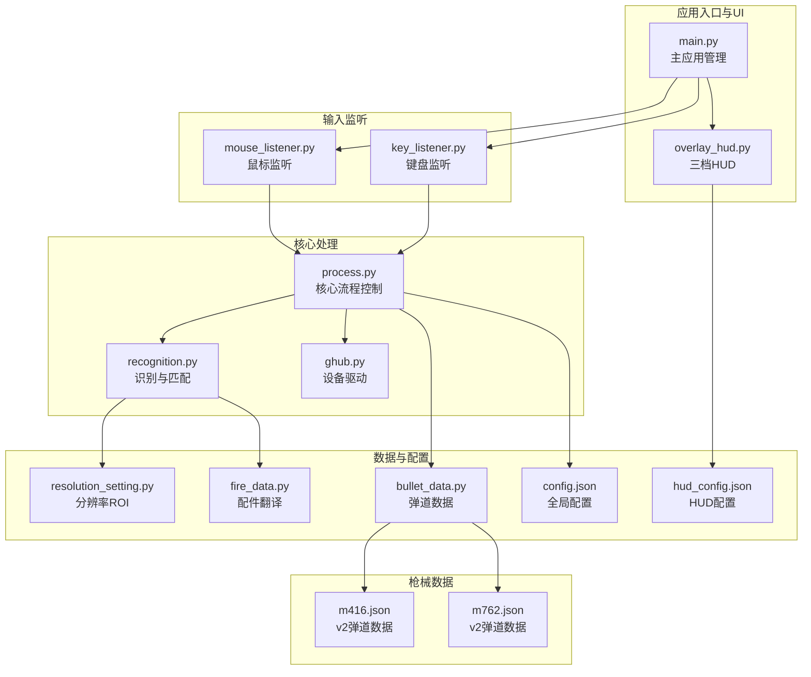
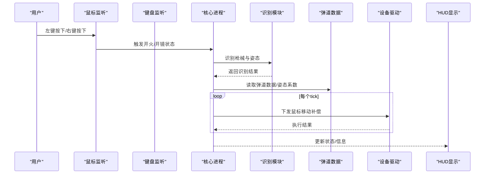
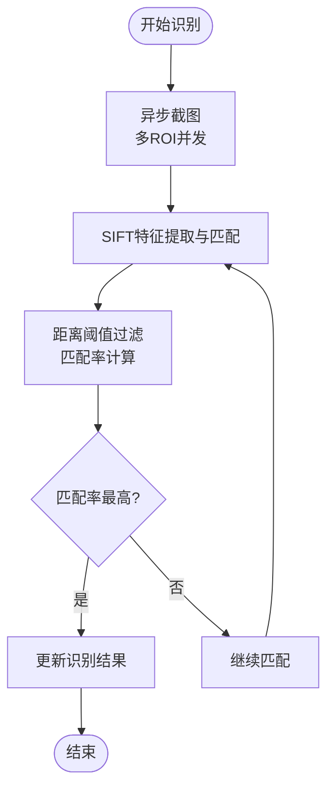
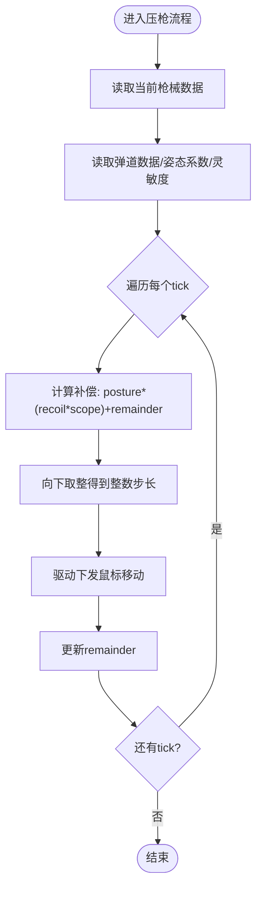
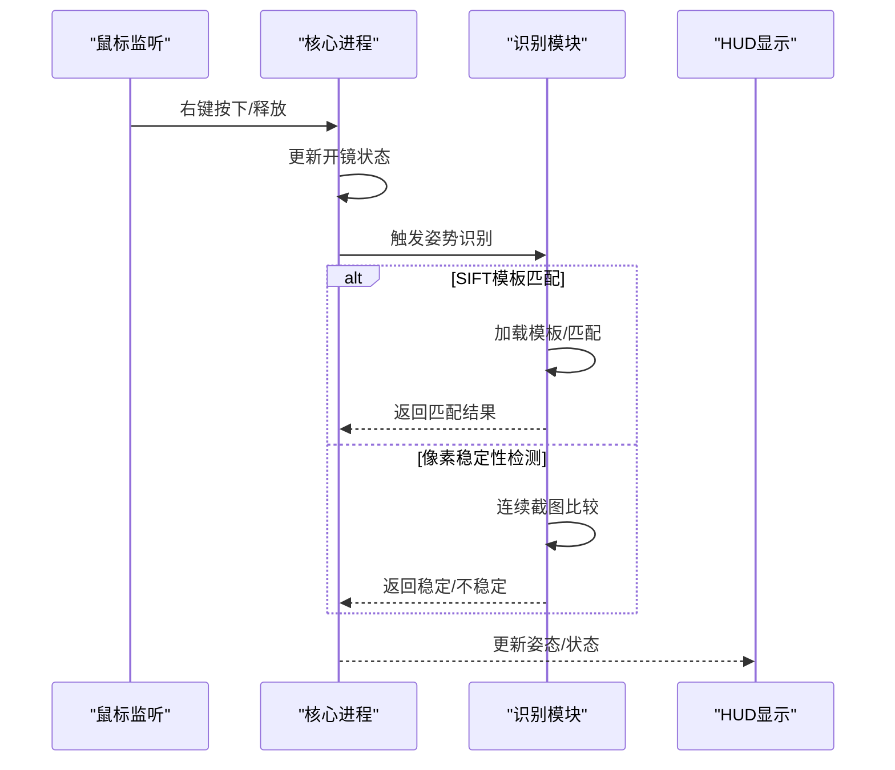
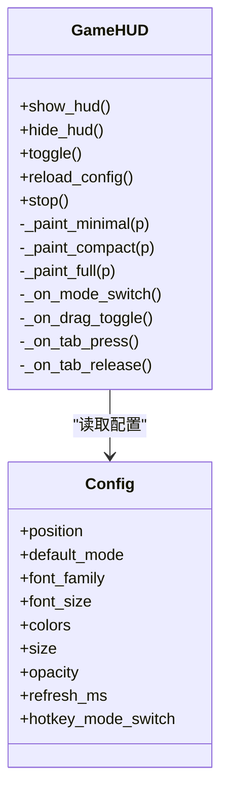
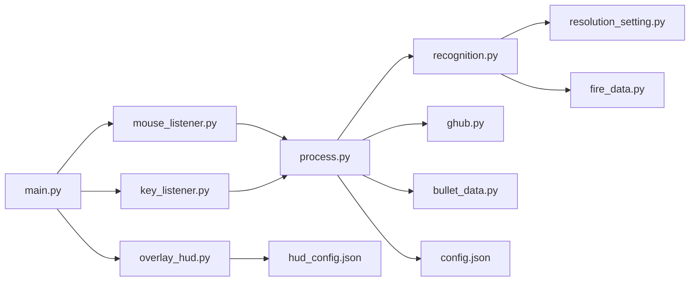

# 核心功能特性

<cite>
**本文档引用的文件**
- [main.py](file://main.py)
- [recognition.py](file://core/recognition.py)
- [process.py](file://core/process.py)
- [bullet_data.py](file://data/bullet_data.py)
- [fire_data.py](file://data/fire_data.py)
- [overlay_hud.py](file://ui/overlay_hud.py)
- [mouse_listener.py](file://input/mouse_listener.py)
- [key_listener.py](file://input/key_listener.py)
- [resolution_setting.py](file://data/resolution_setting.py)
- [ghub.py](file://core/ghub.py)
- [config.json](file://Config/config.json)
- [hud_config.json](file://Config/hud_config.json)
- [m416.json](file://_internal/GunData/m416.json)
- [m762.json](file://_internal/GunData/m762.json)
</cite>

## 目录
1. [简介](#简介)
2. [项目结构](#项目结构)
3. [核心组件](#核心组件)
4. [架构总览](#架构总览)
5. [详细组件分析](#详细组件分析)
6. [依赖关系分析](#依赖关系分析)
7. [性能考虑](#性能考虑)
8. [故障排除指南](#故障排除指南)
9. [结论](#结论)
10. [附录](#附录)

## 简介
本项目是一个面向PUBG的自动识别与压枪辅助工具，核心目标是通过计算机视觉与弹道数据驱动，实现枪械识别、姿态识别、开火状态检测，并基于v2弹道格式提供高精度、低锯齿的压枪补偿。系统采用SIFT特征匹配进行枪械与配件识别，支持多分辨率适配；通过鼠标/键盘监听触发压枪流程；内置三档游戏内HUD显示系统，提供极简、紧凑、完整三种模式，便于不同场景下的信息展示与交互。

## 项目结构
项目采用模块化设计，主要分为以下层次：
- 应用入口与UI层：主窗口、按钮事件、日志输出、分辨率/灵敏度配置
- 输入监听层：鼠标与键盘事件监听，触发识别与压枪
- 核心处理层：识别与压枪算法、弹道数据读取、设备驱动封装
- 数据与配置层：弹道数据、配件翻译、分辨率ROI、HUD配置
- UI显示层：三档HUD悬浮窗，支持拖拽、热键切换与配置持久化

**图表来源**
- [main.py:11-294](file://main.py#L11-L294)
- [overlay_hud.py:229-698](file://ui/overlay_hud.py#L229-L698)
- [mouse_listener.py:13-64](file://input/mouse_listener.py#L13-L64)
- [key_listener.py:6-70](file://input/key_listener.py#L6-L70)
- [process.py:13-405](file://core/process.py#L13-L405)
- [recognition.py:1-478](file://core/recognition.py#L1-L478)
- [resolution_setting.py:1-147](file://data/resolution_setting.py#L1-L147)
- [fire_data.py:1-83](file://data/fire_data.py#L1-L83)
- [bullet_data.py:1-800](file://data/bullet_data.py#L1-L800)
- [config.json:1-1](file://Config/config.json#L1-L1)
- [hud_config.json:1-91](file://Config/hud_config.json#L1-L91)
- [m416.json:1-200](file://_internal/GunData/m416.json#L1-L200)
- [m762.json:1-200](file://_internal/GunData/m762.json#L1-L200)

**章节来源**
- [main.py:1-294](file://main.py#L1-L294)
- [overlay_hud.py:1-698](file://ui/overlay_hud.py#L1-L698)
- [mouse_listener.py:1-64](file://input/mouse_listener.py#L1-L64)
- [key_listener.py:1-70](file://input/key_listener.py#L1-L70)
- [process.py:1-405](file://core/process.py#L1-L405)
- [recognition.py:1-478](file://core/recognition.py#L1-L478)
- [resolution_setting.py:1-147](file://data/resolution_setting.py#L1-L147)
- [fire_data.py:1-83](file://data/fire_data.py#L1-L83)
- [bullet_data.py:1-800](file://data/bullet_data.py#L1-L800)
- [config.json:1-1](file://Config/config.json#L1-L1)
- [hud_config.json:1-91](file://Config/hud_config.json#L1-L91)
- [m416.json:1-200](file://_internal/GunData/m416.json#L1-L200)
- [m762.json:1-200](file://_internal/GunData/m762.json#L1-L200)

## 核心组件
- SIFT枪械识别与模板库管理：基于OpenCV SIFT特征匹配，结合多分辨率ROI区域，实现枪械与配件的高精度识别；支持模板库动态加载与阈值匹配。
- 智能压枪系统：v2弹道格式支持每发子弹的垂直/水平补偿平滑展开，消除锯齿；结合姿态系数、倍镜灵敏度与Shift倍率补偿，实现精准压枪。
- 开火状态检测与姿势识别：通过右键长按/点击检测、像素取色判定开镜状态；支持姿势区域截图与模板匹配，提升识别稳定性。
- 三档HUD显示系统：极简/紧凑/完整三档模式，支持热键切换、拖拽定位、透明背景与颜色配置，兼顾信息密度与可读性。

**章节来源**
- [recognition.py:38-100](file://core/recognition.py#L38-L100)
- [process.py:183-362](file://core/process.py#L183-L362)
- [overlay_hud.py:188-631](file://ui/overlay_hud.py#L188-L631)

## 架构总览
系统采用“监听触发-识别-压枪-显示”的流水线架构。鼠标/键盘事件作为触发源，核心进程根据当前状态读取弹道数据，计算补偿值并通过GHUB驱动下发鼠标移动，同时HUD实时反馈状态。

**图表来源**
- [mouse_listener.py:23-50](file://input/mouse_listener.py#L23-L50)
- [key_listener.py:14-56](file://input/key_listener.py#L14-L56)
- [process.py:207-261](file://core/process.py#L207-L261)
- [recognition.py:467-477](file://core/recognition.py#L467-L477)
- [ghub.py:32-51](file://core/ghub.py#L32-L51)
- [overlay_hud.py:390-631](file://ui/overlay_hud.py#L390-L631)

## 详细组件分析

### SIFT枪械识别与模板库管理
- 特征匹配算法
  - 使用SIFT提取关键点与描述符，通过FlannBasedMatcher进行knn匹配，采用距离阈值过滤有效匹配点，计算匹配率作为识别依据。
  - 支持异步并发截图与匹配，减少整体识别耗时。
- 模板库管理
  - 识别区域按分辨率配置划分，分别对枪名、瞄具、枪口、握把、枪托进行独立ROI截图与匹配。
  - 支持v1/v2弹道数据格式，v2通过A/B/C编码组合配件，生成对应的弹道键值。
- 跨分辨率适配机制
  - 通过RESOLUTION_SETTINGS与GUNS_REOLUTION_SETTINGS定义各分辨率下的ROI坐标与全屏截图区域，保证在不同分辨率下均能正确截取目标区域。

**图表来源**
- [recognition.py:10-100](file://core/recognition.py#L10-L100)
- [resolution_setting.py:2-121](file://data/resolution_setting.py#L2-L121)

**章节来源**
- [recognition.py:38-100](file://core/recognition.py#L38-L100)
- [resolution_setting.py:2-121](file://data/resolution_setting.py#L2-L121)
- [fire_data.py:54-82](file://data/fire_data.py#L54-L82)

### 智能压枪系统计算逻辑
- v2弹道格式
  - 弹道数据包含每发子弹的垂直补偿数组与可选水平补偿数组，系统在每个tick内将单发总量均匀分配，消除锯齿并保持总位移精度。
  - 通过remainder累加与取整，确保亚像素精度的补偿累计。
- v1兼容路径
  - 采用逐tick累加的方式，按recoil*scope*posture合成补偿值。
- 姿态系数与灵敏度补偿
  - 姿态系数来自弹道JSON的posture字段，不同姿态对后坐力表现有缩放作用。
  - 灵敏度倍率来自ScopeData，支持Shift键长按倍率叠加，提升不同瞄具下的补偿一致性。
- 设备驱动下发
  - 通过GHUB驱动的mouse_R接口下发鼠标移动，实现无延迟的压枪补偿。

**图表来源**
- [process.py:286-362](file://core/process.py#L286-L362)
- [process.py:368-404](file://core/process.py#L368-L404)
- [ghub.py:32-33](file://core/ghub.py#L32-L33)

**章节来源**
- [process.py:183-362](file://core/process.py#L183-L362)
- [process.py:368-404](file://core/process.py#L368-L404)
- [ghub.py:1-55](file://core/ghub.py#L1-L55)
- [m416.json:1-200](file://_internal/GunData/m416.json#L1-L200)
- [m762.json:1-200](file://_internal/GunData/m762.json#L1-L200)

### 开火状态检测与姿势识别
- 开火状态检测
  - 右键长按模式：按下时设置开镜状态，释放时清空；点击模式：按下时检测开镜像素区域，用于判断是否处于开镜状态。
  - 左键按下时触发压枪流程，结合当前开镜状态决定是否执行。
- 姿势识别
  - 提供两种策略：SIFT模板匹配与像素稳定性检测。
  - SIFT模板匹配：加载姿势模板，与截图进行SIFT相似度比较，达到阈值即视为匹配成功。
  - 像素稳定性检测：通过连续截图比较相似度，达到阈值认为姿势稳定；若失败，回退至固定延迟策略。
  - 第三人称模式下，增加等待与稳定检测，提升识别准确性。

**图表来源**
- [mouse_listener.py:30-44](file://input/mouse_listener.py#L30-L44)
- [recognition.py:364-423](file://core/recognition.py#L364-L423)
- [overlay_hud.py:401-457](file://ui/overlay_hud.py#L401-L457)

**章节来源**
- [mouse_listener.py:23-50](file://input/mouse_listener.py#L23-L50)
- [recognition.py:129-210](file://core/recognition.py#L129-L210)
- [recognition.py:251-361](file://core/recognition.py#L251-L361)
- [overlay_hud.py:315-352](file://ui/overlay_hud.py#L315-L352)

### 三档游戏内HUD显示系统
- 模式设计
  - 极简：仅显示当前武器、瞄具、姿态与状态指示灯，适合追求最小遮挡的用户。
  - 紧凑：显示武器槽位、配件详情、开镜状态与开火状态，平衡信息密度与可读性。
  - 完整：显示双槽位信息、姿态/开镜/视角状态、状态指示与提示文字，适合需要全面信息的用户。
- 交互与配置
  - 支持Tab临时隐藏/恢复、F9循环切换模式、F10切换拖拽模式。
  - 支持位置锚点、尺寸、字体、颜色、刷新频率与透明度配置，配置文件为hud_config.json。
  - 拖拽模式下解除鼠标穿透，释放后自动保存位置。

**图表来源**
- [overlay_hud.py:229-698](file://ui/overlay_hud.py#L229-L698)
- [hud_config.json:1-91](file://Config/hud_config.json#L1-L91)

**章节来源**
- [overlay_hud.py:188-631](file://ui/overlay_hud.py#L188-L631)
- [hud_config.json:1-91](file://Config/hud_config.json#L1-L91)

### 主应用管理与事件绑定
- 主应用管理类负责UI初始化、按钮事件绑定、日志输出、分辨率与灵敏度配置保存。
- 通过线程启动鼠标/键盘监听，接收事件后更新状态并触发识别或压枪流程。
- HUD随程序运行周期显示/隐藏，支持暂停/继续与退出清理。

**章节来源**
- [main.py:11-294](file://main.py#L11-L294)
- [mouse_listener.py:52-64](file://input/mouse_listener.py#L52-L64)
- [key_listener.py:58-70](file://input/key_listener.py#L58-L70)

## 依赖关系分析
- 模块耦合
  - 主应用与UI层通过信号连接，解耦事件处理与界面更新。
  - 核心进程与识别模块通过异步接口通信，避免阻塞主线程。
  - HUD与配置文件松耦合，通过配置加载与热键切换实现动态更新。
- 外部依赖
  - OpenCV用于SIFT特征与图像处理；PyQt5用于UI与绘图；pynput用于输入监听；ctypes用于调用本地DLL。
- 潜在风险
  - DLL驱动缺失或权限不足会影响鼠标/键盘下发；分辨率配置不匹配会导致ROI截取异常；Shift倍率配置不当可能造成补偿过度。

**图表来源**
- [main.py:1-294](file://main.py#L1-L294)
- [mouse_listener.py:1-64](file://input/mouse_listener.py#L1-L64)
- [key_listener.py:1-70](file://input/key_listener.py#L1-L70)
- [overlay_hud.py:1-698](file://ui/overlay_hud.py#L1-L698)
- [process.py:1-405](file://core/process.py#L1-L405)
- [recognition.py:1-478](file://core/recognition.py#L1-L478)
- [ghub.py:1-55](file://core/ghub.py#L1-L55)
- [resolution_setting.py:1-147](file://data/resolution_setting.py#L1-L147)
- [fire_data.py:1-83](file://data/fire_data.py#L1-L83)
- [bullet_data.py:1-800](file://data/bullet_data.py#L1-L800)
- [config.json:1-1](file://Config/config.json#L1-L1)
- [hud_config.json:1-91](file://Config/hud_config.json#L1-L91)

**章节来源**
- [main.py:1-294](file://main.py#L1-L294)
- [process.py:1-405](file://core/process.py#L1-L405)

## 性能考虑
- 异步并发：识别阶段采用异步任务并发截图与匹配，显著降低端到端耗时。
- 匹配阈值：SIFT匹配使用距离阈值过滤无效点，提高匹配效率与稳定性。
- 姿态识别策略：优先模板匹配，失败时回退像素稳定性检测，兼顾速度与准确率。
- HUD刷新：支持刷新频率配置，默认250ms，可根据显示器刷新率调整以平衡流畅度与资源占用。

[本节为通用指导，无需特定文件引用]

## 故障排除指南
- 驱动相关
  - 症状：无法下发鼠标移动
  - 排查：检查GHUB驱动是否安装、DLL是否存在、权限是否足够
  - 参考：[ghub.py:8-21](file://core/ghub.py#L8-L21)
- 分辨率不匹配
  - 症状：识别区域偏移或空白
  - 排查：确认config.json中的resolution与实际分辨率一致；核对RESOLUTION_SETTINGS与GUNS_REOLUTION_SETTINGS
  - 参考：[config.json:1-1](file://Config/config.json#L1-L1)、[resolution_setting.py:2-121](file://data/resolution_setting.py#L2-L121)
- Shift倍率异常
  - 症状：压枪过度或不足
  - 排查：检查config.json中shift键倍率配置；确认Shift按键事件是否被正确触发
  - 参考：[process.py:97-124](file://core/process.py#L97-L124)、[key_listener.py:42-56](file://input/key_listener.py#L42-L56)
- HUD不可拖拽/颜色异常
  - 症状：无法拖拽或颜色不生效
  - 排查：检查hud_config.json配置项；确认F10拖拽模式切换；验证颜色RGBA值范围
  - 参考：[overlay_hud.py:342-352](file://ui/overlay_hud.py#L342-L352)、[hud_config.json:18-87](file://Config/hud_config.json#L18-L87)

**章节来源**
- [ghub.py:8-21](file://core/ghub.py#L8-L21)
- [config.json:1-1](file://Config/config.json#L1-L1)
- [resolution_setting.py:2-121](file://data/resolution_setting.py#L2-L121)
- [process.py:97-124](file://core/process.py#L97-L124)
- [key_listener.py:42-56](file://input/key_listener.py#L42-L56)
- [overlay_hud.py:342-352](file://ui/overlay_hud.py#L342-L352)
- [hud_config.json:18-87](file://Config/hud_config.json#L18-L87)

## 结论
本工具通过SIFT特征匹配与v2弹道格式，实现了高精度的枪械识别与压枪补偿；结合多分辨率适配、Shift倍率补偿与三档HUD显示，满足不同用户的使用需求。建议在使用前完成分辨率与灵敏度配置校准，并根据个人习惯调整HUD样式与刷新频率，以获得最佳体验。

[本节为总结性内容，无需特定文件引用]

## 附录
- 使用示例与配置说明
  - 枪械识别：按Tab键触发识别，系统自动更新UI与日志；可在config.json中设置默认分辨率
  - 压枪补偿：左键持续按下触发压枪，系统根据当前姿态、瞄具与Shift倍率计算补偿
  - HUD显示：F9循环切换模式，F10切换拖拽模式，支持自定义颜色与尺寸
  - 参考文件：[main.py:223-294](file://main.py#L223-L294)、[overlay_hud.py:328-352](file://ui/overlay_hud.py#L328-L352)、[config.json:1-1](file://Config/config.json#L1-L1)、[hud_config.json:1-91](file://Config/hud_config.json#L1-L91)

**章节来源**
- [main.py:223-294](file://main.py#L223-L294)
- [overlay_hud.py:328-352](file://ui/overlay_hud.py#L328-L352)
- [config.json:1-1](file://Config/config.json#L1-L1)
- [hud_config.json:1-91](file://Config/hud_config.json#L1-L91)