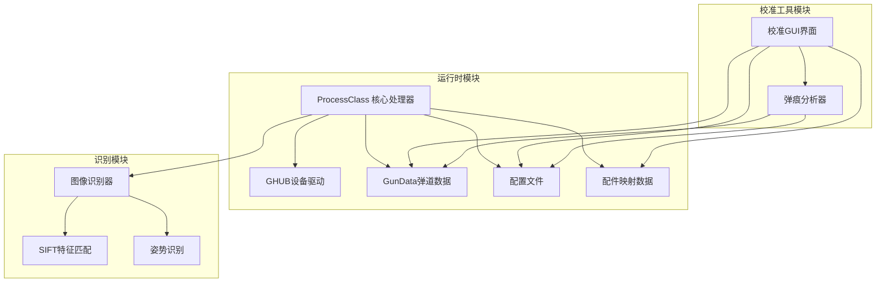
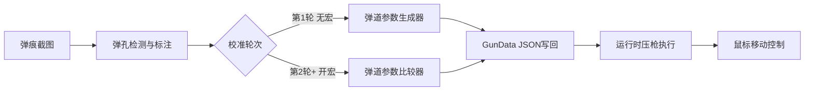

# 项目介绍

<cite>
**本文档引用的文件**
- [README.md](file://README.md)
- [main.py](file://main.py)
- [main_new.py](file://main_new.py)
- [core/process.py](file://core/process.py)
- [core/recognition.py](file://core/recognition.py)
- [core/ghub.py](file://core/ghub.py)
- [data/fire_data.py](file://data/fire_data.py)
- [data/bullet_data.py](file://data/bullet_data.py)
- [requirements.txt](file://requirements.txt)
- [Config/config.json](file://Config/config.json)
- [docs/SDD-Architecture.md](file://docs/SDD-Architecture.md)
- [todo/PUBG宏识别工具技术增强建议.md](file://todo/PUBG宏识别工具技术增强建议.md)
- [todo/PUBG宏识别工具新功能建议.md](file://todo/PUBG宏识别工具新功能建议.md)
</cite>

## 目录
1. [项目概述](#项目概述)
2. [核心功能特性](#核心功能特性)
3. [技术创新点](#技术创新点)
4. [技术架构](#技术架构)
5. [项目发展历程](#项目发展历程)
6. [适用场景与用户群体](#适用场景与用户群体)
7. [学习交流价值](#学习交流价值)
8. [未来发展展望](#未来发展展望)

## 项目概述

PUBG自动识别压枪工具是一个基于计算机视觉和人工智能技术的开源项目，专为《绝地求生》(PUBG)游戏设计。该项目的核心目标是通过先进的图像识别技术和智能算法，帮助玩家提升游戏体验，实现精准的自动压枪功能。

该项目采用纯Python开发，利用OpenCV SIFT算法实现跨分辨率的枪械识别，无需为每种分辨率单独制作模板。项目不仅具备强大的技术实力，更重要的是体现了开源共享的精神，为游戏爱好者和开发者提供了宝贵的学习资源。

## 核心功能特性

### SIFT枪械识别
项目实现了基于OpenCV SIFT算法的跨分辨率枪械识别系统。该系统能够自动识别枪械名称、倍镜、枪口、握把、枪托等配件信息，支持多种分辨率环境下的稳定识别。

### 智能压枪系统
基于弹道数据和配件组合，系统能够根据玩家的姿势系数和灵敏度自动计算后坐力补偿。支持全自动和半自动枪械的不同压枪模式，提供精确的鼠标移动控制。

### 开火状态检测
通过像素取色技术判断玩家是否处于开镜状态，实现自动启停压枪功能，确保在正确时机提供后坐力补偿。

### 姿势识别
采用图标识别和键盘追踪双重策略，准确识别玩家的站立、蹲下、趴下等不同姿态，为压枪计算提供准确的姿态系数。

### 三档游戏内HUD
提供Tab循环切换的三档HUD显示模式，包括极简、紧凑、完整和隐藏模式，满足不同玩家的显示偏好。

### 弹痕校准工具
集成了完整的弹痕检测、排序、对比和可视化工具，支持GUI、CLI和游戏内HUD三种模式，提供交互式标注修正功能。

**章节来源**
- [README.md: 7-15:7-15](file://README.md#L7-L15)
- [README.md: 135-144:135-144](file://README.md#L135-L144)

## 技术创新点

### 基于OpenCV SIFT算法的跨分辨率识别
项目最大的技术突破在于采用了OpenCV的SIFT算法，实现了真正的跨分辨率识别。传统的图像识别方法需要为每种分辨率单独制作模板，而SIFT算法通过特征点检测和匹配，能够在不同分辨率下保持稳定的识别效果。

### 多层识别优化策略
系统实现了多层次的识别优化策略，包括：
- **参数调优**：优化SIFT算法参数配置，平衡识别精度和速度
- **特征点筛选**：智能筛选有效的特征点，减少无效计算
- **ROI区域优化**：动态调整感兴趣区域，提高处理效率
- **并行计算**：利用多核CPU并行处理，提升识别速度

### 自适应压枪算法
项目实现了自适应压枪系统，能够根据实际游戏反馈动态调整压枪参数。通过机器学习和模糊逻辑控制，系统能够学习用户的操作习惯，提供个性化的压枪补偿。

### 混合识别策略
结合多种识别算法，根据场景自动选择最优算法。支持SIFT特征匹配、模板匹配和级联分类器等多种识别模式，用户可根据设备性能选择合适的识别精度等级。

**章节来源**
- [todo/PUBG宏识别工具技术增强建议.md: 7-26:7-26](file://todo/PUBG宏识别工具技术增强建议.md#L7-L26)
- [todo/PUBG宏识别工具技术增强建议.md: 122-169:122-169](file://todo/PUBG宏识别工具技术增强建议.md#L122-L169)

## 技术架构

### 整体架构设计
项目采用模块化设计，主要分为三个核心模块：

1. **校准与分析模块**：负责从弹痕截图提取弹孔坐标，生成或修正GunData中的弹道数组
2. **运行时模块**：在识别到枪械、倍镜、姿势后，按固定时间步长读取弹道数组并驱动鼠标下移
3. **配置与数据模块**：提供分辨率与灵敏度倍率配置，以及配件映射数据

### 核心组件关系

**图表来源**
- [docs/SDD-Architecture.md: 19-40:19-40](file://docs/SDD-Architecture.md#L19-L40)

### 数据流架构

**图表来源**
- [docs/SDD-Architecture.md: 52-61:52-61](file://docs/SDD-Architecture.md#L52-L61)

**章节来源**
- [docs/SDD-Architecture.md: 1-129:1-129](file://docs/SDD-Architecture.md#L1-L129)

## 项目发展历程

### 技术演进路线
项目经历了从基础识别到智能化压枪的发展历程：

**初期阶段**：实现了基础的SIFT图像识别功能，能够识别枪械和配件信息
**中期阶段**：开发了完整的压枪算法，支持多种枪械和配件组合
**现阶段**：集成了弹痕校准工具，实现了从识别到压枪的完整闭环

### 版本特性发展
项目在不同版本中不断优化和增强功能：

- **版本1.x**：基础识别功能，支持主要枪械类型
- **版本2.x**：引入自适应压枪算法，支持多因素模型
- **版本3.x**：集成高级校准工具，支持多轮迭代优化

### 功能完善历程
项目功能从单一的识别功能逐步扩展到完整的压枪解决方案：

1. **识别功能**：枪械和配件识别
2. **压枪功能**：基础后坐力补偿
3. **校准功能**：弹痕检测和参数修正
4. **优化功能**：性能优化和用户体验提升

**章节来源**
- [todo/PUBG宏识别工具技术增强建议.md: 120-345:120-345](file://todo/PUBG宏识别工具技术增强建议.md#L120-L345)

## 适用场景与用户群体

### 目标用户群体
项目主要面向以下用户群体：

**游戏爱好者**：希望提升PUBG游戏体验，追求更高射击精度的玩家
**竞技选手**：参加PUBG比赛的专业选手，需要精确的压枪控制
**技术学习者**：对计算机视觉、图像识别技术感兴趣的开发者
**游戏优化师**：为游戏提供技术优化方案的专业人士

### 适用应用场景
项目适用于多种游戏场景：

**休闲娱乐**：普通玩家提升射击技巧，享受更好的游戏体验
**竞技比赛**：专业选手进行训练和比赛，提高竞技水平
**技术研究**：研究人员探索计算机视觉在游戏中的应用
**教育培训**：游戏相关专业的教学和实践项目

### 技术要求
项目对用户的技术水平要求相对较低，但仍需要一定的技术基础：

- 基础的计算机操作能力
- 对PUBG游戏的基本了解
- 能够按照教程进行配置和使用

**章节来源**
- [README.md: 16-20:16-20](file://README.md#L16-L20)

## 学习交流价值

### 技术学习价值
项目具有很高的技术学习价值：

**计算机视觉技术**：展示了OpenCV SIFT算法的实际应用，包括特征点检测、匹配和识别
**图像处理技术**：演示了图像预处理、ROI提取、模板匹配等关键技术
**机器学习应用**：体现了机器学习在游戏辅助中的实际应用
**软件架构设计**：展示了模块化设计和组件化开发的最佳实践

### 开源共享精神
项目体现了开源软件的共享精神：

- **完全开源**：所有代码公开，欢迎社区贡献
- **学习导向**：专注于教育和学习价值，而非商业利益
- **社区建设**：鼓励用户交流经验和改进建议
- **知识传播**：通过文档和示例代码传播技术知识

### 实践应用价值
项目为相关领域的实践应用提供了参考：

**算法优化**：展示了SIFT算法的优化策略和性能提升方法
**系统设计**：体现了大型项目的模块化设计和架构规划
**工具开发**：提供了完整的工具开发流程和实践经验
**质量保证**：展示了代码质量控制和测试验证的方法

**章节来源**
- [README.md: 3](file://README.md#L3)

## 未来发展展望

### 技术发展方向
项目在未来将继续在以下几个方面进行技术升级：

**算法优化**：进一步优化SIFT算法性能，提升识别精度和速度
**智能化程度**：增强系统的自适应能力和学习能力
**多平台支持**：扩展支持更多的游戏和平台
**用户体验**：持续改善用户界面和交互体验

### 功能扩展计划
项目计划逐步添加更多实用功能：

**AI辅助系统**：集成人工智能技术，提供更智能的游戏辅助
**社区功能**：建立用户社区，促进经验分享和技术交流
**云端服务**：提供云端配置同步和数据分析服务
**移动端支持**：开发移动应用，实现多设备协同工作

### 生态建设规划
项目将致力于构建完整的生态系统：

**开发者社区**：建立活跃的开发者社区，推动技术创新
**教育资源**：提供丰富的学习资源和培训课程
**合作伙伴**：与游戏公司、培训机构等建立合作关系
**标准制定**：参与相关技术标准的制定和推广

### 技术挑战与机遇
项目面临的主要挑战包括：

**技术挑战**：算法优化、性能提升、兼容性保证等技术难题
**市场挑战**：与其他同类产品的竞争，用户需求的变化
**合规挑战**：遵守游戏规则和法律法规的要求
**可持续发展**：保持项目的长期发展和持续创新

通过持续的技术创新和社区建设，PUBG自动识别压枪工具项目将继续为游戏爱好者和开发者提供有价值的技术解决方案，推动相关技术的发展和应用。

**章节来源**
- [todo/PUBG宏识别工具新功能建议.md: 1-206:1-206](file://todo/PUBG宏识别工具新功能建议.md#L1-L206)