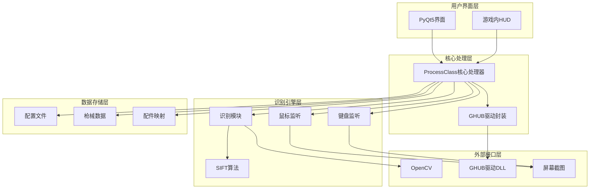
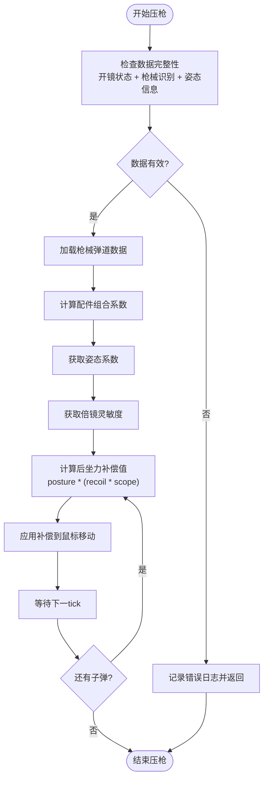
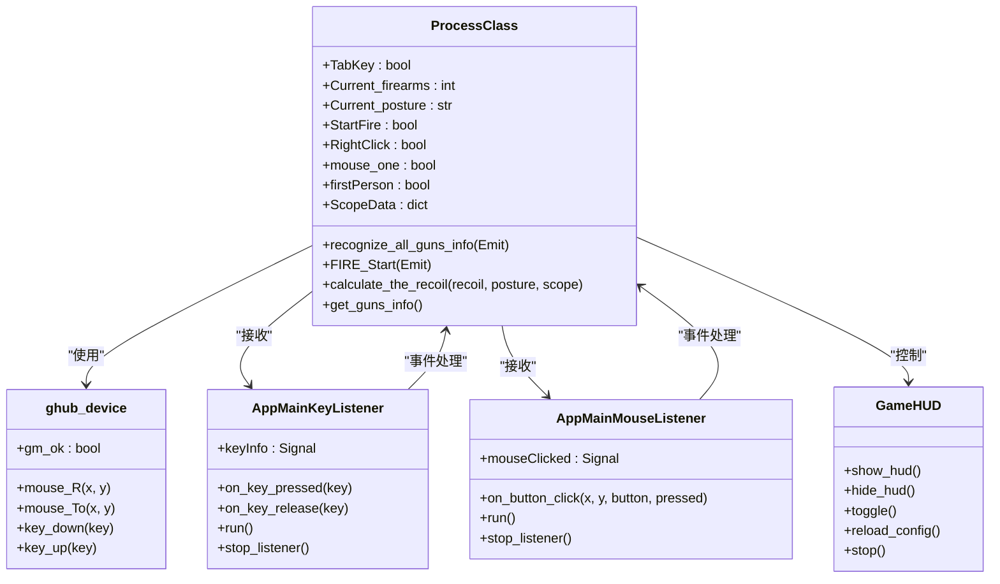
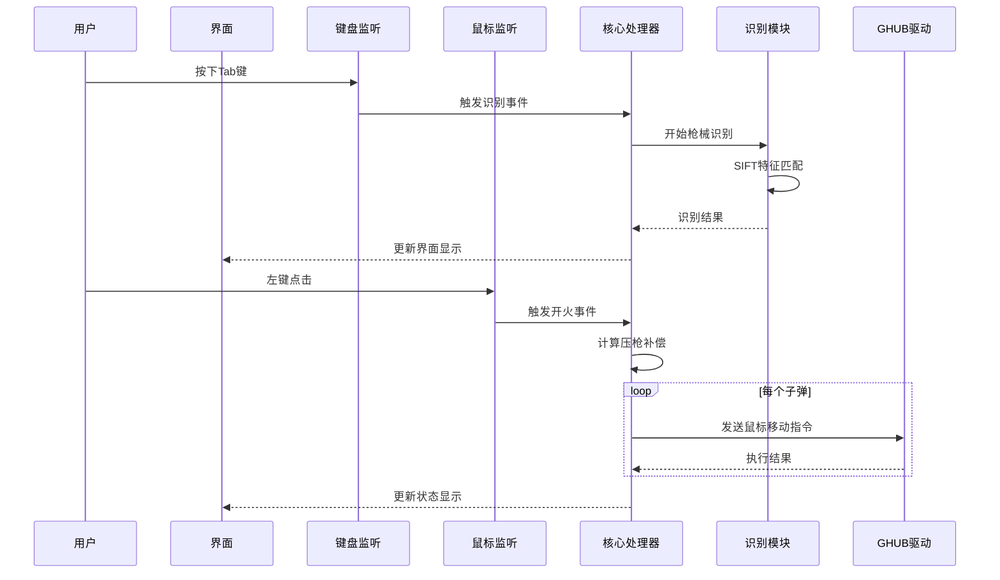

# 项目概述

## 项目简介

PUBG自动识别压枪工具是一个基于Python开发的PUBG游戏辅助工具，旨在通过计算机视觉技术和智能算法实现枪械自动识别和智能压枪功能。该项目利用OpenCV SIFT算法实现枪械与配件的精准识别，结合弹道数据和姿态系数，为玩家提供自动化的后坐力补偿解决方案。

## 核心目标

本项目的核心目标是：
- **自动化枪械识别**：通过OpenCV SIFT算法实现枪械、倍镜、枪口、握把、枪托的自动识别
- **智能压枪系统**：基于弹道数据、姿态系数和灵敏度自动计算后坐力补偿
- **游戏体验优化**：减少手动调节时间，提升射击精度和游戏体验
- **学习交流平台**：为游戏爱好者提供技术学习和交流的实践平台

## 主要功能特性

### 1. SIFT枪械识别系统
- **多分辨率适配**：支持3840x2160、2560x1440、1920x1080等多种分辨率
- **实时图像处理**：使用OpenCV SIFT算法进行特征点匹配和识别
- **配件组合识别**：自动识别枪械的倍镜、枪口、握把、枪托等配件组合

### 2. 智能压枪系统
- **弹道数据驱动**：基于详细的弹道数据进行精确计算
- **姿态系数融合**：考虑站立、蹲下、趴下等不同姿态的影响
- **灵敏度自适应**：根据倍镜类型和玩家设置动态调整补偿强度

### 3. 开火状态检测
- **像素取色识别**：通过屏幕像素颜色变化判断是否处于开镜状态
- **自动启停控制**：开镜时自动启用压枪，离开开镜状态时自动停止

### 4. 姿势识别系统
- **图标识别**：通过屏幕特定区域的图标变化识别玩家姿态
- **键盘追踪**：结合键盘事件进行双重验证
- **模板匹配**：支持自定义姿势模板，提高识别准确性

### 5. 三档游戏内HUD
- **极简模式**：仅显示核心信息，最小化遮挡
- **紧凑模式**：显示武器信息和配件详情
- **完整模式**：显示所有相关信息和状态指示

### 6. 弹痕校准工具
- **GUI模式**：图形用户界面，支持交互式标注修正
- **CLI模式**：命令行界面，快捷键F5/F6/F7操作
- **HUD模式**：游戏内悬浮窗，边打边校准

## 技术架构概览

**图表来源**
- [main.py:11-294](file://main.py#L11-L294)
- [core/process.py:13-405](file://core/process.py#L13-L405)
- [core/recognition.py:1-478](file://core/recognition.py#L1-L478)

## 技术亮点

### 1. OpenCV SIFT算法应用
项目采用OpenCV的SIFT（Scale-Invariant Feature Transform）算法实现高精度的图像特征匹配：
- **特征点检测**：自动检测图像中的关键特征点
- **描述符计算**：为每个特征点生成不变性描述符
- **匹配算法**：使用FlannBasedMatcher进行快速匹配
- **阈值过滤**：通过距离阈值筛选高质量匹配点

### 2. 多线程异步处理
- **识别线程**：独立处理图像识别任务，避免阻塞主线程
- **压枪线程**：实时处理鼠标移动指令
- **监听线程**：持续监控键盘和鼠标事件
- **异步IO**：使用asyncio优化图像处理性能

### 3. 智能压枪算法

**图表来源**
- [core/process.py:183-405](file://core/process.py#L183-L405)

### 4. 分辨率适配机制
项目实现了完善的多分辨率适配系统：
- **动态ROI配置**：根据不同分辨率自动调整截图区域
- **坐标映射**：将屏幕坐标转换为统一的内部坐标系统
- **模板匹配**：支持不同分辨率下的模板匹配

## 项目声明与使用注意事项

### 项目声明
本项目仅供学习交流使用，用于其他用途与本人无关。如使用了本项目源码请标明出处。

### 使用注意事项
- **环境要求**：Python ≥ 3.8，Windows 10/11，需要安装Logitech GHUB驱动
- **依赖安装**：`pip install -r requirements.txt`
- **驱动要求**：需要正确安装GHUB/LGS驱动才能正常使用鼠标控制功能
- **游戏兼容性**：主要针对PUBG游戏设计，其他游戏可能需要调整配置

## 应用场景与价值

### 游戏体验改善
- **精度提升**：自动化的后坐力补偿显著提升射击精度
- **学习效率**：帮助新手玩家快速掌握各种枪械的后坐力规律
- **时间节省**：减少手动调节和测试的时间成本

### 学习交流意义
- **技术学习**：为计算机视觉、图像处理、游戏开发爱好者提供实践案例
- **算法研究**：展示了SIFT算法在实际游戏场景中的应用
- **开源贡献**：为游戏辅助工具开发提供了开源参考

## 技术架构详细分析

### 核心组件关系

**图表来源**
- [core/process.py:13-405](file://core/process.py#L13-L405)
- [core/ghub.py:5-55](file://core/ghub.py#L5-L55)
- [input/key_listener.py:6-70](file://input/key_listener.py#L6-L70)
- [input/mouse_listener.py:13-64](file://input/mouse_listener.py#L13-L64)
- [ui/overlay_hud.py:229-698](file://ui/overlay_hud.py#L229-L698)

### 数据流分析

**图表来源**
- [input/key_listener.py:14-56](file://input/key_listener.py#L14-L56)
- [input/mouse_listener.py:23-50](file://input/mouse_listener.py#L23-L50)
- [core/process.py:207-405](file://core/process.py#L207-L405)

## 性能考虑

### 图像处理优化
- **异步处理**：使用asyncio优化图像识别性能
- **内存管理**：及时释放图像数据，避免内存泄漏
- **缓存机制**：缓存常用模板图像，减少重复加载

### 实时性保证
- **多线程架构**：分离识别、处理、显示等任务
- **事件驱动**：基于事件的响应式设计
- **延迟控制**：精确控制压枪的执行频率

## 故障排除指南

### 常见问题及解决方案
- **识别不准确**：检查截图区域配置，确保图像清晰
- **压枪无效**：确认GHUB驱动已正确安装和运行
- **界面显示异常**：检查PyQt5版本兼容性
- **性能问题**：降低图像分辨率或减少识别频率

### 调试建议
- 启用调试模式查看详细日志
- 检查OpenCV版本兼容性
- 验证配置文件格式正确性

## 结论

PUBG自动识别压枪工具项目展现了现代游戏辅助技术的发展水平，通过计算机视觉、智能算法和实时控制系统，为玩家提供了高效、准确的游戏体验优化方案。项目不仅具有实用价值，更为相关技术的学习和研究提供了宝贵的实践案例。

**Section sources**
- [README.md:1-156](file://README.md#L1-L156)
- [main.py:1-294](file://main.py#L1-L294)
- [core/recognition.py:1-478](file://core/recognition.py#L1-L478)
- [core/process.py:1-405](file://core/process.py#L1-L405)
- [core/ghub.py:1-55](file://core/ghub.py#L1-L55)
- [ui/overlay_hud.py:1-698](file://ui/overlay_hud.py#L1-L698)
- [calibration/calibrate.py:1-550](file://calibration/calibrate.py#L1-L550)