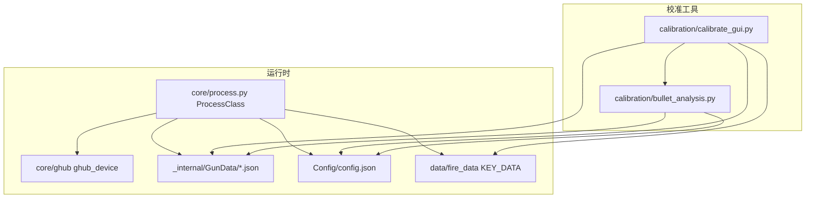
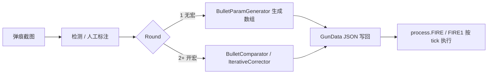

# SDD：系统架构说明

本文档描述 PUBG 压枪宏校准项目的模块划分、依赖关系与数据流，对应实现以 `calibration/bullet_analysis.py`、`calibration/calibrate_gui.py`、`core/process.py` 为主。

---

## 1. 总体架构

系统由三条主线组成：

1. **校准与分析（离线）**：从弹痕截图提取弹孔坐标，生成或修正 `_internal/GunData` 中的弹道数组。
2. **运行时（在线）**：`core/process.py` 在识别到枪械、倍镜、姿势后，按固定时间步读取弹道数组并驱动鼠标下移。
3. **配置与数据**：`Config/config.json` 提供分辨率与灵敏度倍率；`data/fire_data.py` 的 `KEY_DATA` 将枪口/握把/枪托映射为配件码数字，与 GunData 的键名拼接规则一致。

---

## 2. 模块依赖关系（示意）

**要点**：

- `bullet_analysis.py` 不依赖 PyQt5；可被 GUI 或 CLI 引用。
- `calibrate_gui.py` 依赖 `bullet_analysis`、`_internal/GunData`、`Config/config.json` 与 `data/fire_data`（构建 `acc_code`）。
- `process.py` 在运行时读取同一份 GunData 与 config，与校准工具共用数据格式约定。

---

## 3. 数据流（端到端）

| 阶段 | 输入 | 输出 |
|------|------|------|
| 截图 | 游戏内墙面弹痕 PNG/JPG | 像素图像 |
| 标注 | 图像 + 可选 ROI | 有序弹孔列表 `{x, y, shot_num, ...}` |
| Round 1 | 弹孔、`gun_name`、`scope_val`、`posture_val` | `generated_array`（每 tick 补偿值） |
| Round 2+ | 当前 GunData 数组、开宏后弹孔、chunk 划分 | `corrected_uniform` 等修正结果 |
| 宏执行 | `ballistic` 数组、`posture`、`scope`（来自识别+config） | 鼠标相对移动序列 |

**与 GunData 的衔接**：GUI 将生成的数组以 `"{acc_code}": [ ... ]` 形式展示，用户复制到 `_internal/GunData/<枪名>.json`。运行时 `ProcessClass.read_gun_data` 按枪械名加载 JSON，用 `get_accessories_nameCode` 得到 `NameCode`（如 `A0B0C0`），取 `gun[NameCode]` 作为 `ballistic`。

---

## 4. 核心类与职责

### 4.1 `calibration/bullet_analysis.py`

| 类 | 职责 |
|----|------|
| `BulletDetector` | 弹痕检测：单图（暗点 + Blob + 中值差分）、模板匹配、双图差分；支持 ROI。 |
| `BulletSorter` | 按 Y 排序并赋 `shot_num`；支持 `bottom_up` / `top_down` 与起始发数。 |
| `BulletComparator` | 将相邻弹孔间距与 GunData 理论 chunk 累加对比，算 `ratio`、`suggested_scope` 等。 |
| `BulletParamGenerator` | **Round 1**：无已有 GunData 时，由像素间距与 `chunk_f` 直接生成每 tick 值。 |
| `ParameterCorrector` | 根据对比结果的 `avg_ratio` 或逐发 `ratio` 缩放原始数组。 |
| `IterativeCorrector` | **Round 2+**：基于开宏后残差弹痕与当前数组做比例修正；支持多轨迹与起始发数。 |
| `MultiGroupAnalyzer` | 多组对比结果交叉统计，生成 `corrected_optimal` 等。 |
| `ProjectData` | `.calibration.json` v3 的读写与旧格式兼容。 |
| `BulletVisualizer` | 在图像上绘制弹孔序号与连线（用于导出或调试）。 |
| `ResultSaver` | 将调试图像保存到目录。 |

武器元数据（`fire_interval`、`mag`）与 `_TICK_MS=9` 在本文件内集中维护，用于 `chunk_f` 计算。

### 4.2 `calibration/calibrate_gui.py`

| 类/组件 | 职责 |
|---------|------|
| `BulletCanvas` | 弹孔交互：点击添加、拖动、删除、框选删除、ROI、缩放平移；**标注顺序 = 开火顺序**（`shot_num` 按列表顺序）。 |
| `RecoilCurveEditor` | 按 `chunk_f` 将数组分段为「每发一个节点」，拖拽节点按比例缩放该 chunk 内元素。 |
| `MainWindow` | 枪械/倍镜/配件/姿势配置、检测、分析、迭代、多轨迹、保存/加载项目、曲线应用。 |
| `HelpDialog` / `DebugDialog` | 内置帮助与检测过程可视化。 |

### 4.3 `core/process.py`（`ProcessClass`）

| 方法/逻辑 | 职责 |
|-----------|------|
| `read_gun_data` | 加载 `./_internal/GunData/<枪名>.json`。 |
| `get_accessories_nameCode` | 用 `KEY_DATA` 拼出 `A{m}B{n}C{p}`。 |
| `calculate_the_recoil` | `round(posture * (recoil * scope), 2)`，与校准侧理论公式一致。 |
| `FIRE` | 全自动：每元素 `sleep(9ms)`（经 `Computation_latency`），`mouse_R(0, move)`。 |
| `FIRE1` | 半自动枪械列表：每元素 `sleep(100ms)`。 |
| `FIRE` / `FIRE1` 内循环 | **余数累加**：`exact = recoil + remainder`，`move = int(round(exact))`，`remainder = exact - move`。 |

---

## 5. 设计约束与一致性

1. **时间步**：分析模块中 `_TICK_MS = 9` 与 `process.FIRE` 的 9ms 步长一致；半自动使用 100ms。
2. **理论鼠标移动**：与 `BulletComparator` 中一致，对数组元素使用 `round(posture_val * (v * scope_val), 2)` 再累加为 chunk 理论值。
3. **配件码**：GUI 用 `KEY_DATA['Muzzle'|'Grip'|'Stock']` 生成 `acc_code`，需与运行时 `get_accessories_nameCode` 规则一致，否则读写错 GunData 键。

---

## 6. 文档索引

- 算法推导与公式：`SDD-Algorithm.md`
- 校准操作步骤：`SDD-UserGuide.md`
- JSON 与项目文件格式：`SDD-DataFormat.md`
